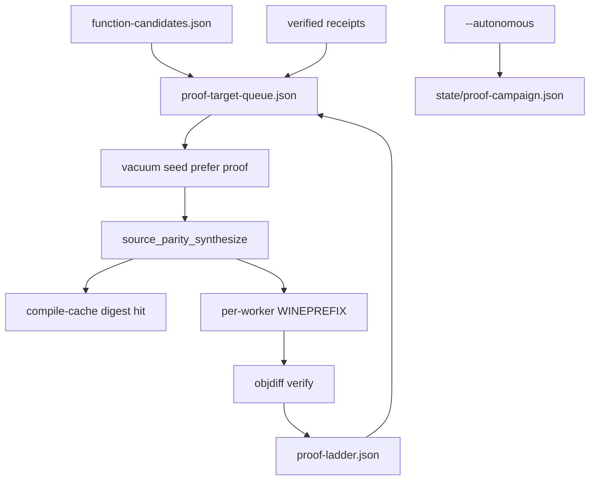

# Proof Ladder Scale-Up Plan

## Summary

Add a **proof-target queue** and **campaign receipts** so autonomy chases `nextRung` (1% → 5% → 20%) with trivial-first ranking. Ship **compile/objdiff cache** (G15) and **per-worker Wine prefixes** (G14) so parallel synth scales without false mismatches or honesty regressions. Numerator semantics stay frozen.

## Problem Frame

`proof-ladder.json` reports coverage but does not drive work. Synthesis is slow; shared `WINEPREFIX` breaks parallel MSVC; `--autonomous` defaults to one function with no proof prioritization. Origin: `docs/brainstorms/2026-07-25-proof-ladder-scale-up-requirements.md`.

## Requirements Traceability

| ID | Requirement | Plan coverage |
|----|-------------|---------------|
| R1–R3 | Proof-target queue + ladder targeting fields | U1, U2 |
| R4–R6 | Autonomous/vacuum proof preference + campaign receipt | U3, U6 |
| R7–R9 | Compile cache + per-worker prefix + timings | U4, U5 |
| R10–R11 | Critical-path + status surfacing | U7 |
| R12–R14 | Honesty invariants | U8 |

## Key Technical Decisions

- KTD1. **New module `proof_target.py`** — Queue builder separate from `readability_repair.py`; ranks unverified inventoried functions using task metadata + match summaries. Rationale: different ranking axis (origin KTD1).
- KTD2. **Extend `proof_ladder.py` in place** — Add `functionsToNextRung`, `nextRungTargetNumerator`; do not change `RUNGS` or numerator source. Rationale: origin KTD2.
- KTD3. **Autonomy order** — readability repair (if blocks vacuum) → proof-target seed → task fallback. Rationale: readable-recovery stack ordering.
- KTD4. **Compile cache under work-dir** — `source-synthesis/compile-cache/` keyed by target slice digest + compiler profile + lane; synth checks before compile. Rationale: G15 without global mutable state.
- KTD5. **Worker prefix via env wrapper** — `verify_pool.map_parallel` assigns `worker_index` → `WINEPREFIX=work_dir/wine-prefixes/{i}` in worker thread before MSVC calls. Rationale: G14 minimal change surface.
- KTD6. **Campaign receipt** — `state/proof-campaign.json` written per `--autonomous` session with rung before/after, attempts, accepts, near-misses. Rationale: STRATEGY agent loop completion.

## High-Level Technical Design

---

## Implementation Units

### U1. Ladder targeting fields

**Goal:** Expose how many accepts are needed to reach `nextRung`.

**Requirements:** R3

**Dependencies:** None

**Files:**
- Modify: `src/agentdecompile_recovery/proof_ladder.py`
- Test: `tests/test_proof_ladder.py`

**Approach:** After computing `nextRung`, if set, `nextRungTargetNumerator = ceil(threshold * denominator)` and `functionsToNextRung = max(0, nextRungTargetNumerator - numerator)`. Include in `build_proof_ladder` return and schema docstring.

**Test scenarios:**
- 1000 denominator, 5 numerator, nextRung 1% → `functionsToNextRung` 5.
- At 1% rung, nextRung 5% → `functionsToNextRung` 40 for denominator 1000.

**Verification:** Extend existing proof ladder tests.

---

### U2. Proof-target queue builder

**Goal:** Rank unverified inventoried functions for matching.

**Requirements:** R1, R2

**Dependencies:** U1

**Files:**
- Create: `src/agentdecompile_recovery/proof_target.py`
- Modify: `src/agentdecompile_recovery/pipeline.py` (`stage_report` hook)
- Test: `tests/test_proof_target.py` (new)

**Approach:** Load candidates from `function-candidates.json`; subtract entries with objdiff-verified receipts (`claim_report._count_objdiff_verified` set or scan verified + synthesis summaries). Score: +100 trivial/reloc match hint from summaries, +50 semantic source, +25 has source task, −min(40, bodyBytes//64). Write `facts/proof-target-queue.json` schema `agentdecompile.proof-target-queue.v1`. Rebuild at report stage (like readability queue).

**Patterns to follow:** `readability_repair.py` queue builder; `vacuum_queue._score_task`.

**Test scenarios:**
- Covers AE1. Mixed verified/unverified fixtures → correct count and ordering.
- Empty candidates → status `skipped`.

**Verification:** Unit tests with temp work dirs.

---

### U3. Vacuum seed prefers proof targets

**Goal:** Autonomous synthesis seeds proof queue before generic tasks.

**Requirements:** R4, R6

**Dependencies:** U2

**Files:**
- Modify: `src/agentdecompile_recovery/vacuum_queue.py`
- Modify: `src/agentdecompile_recovery/frontdoor.py`
- Test: `tests/test_proof_target.py`

**Approach:** Add `proof_target_vacuum_entries(work_dir)` mapping queue to pending shape. Merge: proof targets first (with source task required for vacuum), then `_candidate_entries`. Seed receipt flag `proofTargetFirst: true`. Autonomous branch after readability repair uses proof merge.

**Test scenarios:**
- Covers AE2. Proof queue + tasks → seeded entry matches proof head when it has a task.

**Verification:** Seed receipt tests.

---

### U4. Compile/objdiff cache (G15)

**Goal:** Skip recompile when target slice + flags digest unchanged.

**Requirements:** R7, R9

**Dependencies:** None (can parallelize with U2)

**Files:**
- Create: `src/agentdecompile_recovery/compile_cache.py`
- Modify: `src/agentdecompile_recovery/source_parity_synthesize.py` (or thin wrapper used by plugin pipeline)
- Modify: `src/agentdecompile_recovery/pipeline.py` / stage timings if present
- Test: `tests/test_compile_cache.py` (new)

**Approach:** Cache dir `work_dir/source-synthesis/compile-cache/`. Key = sha256(target slice bytes + compiler profile + lane + flags). Store objdiff result receipt path + mtime. On hit, return cached verifier outcome and increment `compileCacheHits` in synth summary. Miss runs full compile and writes cache entry.

**Patterns to follow:** `match_cache.py` keying discipline.

**Test scenarios:**
- Covers AE3. Two identical digests → second call records hit.
- Digest change → miss.

**Verification:** Unit tests; no live Wine required for key logic.

---

### U5. Per-worker Wine prefix (G14)

**Goal:** Parallel MSVC workers do not share one `WINEPREFIX`.

**Requirements:** R8, R9

**Dependencies:** None

**Files:**
- Modify: `src/agentdecompile_recovery/verify_pool.py`
- Modify: `src/agentdecompile_recovery/package_verify.py` (`msvc_environment` or caller)
- Modify: `src/agentdecompile_recovery/source_parity_synthesize.py` (pass work_dir for prefix root)
- Test: `tests/test_verify_pool.py` or extend `tests/test_compile_cache.py`

**Approach:** Add optional `worker_env_factory: Callable[[int], dict]` to `map_parallel` or thread-local worker index set before `fn`. Default None preserves current behavior. When set, `WINEPREFIX=work_dir/wine-prefixes/worker-{i}` (create if missing). Record `workerPrefix` in synth attempt receipts.

**Test scenarios:**
- Covers AE4. Mock/env test: two workers get distinct prefix paths.
- Regression: single-worker path unchanged.

**Verification:** Unit test with env capture; optional integration smoke with trivial fixture.

---

### U6. Proof campaign receipt

**Goal:** Named autonomous session outcomes for proof work.

**Requirements:** R5, R13

**Dependencies:** U1, U3

**Files:**
- Create or extend: `src/agentdecompile_recovery/proof_campaign.py`
- Modify: `src/agentdecompile_recovery/frontdoor.py`
- Test: `tests/test_proof_target.py`

**Approach:** Before/after autonomous vacuum bridge, snapshot ladder. After bridge, write `state/proof-campaign.json`: rungBefore, rungAfter, numeratorDelta, attempted, accepts, nearMisses (best diff), status (`accepted` / `near-miss` / `budget-stop` / `empty-queue`). Merge into `autonomy-budget.json` reason or sibling receipt.

**Test scenarios:**
- Covers AE5. Budget exhausted near-miss → campaign names near-miss; numerator unchanged.

**Verification:** Fixture work dir with mock vacuum outcome.

---

### U7. Critical-path and status surfacing

**Goal:** Operators see proof-scale as next action.

**Requirements:** R10, R11

**Dependencies:** U1, U2

**Files:**
- Modify: `src/agentdecompile_recovery/critical_path.py`
- Modify: `src/agentdecompile_recovery/recovery_status.py`
- Modify: `src/agentdecompile_recovery/pipeline.py` (`stage_report` embed)
- Test: `tests/test_critical_path_next_actions.py`

**Approach:** `_action_proof_scale(work_dir)` — ready when `nextRung` set and `functionsToNextRung` > 0 and proof queue non-empty; commandHint with `--autonomous --autonomous-max-functions N --workers W`. Recovery status adds `proofTargetQueue` block.

**Test scenarios:**
- Non-zero `functionsToNextRung` → action `proof-scale` ready.

**Verification:** Critical-path fixture tests.

---

### U8. Honesty regression tests

**Goal:** Lock numerator/denominator invariants.

**Requirements:** R12, R14

**Dependencies:** U2, U6

**Files:**
- Test: `tests/test_proof_target.py`, `tests/test_proof_ladder.py`

**Approach:** Building proof queue + campaign receipt does not change numerator without verified accept. Port/readability artifacts do not count.

**Verification:** pytest unit markers.

---

## Scope Boundaries

### In scope

U1–U8; `docs/CRITICAL_PATH.md` note for proof-target queue and campaign receipt.

### Deferred for later

New rungs above 20%; whole-binary link; LLM synth default; cross-binary proof propagation.

### Outside this product's identity

≥90% claims; advisory counts in numerator.

### Deferred to Follow-Up Work

Live swkotor.exe smoke to hit 1% rung (KPI chase, not CI gate).

---

## Risks & Dependencies

| Risk | Mitigation |
|------|------------|
| Wine prefix proliferation disk use | Prefixes under work-dir; document cleanup |
| Cache stale after toolchain change | Include compiler profile + target sha in cache key |
| Proof queue ranks functions without source tasks | Vacuum seed still requires task; queue marks `synthesisEligible` |

**Depends on:** Shipped proof ladder, vacuum, match cache, readability repair loop, fail-closed `is_proven_zero`.

---

## Execution Posture

Characterization-first: U1 ladder math + U8 honesty tests before frontdoor autonomy wiring. Fixture work dirs; live Wine optional for G14 integration smoke.
