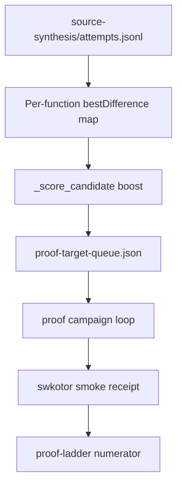

# Proof Scale Live Validation Plan

## Summary

Validate proof-ladder scale-up on **swkotor.exe** with a bounded autonomous smoke run, then improve accept conversion by **near-miss–aware proof-target ranking**. Success is ≥1 objdiff accept or a named auditable terminal — not silent runs. Numerator honesty stays frozen.

## Problem Frame

Proof-target queue, campaign loop, compile cache, and per-worker Wine prefixes shipped with unit-test coverage. **Live swkotor smoke was deferred.** Operators lack a canonical recipe and near-miss functions are not prioritized for retry when campaigns stall the numerator.

Origin: `docs/brainstorms/2026-07-25-proof-scale-live-validation-requirements.md`.

## Requirements Traceability

| ID | Requirement | Plan coverage |
|----|-------------|---------------|
| R1–R4 | Live smoke recipe + named terminal + ladder snapshot + honesty | U3, U6 |
| R5–R8 | Near-miss–aware ranking within existing heuristics | U1, U2 |
| R9–R10 | Operator surfaces | U4 |
| R11–R12 | Honesty invariants | U5 |

## Key Technical Decisions

- KTD1. **Near-miss boost as score additive, not separate queue** — Extend `_score_candidate` in `proof_target.py` with a bounded bonus from per-function `bestDifference` in `source-synthesis/attempts.jsonl`. Rationale: reuses existing sort; no second queue to maintain.
- KTD2. **Default near-miss threshold = 8 bytes** — Functions with `0 < bestDifference ≤ 8` get tiered boost (larger boost for smaller diff). Rationale: origin deferred exact threshold; 8 is conservative starting point; constant in one module for easy tuning after smoke.
- KTD3. **Smoke is documented operator flow first** — `docs/CRITICAL_PATH.md` gains a swkotor proof-scale smoke section; optional thin shell helper only if the doc block is insufficient after first manual run.
- KTD4. **Named terminal = smoke pass** — `readability-blocked`, `near-miss`, `bridge-failed`, etc. with complete loop receipts count as successful smoke when they surface actionable blockers (see origin R2).
- KTD5. **swkotor.exe is the anchor binary** — Full KOTOR PE; operator supplies `--vc-root` and Wine prefix per existing CRITICAL_PATH guidance.

## High-Level Technical Design

---

## Implementation Units

### U1. Near-miss evidence loader

**Goal:** Aggregate per-function best objdiff delta from synthesis attempts for ranking input.

**Requirements:** R5, R7

**Dependencies:** None

**Files:**
- Modify: `src/agentdecompile_recovery/proof_target.py` (or extract helper colocated with `infer_near_misses` pattern in `proof_campaign.py`)
- Test: `tests/test_proof_target.py`

**Approach:** Scan `source-synthesis/attempts.jsonl` for rows with `status` in `{mismatched, matched}` and `differences > 0`; build `dict[name, bestDifference]` (also key by normalized entry when name missing). Return empty dict when file absent.

**Patterns to follow:** `infer_near_misses()` in `proof_campaign.py`.

**Test scenarios:**
- Covers AE2 setup. Two attempts for `fn_a` with differences 5 and 2 → map returns 2 for `fn_a`.
- Missing attempts file → empty map, no error.
- Matched with differences 0 excluded from near-miss map.

**Verification:** Unit tests pass; no writes to `verified/`.

---

### U2. Near-miss–aware proof-target scoring

**Goal:** Boost queue rank for functions with recent small near-misses without changing claim boundaries.

**Requirements:** R5, R6, R7, R8

**Dependencies:** U1

**Files:**
- Modify: `src/agentdecompile_recovery/proof_target.py`
- Test: `tests/test_proof_target.py`

**Approach:** In `_score_candidate`, add `NEAR_MISS_MAX_DIFF = 8` and tiered bonus: e.g. `+80` when `bestDifference ≤ 4`, `+40` when `≤ 8`. Include `nearMissBestDifference` on queue entries when present for operator visibility. Existing trivial/reloc/semantic/bodyBytes heuristics unchanged.

**Test scenarios:**
- Covers AE2. Function A near-miss diff 2, function B never attempted, equal body/heuristics → A ranks first.
- Difference 20 → no near-miss boost.
- Queue entries retain `claimBoundary: proof-target-advisory`.

**Verification:** `build_proof_target_queue` ordering tests; numerator unchanged without verified receipts.

---

### U3. Swkotor proof-scale smoke recipe

**Goal:** Document bounded live smoke operators can run without inventing flags.

**Requirements:** R1, R2, R3, R9

**Dependencies:** None (docs-only; references shipped campaign loop)

**Files:**
- Modify: `docs/CRITICAL_PATH.md`
- Optional: `scripts/proof-scale-smoke.sh` (only if doc-only proves insufficient)

**Approach:** Add **Proof-scale smoke (swkotor)** subsection: prerequisites (work dir through `report`, toolchain), example command with `--resume --autonomous --autonomous-max-functions N --autonomous-max-campaigns M --workers 4`, expected receipts (`proof-campaign-loop.json`, `proof-campaign-history.jsonl`, `proof-ladder.json`), pass/fail interpretation (accept vs named terminal). Link from existing proof-scale receipt table row.

**Test scenarios:**
- Test expectation: none — documentation-only unit.

**Verification:** Doc review: command flags match `frontdoor.py` argparse names.

---

### U4. Operator surface polish

**Goal:** Critical path and recovery status expose near-miss retry signal for next run.

**Requirements:** R9, R10

**Dependencies:** U2

**Files:**
- Modify: `src/agentdecompile_recovery/critical_path.py`
- Modify: `src/agentdecompile_recovery/recovery_status.py` (if `nearMissBestDifference` not surfaced on queue summary)
- Test: `tests/test_critical_path_next_actions.py`, extend recovery status test if present

**Approach:** Extend `proof-scale` ready action `reason` or `counts` with `nearMissRetryCount` when queue entries carry near-miss boost. Ensure `proofCampaignLoop.bestDifference` and top queue near-miss fields visible in status.

**Test scenarios:**
- Queue fixture with one near-miss-boosted entry → critical-path counts or topEntries show `nearMissBestDifference`.

**Verification:** Unit tests on fixtures; no CLI change required.

---

### U5. Honesty regression tests

**Goal:** Lock numerator invariants under near-miss ranking.

**Requirements:** R4, R11, R12

**Dependencies:** U2

**Files:**
- Test: `tests/test_proof_target.py`, `tests/test_proof_campaign_loop.py`

**Approach:** Rebuild queue with near-miss boosts and near-miss attempts jsonl; assert `build_proof_ladder` numerator unchanged. Assert queue metadata does not write `verified/` receipts.

**Test scenarios:**
- Covers AE1, AE4 partial. Near-miss map + queue rebuild → numerator same before/after.
- Campaign loop with mocked bridge + near-miss attempts → `numeratorDelta` 0 in loop receipt.

**Verification:** `uv run pytest tests/test_proof_target.py tests/test_proof_campaign_loop.py -m unit -q`

---

### U6. Manual swkotor smoke execution

**Goal:** Execute smoke on swkotor work dir and record outcome for KPI evidence.

**Requirements:** R2, R3, success criteria

**Dependencies:** U3 (recipe); U1–U2 recommended before retry-focused smoke

**Files:**
- Output: work dir receipts only (no code unless smoke reveals tooling gap)

**Approach:** Operator (or agent with binary access) runs documented smoke against existing swkotor work dir or fresh `--stop-after report` then autonomous campaign. Capture: terminal status, `numeratorDelta`, `bestDifference`, blocker class (readability / bridge / near-miss / accept). If infra blocker found, file follow-up unit — do not weaken honesty gates.

**Execution note:** Characterization-first — run smoke once before tuning `NEAR_MISS_MAX_DIFF` if near-miss distribution is unknown.

**Test scenarios:**
- Manual — not CI-gated.

**Verification:** Loop receipt exists with non-empty `status`; claim boundary present; ladder snapshot recorded in notes or `docs/solutions/` if novel blocker found.

---

## Scope Boundaries

### In scope

U1–U6; swkotor smoke recipe; near-miss ranking; honesty tests.

### Deferred for later

- Autonomous permuter lane after near-miss (origin approach C).
- CI-gated live smoke on every PR.
- 5%/20% rung chase.

### Deferred to Follow-Up Work

- Threshold tuning script driven by smoke `bestDifference` histogram.
- `scripts/proof-scale-smoke.sh` if manual doc flow is too error-prone.

### Outside this product's identity

- Counting near-misses or attempts toward numerator.
- Whole-binary recovery claims.

---

## Risks & Dependencies

| Risk | Mitigation |
|------|------------|
| swkotor smoke wall-clock hours | Bounded `--autonomous-max-functions` and `--autonomous-max-campaigns`; document `--autonomous-max-wall-seconds` |
| Near-miss boost chases wrong functions | Cap boost below trivial/reloc tier; tune threshold after U6 smoke |
| Toolchain/Wine false near-miss | Per-worker prefixes already shipped; smoke distinguishes infra vs synth |
| Binary not available in CI/agent env | U6 manual; unit tests stay fixture-only |

**Depends on:** Shipped proof campaign loop, proof-target queue, compile cache, fail-closed objdiff.

---

## Execution Posture

Characterization-first: U5 honesty tests + U1–U2 unit tests before U6 live smoke. U3 doc can land in parallel. U6 informs threshold tuning — do not block U1–U2 on smoke completion.
