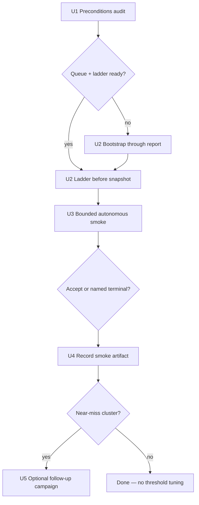

# Proof-Scale Smoke Execution (swkotor)

## Summary

Execute the **outstanding U6 slice** from proof-scale live validation: run bounded autonomous smoke on `swkotor.exe`, capture before/after ladder snapshots and campaign receipts, and record the terminal outcome. Code for near-miss ranking, operator surfaces, and the smoke recipe is already shipped (parent plan U1–U5 **completed**). This plan is execution-only — no new orchestration unless smoke exposes a tooling gap.

## Problem Frame

Proof-target queue, campaign loop, near-miss ranking, mismatch-class routing, and honesty tests are in place. **No live swkotor smoke has been recorded.** Existing work dirs under `target/agentdecompile-reconstruct/` lack a ready proof-target queue (`proof-ladder.json` in `swkotor-parity` shows `status: no-inventory`, `denominator: 0`). Without a characterized smoke run, STRATEGY metrics **Verified function parity** and **Agent loop completion** lack PE-scale evidence.

Origin: `docs/brainstorms/2026-07-25-proof-scale-live-validation-requirements.md` (R2, R3, success criteria). Parent: `docs/plans/2026-07-25-proof-scale-live-validation.md` (U6).

## Requirements Traceability

| ID | Requirement | Plan coverage |
|----|-------------|---------------|
| R2 | Accept or named terminal with complete receipts | U3, U4 |
| R3 | Before/after ladder snapshot | U2, U4 |
| R4, R11 | Honesty — numerator only from objdiff-zero `verified/` | U4 |
| Success criteria | Documented smoke completes; near-miss retry ordering observable on follow-up | U3, U5 |

## Key Technical Decisions

- **KTD1. Reuse `swkotor-parity` work dir when possible** — `analysis-target.json` already pins the Steam `swkotor.exe` path and unpacked analysis image. Rationale: avoids re-import; operator re-runs through `report` to refresh inventory and proof-target queue rather than starting a third work dir. Fresh `target/agentdecompile-reconstruct/swkotor` only if parity dir is corrupted or irreproducible.
- **KTD2. Bootstrap gate before smoke** — Smoke runs only when `facts/proof-target-queue.json` exists with non-empty `entries` and `proof-ladder.json` has `denominator > 0`. Rationale: origin smoke assumes report-ready work dir; current parity dir fails this gate.
- **KTD3. Toolchain defaults from repo scripts** — MSVC via `--vc-root` defaulting to `scripts/cl-compile.sh` convention (`/run/media/brunner56/MyBook/Toolchains/msvc8.0-main`); Wine prefix via `--source-synthesis-wineprefix` (e.g. `/tmp/vctk2003/wineprefix` or `target/toolchain-acquire/vctoolkit2003/wineprefix`). Rationale: documented in `scripts/cl-compile.sh` and `scripts/compiler-profile.sh`; smoke must pass these on every autonomous invocation.
- **KTD4. MCP posture: skip closure on first pass when MCP unset** — Use `--skip-closure-executors` when `AGENTDECOMPILE_MCP_SERVER_URL` is unavailable so smoke tests campaign loop + synth/objdiff, not MCP readability. Rationale: isolates proof-scale path; `readability-blocked` remains a valid named terminal if closure is enabled later. Record which mode was used in the smoke artifact.
- **KTD5. Named terminal = pass** — `near-miss`, `readability-blocked`, `bridge-failed`, `empty-queue`, `budget-stop` with `claimBoundary` and history JSONL count as successful smoke when they surface an actionable blocker (see origin R2). Do not weaken honesty gates if smoke stalls.
- **KTD6. Bounded wall-clock** — Set `--autonomous-max-wall-seconds` (e.g. 7200) in addition to function/campaign caps. Rationale: parent plan risk table; swkotor smoke can run hours uncapped.

## High-Level Technical Design



---

## Implementation Units

### U1. Preconditions audit

**Goal:** Confirm binary, toolchain, work dir, and executor posture before spending wall-clock on smoke.

**Requirements:** R2 (prerequisites)

**Dependencies:** None

**Files:**
- Read: `target/agentdecompile-reconstruct/swkotor-parity/analysis-target.json` (or chosen work dir)
- Read: `docs/CRITICAL_PATH.md` (smoke recipe)
- Read: `scripts/cl-compile.sh` (VC/Wine defaults)

**Approach:** Verify `originalBinaryPath` resolves (`swkotor.exe` on disk). Confirm `cl.exe` under `--vc-root` and Wine prefix exist. Check work dir for `proof-ladder.json` (`denominator`, `functionsToNextRung`) and `facts/proof-target-queue.json`. Note MCP URL presence; decide `--skip-closure-executors` per KTD4. Write a one-line audit note (terminal or `state/smoke-prep.json`) with paths and gate results.

**Test scenarios:**
- Test expectation: none — operator/execution characterization.

**Verification:** Audit lists binary path, VC root, wine prefix, work dir, queue/ladder gate pass/fail, MCP mode.

---

### U2. Bootstrap and before snapshot

**Goal:** Bring work dir to report-ready state and capture ladder state before autonomous smoke.

**Requirements:** R3

**Dependencies:** U1

**Files:**
- Output: work dir `facts/proof-ladder.json`, `facts/proof-target-queue.json`
- Optional output: `state/smoke-prep.json` (before snapshot)

**Approach:** If U1 gate fails, run reconstruct with `--resume --stop-after report`, passing `--vc-root` and `--source-synthesis-wineprefix`. Re-read `proof-ladder.json` — require `denominator > 0`. Copy or record `numerator`, `rung`, `functionsToNextRung`, `denominator` into before snapshot. Set `N = min(functionsToNextRung, 5)` and `M = min(3, ceil(functionsToNextRung / N))` for smoke caps unless ladder already shows a smaller gap.

**Patterns to follow:** `docs/CRITICAL_PATH.md` proof-scale smoke section.

**Test scenarios:**
- Test expectation: none — live bootstrap.

**Verification:** `facts/proof-target-queue.json` exists with `entries.length > 0`; before snapshot recorded.

---

### U3. Bounded autonomous smoke run

**Goal:** Execute one bounded `--autonomous` invocation and produce campaign loop receipts.

**Requirements:** R2, R3, success criteria

**Dependencies:** U2

**Files:**
- Output: `state/proof-campaign-loop.json`, `state/proof-campaign-history.jsonl`, `state/proof-campaign.json` (per iteration)
- Output: `facts/proof-ladder.json` (after), `source-synthesis/attempts.jsonl`

**Approach:** Run documented smoke command with toolchain flags on every invocation:

```bash
TARGET=/path/from/analysis-target.json
WORK=target/agentdecompile-reconstruct/swkotor-parity   # or chosen dir
VC_ROOT=/run/media/brunner56/MyBook/Toolchains/msvc8.0-main
WINEPREFIX=/tmp/vctk2003/wineprefix

uv run agentdecompile-reconstruct "$TARGET" \
  --work-dir "$WORK" \
  --resume \
  --autonomous \
  --autonomous-max-functions "${N:-5}" \
  --autonomous-max-campaigns "${M:-3}" \
  --autonomous-max-wall-seconds 7200 \
  --workers 4 \
  --vc-root "$VC_ROOT" \
  --source-synthesis-wineprefix "$WINEPREFIX" \
  --skip-closure-executors    # omit when MCP is up and readability closure is in scope
```

Tee stdout/stderr to `state/proof-scale-smoke.log`. Do not pass `--force-rematch` unless intentionally resetting proven functions.

**Patterns to follow:** Parent plan U6; `run_proof_campaign_loop()` terminals in `proof_campaign.py`.

**Test scenarios:**
- Manual — live smoke only; not CI-gated.

**Verification:** Loop receipt has non-empty `status` and `claimBoundary`; history JSONL has ≥1 row; process exit is interpretable (non-silent).

---

### U4. Outcome capture and honesty check

**Goal:** Record smoke result for KPI evidence and verify numerator honesty.

**Requirements:** R2, R3, R4, R11

**Dependencies:** U3

**Files:**
- Create: `docs/solutions/workflow-learnings/2026-07-25-proof-scale-smoke-swkotor.md` (or update if exists)
- Read: work dir `state/proof-campaign-loop.json`, `facts/proof-ladder.json`, `verified/` receipts

**Approach:** Document: terminal status, `totalAccepts`, `numeratorDelta`, `bestDifference`, `campaignCount`, top mismatch classes from `state/mismatch-class-last.json` if present, MCP mode, wall-clock. Compare before/after ladder `numerator` to `verified/` objdiff-zero count change — they must match. If infra blocker (missing cl, Wine, bridge), file as tooling gap — do not relax `is_proven_zero` / `is_objdiff_zero_accept`. If novel blocker class, include remediation hint in the solution doc YAML frontmatter (`module`, `problem_type`, `component`, `tags`).

**Test scenarios:**
- Cross-check: `numeratorDelta` in loop receipt equals delta in `proof-ladder.json` numerator only when new objdiff-zero rows exist under `verified/`.
- Near-miss terminal: `numeratorDelta` must be 0.

**Verification:** Solution doc exists with terminal class and receipt paths; honesty cross-check passes.

---

### U5. Post-smoke follow-up (conditional)

**Goal:** Validate near-miss retry ordering or tune threshold only when smoke data supports it.

**Requirements:** R5–R7 (observational), origin deferred threshold question

**Dependencies:** U4

**Files:**
- Read: `facts/proof-target-queue.json`, `source-synthesis/attempts.jsonl`
- Modify (only if justified): `src/agentdecompile_recovery/proof_target.py` (`NEAR_MISS_MAX_DIFF`)

**Approach:** **Only if** U3 ended `near-miss` with `bestDifference ≤ 8` on multiple functions: refresh queue (next `--autonomous` iteration or manual `build_proof_target_queue`) and confirm near-miss-boosted entries rank first (`nearMissRetryCount`, `nearMissBestDifference` on top entries). **Do not** change `NEAR_MISS_MAX_DIFF` until `bestDifference` histogram from smoke is reviewed. Optional second bounded campaign (`--autonomous-max-campaigns 1`) to confirm retry ordering — still bounded.

**Test scenarios:**
- If threshold change proposed: add/adjust unit test in `tests/test_proof_target.py` for new boundary.

**Verification:** Either (a) follow-up shows boosted target attempted first, or (b) explicit note that smoke did not justify tuning.

---

## Scope Boundaries

### In scope

U1–U5; live swkotor smoke; receipt capture; honesty verification; conditional follow-up.

### Deferred for later

- `scripts/proof-scale-smoke.sh` helper (add only if manual commands prove error-prone after U3)
- CI-gated smoke on every PR
- PDB symbol provenance (PE readability beyond MCP rename)
- Autonomous permuter lane (origin approach C)
- 5%/20% rung chase

### Deferred to Follow-Up Work

- Threshold tuning driven by smoke histogram (parent plan follow-up)
- Full agent closure smoke with MCP readability (separate run without `--skip-closure-executors`)

### Outside this product's identity

- Counting near-misses or attempts toward numerator
- Whole-binary recovery claims

---

## Risks & Dependencies

| Risk | Mitigation |
|------|------------|
| Work dir `no-inventory` / empty queue | U2 bootstrap through `report` before smoke |
| Multi-hour wall-clock | `--autonomous-max-wall-seconds`, cap N/M to `functionsToNextRung` |
| MCP unavailable blocks closure | KTD4 skip closure; document `readability-blocked` as expected on closure-enabled runs |
| Shared Wine false mismatches | Per-worker prefixes already shipped; use dedicated prefix per `compiler-profile.sh` |
| Stale `target/` receipts | `--resume` is incremental; prefer self-contained run in one session |
| Smoke passes but numerator unchanged | Valid if named terminal; only accept path increments numerator |

**Depends on:** Shipped proof campaign loop, proof-target queue, near-miss ranking, mismatch-class routing, fail-closed objdiff verification.

---

## Open Questions

- **OQ1 (resolve at U1):** Confirm `swkotor-parity` vs fresh `swkotor` work dir — default parity unless audit shows corruption.
- **OQ2 (resolve at U3):** Exact `N`/`M` from live `functionsToNextRung` after bootstrap.

---

## Execution Posture

Characterization-first: run U3 once before any `NEAR_MISS_MAX_DIFF` tuning (U5). Honesty unit tests already gate code paths; U4 is the live honesty cross-check. No code changes expected unless smoke reveals a tooling gap.
