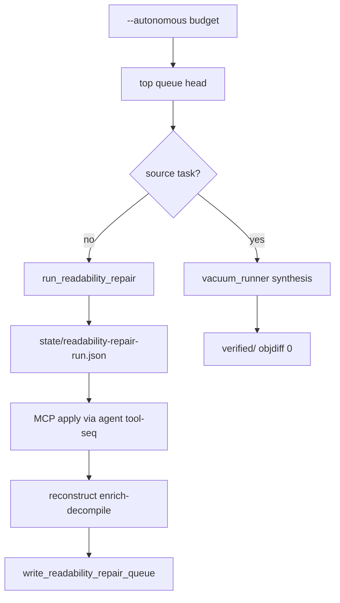

# Readability Repair Loop Closure

## Summary

Route readability queue entries by `repairClass` instead of blindly seeding them into vacuum synthesis. Readability-only rows (`FUN_*` with no source task) get an agent-native repair executor receipt with MCP tool-seq hints; synthesis vacuum stays unchanged when a source task exists. Re-enrich rebuilds the queue; proof-ladder and `verified/` semantics stay frozen.

## Problem Frame

Readability-score-repair shipped `facts/readability-repair-queue.json`, critical-path `readability-repair`, and vacuum seed preference — but `--autonomous` still pushes readability rows into `state/queue.json`, and `vacuum_runner` fails with `missing-task` when no `source-generation/tasks.jsonl` row exists. Operators must manually bridge MCP rename → re-enrich → queue refresh.

Origin: `docs/brainstorms/2026-07-25-readability-repair-loop-requirements.md`.

## Requirements Traceability

| ID | Requirement | Plan coverage |
|----|-------------|---------------|
| R1 | No vacuum seed for readability-only entries | U1 |
| R2 | RepairClass-specific executor guidance | U2 |
| R3 | Advisory executor receipt, no auto-apply | U2 |
| R4 | Re-enrich rebuilds queue | U3 |
| R5 | Critical-path status reflects queue shrink | U3 |
| R6 | Bounded repair attempt receipt | U2, U4 |
| R7 | Autonomous runs readability path first | U4 |
| R8 | Synthesis unchanged when source task exists | U1, U4 |
| R9–R10 | Honesty invariants | U5 |

## Key Technical Decisions

- KTD1. **Split seed paths** — Vacuum queue seeds only synthesis-eligible entries (source-generation task present). Readability-only queue heads are handled by a dedicated repair executor, not `vacuum_runner`. Rationale: satisfies R1/R7; matches Mizuchi/decomp-goal separation of naming vs objdiff loops.
- KTD2. **Extend `readability_repair.py`, not a peer CLI** — Add `run_readability_repair()` and tool-seq hint builder colocated with queue builder. Rationale: reconstruct-primary UX; mirrors `context_propose.py` propose-only pattern (see origin KTD2).
- KTD3. **Tool-seq hints, not headless MCP apply** — Receipt includes runnable `agentdecompile-cli tool-seq` JSON for `rename`; module-refresh and re-enrich get reconstruct command hints. Rationale: conflict protocol and agent-native parity without Ghidra mutation inside reconstruct.
- KTD4. **`frontdoor.py` autonomous branch** — After seed, if budget targets a readability-only head, invoke repair executor and skip decomp-cli vacuum bridge for that slot; fall through to vacuum when synthesis-eligible. Rationale: closes AE1 without new product surface.
- KTD5. **Re-enrich remains feedback gate** — Queue rebuild after enrich-decompile only (see origin KTD3). Repair attempt receipt records queue count before; caller or report stage records after re-enrich.

## High-Level Technical Design

---

## Implementation Units

### U1. Vacuum seed policy fix

**Goal:** Stop enqueueing readability-only rows into synthesis vacuum.

**Requirements:** R1, R8

**Dependencies:** None (builds on shipped queue)

**Files:**
- Modify: `src/agentdecompile_recovery/vacuum_queue.py`
- Modify: `src/agentdecompile_recovery/readability_repair.py`
- Test: `tests/test_readability_repair_loop.py` (new)

**Approach:** Add `has_source_task(work_dir, entry, name)` helper. Filter `_repair_queue_entries` merge: only include repair rows that match a tasks.jsonl row OR exclude all repair rows from vacuum merge (readability path is separate). Preferred: **exclude all readability-repair rows from vacuum seed**; synthesis seed uses task candidates only; repair queue consumed by autonomous repair branch (KTD1). Update seed receipt: `readabilityQueueExcludedFromVacuum: true`, drop misleading `readabilityQueueFirst` when repair rows no longer seed vacuum.

**Patterns to follow:** Existing `_candidate_entries` filtering in `vacuum_queue.py`.

**Test scenarios:**
- Covers AE1. Queue with `FUN_*` head, no tasks → vacuum seed does not append readability row; `seededCount` 0 or task-only.
- Repair queue + tasks both present → vacuum seeds task entry, not repair head, when repair head lacks task.

**Verification:** Unit tests pass; existing `test_vacuum_seed_prefers_repair_queue` updated to reflect new policy (repair no longer in vacuum pending).

---

### U2. Readability repair executor and tool-seq hints

**Goal:** Emit advisory repair run receipt with repairClass-specific MCP/reconstruct guidance.

**Requirements:** R2, R3, R6

**Dependencies:** U1

**Files:**
- Modify: `src/agentdecompile_recovery/readability_repair.py`
- Test: `tests/test_readability_repair_loop.py`

**Approach:** Add `build_repair_tool_seq(entry: dict) -> list[dict]` — for `rename`: `[{name: rename-function, arguments: {programPath, addressOrSymbol, name: suggested}}]` placeholders; for `module-refresh`: hint to refresh assert paths / module-map evidence; for `re-enrich`: reconstruct resume command. Add `run_readability_repair(work_dir, *, limit=1) -> dict` writing `state/readability-repair-run.json` with schema `agentdecompile.readability-repair-run.v1`, top entry, toolSeq, queueCountBefore, status (`ready` / `empty` / `skipped`), claimBoundary.

**Patterns to follow:** `context_propose.py` `applyHint` strings; `vacuum_runner.py` receipt shape.

**Test scenarios:**
- Covers AE2. `repairClass: rename` → receipt contains tool-seq with rename-function and claimBoundary.
- Empty queue → status `empty`, no crash.

**Verification:** Receipt written under work-dir state; unit tests with fixture queue JSON.

---

### U3. Queue feedback and critical-path refresh

**Goal:** Re-enrich rebuilds queue; critical-path reflects shrink/complete.

**Requirements:** R4, R5

**Dependencies:** U2 (queue builder already exists)

**Files:**
- Modify: `src/agentdecompile_recovery/critical_path.py`
- Modify: `src/agentdecompile_recovery/reconstruct_enrich.py` (ensure queue rebuild — already calls `write_readability_repair_queue`)
- Test: `tests/test_readability_repair_loop.py`, `tests/test_critical_path_next_actions.py`

**Approach:** Extend `_action_readability_repair` to read latest `readability-repair-run.json` when present (last attempt, queue delta). After enrich, queue rebuild is already wired — add test that simulates facts name change and queue shrink. Critical-path `complete` when `queueCount == 0`.

**Test scenarios:**
- Covers AE3. Facts with renamed function + module hints → rebuilt queue excludes entry.
- Queue empty → action status `complete`.

**Verification:** Critical-path and queue rebuild tests pass.

---

### U4. Autonomous branch in frontdoor

**Goal:** `--autonomous` runs readability repair path for readability-only heads.

**Requirements:** R7, R8

**Dependencies:** U1, U2

**Files:**
- Modify: `src/agentdecompile_recovery/frontdoor.py`
- Modify: `src/agentdecompile_recovery/autonomy_budget.py` (optional receipt fields)
- Test: `tests/test_readability_repair_loop.py`

**Approach:** Before `run_decomp_cli_bridge`, call `run_readability_repair(work_dir, limit=budget.max_functions)` when repair queue non-empty and head lacks source task. Write autonomy budget receipt noting `readabilityRepairAttempted: true`. If repair run returns `ready`, do not bridge vacuum for that cycle (agent applies MCP out-of-band; next reconstruct re-enrich closes loop). If head has source task, existing vacuum bridge unchanged.

**Patterns to follow:** Existing autonomous block in `frontdoor.py` lines 495–549.

**Test scenarios:**
- Covers AE1, AE4. Autonomous with readability-only head → repair run receipt, no vacuum `missing-task`.
- Head with task → vacuum bridge still invoked (mock/spy on bridge args).

**Verification:** Unit tests with temp work dir; no live Ghidra/MCP required for receipt path.

---

### U5. Honesty regression tests

**Goal:** Lock proof-ladder invariants for repair-loop metadata.

**Requirements:** R9, R10

**Dependencies:** U2, U4

**Files:**
- Test: `tests/test_readability_repair_loop.py`, extend `tests/test_readability_repair.py` if needed

**Approach:** Run `run_readability_repair` + queue rebuild on fixture work dir; assert `build_proof_ladder` numerator/denominator unchanged.

**Test scenarios:**
- Repair executor alone does not change proof-ladder counts.
- High Port score in facts does not increment numerator.

**Verification:** pytest unit markers only.

---

## Scope Boundaries

### In scope

U1–U5; brief note in `docs/CRITICAL_PATH.md` for repair run receipt and autonomous branch.

### Deferred for later

Auto MCP apply; LLM rename; batch queue repair; proof-ladder scale-up; G14/G15 perf (per origin).

### Outside this product's identity

Port pass as verified recovery; peer repair CLI.

### Deferred to Follow-Up Work

Optional MCP prompt resource listing top-N queue entries for Cursor/agent consumers (documentation in receipt may suffice for v1).

---

## Risks & Dependencies

| Risk | Mitigation |
|------|------------|
| Autonomous repair without MCP session produces hints only | Receipt status `ready`; critical-path commandHint unchanged |
| Test `test_vacuum_seed_prefers_repair_queue` behavior change | Update test to assert repair excluded from vacuum, repair runner preferred |
| Name slug collisions in tool-seq | Include entry hex in rename arguments |

**Depends on:** Completed readability-score-repair (`readability_repair.py`, vacuum merge, critical-path action).

---

## Execution Posture

Characterization-first: update vacuum seed tests before autonomous wiring. Fixture JSONL/queue only; no live PyGhidra for executor logic.
