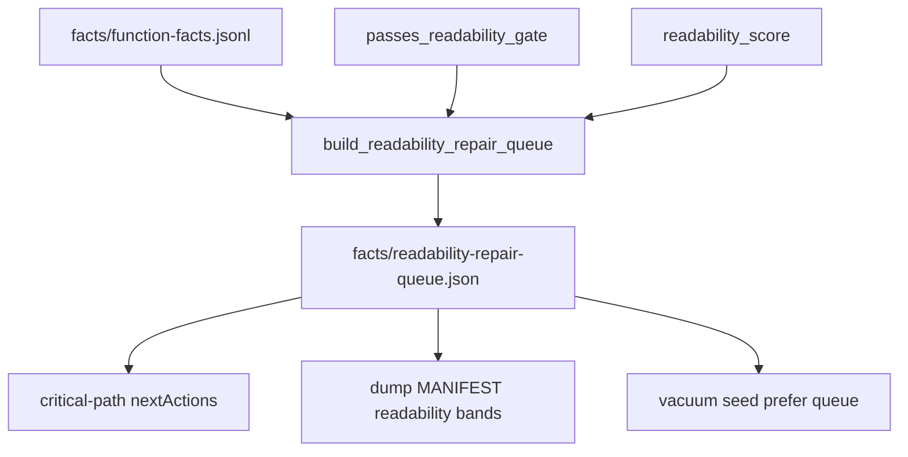

# Readability Score and Agent Repair Queue

## Summary

Extend the existing per-function `readabilityScore` on enrich facts into an operator- and agent-facing **repair queue** that ranks sub–Port-gate functions for bounded rename/re-enrich work. The boolean Port gate stays unchanged; scores and queue ordering are advisory only and never affect proof-ladder or `verified/` promotion.

## Problem Frame

Readable-recovery-quality shipped enrich-before-decompile, boolean Port gating, and dump metrics (`namedCount`, `moduleResolvedCount`, `readabilityExcludedFromPort`). `readability_score()` already writes to facts but nothing consumes it for prioritization. Operators and agents still manually hunt `FUN_*` rows in advisory output. Vacuum seeding today sorts `source-generation/tasks.jsonl` by synthesis-oriented heuristics, not readability gaps.

Origin: `docs/brainstorms/2026-07-25-readability-score-repair-requirements.md`.

## Requirements Traceability

| ID | Requirement | Plan coverage |
|----|-------------|---------------|
| R1 | Stable 0–1 score on enrich facts | U1 (align heuristic; already mostly present) |
| R2 | Boolean Port gate unchanged | U3 (no threshold gate) |
| R3 | Score advisory only | U1, U3, U6 |
| R4 | Repair queue receipt, ranked worst-first | U2 |
| R5 | v1 repair classes: rename / module refresh / re-enrich | U2 |
| R6 | Queue claimBoundary advisory | U2 |
| R7 | Manifest score bands | U3 |
| R8 | critical-path nextAction | U4 |
| R9 | Autonomous vacuum prefers queue order | U5 |
| R10–R11 | Honesty invariants | U3, U6 |

## Key Technical Decisions

- KTD1. **Queue over Port threshold** (see origin KTD1). Rank failed-gate functions; do not add numeric cutoff to Port inclusion in v1.
- KTD2. **Reuse `readability_score()` and `passes_readability_gate()`** from `pyghidra_enrich.py` / `module_resolver.py` — single source of truth; queue builder imports both rather than duplicating rules.
- KTD3. **Queue lives under work-dir `facts/`** alongside enrich receipts (`facts/readability-repair-queue.json`) so dump, status, and autonomy read one tree. Mirror summary fields into dump manifest only; do not require dump to rebuild queue.
- KTD4. **Repair class inference is heuristic** — e.g. `FUN_*` → `rename`, fallback module → `module-refresh`, else `re-enrich`. No auto-MCP apply in v1; queue is metadata for agents and vacuum prompts.
- KTD5. **Vacuum merge policy** — When repair queue exists, seed pending entries from queue first (up to budget), then fall back to existing task scoring for remaining slots. Preserves synthesis path when queue is empty.

## High-Level Technical Design

Directional only: queue generation is receipt arithmetic over facts; it does not mutate Ghidra or proof state.

---

## Implementation Units

### U1. Score and gate alignment

**Goal:** Ensure score and boolean gate tell a consistent story and expose repair-class hints.

**Requirements:** R1, R2, R5

**Dependencies:** None (builds on shipped enrich)

**Files:**
- Modify: `src/agentdecompile_recovery/pyghidra_enrich.py`
- Modify: `src/agentdecompile_recovery/module_resolver.py` (optional shared helper for repair-class inference)
- Test: `tests/test_readability_repair.py` (new)

**Approach:** Keep existing 0–1 heuristic. Add a small `infer_repair_class(name, module, module_provenance)` helper colocated with gate logic. Document in score docstring that score is advisory and Port uses the boolean gate only.

**Patterns to follow:** `passes_readability_gate`, existing `readability_score` tests in `tests/test_rtti_recover.py`.

**Test scenarios:**
- Covers AE1. Named + resolved module → score ≥ 0.8 and gate pass.
- `FUN_*` + any module → gate fail, repair class `rename`.
- Named + `recovered/unmapped` → gate fail, repair class `module-refresh`.
- Score 1.0 does not imply gate pass when module is fallback.

**Verification:** Unit tests pass; no change to Port dump exclusion counts for unchanged fixtures.

---

### U2. Repair queue builder and pipeline hook

**Goal:** Write ranked repair queue receipt after enrich (or at report/dump when facts exist).

**Requirements:** R4, R5, R6

**Dependencies:** U1

**Files:**
- Create: `src/agentdecompile_recovery/readability_repair.py`
- Modify: `src/agentdecompile_recovery/pipeline.py` (post-enrich or `stage_report` hook)
- Modify: `src/agentdecompile_recovery/reconstruct_enrich.py` (optional: invoke queue build when facts written)
- Test: `tests/test_readability_repair.py`

**Approach:** Read `facts/function-facts.jsonl` (fallback `function-facts.jsonl`). For each row, compute gate pass; if fail, append queue entry with entry hex, name, module, provenance, score, repairClass. Sort ascending by score, then entry. Write `facts/readability-repair-queue.json` with schema `agentdecompile.readability-repair-queue.v1`, counts, and claimBoundary. Soft-skip when facts missing (empty queue receipt with reason).

**Patterns to follow:** Receipt shape in `vacuum_queue.py` (`vacuum-queue-seed.json`), enrich receipts in `reconstruct_enrich.py`.

**Test scenarios:**
- Covers AE2. `FUN_00401000` + fallback module ranks first among mixed fixtures.
- Empty facts → queue status `skipped`, no crash.
- Queue entries include `claimBoundary: readability-repair-advisory`.

**Verification:** Receipt written under work-dir facts; unit tests with temp JSONL fixtures.

---

### U3. Dump manifest and report surfacing

**Goal:** Expose score distribution bands without changing Port gate behavior.

**Requirements:** R2, R3, R7, R10

**Dependencies:** U2

**Files:**
- Modify: `src/agentdecompile_recovery/source_dump.py`
- Modify: `src/agentdecompile_recovery/pipeline.py` (`stage_report` embed queue summary)
- Test: `tests/test_readability_repair.py`, extend `tests/test_elf_dump_readability.py`

**Approach:** When building manifest, if queue receipt exists, add `readabilityRepairQueue` block: `portReadyCount`, `queueCount`, `medianScore`, `scoreBands` (e.g. 0–0.3, 0.3–0.6, 0.6–0.8, 0.8–1.0). Keep existing `readabilityExcludedFromPort` semantics unchanged. Report stage copies queue path + top-N entries into `report.json`.

**Test scenarios:**
- Covers AE3. Manifest includes bands; `readabilityExcludedFromPort` unchanged for existing FUN_ fixture.
- Port-ready named function still lands in Port when module hints present.

**Verification:** Dump manifest fields present; Port gate tests still pass.

---

### U4. Critical-path next action

**Goal:** Agents see readability-repair as a first-class next step when queue non-empty.

**Requirements:** R8

**Dependencies:** U2

**Files:**
- Modify: `src/agentdecompile_recovery/critical_path.py`
- Test: `tests/test_critical_path_next_actions.py`

**Approach:** Add `_action_readability_repair(work_dir)` — status `ready` when queue count > 0, `complete` when all queued entries later pass gate (best-effort on re-read), `blocked` when facts missing. Command hint: resume reconstruct or MCP rename on top entry. Do not add peer CLI.

**Test scenarios:**
- Non-empty queue → action id `readability-repair`, status `ready`.
- Missing facts → action `blocked` or omitted with reason.

**Verification:** `build_next_actions` includes new action in fixture work dir.

---

### U5. Autonomous vacuum seed prefers repair queue

**Goal:** `--autonomous` seeds vacuum from readability queue before generic task order.

**Requirements:** R9

**Dependencies:** U2

**Files:**
- Modify: `src/agentdecompile_recovery/vacuum_queue.py`
- Modify: `src/agentdecompile_recovery/frontdoor.py` (pass queue path if needed)
- Test: `tests/test_readability_repair.py`

**Approach:** Extend `seed_vacuum_queue_from_work_dir` to accept optional `repair_queue_path`. When present, map queue entries to vacuum pending shape (name slug, entry, score inverted for sort, reason `readability-repair-queue`). Seed up to `limit` from queue first, then existing `_candidate_entries` for remainder. Update seed receipt to note `readabilityQueueFirst: true`.

**Test scenarios:**
- Covers AE4. Queue + tasks both present → top pending entry matches queue head when limit=1.

**Verification:** Seed receipt reflects readability-first ordering.

---

### U6. Honesty regression tests

**Goal:** Lock proof-ladder and verified invariants against score/queue-only runs.

**Requirements:** R3, R11

**Dependencies:** U2, U3

**Files:**
- Test: `tests/test_readability_repair.py`, `tests/test_proof_ladder.py` (extend if needed)

**Approach:** Build queue from fixture facts; run proof-ladder math fixture unchanged. Assert high-score fact does not increment objdiff numerator.

**Test scenarios:**
- Queue generation alone does not change `proof-ladder.json` numerator/denominator in fixture work dir.

**Verification:** pytest unit markers only; no live Ghidra.

---

## Scope Boundaries

### In scope

U1–U6 as above; docs note in `docs/CRITICAL_PATH.md` for queue receipt and autonomous behavior.

### Deferred for later

Multi-axis QRS sub-scores, numeric Port threshold, LLM rename, PDB/DWARF score inputs, automatic MCP apply (per origin).

### Outside this product's identity

Score or queue implying verified recovery; peer repair CLI.

### Deferred to Follow-Up Work

Wire MCP prompt template listing top queue entries for agent-native repair loop (documentation-only in U4 hint may suffice for v1).

---

## Risks & Dependencies

| Risk | Mitigation |
|------|------------|
| Queue stale after manual rename without re-enrich | Receipt includes `factsSha256` or mtime hint; rebuild on each report/dump |
| Vacuum queue name slug collisions | Reuse `_slugify` from vacuum_queue; include entry in prompt stub |
| Score/gate drift | Shared helpers in module_resolver / readability_repair |

**Depends on:** Shipped enrich-decompile stage and facts JSONL from readable-recovery-quality branch.

---

## Execution Posture

Characterization-first: U6 honesty tests and Port regression tests before vacuum coupling. Fake facts JSONL fixtures; no live PyGhidra required for queue logic.
