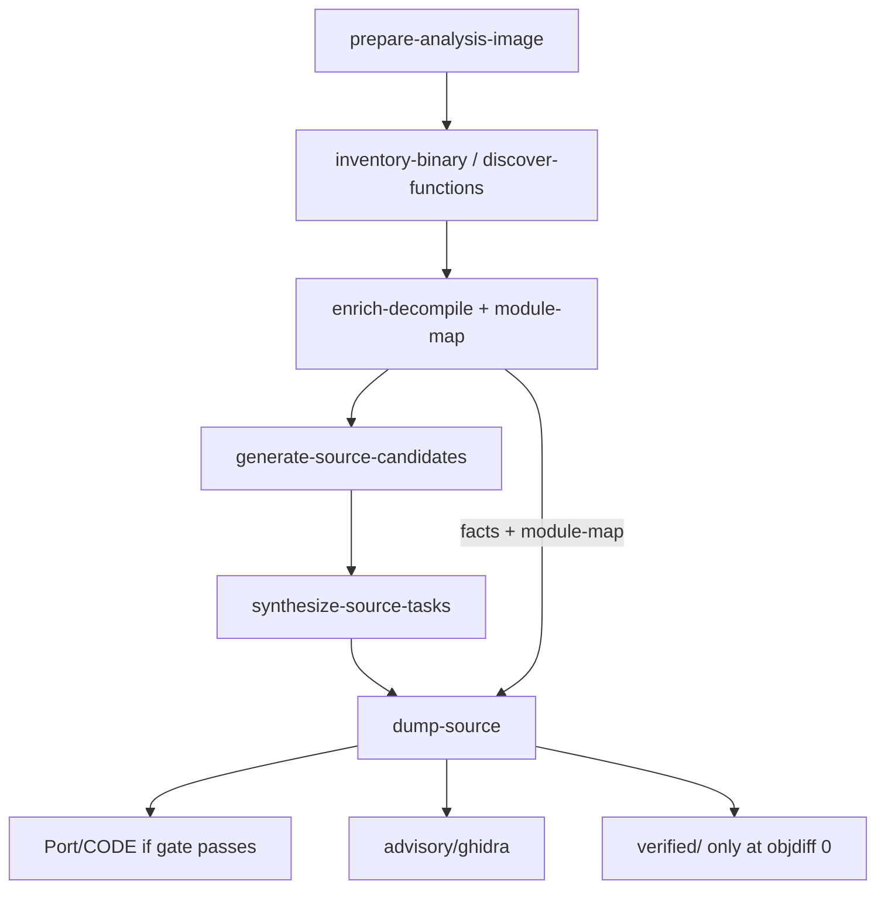

# Readable Recovery Quality Plan

## Summary

Wire enrich-before-decompile (names, types, structs, RTTI/vtable classes, module
map) into the default `agentdecompile-reconstruct` path, add PE MSVC class
recovery parity with the existing ELF lane, and keep dump noise-strip + Port
readability gating as the operator-facing finish. Readability stays advisory;
`verified/` still requires objdiff 0.

## Problem Frame

The enrichment stack already exists under `src/agentdecompile_recovery/`
(`pyghidra_enrich.py`, `rtti_recover.py`, `module_resolver.py`,
`reference_corpus.py`) and runs on the ELF one-shot path in
`source_parity_one_shot.py`. The product entrypoint
(`frontdoor.py` → `pipeline.RecoveryRunner`) never calls it, so default dumps
still look like raw Ghidra. Requirements:
`docs/brainstorms/2026-07-25-readable-recovery-quality-requirements.md`.

## Requirements Traceability

| ID | Requirement (from origin) | Plan coverage |
|----|---------------------------|---------------|
| R1–R4 | Enrich on default path before decompile; ordered; named provenance; structs | U1 |
| R5–R6 | PE MSVC RTTI / vtable class recovery | U2 |
| R7–R8 | Module map for PE + ELF | U1, U3 |
| R9–R11 | Noise strip, Port gate, house style | U3 (mostly landed; verify on reconstruct dump) |
| R12–R13 | Honesty: readability ≠ proof; no byte-emitters in verified | U1, U3, U4 |

## Key Technical Decisions

- KTD1. **Reuse one-shot enrichment modules from `RecoveryRunner`, do not fork a second enricher.** Call into `pyghidra_enrich`, `module_resolver`, and (for ELF) existing Itanium helpers from a new reconstruct stage (or stages) so one-shot and reconstruct share behavior.
- KTD2. **Insert enrich after inventory / discover-functions and before generate-source-candidates.** Facts must exist for synth and dump; enrich owns writing `facts/function-facts.jsonl` + `facts/module-map.json` under the reconstruct work dir.
- KTD3. **PE class recovery prefers Ghidra RTTI / class data types via the live PyGhidra session.** Use program analysis already present after open/analyze; extend `rtti_recover.py` (or a sibling PE helper) only where Ghidra does not expose enough for naming/vtable slots. Avoid a standalone binary-only MSVC RTTI parser as the primary path.
- KTD4. **Module conflict resolution stays the existing ranked resolver** (assert-string → RTTI class → call-graph vote → optional VA bands → `recovered/unmapped`). No new policy in v1.
- KTD5. **Enrichment is default-on; opt-out is `--skip-enrichment`.** Fast path for inventory/match-only operators; default product path always enriches.
- KTD6. **Port gate stays the boolean name+module check** (`passes_readability_gate`). Numeric score deferred.

## High-Level Technical Design

Directional only: enrich produces advisory facts; synth/match remain the proof path.

## Implementation Units

### U1. Reconstruct enrich stage

**Goal:** Default `RecoveryRunner` runs enrich-before-decompile and writes facts + module-map into the work dir.

**Files:**
- `src/agentdecompile_recovery/pipeline.py`
- `src/agentdecompile_recovery/frontdoor.py` (flag wiring if needed)
- Reuse: `src/agentdecompile_recovery/pyghidra_enrich.py`, `module_resolver.py`, `source_parity_one_shot.py` (shared helpers, avoid duplicating session open logic)
- `tests/test_recovery_enrich_stage.py` (new)

**Approach:** Add an `enrich-decompile` (and/or `module-map`) stage between function discovery and source generation. Reuse `PyGhidraEnrichProgram` + `run_enrich_pipeline` / `build_names_by_entry`. Place receipts under `work-dir/facts/` (and optionally `work-dir/unpack/facts/` for dump discovery compatibility). When enrich succeeds, `generate-source-candidates` must see decompiler facts. `--skip-enrichment` skips the stage with an explicit receipt reason.

**Test scenarios:**
- Enrich stage writes non-empty `function-facts.jsonl` and `module-map.json` for a fixture ELF when Ghidra is available (mark integration if needed; unit-test session ordering with `FakeEnrichProgram`).
- With `--skip-enrichment`, stage is skipped and generate-source still runs without requiring enrich facts.
- Named provenance from `build_names_by_entry` appears on facts for non-`FUN_` symbols.

**Requirements:** R1–R4, R7–R8, R12, KTD1–KTD2, KTD5.

### U2. PE MSVC RTTI / class enrichment

**Goal:** PE targets get class-shaped enrichment comparable to ELF Itanium path.

**Files:**
- `src/agentdecompile_recovery/rtti_recover.py` (extend or add PE helpers)
- `src/agentdecompile_recovery/pyghidra_enrich.py` (apply class DTs / names from PE evidence)
- `tests/fixtures/pe/` (minimal RTTI-bearing fixture if feasible)
- `tests/test_pe_rtti_recover.py` (new)

**Approach:** In the enrich session, read Ghidra RTTI / class / vtable structures for PE; map typeinfo / class names into `apply_struct` / `apply_name` / module hints. Unmapped vtable slots get stable `Class_slot_N` placeholders (R6). Keep claimBoundary advisory.

**Test scenarios:**
- Demangle / class-name extraction from fixture PE RTTI strings or mocked Ghidra surface.
- Enrich applies at least one non-default class-related name or struct when evidence exists.
- Missing RTTI does not fail the stage (soft degrade to symbol/string enrichment only).

**Requirements:** R5–R6, KTD3.

### U3. Dump path verification on reconstruct work dirs

**Goal:** Reconstruct dumps always consume module-map + noise-strip + Port gate; no dual-path regressions.

**Files:**
- `src/agentdecompile_recovery/frontdoor.py` (`run_dump_source`)
- `src/agentdecompile_recovery/source_dump.py` (confirm `strip_ghidra_noise` / `allman_brace_style` on Port + advisory)
- `tests/test_elf_dump_readability.py`, `tests/test_match_cache_and_dump.py` (extend)

**Approach:** Ensure dump looks for `work-dir/facts/module-map.json` (already partially present). Confirm advisory/Port bodies lose WARNING/library banners. Confirm FUN_+fallback modules stay out of Port. Do not change proof ladder math.

**Test scenarios:**
- Dump with module hints places a named function under a non-fallback module in Port.
- Dump excludes FUN_ + fallback from Port (`readabilityExcludedFromPort` increments).
- Styled advisory text contains no `WARNING:` / `Library Function` banners.

**Requirements:** R9–R11, R12–R13, KTD4, KTD6.

### U4. Critical-path docs + operator surface

**Goal:** Docs and capabilities describe enrich as part of the default reconstruct path.

**Files:**
- `docs/CRITICAL_PATH.md`
- `STRATEGY.md` (short note under Matching recovery / Multi-format export if needed)
- `AGENTS.md` only if entrypoint guidance would otherwise mislead

**Approach:** Document enrich-before-decompile + `--skip-enrichment`, PE/ELF behavior, and that Port readability is advisory. Update critical-path nextActions hints if they still point at thin inventory-only flow.

**Test scenarios:** Doc-only; no code tests. Manual check that CRITICAL_PATH mermaid/stages mention enrich.

**Requirements:** R1, KTD5 (operator visibility).

## Scope Boundaries

**In scope:** Default-path enrich wiring, PE RTTI class enrichment, module-map + dump gate verification, skip flag, docs.

**Deferred:** LLM skin, SAILR-style CF structuring, DWARF/PDB as primary naming, numeric readability score, vacuum/proof-coverage scale-up, full one-shot/reconstruct code merge beyond shared enrich calls.

**Out of identity:** Promoting readable advisory into verified; 90% parity marketing.

## Risks & Dependencies

| Risk | Mitigation |
|------|------------|
| Cold-run wall time rises with default enrich | Document; provide `--skip-enrichment`; reuse analyzed Ghidra project when inventory already opened one |
| PE RTTI coverage uneven across compilers | Soft-fail enrich; still apply symbols/strings/modules |
| Dual paths (one-shot vs reconstruct) drift again | Shared modules only (KTD1); avoid copy-paste stage bodies |
| Ghidra unavailable in unit CI | Keep FakeEnrichProgram unit tests; gate live PyGhidra behind markers |

## Execution Posture

Prefer characterization tests around dump/Port gate and FakeEnrich ordering first, then reconstruct stage wiring. Live Ghidra tests are optional/integration.

## Open Questions

None blocking. Implementation may choose exact stage name(s) and work-dir layout (`facts/` vs `unpack/facts/`) as long as dump discovery finds the module map.
