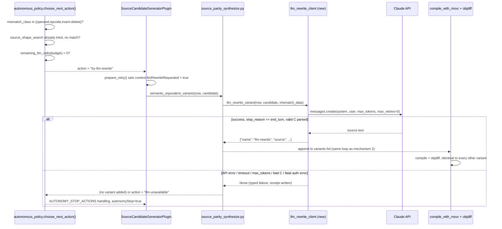

# feat: LLM-based candidate rewriting (challenger lane, mechanism 3)

---

## Summary

Add a third challenger-lane mechanism to the proof-scale recovery loop: when a function is a real near-miss (operand/opcode/insert-delete mismatch) and mechanisms 1 (compiler-flag exploration) and 2 (idiom permutation) have both exhausted without a byte-exact match, make one bounded Claude API call to rewrite the packaged decompiler source into an alternate C shape. The result is fed through the existing compile+objdiff verification path unchanged. This closes the gap Run9–Run12 exposed: 12–15 near-miss functions per campaign with no further conversion lever.

## Problem Frame

(see origin: docs/brainstorms/2026-07-29-llm-candidate-rewriting-requirements.md)

`generate()` in `source_parity_synthesize.py` covers ~30 narrow byte-pattern shapes plus one rule-agnostic idiom-permutation fallback. Everything else — most real functions with actual control flow — has exactly one candidate (raw decompiler output, recompiled under different flags), and when that candidate's near-miss isn't flag-sensitive or idiom-permutable, the function is permanently stuck. Mechanism 2 proved the "generate alternate C shape → verify via the same objdiff gate" pattern works, but doesn't generalize past one narrow shape without either a large hand-written rule catalog or a general rewriter.

## Key Technical Decisions

- **Insertion point: `semantic_equivalent_variants()` in `source_parity_synthesize.py`, same slot as mechanism 2.** A new `llm_rewrite_variant(row, candidate, mismatch_data)` function returns a single `{"name": "llm-rewrite", "source": ...}` dict, appended to the variants list that `run_msvc_source_shape_search()` already compiles and objdiffs identically to every other variant (source_parity_synthesize.py, `run_msvc_source_shape_search` loop). No new verification path — satisfies R5 by construction rather than by convention.
- **Trigger gate lives in `autonomous_policy.choose_next_action()`.** A new action value (`try-llm-rewrite`) is produced when `mismatch_class` is a real near-miss class (operand/opcode/insert-delete — the existing `has_mismatch_evidence` set), `source_shape_search` has already been attempted without a match, and `remaining_llm_calls(...) > 0`. `SourceCandidateGeneratorPlugin.prepare_retry()` reads this action and sets an `llmRewriteRequested` context flag, mirroring how `sourceShapeSearch`/`routedPlaybook` are already threaded today. This keeps the gate (R2) in the one place policy decisions already live, rather than duplicating near-miss/exhaustion logic inside `source_parity_synthesize.py`.
- **Budget: extend `AutonomyBudget` (frozen dataclass) with `max_llm_calls_per_function: int = 0`.** Default 0 keeps existing campaigns unaffected (R1). A `remaining_llm_calls(calls_seen, budget)` pure helper follows the exact shape of the existing `remaining_attempts()`. Per-function LLM call counts are tracked the same way attempt counts are tracked today (via attempt records / campaign state), not a new counting mechanism.
- **Fail-closed via a new typed terminal.** `"llm-unavailable"` is added to `plugin_pipeline.py`'s `AUTONOMY_STOP_ACTIONS` frozenset, exactly like the existing `"stop-budget-exhausted"` handling — `prepare_retry()` sets `context["autonomyStop"] = True` and the retry loop exits cleanly. Any API error, timeout, non-`end_turn`/non-`max_tokens`-handled stop reason, or budget exhaustion routes here. This satisfies R4 by reusing the existing stop-action mechanism rather than inventing a parallel one.
- **Claude API client: official `anthropic` Python SDK, not hand-rolled httpx.** New dependency in `pyproject.toml`. The SDK's transport is httpx underneath and accepts a caller-supplied `httpx.Client`, so existing httpx conventions (timeouts, pooling) still apply. Construct with `max_retries=0` — the loop's own bounded-attempt logic (one LLM call per trigger, gated by budget) owns retry/backoff decisions; the SDK's internal retry policy is explicitly disabled to avoid a hidden retry storm underneath the "fail-closed, no retry storm" requirement. Model default: **Claude Sonnet** (cost/quality balance for a bounded per-function budget), overridable via CLI flag.
- **Prompt shape: plain-text output with a strict single-fenced-code-block instruction, not structured/JSON output.** JSON-encoding a full C source blob risks escaping bugs (quotes, backslashes, newlines); a delimited plain-text block is parsed deterministically in-process. System prompt carries rewrite instructions/constraints; user message carries the packaged-source candidate, target byte slice/disassembly, and the current objdiff mismatch histogram (per origin's "context fed to the model" decision).
- **`stop_reason` and error classes are handled explicitly, not just exceptions.** `stop_reason == "max_tokens"` (truncated output) and `"model_context_window_exceeded"` are treated as failed rewrite attempts, not silently accepted as valid C source. `RateLimitError`/`OverloadedError`/`InternalServerError`/`ServiceUnavailableError`/`APIConnectionError`/`APITimeoutError` are the "this call failed, no retry, count against budget, move on" set. `AuthenticationError`/`BadRequestError`/`PermissionDeniedError`/`NotFoundError` are treated as fatal/config errors — one occurrence routes to `llm-unavailable` for the remainder of the campaign (not per-function) since these indicate a broken setup, not a transient per-call failure.
- **Receipt schema: `agentdecompile.llm-rewrite-call.v1`**, following the existing `agentdecompile.source-shape-search.v1` template exactly (schema string, `claimBoundary`, atomic write via `atomic_write_json()`). Records: prompt reference (a hash/identifier, not the full prompt text), response status, `stop_reason`, token usage (`input_tokens`/`output_tokens`), resulting candidate source hash, and the objdiff outcome once verified. Advisory only — the objdiff gate remains the sole proof mechanism (R3).

## High-Level Technical Design



## Requirements Traceability

- **R1** (opt-in budget field, default 0) → U1 (AutonomyBudget field + wiring)
- **R2** (trigger only on real near-miss, after mechanisms 1+2 exhausted) → U2 (policy gate)
- **R3** (every call recorded as advisory receipt) → U4 (receipt schema)
- **R4** (fail-closed, typed terminal, no retry storm) → U1, U3 (stop-action wiring), U4
- **R5** (identical compile+objdiff path, no special-casing) → U3 (insertion into existing variants loop)

## Scope Boundaries

(see origin: docs/brainstorms/2026-07-29-llm-candidate-rewriting-requirements.md)

### Deferred for later
- Multiple candidates per LLM call.
- Pluggable/multi-provider abstraction — Claude API (`anthropic` SDK) only.
- Prompt-tuning/iteration loops (feeding a failed rewrite's diff back for a second attempt).

### Outside this mechanism's identity
- Claiming LLM-generated source as verified without the objdiff gate.
- Unbounded autonomous LLM spend — every run respects `max_llm_calls_per_function`.

### Deferred to Follow-Up Work
- AWS Bedrock / GCP Vertex credential paths (SDK supports them; not needed for a direct-API v1).
- Prompt caching (`cache_control` blocks) for cost reduction — worth revisiting once real call-volume data exists.

## Dependencies / Prerequisites

- New dependency: `anthropic` Python SDK, added to `pyproject.toml`.
- New env var: `ANTHROPIC_API_KEY` (SDK default credential resolution). No env var currently documented in `.env.example`; add it there. **Assumption, not yet verified**: credentials are available in the environment the autonomous loop runs in (carried from origin as an implementation-time unknown — verify before running a real campaign with the flag enabled; the mechanism must no-op safely via `llm-unavailable` if the key is absent).
- Existing objdiff histogram/`diff_kind` data (fixed on this branch, commit `6a5a827`) — confirmed available at the point `mismatch_class` is computed.

---

## Implementation Units

### U1. Extend AutonomyBudget with LLM call budget

**Goal:** Add a bounded, opt-in `max_llm_calls_per_function` field to `AutonomyBudget`, following the exact pattern of `max_attempts_per_function`, and wire it through CLI/programmatic entry points.

**Requirements:** R1

**Dependencies:** None (first unit)

**Files:**
- Modify: `src/agentdecompile_recovery/autonomy_budget.py`
- Modify: `src/agentdecompile_recovery/frontdoor.py`
- Test: `tests/test_autonomy_budget.py`

**Approach:**
- Add `max_llm_calls_per_function: int = 0` to the `AutonomyBudget` frozen dataclass; extend `__post_init__` validation to match the existing `>= 0`-style checks on `max_attempts_per_function`.
- Add `remaining_llm_calls(calls_seen: int, budget: AutonomyBudget) -> int`, mirroring `remaining_attempts()` (autonomy_budget.py:199).
- Extend `_coerce_budget()` (autonomous_policy.py:176) to read the new field from both snake_case and camelCase keys, matching the existing coercion pattern.
- `to_json()` includes the new field under the existing `agentdecompile.autonomy-budget.v1` schema — no schema version bump needed since this is an additive field with a safe default.
- `frontdoor.py`: add `--autonomous-max-llm-calls` (int, default 0) immediately after `--autonomous-max-attempts` in the argparse block (~line 127-160). Thread `autonomous_max_llm_calls` through the same four sites `autonomous_max_attempts` already appears in: the two `budget_from_args(...)` call sites (~lines 491-495, 514-518), the programmatic `reconstruct(...)`-style function signatures (~lines 748-846), and the subprocess-forwarding `argv.extend([...])` block (~lines 772-781).

**Patterns to follow:** `max_attempts_per_function` end-to-end in `autonomy_budget.py` and `frontdoor.py` — same validation shape, same four wiring sites, same JSON key naming.

**Test scenarios:**
- Happy path: `AutonomyBudget(max_llm_calls_per_function=3)` constructs; `to_json()` includes the field.
- Default: `AutonomyBudget()` has `max_llm_calls_per_function == 0`; existing campaigns constructed without the field are unaffected (regression check against current `test_autonomy_budget.py` assertions).
- Edge case: `remaining_llm_calls(calls_seen=0, budget)` returns the full budget; `remaining_llm_calls(calls_seen=budget.max_llm_calls_per_function, budget)` returns 0.
- Error path: negative `max_llm_calls_per_function` raises `ValueError` in `__post_init__`, matching existing negative-value validation for `max_attempts_per_function`.
- CLI: `--autonomous-max-llm-calls 5` on `frontdoor.py`'s argv produces a budget with `max_llm_calls_per_function == 5`; omitting the flag defaults to 0.

**Verification:** `AutonomyBudget` round-trips the new field through construction, JSON serialization, and CLI parsing; existing `test_autonomy_budget.py` suite still passes unmodified for budgets that don't set the new field.

---

### U2. LLM rewrite client

**Goal:** A new module wrapping the Anthropic Messages API for a single bounded, fail-closed code-rewrite call.

**Requirements:** R3, R4

**Dependencies:** None (can build in parallel with U1)

**Files:**
- Create: `src/agentdecompile_recovery/llm_rewrite_client.py`
- Modify: `pyproject.toml` (add `anthropic` dependency)
- Modify: `.env.example` (document `ANTHROPIC_API_KEY`)
- Test: `tests/test_llm_rewrite_client.py`

**Approach:**
- One function, e.g. `request_llm_rewrite(system_prompt: str, user_prompt: str, *, model: str, max_tokens: int, client: Anthropic | None = None) -> LlmRewriteResult`, where `LlmRewriteResult` is a small dataclass/typed-dict carrying `status` (`"ok"` / `"llm-unavailable"` / `"llm-fatal"`), `source: str | None`, `stop_reason: str | None`, `input_tokens`/`output_tokens`, and an error description when applicable.
- Construct the SDK client with `max_retries=0` and reuse the codebase's existing `httpx.Timeout` conventions via the SDK's `http_client=` param (or `timeout=` passthrough) rather than the SDK's own default timeout object.
- Catch and classify exceptions per the Key Technical Decisions error-class split: transient (`RateLimitError`, `OverloadedError`, `InternalServerError`, `ServiceUnavailableError`, `APIConnectionError`, `APITimeoutError`) → `status="llm-unavailable"`; fatal/config (`AuthenticationError`, `BadRequestError`, `PermissionDeniedError`, `NotFoundError`) → `status="llm-fatal"`.
- On success, inspect `stop_reason`: `"end_turn"` with a successfully-extracted single fenced code block → `status="ok"`; `"max_tokens"` or `"model_context_window_exceeded"` or no extractable fenced block → `status="llm-unavailable"` (treated as a failed attempt, not a crash).
- Source extraction: parse `message.content` blocks for `type == "text"`, extract the single fenced code block deterministically (strip fence markers); do not attempt JSON/structured output parsing for the source blob itself.
- This module has no knowledge of the recovery pipeline's row/candidate/mismatch types — it takes fully-formed prompt strings and returns a result. Prompt construction (packaging candidate + target bytes + histogram into `system_prompt`/`user_prompt`) belongs to U3, keeping this module a thin, independently-testable API boundary.

**Patterns to follow:** `src/agentdecompile_cli/bridge.py`'s `RawMcpHttpBackend` for timeout/error-handling style (explicit `httpx.Timeout`, deliberate conditions rather than generic retry loops) — reused here via the SDK's `http_client=` passthrough. `atomic_write_json()` / `now()` from `.state` for any receipt-adjacent writes.

**Test scenarios:**
- Happy path: mocked Anthropic client returns `stop_reason="end_turn"` with a valid single fenced C block → `status="ok"`, `source` extracted correctly, token counts captured.
- Edge case: response with `stop_reason="max_tokens"` → `status="llm-unavailable"`, `source is None`.
- Edge case: response with no fenced code block in the text content → `status="llm-unavailable"`.
- Edge case: response with multiple fenced blocks → deterministic handling (first block, or explicit failure) — pick one and test it.
- Error path: mocked `RateLimitError` raised → `status="llm-unavailable"`, no exception propagates.
- Error path: mocked `AuthenticationError` raised → `status="llm-fatal"`, no exception propagates.
- Error path: mocked `APITimeoutError` raised → `status="llm-unavailable"`.
- Integration: no real network calls in tests — all Anthropic client interaction is mocked/monkeypatched at the SDK boundary.

**Verification:** Every SDK exception class named in the Key Technical Decisions error split has an explicit test driving it to the correct `status`; no test makes a real API call (verify via `ANTHROPIC_API_KEY` unset in test environment plus mocked client injection).

---

### U3. Policy gate and pipeline insertion

**Goal:** Trigger the LLM rewrite only for real near-miss functions that have exhausted mechanisms 1+2, respecting the per-function budget, and route failures through the existing fail-closed stop-action mechanism.

**Requirements:** R2, R4, R5

**Dependencies:** U1 (needs `remaining_llm_calls`), U2 (needs the client's result shape)

**Files:**
- Modify: `src/agentdecompile_recovery/autonomous_policy.py`
- Modify: `src/agentdecompile_recovery/source_plugins.py`
- Modify: `src/agentdecompile_recovery/plugin_pipeline.py`
- Modify: `src/agentdecompile_recovery/source_parity_synthesize.py`
- Test: `tests/test_autonomous_policy.py` (or equivalent existing test file)
- Test: `tests/test_llm_rewrite_shape_search.py`

**Approach:**
- `autonomous_policy.choose_next_action()`: add an `elif` branch producing `action: "try-llm-rewrite"` when `has_mismatch_evidence` is true (existing `{CLASS_OPERAND, CLASS_OPCODE, CLASS_INSERT_DELETE}` set), the function has already gone through source-shape-search without a match, and `remaining_llm_calls(calls_seen, budget) > 0`. When the LLM budget is exhausted but mismatch evidence remains, fall through to today's existing terminal behavior (`stop-budget-exhausted` / `reject-near-miss`) — do not invent a separate "LLM budget exhausted" terminal, since the existing budget-exhaustion path already covers "no more levers, stop."
- `source_plugins.py`'s `SourceCandidateGeneratorPlugin.prepare_retry()`: when `policy.get("action") == "try-llm-rewrite"`, set `context["llmRewriteRequested"] = True`, mirroring the existing `sourceShapeSearch`/`routedPlaybook` flag-setting.
- `source_parity_synthesize.py`: add `llm_rewrite_variant(row, candidate, mismatch_data) -> dict | None`, called from `semantic_equivalent_variants()` when the `llmRewriteRequested` context flag is set (threaded down from `run_msvc_source_shape_search()` similarly to how `source_shape_search` already flows in). This function builds the system/user prompts from `row` (packaged-source candidate), the target byte slice/disassembly, and `mismatch_data` (histogram + `diff_kind` breakdown from `mismatch_classify.py`), calls `llm_rewrite_client.request_llm_rewrite(...)` (U2), writes the `agentdecompile.llm-rewrite-call.v1` receipt (U4), and returns `{"name": "llm-rewrite", "source": ...}` on success or `None` on failure (mirroring `byte_field_guard_return_self_variants()`'s return-empty-list-on-no-match convention, adapted to a single optional variant).
- `plugin_pipeline.py`: add `"llm-unavailable"` to the `AUTONOMY_STOP_ACTIONS` frozenset so `prepare_retry()` sets `context["autonomyStop"] = True` and exits the retry loop cleanly when U2 reports `status="llm-fatal"` for the campaign (config/auth errors) — per-call `"llm-unavailable"` transient failures do NOT stop the campaign, only exhaust that function's LLM attempt and fall through to existing near-miss handling.

**Technical design:**
```
choose_next_action(...):
    ...existing operand/opcode/insert-delete + boundary-suspect logic...
    elif has_mismatch_evidence and source_shape_search_exhausted and remaining_llm_calls(calls_seen, budget) > 0:
        action = "try-llm-rewrite"
    ...existing stop-budget-exhausted / reject-near-miss fallthrough unchanged...
```
(Directional guidance for the branch placement relative to existing logic — not a literal diff.)

**Patterns to follow:** The existing `sourceShapeSearch`/`routedPlaybook` context-flag flow between `autonomous_policy.py` → `source_plugins.py` → `source_parity_synthesize.py`. The existing `AUTONOMY_STOP_ACTIONS` handling for `stop-budget-exhausted`.

**Test scenarios:**
- Happy path: near-miss classified as `operand`, source-shape-search already exhausted, `remaining_llm_calls > 0` → `choose_next_action()` returns `action == "try-llm-rewrite"`.
- Edge case: near-miss evidence present but `remaining_llm_calls == 0` → falls through to existing `stop-budget-exhausted`/`reject-near-miss` behavior (regression: existing tests for that path still pass).
- Edge case: `mismatch_class` is `boundary-suspect` or `unclassified` (no real near-miss evidence) → LLM rewrite is never triggered, regardless of remaining budget.
- Edge case: source-shape-search has NOT yet been attempted → LLM rewrite is not triggered (mechanisms 1+2 must be exhausted first, per R2).
- Integration: `llmRewriteRequested` context flag set by `prepare_retry()` when action is `try-llm-rewrite`, reaches `semantic_equivalent_variants()`, and `llm_rewrite_variant()` is invoked (mock `llm_rewrite_client` at the module boundary, no real API call).
- Integration: `llm_rewrite_variant()` returning a variant dict flows into the same `run_msvc_source_shape_search()` compile+objdiff loop as a mechanism-2 variant — same success/failure handling, no special-cased acceptance path (covers R5).
- Error path: `llm_rewrite_client` returns `status="llm-fatal"` → `plugin_pipeline.py` routes through `AUTONOMY_STOP_ACTIONS`, `context["autonomyStop"] = True`, retry loop exits without raising.
- Error path: `llm_rewrite_client` returns `status="llm-unavailable"` (transient) → no variant added, function falls through to existing near-miss/terminal handling, campaign continues to the next function (does not stop the whole campaign).

**Verification:** A near-miss function with `source_shape_search` exhausted and LLM budget available reaches `llm_rewrite_variant()` exactly once per policy decision (not per compile attempt); a fatal LLM error stops the campaign cleanly via the existing stop-action mechanism; a transient LLM error does not stop the campaign.

---

### U4. LLM call receipts

**Goal:** Every LLM call and its outcome is recorded as an advisory receipt, following the existing receipt-schema conventions.

**Requirements:** R3

**Dependencies:** U2 (result shape), U3 (call site)

**Files:**
- Modify: `src/agentdecompile_recovery/source_parity_synthesize.py` (receipt write, co-located with `llm_rewrite_variant()` from U3)
- Test: `tests/test_llm_rewrite_receipt.py`

**Approach:**
- Define schema `agentdecompile.llm-rewrite-call.v1`, following `agentdecompile.source-shape-search.v1`'s structure exactly: `schema`, `claimBoundary` (advisory, not proof — reiterating the objdiff gate is the sole verification), timestamp via `now()`, and call-specific fields: a prompt reference (hash/identifier of the constructed prompt, not full prompt text, to keep receipts small and avoid leaking large source blobs into logs redundantly), `status` (`ok`/`llm-unavailable`/`llm-fatal`), `stopReason`, `model`, `inputTokens`/`outputTokens`, `resultingCandidateSha256` (when a candidate was produced), and — once the variant has gone through compile+objdiff — the objdiff outcome (`differences`, `status`) so the receipt captures the full call-to-verification lifecycle, not just the LLM call in isolation.
- Write via `atomic_write_json()`, appended to the same per-function receipt directory structure that `run_msvc_source_shape_search()`'s `summary.json` already uses, or as its own `llm-rewrite-summary.json` sibling file — follow whichever existing per-function directory convention `run_msvc_source_shape_search()` uses today so tooling that already scans that directory picks this up without changes.

**Patterns to follow:** `run_msvc_source_shape_search()`'s `summary.json` write (source_parity_synthesize.py) — same schema/claimBoundary/atomic-write shape, same directory placement convention.

**Test scenarios:**
- Happy path: successful LLM call + successful objdiff match → receipt written with `status="ok"`, full token/candidate/objdiff fields populated.
- Edge case: successful LLM call but candidate fails to compile or doesn't match → receipt written with `status="ok"` for the call itself but the objdiff outcome fields reflect the mismatch (the receipt distinguishes "call succeeded" from "candidate verified" — never conflates the two, per R3's "advisory only" requirement).
- Error path: `llm-unavailable`/`llm-fatal` call → receipt written with the failure status and no candidate/objdiff fields (or explicit nulls), never a fabricated success.
- Verification: receipt JSON always includes `claimBoundary` and schema string, matching the existing `agentdecompile.source-shape-search.v1` convention byte-for-byte in structure (not values).

**Verification:** Every LLM call path (success, transient failure, fatal failure) produces exactly one receipt; receipts never claim verification the objdiff gate hasn't actually performed.

---

## Risks & Mitigations

- **Risk: hidden cost blowup if the budget field is misconfigured or the gate mis-fires.** Mitigated by default `max_llm_calls_per_function=0` (opt-in only), the existing per-function budget-exhaustion fallthrough being reused rather than duplicated, and `max_retries=0` at the SDK level preventing per-call retry amplification.
- **Risk: LLM-generated C source triggers the same invalid-C/`C2146`-class compile failures already documented for `source_parity_synthesize.py`'s existing generators** (per `docs/solutions/workflow-learnings/2026-07-25-proof-scale-smoke-swkotor.md`). Mitigated by R5 — the LLM variant goes through the identical compile+objdiff path, so a syntactically invalid rewrite simply fails to compile and is recorded as a normal non-match, not a special error case requiring new handling.
- **Risk: `ANTHROPIC_API_KEY` unavailable in the environment the autonomous loop runs in** (explicitly flagged as unverified in the origin document). Mitigated by treating missing/invalid credentials as an `AuthenticationError` → `status="llm-fatal"` → clean `autonomyStop` on first occurrence, rather than crashing the campaign.

## Open Questions

- Exact per-function attempt-count source for `remaining_llm_calls(calls_seen, ...)` — whether LLM call counts are tracked via existing attempt-record JSONL scanning (same mechanism `remaining_attempts()` uses) or a new lightweight counter. Deferred to implementation; the existing `remaining_attempts()` call site in `autonomous_policy.py` shows the pattern to mirror.
- Whether `max_tokens` should be a fixed constant or derived from the target function's byte-slice size (larger functions need more room for output C). Deferred to implementation — start with a fixed generous constant (e.g. sized for the largest functions seen in the swkotor corpus) and revisit if truncation (`stop_reason == "max_tokens"`) shows up often in practice.
- Real cost-per-campaign estimate at realistic near-miss volumes (12-15/campaign per Run9-Run12) — worth a rough calculation once Sonnet pricing and typical prompt/output token sizes for this corpus are known; not blocking for the plan, but should inform the default `max_llm_calls_per_function` recommended in documentation/CLI help text.

## Sources / Research

- `src/agentdecompile_recovery/autonomy_budget.py`, `autonomous_policy.py`, `source_plugins.py`, `plugin_pipeline.py`, `source_parity_synthesize.py`, `frontdoor.py` — existing pipeline, budget, and mechanism-2 insertion-point structure (repo research).
- `src/agentdecompile_cli/bridge.py` — existing httpx timeout/error-handling conventions (repo research).
- Anthropic Python SDK (Context7 `/anthropics/anthropic-sdk-python`) — client construction, retry/timeout semantics, exception hierarchy, `stop_reason` handling, token usage fields (external research).
- `docs/solutions/workflow-learnings/2026-07-25-proof-scale-smoke-swkotor.md` — near-miss evidence volume, histogram/`diff_kind` fix confirming dependency data is live, and the still-open invalid-C generator bug relevant to risk mitigation (learnings research).
- `docs/solutions/architecture-patterns/decomp-matching-toolchain.md` — confirms the LLM rewriter's place in the verify-loop escalation tier (objdiff → permuter-equivalent → LLM-rewrite), not a parallel pipeline (learnings research).
- `docs/brainstorms/2026-07-29-llm-candidate-rewriting-requirements.md` — origin requirements document.
