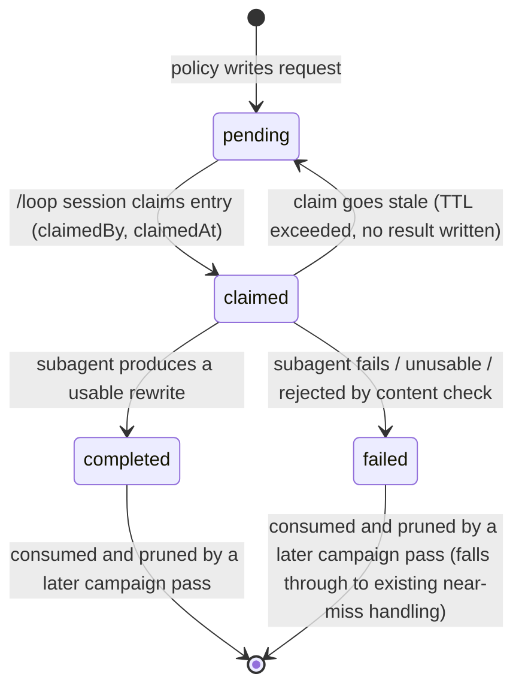

# feat: Subagent-fulfilled candidate rewriting + `/plugin install` packaging

---

## Summary

Two changes: (1) remove the direct-Anthropic-API challenger-lane mechanism shipped earlier this session and replace it with a file-queue handoff to a live Claude Code session (driven by `/loop`) that fulfills rewrites via an `Agent` subagent dispatch; (2) package AgentDecompile as an installable Claude Code plugin (`.claude-plugin/plugin.json` + `marketplace.json`, wiring `mcpServers` so `/plugin install` launches the real MCP server).

## Problem Frame

(see origin: docs/brainstorms/2026-07-29-subagent-rewrite-and-plugin-install-requirements.md)

Mechanism 3 (challenger-lane LLM rewriting) was implemented as a headless Python client calling the Anthropic Messages API directly with its own `ANTHROPIC_API_KEY`, gated by `AutonomyBudget.max_llm_calls_per_function`. This duplicates API spend/credentials outside whatever agent session is already running AgentDecompile via MCP. The fix is architectural, not a parameter change: the rewrite step must be fulfilled by a subagent of an already-running agent, not a standalone API client.

Separately, AgentDecompile has no `/plugin install` path today — only a manual `uv`-based MCP server setup documented in `.claude/skills/agentdecompile-server-env`. Repo research confirms `.claude-plugin/` does not exist yet, and that `pyproject.toml`'s `[tool.setuptools.packages.find]` scoping means adding `.claude-plugin/` has no effect on the PyPI package build (`publish-pypi.yml` is unaffected).

## Key Technical Decisions

- **Fulfillment shape: queue + live `/loop` session.** The Python `--autonomous` campaign loop keeps its existing role (near-miss detection, mechanism-1/2 exhaustion gating, compile+objdiff verification). When policy decides a rewrite is warranted, it writes a typed request to `work_dir/state/rewrite-queue.json` and produces a non-blocking typed terminal for that attempt — mirroring the existing `pending`/`matched`/`failed` lifecycle shape in `autonomy_budget.ensure_vacuum_queue()` (the closest existing async-handoff precedent in this codebase; repo research confirms no other file-queue pattern exists to reuse). A live Claude Code session running `/loop` polls `pending` entries, dispatches one `Agent` subagent per entry, and writes the result back into the same queue file keyed by request id.
- **Rename, don't redesign, the existing budget/gating shape** (per origin decision): `max_llm_calls_per_function` → `max_rewrite_requests_per_function`, `try-llm-rewrite` → `try-rewrite-request`, `llm-unavailable` → `rewrite-unavailable`. The near-miss + mechanism-1/2-exhaustion gate in `autonomous_policy.choose_next_action()` and the `AUTONOMY_STOP_ACTIONS` typed-terminal wiring in `plugin_pipeline.py` are structurally sound; only the fulfillment side (synchronous API call → async queue write) changes.
- **Full removal, no fallback.** `src/agentdecompile_recovery/llm_rewrite_client.py` is deleted outright, along with the `anthropic` dependency and `ANTHROPIC_API_KEY` from `.env.example`. Repo research found `scripts/run-ai-phase.sh` and `.github/workflows/claude.yml` also reference `ANTHROPIC_API_KEY` for unrelated purposes (a separate pre-existing "AI phase" container-based matcher, and the Claude Code GitHub Action's own CI credential) — both are explicitly out of scope and untouched.
- **`try-rewrite-request` must become a genuine non-blocking terminal — this is a new decision, not inherited behavior.** Feasibility review (this session) found the plan's original framing ("terminates non-blocking, as today") was factually wrong: in the code shipped this session, `try-llm-rewrite` sits in `source_plugins.py`'s `bump_actions` set, so the pipeline retries the *same* synchronous call inline, in-process, with no sleep (`PluginPipeline` has no backoff; `--no-sleep` is always passed to the vacuum bridge). At `max_attempts_per_function=3` (default), that retry budget burns in milliseconds — long before any live `/loop` session could notice a queue entry, dispatch a subagent ("may take minutes"), and write a result back. **Fix: `try-rewrite-request` is added to `plugin_pipeline.py`'s `AUTONOMY_STOP_ACTIONS`** (alongside the renamed `rewrite-unavailable`), so writing a pending request actually halts that function's in-process attempt loop. Consuming a completed result therefore requires a **separate, later `--autonomous` invocation** against the same `work_dir` — not a retry within the same process. The plan does not prescribe what re-triggers that later invocation (cron, manual re-run, a wrapper script); this is named explicitly as an operational gap for the implementer to close, not assumed away.
- **Queue lifecycle has four real states, not three, with an explicit claim step to prevent duplicate dispatch.** Adversarial review found that a naive `pending`/`completed`/`failed` design lets two `/loop` ticks (poll interval routinely shorter than "may take minutes" subagent runtime) dispatch two subagents for the same entry, and that whole-file `atomic_write_json()` snapshots without a compare-and-swap step let a slower writer silently clobber a faster one's result. **Fix:** the queue adds a real `claimed` state — a worker claims an entry by writing `{claimedBy: <session/process id>, claimedAt: <timestamp>}` onto it in the same write that would otherwise leave it bare `pending`; the poll step skips entries already `claimed` within a staleness window (TTL, e.g. 10x the subagent's expected max duration) and only re-offers entries whose claim has gone stale (crashed/killed session). Every queue mutation is read-current → verify entry is in the expected state → write-full-snapshot; a mutation that finds the entry no longer in the expected state (already claimed/completed by a concurrent writer) is discarded rather than overwriting. This makes `claimed` (already present in the state diagram below) a real, code-level state rather than diagrammatic sugar — resolving the terminology gap coherence review flagged between this queue's states and `ensure_vacuum_queue()`'s `pending`/`matched`/`failed`/`attempts` shape, which this queue deliberately diverges from (an added `claimed` state, and `completed` instead of `matched` since "matched" implies a code-slice match this queue doesn't itself judge) rather than copies verbatim.
- **Queue schema follows the existing `schema` + `claimBoundary` idiom** (`agentdecompile.rewrite-queue.v1`, `atomic_write_json()`), matching `agentdecompile.autonomy-budget.v1` and `agentdecompile.vacuum-queue.v1` conventions found in `autonomy_budget.py`. Consumed (`completed`/`failed`) entries are pruned after being picked up by a campaign pass, bounding file growth if no worker ever polls a given `work_dir`.
- **New skill for the polling/dispatch side, invoked via `/loop`, with restricted tool access.** A new `.claude/skills/agentdecompile-rewrite-worker/SKILL.md` reads pending (unclaimed or stale-claimed) queue entries for a given `work_dir`, claims each before dispatch, then dispatches an `Agent` subagent per entry with the packaged-source candidate + target byte slice + mismatch histogram (the same context payload already designed for the removed direct-API prompt), and writes results back. **Security review flagged that this context is derived from the binary under recovery — untrusted content by this pipeline's own design premise (that's why objdiff verification exists) — and dispatching a general-purpose `Agent` with default tool access (Bash, Write, full file system) against untrusted content is a materially different threat model than the removed direct-API client, which had no tool access at all.** Fix: the subagent dispatch is scoped to text-generation only (no Bash/Write/file-system tool grants) — pulled forward into this plan's scope rather than deferred as a "future refinement." The user runs `/loop <interval> /agentdecompile-rewrite-worker <work_dir>` (or equivalent) to keep it polling; a longer interval than the original example (`/loop 60 ...`) is no longer load-bearing for correctness now that claiming prevents duplicate dispatch, but should still roughly match expected subagent duration to avoid wasted no-op polls. No new plugin dependency (`ralph-loop` considered and rejected per origin decision — `/loop` is built-in).
- **Plugin manifest wires `mcpServers` per Anthropic's documented schema** (verified via Context7/official docs this session, not assumed from ponytail — ponytail's manifest omits this field entirely): `command: "uv"`, `args: ["run", "--project", "${CLAUDE_PLUGIN_ROOT}", "mcp-agentdecompile"]`. `${CLAUDE_PLUGIN_ROOT}` is required (not `cwd`, which does not exist in the MCP server config schema) — `uv run --project <dir>` is the documented workaround. `${CLAUDE_PLUGIN_DATA}` (persists across plugin updates, unlike `${CLAUDE_PLUGIN_ROOT}`) is used for any persistent env var the server needs, since `${CLAUDE_PLUGIN_ROOT}` is deleted ~14 days after a plugin update.
- **Marketplace self-hosts** (`.claude-plugin/marketplace.json` with `source: "./"`), matching ponytail's precedent: `/plugin marketplace add <org>/agentdecompile` then `/plugin install agentdecompile@agentdecompile`. Because `/plugin install` unconditionally spawns the `mcpServers` subprocess, adding a marketplace source is documented (U5/U6) as a trust decision — only add a marketplace source (fork or otherwise) whose code you're willing to have executed on install.
- **Existing skills need no manifest changes.** Per the verified schema, `skills/`/`commands/`/`agents/` directories auto-discover without requiring `plugin.json` entries; `.claude/skills/agentdecompile-server-env` and the new `agentdecompile-rewrite-worker` skill are picked up automatically.
- **Subagent-produced source gets a minimal content check before it reaches the compiler, not just the objdiff correctness gate.** Security review noted that `run_msvc_source_shape_search()`'s compile+objdiff path was built as a *correctness* gate (byte-identical output) for bounded, deterministic mechanisms — it was never a *content-safety* gate, and freeform LLM output now reaches it with no other check. Fix: `pending_rewrite_variant()` (U3) rejects a completed result outright (treats it as `failed`, same as an empty/unusable rewrite) if it isn't a single well-formed function body — no `#pragma`, no `#include`, no linker directives — before it is ever queued for compilation.

## High-Level Technical Design

```mermaid
sequenceDiagram
    participant CampaignA as --autonomous invocation (pass N)
    participant Queue as work_dir/state/rewrite-queue.json
    participant Loop as /loop-driven Claude Code session
    participant Sub as Agent subagent (no Bash/Write tools)
    participant CampaignB as --autonomous invocation (pass N+1, later)
    participant Verify as compile_with_msvc + objdiff

    CampaignA->>CampaignA: near-miss + mechanisms 1+2 exhausted?
    CampaignA->>Queue: no completed/claimed entry exists -> write pending request
    CampaignA-->>CampaignA: action = "try-rewrite-request" (added to AUTONOMY_STOP_ACTIONS -- halts this function's attempt loop)

    Note over Loop,Sub: Separate process/session, any time later
    Loop->>Queue: poll; skip entries already claimed (unless claim is stale)
    Loop->>Queue: claim entry (claimedBy, claimedAt)
    Loop->>Sub: dispatch subagent (packaged source + target bytes + mismatch histogram)
    Sub-->>Loop: rewritten C source (or failure)
    Loop->>Queue: write result (completed/failed) if entry still claimed by this session; discard if not

    Note over CampaignB: A separate, later --autonomous invocation (operator/cron re-run) against the same work_dir
    CampaignB->>Queue: check for completed result (request id)
    alt result completed and passes content check
        Queue-->>CampaignB: candidate source
        CampaignB-->>Verify: append as shape-search variant (same path as every other variant)
    else pending/claimed/failed/missing
        CampaignB-->>CampaignB: falls through to existing near-miss handling
    end
```



## Requirements Traceability

- **R1** (full removal of direct API path) → U1
- **R2** (preserve near-miss + mechanism-1/2-exhaustion gating, renamed) → U2
- **R3** (typed request record with rewrite context) → U2
- **R4** (`/loop`-driven polling + subagent dispatch) → U4
- **R5** (result flows through identical compile+objdiff path) → U3
- **R6, R7** (plugin.json + marketplace.json, `mcpServers` wiring) → U5
- **R8** (manual setup docs remain valid) → U5, U6

## Scope Boundaries

### Deferred for later
- Publishing to a public/shared Claude Code marketplace listing beyond `source: "./"` self-hosting.
- `${CLAUDE_PLUGIN_DATA}`-based persistent venv/dependency caching strategy beyond the minimal `mcpServers` entry needed to launch the server.
- A *named, reusable* subagent type definition for the rewrite worker. Security review's tool-restriction requirement (no Bash/Write grants) is in scope for U4 regardless — that's a dispatch-time constraint on the general-purpose `Agent` call, not a new subagent type. Formalizing a dedicated, reusable subagent type is the future refinement still deferred here.

### Outside this mechanism's identity
- Any design that reintroduces a standalone API credential for autonomous rewrite calls independent of a live agent session.
- Claiming subagent-rewritten source as verified without the objdiff gate (unchanged invariant).
- Touching `scripts/run-ai-phase.sh` or `.github/workflows/claude.yml`'s use of `ANTHROPIC_API_KEY` — confirmed unrelated pre-existing mechanisms.

### Deferred to Follow-Up Work
- A `docs/solutions/architecture-patterns/` entry documenting the new file-queue pattern once it lands (flagged by learnings research as worth capturing — no prior file-queue pattern exists in this repo to reuse).

## Dependencies / Assumptions

- Assumes a live Claude Code session running `/loop` against the rewrite worker skill is available whenever `max_rewrite_requests_per_function` is set above 0 — this mechanism cannot fulfill requests with no agent session polling. A campaign with pending/claimed, unfulfilled requests still terminates cleanly for that function via `AUTONOMY_STOP_ACTIONS` rather than hanging, but a *result* is only ever consumed by a later, separately-triggered `--autonomous` invocation — see the corrected Key Technical Decisions bullet above. What re-triggers that later invocation (cron, manual re-run, wrapper script) is an operational choice this plan does not prescribe.
- Assumes at most one `/loop` worker session polls a given `work_dir` at a time in the common case; the claim/staleness-TTL mechanism (Key Technical Decisions) tolerates accidental overlap without data loss, but is not a substitute for an operator avoiding routinely running two workers against the same `work_dir`.
- `uv` must be resolvable via `PATH` when Claude Code spawns the plugin's MCP server subprocess (per verified plugin schema research; no documented PATH augmentation guarantee beyond the plugin's own `bin/` directory, which applies to the Bash tool, not confirmed for MCP subprocess spawning) — flag as an implementation-time risk to verify with a real `/plugin install` test.

## Risks & Mitigations

- **Risk: silent regression of the wineprefix/`--vc-root` wiring fix** (documented in `docs/solutions/workflow-learnings/2026-07-25-proof-scale-smoke-swkotor.md`, fixed earlier this session) while touching `vacuum_runner.py`/`autonomy_budget.py`/`proof_campaign.py`/`frontdoor.py` for the queue rename. Mitigation: U2's diff should be scoped to rename/field changes only; run the existing `tests/test_vacuum_runner.py` suite unchanged as a regression gate.
- **Risk: the still-open `source_parity_synthesize.py` invalid-C-generation bug** (documented in the same learnings doc) could mask or duplicate under the new async path. Mitigation: U3 does not touch candidate-generation logic beyond the queue-result check; the identical compile+objdiff verification path (R5) means an invalid subagent rewrite simply fails to compile, same as today.
- **Risk: `/plugin install`'s MCP subprocess spawn cannot resolve `uv`** if the plugin loader's subprocess environment differs from an interactive shell's `PATH`. Mitigation: document a fallback (absolute `uv` path or wrapper script) in U5's verification step; this is explicitly called out as an implementation-time unknown to verify with a real install, not assumed to work from documentation alone.
- **Risk: no result is ever consumed if nothing re-triggers `--autonomous` after a `/loop` worker completes a rewrite.** A completed result sits in the queue until some later invocation happens to check it. Mitigation: named explicitly as an operational gap in Dependencies/Assumptions rather than assumed solved; U6 documentation should state this plainly rather than implying full automation.
- **Risk: a target binary's disassembly/strings content is engineered as an indirect prompt injection against the rewrite-worker subagent.** Mitigation: the subagent dispatch is tool-restricted (no Bash/Write/file-system grants — Key Technical Decisions), bounding what a manipulated subagent could do even if steered; the content check in U3 bounds what a manipulated subagent's *output* can do downstream.
- **Risk: a malicious or compromised marketplace fork gets its code executed automatically on `/plugin install`.** Mitigation: documented as an explicit trust decision at the point `/plugin marketplace add` is described (Key Technical Decisions, U5/U6) rather than left implicit.
- **Risk: unbounded queue growth in a `work_dir` no worker ever polls.** Mitigation: pruning consumed entries (Key Technical Decisions) bounds growth from consumed entries; a cap or TTL on unclaimed `pending` entries is deferred to U2 implementation (see Open Questions) since it is not correctness-blocking, only a housekeeping concern.

## Open Questions

- Exact request-id scheme for the rewrite queue (function name + candidate source hash, vs. a UUID) — deferred to U2 implementation; either satisfies the schema, but should be deterministic enough that re-running the same near-miss doesn't spawn duplicate pending requests.
- Whether the rewrite-worker skill should cap subagent dispatches per `/loop` tick (a bounded-cost signal analogous to the removed `max_llm_calls_per_function`, but now living in the skill's own prompt/instructions rather than Python) — deferred to U4.
- Whether `claude plugin validate --strict` should be added to a CI workflow for the new `.claude-plugin/` manifests — deferred to U5/U6, not blocking initial packaging.
- Whether unclaimed `pending` entries older than some TTL should be pruned or merely left for an operator to notice via direct inspection of `rewrite-queue.json` — deferred to U2 implementation; not correctness-blocking (see Risks & Mitigations), just a housekeeping choice.
- What concretely re-triggers a later `--autonomous` invocation to consume a completed result (cron, manual re-run, a wrapper script co-developed with the rewrite-worker skill) — deferred to U6/operational documentation; flagged as a real gap, not resolved by this plan.

---

## Implementation Units

### U1. Remove the direct-Anthropic-API mechanism

**Goal:** Fully delete the direct API client and every call site added for it, leaving no `ANTHROPIC_API_KEY`/`anthropic` SDK reference in this repo's recovery code.

**Requirements:** R1

**Dependencies:** None (first unit)

**Files:**
- Delete: `src/agentdecompile_recovery/llm_rewrite_client.py`
- Delete: `tests/test_llm_rewrite_client.py`, `tests/test_llm_rewrite_shape_search.py`
- Modify: `src/agentdecompile_recovery/source_parity_synthesize.py` (remove the `llm_rewrite_client` import, `_LlmRewriteOutcome`, `llm_rewrite_variant()`, and the `llm_rewrite_requested`/`llm_mismatch_data`/`llm_status_out` parameters and call sites in `semantic_equivalent_variants()` and `run_msvc_source_shape_search()` and `attempt_candidate_with_msvc_synthetic_slice()`/`attempt_candidate()`)
- Modify: `src/agentdecompile_recovery/autonomy_budget.py` (remove `DEFAULT_MAX_LLM_CALLS_PER_FUNCTION`, `max_llm_calls_per_function` field, `remaining_llm_calls()` — superseded by U2's renamed versions, not left dangling)
- Modify: `src/agentdecompile_recovery/autonomous_policy.py` (remove the `llm-fatal` early-return block, `_llm_calls_seen()`, the `try-llm-rewrite` near-miss branch — superseded by U2)
- Modify: `src/agentdecompile_recovery/source_plugins.py` (remove `llmRewriteRequested`/`llmRewriteMismatchData` context wiring — superseded by U2)
- Modify: `src/agentdecompile_recovery/plugin_pipeline.py` (remove `"llm-unavailable"` from `AUTONOMY_STOP_ACTIONS` — superseded by U2)
- Modify: `src/agentdecompile_recovery/frontdoor.py` (remove `--autonomous-max-llm-calls` and all four wiring sites — superseded by U2)
- Modify: `pyproject.toml` (remove `"anthropic>=0.40.0"` dependency)
- Modify: `.env.example` (remove `ANTHROPIC_API_KEY` block)
- Modify: `tests/test_autonomy_budget.py` (strip the `max_llm_calls_per_function`/`remaining_llm_calls`/`autonomous_max_llm_calls` imports and assertions added this session — must land in the same commit as the symbol removal above, not deferred to U2, or `uv run pytest` fails to collect before U2 ever lands)
- Modify: `docs/plans/2026-07-29-001-feat-llm-candidate-rewriting-plan.md` (mark `status: superseded`, pointing to this plan)

**Approach:** This is a mechanical removal guided by the exact locations repo research already enumerated line-by-line for every file above. Treat U1 and U2 as one combined diff in practice if that reads cleaner (remove-then-rename touches the same lines) — the split exists for review clarity, not because they must land as separate commits, but `tests/test_autonomy_budget.py` must move with U1 regardless of how the commits are split (feasibility review: leaving it to U2 breaks the test suite in between).

**Patterns to follow:** N/A (removal unit).

**Test scenarios:**
- Verification: `grep -ri "anthropic\|llm_rewrite\|ANTHROPIC_API_KEY" src/ tests/ pyproject.toml .env.example` returns zero matches outside `scripts/run-ai-phase.sh` and `.github/workflows/claude.yml` (both explicitly out of scope).
- Verification: full existing test suite (`uv run pytest -m unit`) collects and passes with no reference to the deleted test files or deleted symbols.

**Verification:** No import errors, no dangling references, existing non-mechanism-3 tests (autonomy budget, autonomous policy, source plugins, plugin pipeline) still pass unmodified where they don't touch the removed fields.

---

### U2. Rewrite-request queue: write path and renamed gating

**Goal:** Reintroduce the budget/gating shape from the removed mechanism, renamed for queue-based fulfillment, writing typed pending requests instead of making a synchronous API call.

**Requirements:** R2, R3

**Dependencies:** U1

**Files:**
- Modify: `src/agentdecompile_recovery/autonomy_budget.py` (add `max_rewrite_requests_per_function` field, `remaining_rewrite_requests()` helper)
- Create: `src/agentdecompile_recovery/rewrite_queue.py` (queue read/write/claim helpers: `write_rewrite_request()`, `read_rewrite_queue()`, `claim_pending_entry()`, `write_claimed_result()`, `prune_consumed_entries()`, request-id derivation; schema `agentdecompile.rewrite-queue.v1`)
- Modify: `src/agentdecompile_recovery/autonomous_policy.py` (renamed near-miss branch: `try-rewrite-request` action, `_rewrite_requests_seen()` helper, `_coerce_budget()` reads the renamed field)
- Modify: `src/agentdecompile_recovery/plugin_pipeline.py` (`"try-rewrite-request"` **and** `"rewrite-unavailable"` both added to `AUTONOMY_STOP_ACTIONS` — the former is the load-bearing fix from feasibility review; without it this unit does not actually change control flow from the removed mechanism's in-process retry behavior)
- Modify: `src/agentdecompile_recovery/source_plugins.py` (remove `"try-llm-rewrite"` from `bump_actions` — since it is now a stop action, `prepare_retry()` never reaches the bump-actions check for it)
- Modify: `src/agentdecompile_recovery/frontdoor.py` (`--autonomous-max-rewrite-requests` CLI flag through the same four wiring sites `--autonomous-max-attempts` uses)
- Test: `tests/test_rewrite_queue.py`
- Test: `tests/test_autonomy_budget.py` (extend with `max_rewrite_requests_per_function`/`remaining_rewrite_requests` coverage, following the shape the removed `max_llm_calls_per_function` tests had before U1 stripped them)

**Approach:** `write_rewrite_request()` takes the row, candidate, and mismatch data, derives a deterministic request id (function name + candidate source hash, per the Open Questions default), and calls `atomic_write_json()` on `work_dir/state/rewrite-queue.json`, appending a `pending` entry. `claim_pending_entry()` and `write_claimed_result()` (consumed by U4, not the Python campaign side) implement the read-current → verify-expected-state → write-full-snapshot compare-and-swap discipline from Key Technical Decisions: a claim only succeeds if the entry is still `pending` (or `claimed` with an expired TTL) at write time; a result write only succeeds if the entry is still `claimed` by that same claimant. `choose_next_action()` gains a check: before deciding `try-rewrite-request`, look for a `completed` entry matching the current candidate's request id (threaded in via context, mirroring how `sourceShapeSearch` is already read from context) — if found, do not re-request; let the caller (U3) turn it into a variant instead. `prune_consumed_entries()` removes `completed`/`failed` entries once a campaign pass has read them (called from the same site U3 reads results from).

**Patterns to follow:** `autonomy_budget.ensure_vacuum_queue()` (schema/claimBoundary idiom) and `vacuum_runner.py`'s separate-process consumption model, deliberately **diverged from** rather than copied verbatim: this queue's lifecycle is `pending` → `claimed` → `completed`/`failed` (with a claim step and staleness TTL that `ensure_vacuum_queue()`'s `pending`/`matched`/`failed`/`attempts` shape has no equivalent for, since that queue has no cross-process concurrent-claim problem to solve).

**Test scenarios:**
- Happy path: `write_rewrite_request()` appends a `pending` entry with a stable schema and request id; a second call with the identical row/candidate does not duplicate the pending entry.
- Happy path: `claim_pending_entry()` on a `pending` entry succeeds and writes `claimedBy`/`claimedAt`; a second `claim_pending_entry()` call on the same still-fresh-claimed entry fails (returns none-claimed), preventing duplicate dispatch.
- Edge case: `claim_pending_entry()` on an entry whose claim has exceeded the staleness TTL succeeds (re-offers a stalled claim), and the resulting entry's `claimedBy`/`claimedAt` reflect the new claimant.
- Edge case: `write_claimed_result()` called with a claimant id that no longer matches the entry's current `claimedBy` (e.g. the claim went stale and was re-claimed by someone else in the meantime) is discarded, not written — proves the last-writer-wins race from adversarial review cannot silently clobber a result.
- Edge case: `remaining_rewrite_requests(requests_seen=budget.max, budget)` returns 0; `choose_next_action()` falls through to existing near-miss/terminal handling exactly as the original mechanism did when its budget hit 0.
- Edge case: near-miss evidence present, mechanism-1/2 (`sourceShapeSearch`) not yet exhausted → `try-rewrite-request` is not chosen (same precedence as the original mechanism).
- Integration: `choose_next_action()` returning `try-rewrite-request` causes `plugin_pipeline.py`'s `prepare_retry()` to set `autonomyStop` and halt the in-process attempt loop for that function — the specific behavior feasibility review found missing from the plan's original framing.
- Integration: a `completed` queue entry for the current candidate's request id causes `choose_next_action()` to skip writing a new pending request.
- Error path: a `failed` queue entry does not stop a *later* campaign pass from falling through to existing near-miss handling — only a queue read/write I/O error surfaces as a clear exception, not a silent no-op.

**Verification:** Round-trips through queue write → claim → result-write → prune match the state diagram in High-Level Technical Design, including the stale-claim re-offer and discard-on-mismatched-claimant paths; `remaining_rewrite_requests()` and the near-miss gating precedence mirror the removed mechanism's proven test coverage (`tests/test_llm_rewrite_shape_search.py`'s policy-gating tests, adapted to the new names and the corrected stop-action behavior, before that file was deleted in U1); confirm via a direct read of `plugin_pipeline.py` after the change that `try-rewrite-request` is present in `AUTONOMY_STOP_ACTIONS`.

---

### U3. Result pickup into shape-search variants

**Goal:** When a campaign pass finds a completed rewrite result, feed it through the identical compile+objdiff verification path as every other shape-search variant.

**Requirements:** R5

**Dependencies:** U2

**Files:**
- Modify: `src/agentdecompile_recovery/source_parity_synthesize.py` (new `pending_rewrite_variant(row, candidate, queue_result) -> dict | None`, inserted into `semantic_equivalent_variants()` at the same fallback point the removed `llm_rewrite_variant()` occupied, after the byte-field-guard fallback)
- Modify: `src/agentdecompile_recovery/source_plugins.py` (read the queue's completed-result lookup and thread it into context alongside the existing `sourceShapeSearch` flag, analogous to how `llmRewriteRequested` was threaded before removal)
- Test: `tests/test_rewrite_queue_variant_pickup.py`

**Approach:** Unlike the removed synchronous call, this unit never invokes an LLM directly — it only reads `rewrite_queue.py`'s `read_rewrite_queue()` for a `completed` entry matching the candidate's request id. Before turning that entry into a variant, it runs a minimal content check (per Key Technical Decisions: single well-formed function body only, no `#pragma`/`#include`/linker directives) — an entry that fails the check is treated as `failed` (via `prune_consumed_entries()`), not silently coerced into a variant. A `completed` entry that passes returns `{"name": "rewrite-request", "source": <result source>}` as a variant dict. If no completed entry exists (still `pending`/`claimed`, or never requested, or `failed`), it returns `None`, matching every other exhausted-mechanism fallback in `semantic_equivalent_variants()`.

**Patterns to follow:** `byte_field_guard_return_self_variants()`'s return-empty-on-no-match convention; the removed `llm_rewrite_variant()`'s insertion point (same fallback slot in `semantic_equivalent_variants()`).

**Test scenarios:**
- Happy path: a `completed` queue entry with valid, well-formed source produces a variant dict that reaches `run_msvc_source_shape_search()`'s compile+objdiff loop identically to a mechanism-2 variant.
- Edge case: no queue entry exists for this candidate → returns `None`, no behavior change from mechanism-1/2-only near-miss handling.
- Edge case: a `pending` or `claimed` (not yet `completed`) entry exists → returns `None` (do not treat in-flight work as usable).
- Edge case: a `completed` entry whose source contains a `#pragma`/`#include`/linker directive is rejected by the content check and treated as `failed`, not returned as a variant.
- Integration: a `failed` result (whether from the subagent or the content check) does not produce a variant and does not trigger a new pending request on the same pass (avoids request-storm on a subagent that already tried and failed).

**Verification:** A completed rewrite candidate goes through the same compile+objdiff code path as every other shape-search variant — no special-cased acceptance criteria, confirmed by reusing `run_msvc_source_shape_search()`'s existing loop without modification.

---

### U4. `/loop`-driven rewrite worker skill

**Goal:** A Claude Code skill that polls a work dir's rewrite queue and fulfills pending requests via subagent dispatch, designed to be run under `/loop`.

**Requirements:** R4

**Dependencies:** U2 (queue schema must exist to poll)

**Files:**
- Create: `.claude/skills/agentdecompile-rewrite-worker/SKILL.md`

**Approach:** The skill's instructions: given a `work_dir` argument, read `work_dir/state/rewrite-queue.json` for entries that are `pending`, or `claimed` with an expired staleness TTL; for each, first call `rewrite_queue.claim_pending_entry()` (U2) and only proceed if the claim succeeds (skip entries claimed by a concurrent poll — this is what makes it safe to run this skill under a short `/loop` interval without duplicate dispatch). For each successfully claimed entry, dispatch an `Agent` subagent **scoped to text-generation only — no Bash, Write, or file-system tool grants** (per Key Technical Decisions' security fix; the candidate's packaged source and target-binary context are untrusted input by this pipeline's own design premise) with the packaged-source candidate, target byte slice/disassembly reference, and mismatch histogram (the same context payload the removed mechanism's prompt used), instructed to return a single rewritten C function; on subagent completion, call `rewrite_queue.write_claimed_result()` (U2) with `completed`/source or `failed`/reason — this write is a no-op if the claim went stale and was re-claimed by someone else in the meantime, so a slow subagent cannot clobber a result someone else already wrote. The skill is invoked repeatedly via `/loop <interval> /agentdecompile-rewrite-worker <work_dir>` — the loop mechanism itself is `/loop`'s existing self-pacing or fixed-interval behavior, not new code this skill needs to implement; the claim step (not the poll interval) is what prevents duplicate dispatch, so the interval only needs to roughly track expected subagent duration to avoid wasted no-op polls, not to avoid races.

**Patterns to follow:** Existing `.claude/skills/agentdecompile-server-env/SKILL.md` for this repo's skill frontmatter/structure conventions.

**Test scenarios:**
- Test expectation: none -- this is an instructions/prompt-content skill (markdown), not executable code with a test harness. The claim/result-write concurrency guarantees it depends on are covered by U2's Python-level tests; this unit's own verification is behavioral only.
- Behavioral verification: running `/loop 60 /agentdecompile-rewrite-worker <work_dir>` against a work dir with a manually-seeded pending entry produces a `completed` or `failed` result within one poll cycle, and the dispatched subagent has no Bash/Write tool access.
- Behavioral verification: seeding two overlapping poll cycles against the same pending entry (simulating a slow subagent still running when the next `/loop` tick fires) results in exactly one subagent dispatch, not two — the second poll's claim attempt is skipped.

**Verification:** Manual smoke test — seed a pending rewrite-queue entry (e.g. via U2's `write_rewrite_request()` against a real near-miss candidate), invoke the skill once, confirm the queue file transitions to `claimed` then `completed`/`failed` with a plausible result, and confirm the subagent's tool grants exclude Bash/Write.

---

### U5. Claude Code plugin packaging

**Goal:** Make AgentDecompile installable via `/plugin marketplace add` + `/plugin install`, with the MCP server launching automatically.

**Requirements:** R6, R7, R8

**Dependencies:** None (independent of U1-U4; can be built in parallel)

**Files:**
- Create: `.claude-plugin/plugin.json`
- Create: `.claude-plugin/marketplace.json`

**Approach:** `plugin.json` carries `name`, `version` (static string, since `pyproject.toml`'s version is `setuptools_scm`-derived and not resolvable at plugin-manifest-read time — pick a starting value and bump manually alongside releases), `description`, `author`, and an `mcpServers.agentdecompile` entry per the verified schema: `command: "uv"`, `args: ["run", "--project", "${CLAUDE_PLUGIN_ROOT}", "mcp-agentdecompile"]`. No `commands`/`skills`/`agents` fields needed — `.claude/skills/` (including U4's new skill) auto-discovers. `marketplace.json` follows ponytail's `source: "./"` self-hosting pattern. Because `/plugin install` spawns this subprocess unconditionally on install, U6's docs update states the trust assumption explicitly (per Key Technical Decisions/Risks): only add a marketplace source you trust to execute.

**Technical design:**
```jsonc
// .claude-plugin/plugin.json (directional shape, not final content)
{
  "name": "agentdecompile",
  "version": "0.1.0",
  "description": "PyGhidra-based MCP server for objdiff-verified decompilation recovery",
  "mcpServers": {
    "agentdecompile": {
      "command": "uv",
      "args": ["run", "--project", "${CLAUDE_PLUGIN_ROOT}", "mcp-agentdecompile"]
    }
  }
}
```

**Patterns to follow:** `github.com/DietrichGebert/ponytail`'s `.claude-plugin/plugin.json` (minimal manifest shape) and `.claude-plugin/marketplace.json` (`source: "./"` self-hosting, `plugins` array entry).

**Test scenarios:**
- Test expectation: none -- JSON manifests, not executable code.
- Verification (manual, not automated): `claude plugin validate` (or `--strict`) against the new manifests reports no errors; a real `/plugin marketplace add <org>/agentdecompile` + `/plugin install agentdecompile@agentdecompile` from a checkout of this repo successfully connects the MCP server (surfaces `GHIDRA_INSTALL_DIR`/environment requirements from `.claude/skills/agentdecompile-server-env` as a prerequisite the user must still satisfy — `/plugin install` does not install Ghidra itself).

**Verification:** `.claude-plugin/plugin.json` and `marketplace.json` parse as valid JSON matching the documented schema; a real install attempt confirms `uv` resolves in the MCP subprocess spawn context (flagged as a genuine risk in Risks & Mitigations — verify rather than assume).

---

### U6. Documentation cleanup

**Goal:** Existing docs reflect both changes; no contradicting artifacts left behind.

**Requirements:** R8

**Dependencies:** U1, U5

**Files:**
- Modify: `.claude/skills/agentdecompile-server-env/SKILL.md` (note the `/plugin install` path as an alternative to manual setup, without removing the manual instructions; state explicitly that `/plugin marketplace add` executes the target repo's code on install and should only be pointed at a trusted source)
- Modify: `docs/solutions/workflow-learnings/2026-07-25-proof-scale-smoke-swkotor.md` or a new `docs/solutions/` entry (per learnings research's recommendation) — only if the rewrite-queue pattern is worth capturing post-implementation; may be deferred to a follow-up `/ce-compound` pass rather than done inline here.

**Approach:** Light-touch documentation sync. This unit is small on purpose — most of the "don't leave contradicting docs" work already happened in U1 (marking the old plan superseded). Docs must state plainly that a completed rewrite result is only consumed by a separately-triggered later `--autonomous` invocation (per the corrected Key Technical Decisions) — do not imply this is a fully automatic, single-invocation loop.

**Test scenarios:**
- Test expectation: none -- documentation-only unit.

**Verification:** `.claude/skills/agentdecompile-server-env/SKILL.md` mentions both install paths; no plan or skill doc in the repo still describes the removed direct-API mechanism as current.

---

## Sources / Research

- Repo research (this session): exact line-by-line locations of every symbol to remove/rename across `source_parity_synthesize.py`, `autonomy_budget.py`, `autonomous_policy.py`, `source_plugins.py`, `plugin_pipeline.py`, `frontdoor.py`, `pyproject.toml`, `.env.example`; confirmed `scripts/run-ai-phase.sh` and `.github/workflows/claude.yml` as unrelated, out-of-scope `ANTHROPIC_API_KEY` consumers; confirmed `autonomy_budget.ensure_vacuum_queue()` / `vacuum_runner.py` as the only existing async-handoff precedent; confirmed `.claude/` contains only `agentdecompile-server-env` today; confirmed no CI workflow currently expects or excludes `.claude-plugin/`.
- Learnings research (this session): `docs/solutions/workflow-learnings/2026-07-25-proof-scale-smoke-swkotor.md` (wineprefix wiring fix to avoid regressing; still-open invalid-C-generation bug to not duplicate); confirmed no prior file-queue or plugin-packaging learnings exist in this repo.
- External research (this session, Context7 + official Claude Code docs at `code.claude.com/docs/en/plugins-reference` and `mcp-quickstart`): `mcpServers` field shape (`McpStdioServerConfig`: `command`, `args?`, `env?`, no `cwd`), `${CLAUDE_PLUGIN_ROOT}` / `${CLAUDE_PLUGIN_DATA}` / `${CLAUDE_PROJECT_DIR}` semantics, `uv run --project <dir>` as the documented workaround for the missing `cwd` field, `skills`/`commands`/`agents` auto-discovery vs. manifest-override semantics, required-vs-optional top-level fields, `claude plugin validate --strict`.
- `github.com/DietrichGebert/ponytail` (external research, prior session pass): `.claude-plugin/plugin.json` minimal-manifest precedent, `.claude-plugin/marketplace.json` `source: "./"` self-hosting pattern, two-step `/plugin marketplace add` + `/plugin install` flow.
- `docs/brainstorms/2026-07-29-subagent-rewrite-and-plugin-install-requirements.md` — origin requirements document.
