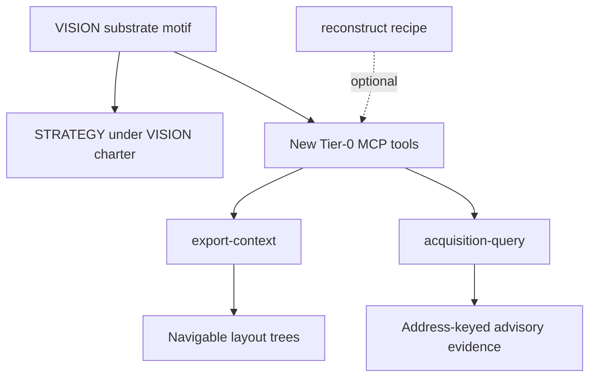

# Vision substrate MCP context (slice)

## Objective

Make VISION-aligned **dismantling and provenance context** independently addressable on the main MCP surface — without growing the reconstruct funnel or stuffing tools into `RecoveryToolProvider`.

## Requirements

- **R1.** `STRATEGY.md` positions AgentDecompile as a binary-as-context substrate; matching recovery is a work track, not the product charter.
- **R2.** MCP tools `export-context` and `acquisition-query` exist, Tier 0, no open Ghidra program required, advertised on default surface.
- **R3.** Tools live in a **new** provider (not `recovery.py`, which stays reconstruct/status/claim-report only).
- **R4.** Handlers call existing recovery islands (`context_export.export_context`, `acquisition_mcp.query_bundle` / registry resolve) — no funnel coupling.
- **R5.** Responses carry explicit `claimBoundary` aligned with VISION claim layers: these tools emit **Advisory** (layout/evidence) only — never Verified or byte-authoritative promotion language.
- **R6.** Unit tests cover tier, advertisement, and provider happy paths with temp dirs / fake bundles.
- **R7.** Canonical docs (`TOOLS_LIST.md`, advertised counts) name both tools; parity tests stay fail-closed on registry drift.

## Non-goals

- Extracting a new Python package / greenfield substrate layout.
- Growing `sourcegen` / `source_parity_synthesize` / CRITICAL_PATH stages.
- Full NSIS / PE `.rsrc` forest implementation (follow-up).
- Changing reconstruct defaults (`resume`, enrich) in this slice.

## Implementation units

### U1. Strategy reconcile

- Update `STRATEGY.md` approach/positioning/metrics to cite `VISION.md` and add context-yield / dismantle-oriented metrics alongside ladder metrics.

### U2. Registry + provider

- Add `Tool.EXPORT_CONTEXT`, `Tool.ACQUISITION_QUERY` to `registry.py` (params, Tier 0 set).
- New `mcp_server/providers/context_substrate.py`; register in `providers/__init__.py` and `ToolProviderManager`.
- Wire handlers to recovery modules.

### U3. Tests

- Extend or add `tests/test_context_substrate_mcp.py` mirroring `tests/test_recovery_mcp.py`.

## Test scenarios

1. Both tools report analysis tier 0.
2. Both tools appear in default advertised list.
3. `export-context` on a tiny text tree writes `manifest.json` / `tree.json` and returns claimBoundary.
4. `acquisition-query` inspect on a minimal fake bundle returns schema + claimBoundary; missing bundle → error/unavailable.

## Risks

- Large real installers: keep MCP defaults conservative (`maxFiles`, light analysis) so agents do not hang.
- TOOLS_LIST / capability resource counts update via `len(Tool)` — verify parity tests.

## Completion notes (2026-08-08)

U1–U3 landed on `feat/vision-substrate-mcp-context` ([PR #171](https://github.com/bodecloud/AgentDecompile/pull/171)): `ContextSubstrateToolProvider`, Tier-0 tools, tests, STRATEGY under VISION. Public docs (`README`, `TOOLS_LIST`, `.cursorrules`) updated to **72 / 68** advertised.

**Follow-ups (not this slice):** NSIS unpacker strength, navigable PE `.rsrc` forests, deeper acquisition MCP bridging, freeze megamodule accretion — without growing the reconstruct funnel.

**Wedge bar:** U1–U3 prove islands are MCP-addressable without funnel growth. Charter gravity shift (initialize preamble, AGENTS reconstruct salience, optional `acquire` MCP, package extract) is deferred and tracked — this slice is not VISION redesign closure.
