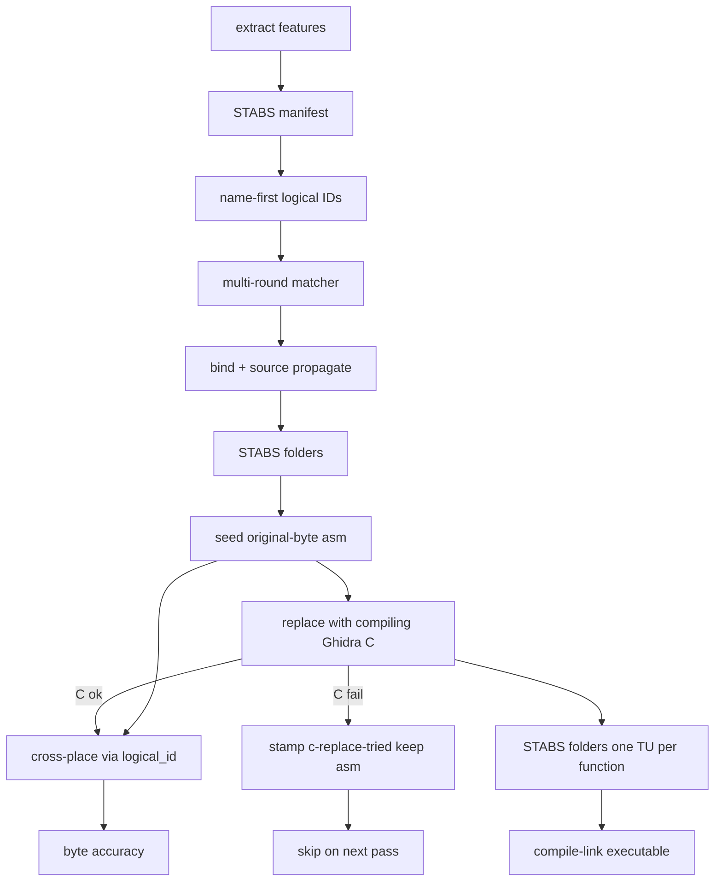
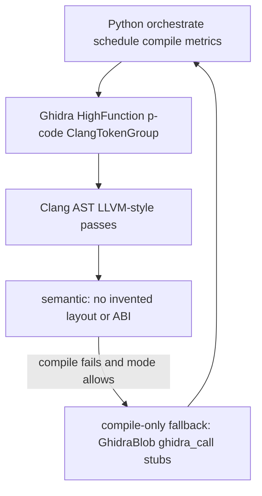
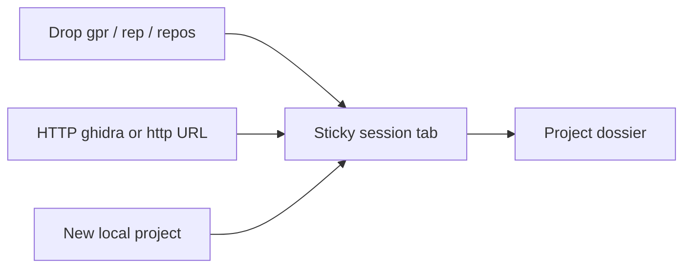
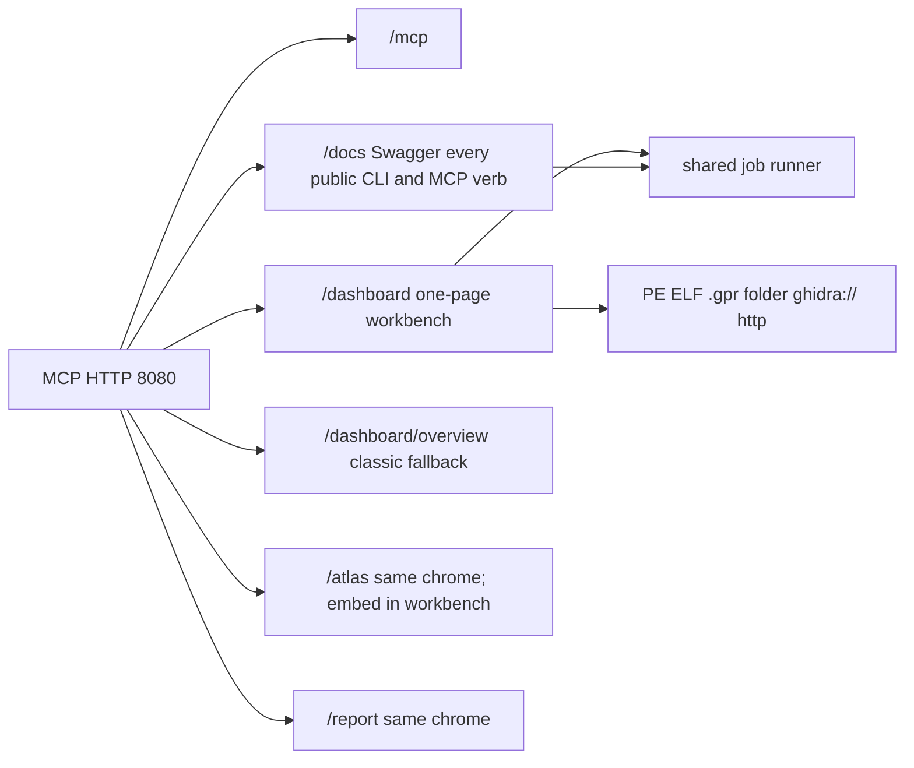
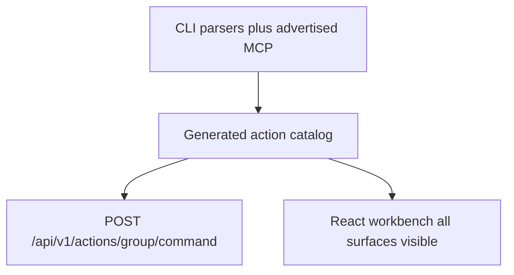

# Living plan: corpus-wide semantic decompilation

**Status:** historical  
**Created:** 2026-08-30  
**Last updated:** 2026-09-08 (superseded pointer only)  
**Code:** `src/agentdecompile_recovery/corpus/`  
**CLI:** `agentdecompile-corpus`

Superseded by [2026-09-08-0156-feat-recovery-pipeline-ladder-plan.md](./2026-09-08-0156-feat-recovery-pipeline-ladder-plan.md) (STRATEGY `active_living_plan` as of 2026-09-08). This file is a dated record. Do not rewrite the deltas below to match today's ladder.

## Objective

AgentDecompile’s main recovery pipeline is corpus-wide semantic decompilation: every registered binary becomes a readable, buildable C/C++ project. Compiled output is later proven byte-accurate. Adding another binary is a registry entry plus `--donor`, not a new product.

## Priorities (do not reorder)

1. One STABS/DWARF donor project compiles and **links to a complete executable**.
2. Cross-match compiling C onto other registered binaries.
3. Independent byte-accuracy compare (real-C and byte-accuracy stay separate).
4. Call graphs, live UI on the MCP HTTP server (default 8080), ELI16 docs, more binaries.

## Rules

- Naming: human, STABS, symbols, Ghidra, placeholder last. Placeholder never overwrites a stronger name.
- `__asm` / `_emit` is the **default compiling substrate** (STABS → asm → C). It is not recovered source and must not go in `verified/`. Compiling Ghidra C replaces those files as it succeeds.
- Cross-match **source** only after compile succeeds. Identity matching is earlier and separate.
- Never claim completion from a dashboard label or a stale artifact.
- Do not hardcode commercial binary names into defaults.

## Progress

### Delta Update

- Landed: kotorxid library + dashboard + operator scripts inside `corpus/` (identity, STABS, matcher, propagate, packaging, genproject, ingest, permuter, atlas export, dashboard panels on MCP 8080, `agentdecompile-corpus` merge/stabs-report/genproject/ingest-recovered/apply-annotations). Store path is required. No default `kotorxid.sqlite` or product binary paths. Donor `data/`, `db/`, Wine prefixes, and product shell drivers were not copied. `ghidra-bulk` skip-existing now skips `c-replace-tried` / `asm-fallback` leftovers; C-fail keeps existing asm (no second `cl.exe`); `--force-c-replace` is the only retry. `workspace` writes STABS folders and fills each compiling function as its own TU; `compile-link` links those units (not a byte-accuracy claim). Overview runs cataloged corpus CLI and MCP tools in place — no `/dashboard/actions` page. `/dashboard/functions` is the browse workspace: functions, logical identities, review, relationships, and builds. Find a function is live. Rows-per-page is a combobox including All (capped at 5,000). Keyset pagination only — no OFFSET on `func`. `/graph?slug=&addr=` and `/function/{slug}/{addr}` are the same function workspace. The address field is a bounded function combobox (80 rows, typeahead). Graph display has hops, callers/callees, size, labels, edges, and ink. Old Graph / Review / Builds / Logical URLs redirect. Recovery and jobs stay on Overview.
- Partial: Wine/MSVC still operator toolchain (`find_msvc_compiler` is PATH-only). Byte-accuracy still a receipt. Ghidra-backed extract needs a live program. Some dashboard panel copy still names the donor effort. `ghidra_bulk` now runs HighFacts + Clang AST first; `GhidraBlob` / `ghidra_call` / diagnostic stubs are compile-only fallback. Default `--mode compile-only` keeps the knowledge-db compile-rate baseline. Semantic mode refuses invented layout or ABI. Donor ASM seed/fallback, real-C skip, and cross-place after a write are merged; `agentdecompile-corpus ghidra-bulk` / `cross-place` are the operator entrypoints. Atlas remains a separate prompt surface.
- Landed 2026-08-31: `/dashboard` is the one-page AgentDecompile workbench (tool strip, all binaries, dual decomp/validate bars, MCP palette, live jobs). `/docs` exposes every public corpus/recover/reconstruct/MCP verb as a typed POST. Catalog is generated from the live parsers. Classic overview stays at `/dashboard/overview`. Leftover Mizuchi Atlas on :5173 is not this surface. `compile-link` writes `.link-stamp` and uses `/OPT:NOREF` so a stub image is not kept after flags change.
- Landed 2026-08-31 (later): leftover Atlas/report/hub chrome uses the workbench dark CSS; Atlas embeds into the Prompt/Map/Score stage (`/atlas?embed=1`). The source dock accepts PE/ELF, `.gpr`, a project folder (`.gpr` + `.rep`), `ghidra://host:port/repo`, and `http(s)` shared locators. Source list sits above the Add drawer.
- Landed 2026-08-31 (React): `/dashboard` is a React 18 page. Ingest, sources, functions, inspector, graph, jobs, Atlas, report, leftover panels, and the tool list stay in document flow. No tool-strip button group, no Add drawer. Search jumps to a section. Layout stacks under 1100px.
- Landed 2026-08-31 (sessions): sticky project tabs at the top of `/dashboard`. A draft tab exists when nothing is loaded. Local `.gpr`, filesystem shared-server `repos/`, and HTTP `ghidra://` / `http(s)` sessions use different colors. Dropping a `.gpr`, `.rep`, or repos tree resolves on disk (no project-path textbox). Loading a project fills a dossier (files, programs, repositories, reachability). Surfaces stay in document flow; session tabs do not hide Atlas/report/tools.
- Landed 2026-08-31 (project chrome): dossier and Sources are one Project section. File/Edit/View/Help is sticky with Save and Save As. HTTP or filesystem shared servers can be saved as a local `.gpr` checkout (and the reverse writes an index checkout or an HTTP link plus a local stub). Save As does not upload versioned Ghidra DBs to a live server.
- Landed 2026-08-31 (chooser): local `.gpr` is picked from a server-side folder list (Name.gpr + Name.rep). Uploading a lone `.gpr` is rejected. Shared projects use host/port/repository/program or a `ghidra://` / `http(s)` URL. Program names on a source card are selectable.
- Partial: opening a registered `.gpr` or shared URL still goes through MCP `open-project` / Ghidra JVM; the workbench stores the locator and listed programs.
- Next: keep leftover C-replace at 2 workers; relink the donor tree after the stamp/flag change. Do not start k2 compile from kotorxid scripts.

### Delta Update
- Landed: `prompt_evidence` resolves `agentdecompile-cli` from this tree's `.venv` (then PATH, then `uv` if present). Shardloop evidence packets were `error: No such file or directory: 'uv'` because watchdog PATH omits `~/.local/bin`. STRATEGY.md rewritten as the near-term bet: workbench-driven compiling C with separate claim tiers.
- Partial: six k1 GOG Mizuchi shards are already mid-cycle with empty AgentDecompile packets. The next `genproject` pass picks up the CLI fix. Harvest still writes 0 when the model does not hit objdiff 0.
- Next: let the running shards finish; do not start a second Wine job. After the next gen cycle, check `AgentDecompile evidence complete for N/40`. Then Cross-place compiling C from dump-source / recovered trees.

### Delta Update
- Landed: STRATEGY now states logical-first propagation, substrate ladder (emit → ghidra-bulk → cross-place → Mizuchi), and single-port 8080 mandate. kotorxid corpus pages already live in `corpus/dashboard/pages.py`; in-tree `agentdecompile-server` on `:8768` with corpus env serves `/dashboard` (200) and `/api/v1/actions` (200). Browser `Accept: text/html` on `/` redirects to workbench when corpus env is set.
- Partial: Cursor's `:8080` uvx server still lacks in-tree routes (`/dashboard` 404). `:8791` kotorxid dashboard runs in parallel until operators switch to unified server with env.
- Next: wire Recover pane defaults to corpus actions (`ghidra-bulk`, `cross-place`, `propagate`, `genproject`); open shared-fs `repos` project in workbench session so overview hero reads `recovered_function` counts.

### Delta Update
- Landed 2026-09-07: `/dashboard/operations` and `/operations` → `wb-processes` (not Commands). `/recovery` → live SQL `/report` (1,021 logical / 1,370 artifacts on kotorxid DB). Recover pane: Ghidra bulk, cross-place, ingest; no `/tmp/wb-dogfood-fixes`. Match pane: corpus identity chain (`match-pair`, apply-stabs, logical-build, merge-parts, propagate-corpus). Pipeline steps panel: per-stage Run links → catalog actions. `GET /dashboard/api/workbench/context` for subagent defaults.
- Partial: Cursor `:8080` uvx still 404 on `/dashboard`; use in-tree server with corpus env (`:8768` verified). Mizuchi shards still running — do not start second Wine job.
- Next: point `:8080` at in-tree server or retire `:8791`; open shared-fs `repos` in workbench so overview hero tracks live counts; pipeline rail "Run pipeline to compile" one-click on overview.

### Delta Update
- Landed 2026-09-07 (single port): `:8080` was an old uvx wheel from `git+https://github.com/bolabaden/agentdecompile` with no corpus env, so only `/health` and `/mcp` answered. `~/.cursor/mcp.json` `agdec-mcp-local` now runs this tree's `.venv/bin/agentdecompile-server` with `AGENT_DECOMPILE_PORT=8080` and the kotorxid corpus env; transport stays stdio so Cursor's client is unchanged, and `agdec-http` keeps pointing at `/mcp/message`. Backup at `~/.cursor/mcp.json.bak-*`.
- Verified on the identical in-tree build (`:8768`): `/dashboard` `/api/v1/actions` `/report` `/atlas` `/docs` all 200; `/operations` → `wb-processes`; `/recovery` → `/report`. `list_binaries` now returns the numeric `id`, so Apply STABS prefills `--binary-id` instead of failing its int-required argument.
- Partial: takes effect on Cursor MCP reload — the old uvx process still holds `:8080` until then.
- Next: reload MCP, confirm `/dashboard` 200 on `:8080`, then retire `:8791`.

### Delta Update
- Landed 2026-09-07 (ops): Killed duplicate `:8768` dev server and stopped kotorxid `:8791` dashboard — unified surface is only on `:8080` now. In-tree server verified: dashboard, 199 actions, live SQL report, atlas, docs all 200.
- Landed: Seeded workbench session `s-odyssey` pointing at `/home/brunner56/biodecompwarehouse/repos/_odyssey` with K1 GOG program + three corpus import slugs; overview fragment renders tab builds/bars when slugs are passed.
- Next: open `http://127.0.0.1:8080/dashboard` in browser (session should restore from `workbench-sessions.json`); run Analyze on `k1_win_gog_swkotor.exe`; let Mizuchi shards finish without second Wine job.

### Delta Update
- Landed 2026-09-07 (overview/recover): session overview shows scoped recovery hero (806 logical on K1 GOG tab); Recover pane resolves `mizuchi_home/.../k1_win_gog_swkotor.exe` cross-placed trees; Review tab gets Reclassify / Re-run match / Evaluate pair toolbar; Match tab embeds crossmatch status panel.
- Partial: 7 Mizuchi shard loops still running on K1 GOG — do not start second Wine job.
- Next: run `corpus.reclassify-matches` then `corpus.cross-place` from Recover/Match after shards finish; byte-accuracy verify on donor compile-link.

