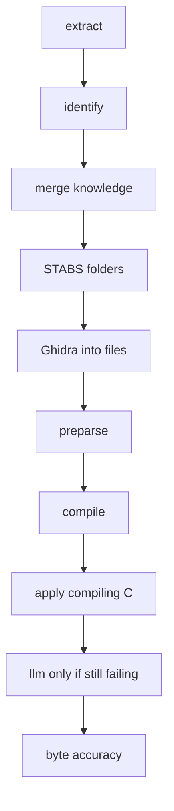

# Living plan: corpus-wide semantic decompilation

**Status:** active  
**Created:** 2026-08-30  
**Last updated:** 2026-08-30 (corpus layout cleanup)  
**Code:** `src/agentdecompile_recovery/corpus/`  
**CLI:** `agentdecompile-corpus`

## Objective

AgentDecompile’s main recovery pipeline is corpus-wide semantic decompilation: every registered binary becomes a readable, buildable C/C++ project. Compiled output is later proven byte-accurate. Adding another binary is a registry entry plus `--donor`, not a new product.

## Priorities (do not reorder)

1. One STABS/DWARF donor project compiles and **links to a complete executable**.
2. Cross-match compiling C onto other registered binaries.
3. Independent byte-accuracy compare (real-C and byte-accuracy stay separate).
4. Call graphs, live UI (8791 / 5173), ELI16 docs, more binaries.

## Rules

- Naming: human, STABS, symbols, Ghidra, placeholder last. Placeholder never overwrites a stronger name.
- `__asm`, `naked`, `_emit`, `.byte` bodies are not source recovery.
- Cross-match **source** only after compile succeeds. Identity matching is earlier and separate.
- Never claim completion from a dashboard label or a stale artifact.
- Do not hardcode commercial binary names into defaults.

## Progress

### Delta Update

- Landed: archive inventory lives in `corpus/archive.py` (compat shim at `corpus_archive`); `list-archive` / `check-extraction` on `agentdecompile-corpus`; identity `source_binary` follows the binding; feature-match `threshold` is the PAIR_POLICY auto cutoff; workspace path strip is generic (`/Users/`, `/home/` only); compile no longer wipes `build/` unless compile is planned.
- Partial: no kotorxid SQLite/`cl.exe` driver in-tree; Wine/MSVC compile remains the operator toolchain. Dashboard 8791 is still the kotorxid process. Byte-accuracy still a receipt.
- Next: extract a real STABS donor with `extract-stabs`, register it `--donor`, `--stop-after compile`.
