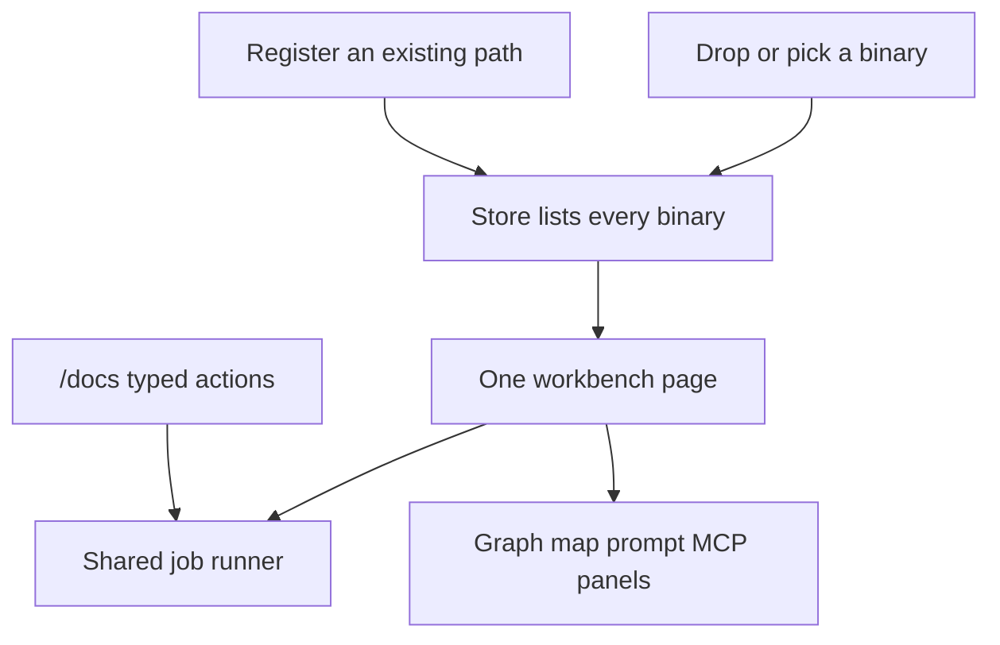
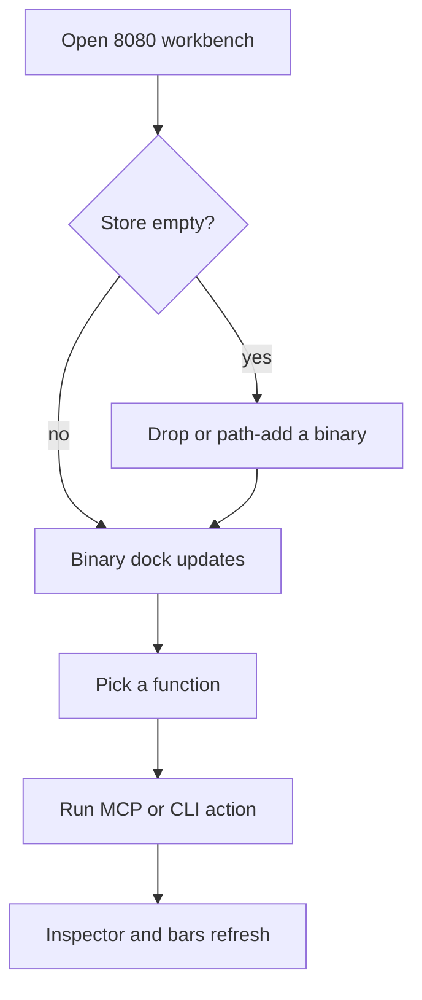

# Workbench AIO - Plan

## Goal Capsule

Objective: One AgentDecompile workbench on the MCP HTTP server (default 8080) that an operator can use as the only surface for corpus binaries, recovery work, advertised MCP tools, and public CLIs — including drag/drop and manage of binaries — without visiting leftover ports or inventing argv.

Product authority: STRATEGY.md primary actors (operators and agents who need binary fluency). This plan owns the 8080 operator surface. Donor compile farms, k2 start, and leftover :5173 restyle are not active scope.

Open blockers: none. Binary ingest is both path-register and copy-in. Public scripts that only wrap cataloged CLIs stay out.

## Product Contract

### Summary

Ship one professional AgentDecompile page on 8080 that keeps every current UI capability, exposes every public CLI and advertised MCP verb in Swagger and in the page, lets the operator add and remove binaries by drop/upload/path, and shows live job reactions. The conversation workbench is the accepted prototype, not a throwaway to rebuild from zero.

### Problem Frame

Today’s surfaces are split: leftover Atlas on 5173, classic dashboard panels, a generic jobs POST, and CLIs that never appear as Try-it operations. An operator cannot treat 8080 as the whole product. A green label is still not a match, and a 40 KB linked stub is still not a complete executable.

### Key Decisions

- One page, tool strip, no tab bar. (session-settled: user-directed — chosen over separate sites or a tab strip: the operator stays on one professional surface.) Governs R2, R3.
- Public CLI and advertised MCP only in Swagger. (session-settled: user-directed — chosen over advertising GUI-only hidden tools: headless 8080 is not the Ghidra GUI.) Governs R6.
- Dual overlapping bars are decomp and validate, not byte-accuracy. (session-settled: user-directed — chosen over a third accuracy bar: compiling C and a linked image stay separate from objdiff 0.) Governs R5.
- Leftover 5173 is not restyled. (session-settled: user-directed — chosen over restyling Mizuchi Atlas: 8080 is the Atlas.) Governs R10.
- Ingest is copy-in and path-register. (session-settled: user-approved — chosen over path-only or copy-only: comprehensive management without losing binaries that already live on disk.) Governs R7, R8.
- The prior 8080 workbench is the prototype. (session-settled: user-directed — chosen over a new ce-prototype: previous prompts already showed the chrome.) Governs R1.

### Actors

- Operator — adds binaries, runs jobs, reads bars and inspector, never invents argv.
- Agent client — same catalog via `/docs` and `/mcp`.
- Job runner — executes cataloged commands without blocking a sibling job.

### Requirements

**Surface**

- R1. 8080 serves one workbench as the default `/dashboard` (and `/app`) with AgentDecompile chrome and no Mizuchi branding.
- R2. The page keeps every capability of the current UIs (overview panels, functions/logical/review/graph/builds, atlas prompt, report, artifacts, action dock), reachable without a tab strip.
- R3. Center content switches by a tool strip or command palette. Deep links use `tool`, `slug`, `addr`, `logical_id`. Old URLs redirect here or keep a no-JS fallback.

**Live work**

- R4. All registered binaries appear together. Selecting one loads a windowed function list. Selecting a function updates graph, inspector, and tool prefills.
- R5. Binary and function rows show overlapping decomp (none / asm / real C) and validate (none / obj / linked) tracks. Validate jobs must not block leftover C-replace or other cataloged jobs.
- R6. Every public `agentdecompile-corpus`, `agentdecompile-recover`, `agentdecompile-reconstruct`, `agentdecompile-cli`, and advertised MCP verb is a typed `/docs` operation and a workbench action. The browser never sends freeform argv. GUI-only hidden MCP tools stay out.

**Binaries**

- R7. The operator can register an existing filesystem path as a corpus binary (slug, role, label) without hardcoding product stems.
- R8. The operator can drag/drop or file-pick a binary; the server copies it into the workspace and registers it. A dropped path that is already readable may register in place instead of copying.
- R9. The operator can remove a registered binary only with confirm, and can change role or label on an existing row.

**Honesty**

- R10. Completeness is receipts and a real linked image, not a dashboard label. Incremental link must not keep a stub after link flags change.
- R11. Empty env is honest: no binaries, no kotorxid/sqlite defaults, no invented match.

### Key Flows

- F1. Empty store → drop or path-add → binary appears with dual bars → functions load.
- F2. Select function → inspector shows C/siblings → run decompile or rename → live log and refresh.
- F3. Start C-replace and compile-link together → both visible in the job pulse; neither waits on the other.
- F4. Swagger Try-it on the same action id → same job runner as the page.
- F5. Remove binary with confirm → row gone; without confirm → refused.

### Acceptance Examples

- AE1. Covers R1, R2, R3. `/dashboard` shows AgentDecompile, a tool strip, and no `role=tablist`. `/docs` is one click away.
- AE2. Covers R7, R8, R9. Drop a small PE, see it listed; register a second path; remove the first only after confirm.
- AE3. Covers R6, F4. `/openapi.json` contains an operationId for every public corpus/recover/reconstruct/cli/MCP verb, with named properties not a freeform argv blob.
- AE4. Covers R5, F3. Two long jobs start and both show running.
- AE5. Covers R11. Unset corpus env yields an empty binary dock and no product-path strings in the HTML.

### Scope Boundaries

In scope: 8080 workbench, Swagger catalog, binary add/remove/edit, live jobs, existing panel/atlas/report mounts, `/OPT:NOREF` + link stamp honesty.

Out of scope: restyling leftover :5173; byte-accuracy as a third bar; GUI-only MCP tools; freeform remote shell; starting k2 compile; raising leftover C-replace workers; wrapping every `scripts/*.sh` that already has a cataloged CLI.

### Success Criteria

An operator can add binaries, run any public tool, and watch decomp/validate and job output on one 8080 page. Swagger can invoke the same tools. A green bar is never treated as a byte match. The 5173 leftover can stay unused.

### Outstanding Questions

None. Deferred to Planning: exact upload directory name, virtual-list window size, and whether reconstruct legacy aliases need duplicate operationIds.
