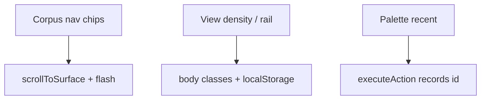

# Workbench Phase B — spatial discoverability

## Goal Capsule

Phase B reduces scroll-hunting and laptop cramping without nested menus: **corpus nav strip**, **density toggle**, **optional jobs side rail**, **recent actions in palette**. Feel authority: [docs/prototypes/dashboard-operator-feel/feel.md](../prototypes/dashboard-operator-feel/feel.md) Part 4–5. Prototype: [docs/prototypes/dashboard-operator-feel/phase-b-mock.html](../prototypes/dashboard-operator-feel/phase-b-mock.html).



## Product Contract

### Requirements

| ID | Requirement |
|----|-------------|
| R-PB-1 | Horizontal corpus nav strip jumps to all major panels |
| R-PB-2 | Compact vs comfortable density via View menu, persisted |
| R-PB-3 | Jobs dock optional side rail on wide viewports, persisted |
| R-PB-4 | Palette shows recent actions (localStorage, max 8) |
| R-PB-5 | wb-more defaults open; nav opens more when target inside |

## Implementation Units

### U1. Corpus navigation strip

**Files:** `workbench-app.js`, `workbench.css`  
**Verification:** `#wb-corpus-nav` present; click scrolls to `#wb-match`

### U2. Density and jobs rail preferences

**Files:** `workbench-app.js`, `workbench.css`  
**Verification:** View menu toggles; `body.wb-density-compact` / `body.wb-jobs-rail`

### U3. Recent actions in palette

**Files:** `workbench-app.js`  
**Verification:** `RECENT_ACTIONS_KEY`, section in CommandPalette

## Verification Contract

```bash
uv run pytest tests/test_dashboard_flow_ui.py tests/test_workbench_projects.py -q
```

Dogfood: corpus nav → Cross-match without opening accordion label; compact density; side rail on wide screen.

## Definition of Done

- [x] R-PB-1 through R-PB-5
- [x] feel.md ≥10k words
- [x] phase-b-mock.html + decisions update
- [x] STRATEGY Phase B note
