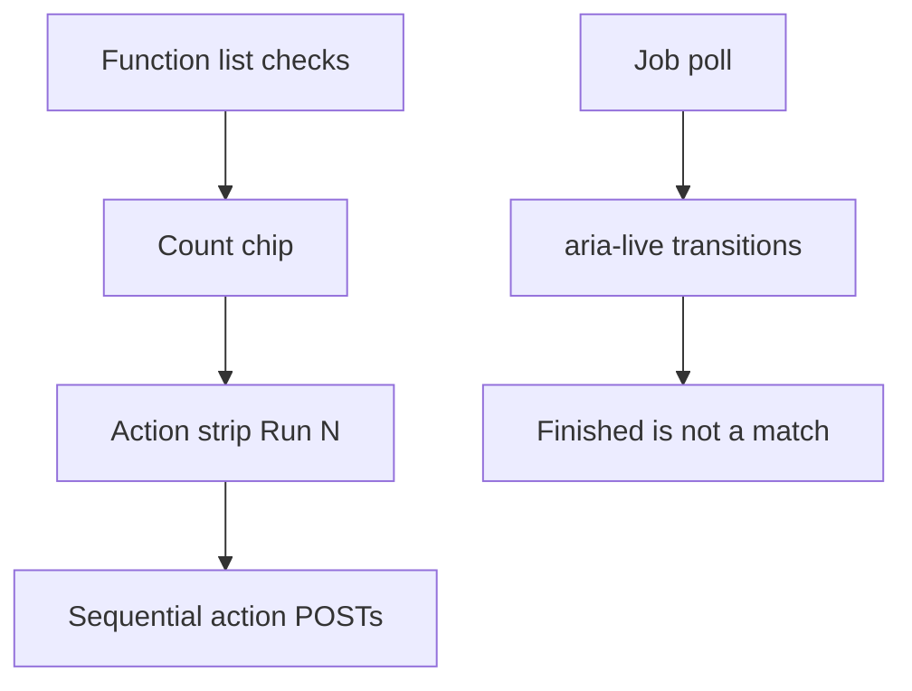

# Workbench Phase C — batch select and quiet job live

## Goal Capsule

Phase C keeps high-power controls **flat**: a visible checked set on the function list drives batch strip runs, and job status is announced only on transitions. Feel authority: [docs/prototypes/dashboard-operator-feel/feel.md](../prototypes/dashboard-operator-feel/feel.md) Essay AJ. Prototype: [docs/prototypes/dashboard-operator-feel/phase-c-mock.html](../prototypes/dashboard-operator-feel/phase-c-mock.html).



## Product Contract

### Problem Frame

Phase A/B left two inner-loop taxes: repeating a function verb once per row, and job status that is visible but silent to assistive tech. A nested Batch menu would add navigation tax.

### Requirements

| ID | Requirement |
|----|-------------|
| R-PC-1 | Function list supports a checked set (checkbox, `x`/Space, Ctrl/⌘-click, Shift range) independent of the primary inspector row |
| R-PC-2 | Visible count chip on the function header and on the action strip when the verb uses an address |
| R-PC-3 | One Run / one confirm queues sequential POSTs for checked functions; toast reports queued N of N |
| R-PC-4 | Hidden `#wb-job-live` `aria-live="polite"` announces start/fail/cancel/finish transitions only |
| R-PC-5 | Finish copy stays honest: a finished job is not a match |

### Scope Boundaries

In scope: workbench JS/CSS, flow-ui tests, feel/strategy/plan write-back.

### Deferred to Follow-Up Work

- Playwright CI dogfood (no display on this host)
- Always-visible two-column corpus grid
- Pinned corpus-nav favorites

## Planning Contract

### Key Technical Decisions

1. **Checked set is not a mode** — no Batch menu; membership lives in `checkedAddrs`. Governs R-PC-1.
2. **Primary click does not clear checks** — inspect one, batch many. Esc / chip × / slug or program change clears. Governs R-PC-1.
3. **Batch only when `actionUsesAddr`** — project-scoped verbs still run once. Governs R-PC-3.
4. **Live region is not the pulse** — `#job-pulse` stays visual; `#wb-job-live` speaks transitions so 1.5s polls do not re-announce. Governs R-PC-4.

## Implementation Units

### U1. Checked set and function-list chrome

**Goal:** Operators mark many functions without a nested mode.

**Requirements:** R-PC-1, R-PC-2

**Dependencies:** none

**Files:** `src/agentdecompile_recovery/corpus/dashboard/static/workbench-app.js`, `src/agentdecompile_recovery/corpus/dashboard/static/workbench.css`, `tests/test_dashboard_flow_ui.py`

**Approach:**

1. Add `toggleAddrList`, `rangeAddrList`, `mergeAddrLists` and `checkedAddrs` / `checkAnchor` state.
2. Wire checkbox, row modifiers, `x`/Space, Shift+j/k, Esc, and chip ×.
3. Clear on slug/program change; prune addrs missing from the current page of rows.

**Test scenarios:**

- Source contains `checkedAddrs`, `wb-func-check`, `wb-sel-chip`, and `key === "x"`.
- Range helper names (`rangeAddrList`, `toggleAddrList`) are present for shift-click / Shift+j/k.

**Verification:** Function header can render an N selected chip; CSS uses a checkbox column.

### U2. Batch strip execute

**Goal:** One strip gesture runs an address-using verb across the checked set.

**Requirements:** R-PC-2, R-PC-3

**Dependencies:** U1

**Files:** `src/agentdecompile_recovery/corpus/dashboard/static/workbench-app.js`, `tests/test_dashboard_flow_ui.py`

**Approach:**

1. `actionUsesAddr` from field names / `from_context` / function-verb ids.
2. `executeAction` confirms once, then loops with `batch: false` and per-row `addr`/`name`.
3. Strip shows “Run N” and the count chip when `checkedCount > 1`.

**Test scenarios:**

- Source contains `actionUsesAddr`, `batch: false`, and `Queued `.
- Mutating batch confirm title includes the function count.

**Verification:** A two-function checked set on `mcp.decompile-function` issues two POSTs after one confirm path.

### U3. Quiet job live region

**Goal:** Screen readers hear job transitions without poll spam.

**Requirements:** R-PC-4, R-PC-5

**Dependencies:** none

**Files:** `src/agentdecompile_recovery/corpus/dashboard/static/workbench-app.js`, `tests/test_dashboard_flow_ui.py`

**Approach:**

1. `jobLiveAnnouncement` diffs previous vs next job list.
2. `JobLiveRegion` is `sr-only` + `aria-live="polite"` + `aria-atomic`.
3. Finished line includes “A finished job is not a match.”

**Test scenarios:**

- Source contains `function JobLiveRegion`, `aria-live="polite"`, and the honest finish sentence.

**Verification:** Poll updates `#wb-job-live` only when a job status string changes.

## Verification Contract

```bash
uv run pytest tests/test_dashboard_flow_ui.py -q
```

Dogfood: check three functions, Run Decompile, hear/see one confirm, three jobs, live text on finish. Esc clears the chip.

## Definition of Done

- [x] R-PC-1 through R-PC-5
- [x] phase-c-mock.html + decisions update
- [x] STRATEGY Operator surface Phase C note
- [x] feel.md Essay AJ rewritten as shipped Phase C
