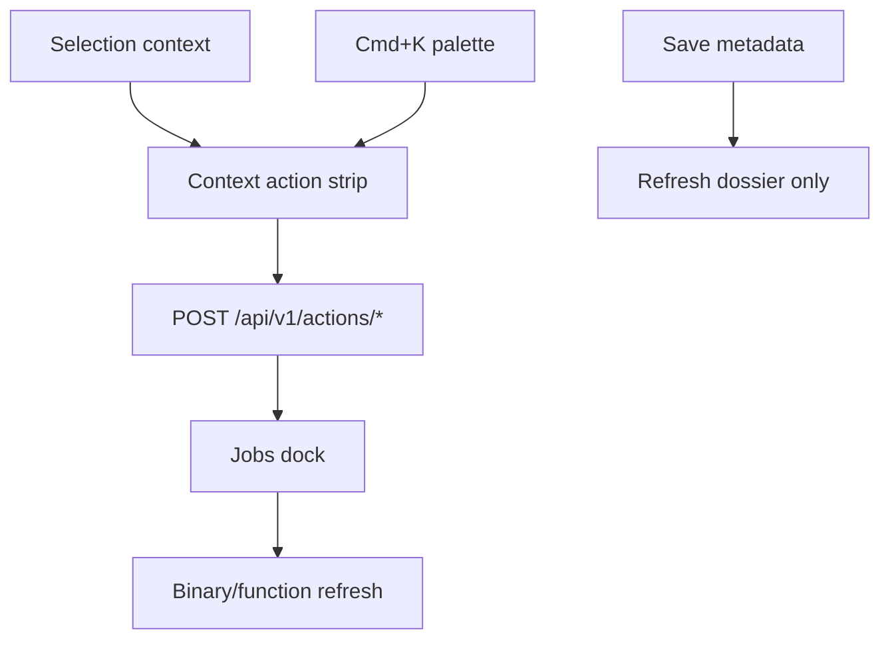

# Dashboard operator feel and flow

## Goal Capsule

Evolve the 8080 workbench into an **operator instrument**: flat power, context-driven actions, peripheral jobs, honest state, and session integrity (project slug ≠ import slug). Long-form feel: [docs/prototypes/dashboard-operator-feel/feel.md](../prototypes/dashboard-operator-feel/feel.md). Prototype decisions: [docs/prototypes/dashboard-operator-feel/decisions.md](../prototypes/dashboard-operator-feel/decisions.md).



## Product Contract

### Problem Frame

Operators lose flow when the dashboard behaves like nested forms: save wipes imports, comboboxes show project folder names, corpus panels hide in collapsed details, jobs dump JSON, and confirms block with native dialogs.

### Key Decisions

- **IDE + flight deck metaphor** — session tabs, explorer, inspector, jobs dock; corpus panels in document flow. Governs R-FEEL-1.
- **Context is the command line** — selection prefills; params optional via strip. Governs R-DFE-3, R-DFE-4.
- **Flat power** — Cmd+K for actions and navigation; function filter separate from go-to. Governs R-DFE-1, R-DFE-2.
- **Save without re-open** — metadata save must not call full project open. Governs R-SESSION-1.
- **Import slug normalization** — session imports are slug strings; projectSlug excluded from binary pickers unless project node selected. Governs R-SESSION-2.
- **Phase B layout gated** — no right-rail/grid reshape until dogfood demands. Governs R-DFE-8.

### Requirements

| ID | Requirement |
|----|-------------|
| R-FEEL-1 | Workbench feel matches sensation table in feel.md (in flow, flat power, honest calm) |
| R-DFE-1 | Cmd+K command palette: Actions, Go to, Recent jobs |
| R-DFE-2 | Toolbar search filters functions only |
| R-DFE-3 | Action strip mounts ToolField; POST includes edited `params` |
| R-DFE-4 | Quick actions, palette, strip share `executeAction` |
| R-DFE-5 | Jobs dock: status, log tail, cancel; honest copy |
| R-DFE-6 | ConfirmDialog replaces `window.confirm` |
| R-DFE-7 | All wb-more surfaces reachable from palette and View |
| R-DFE-8 | U4 layout reshape deferred per prototype sign-off |
| R-SESSION-1 | Save project refreshes dossier; preserves imports and selection |
| R-SESSION-2 | openLocator uses inspected.slug for register; merges imports; upload selects import slug |
| R-SESSION-3 | Backend session merge coerces imports to slug strings |

## Implementation Units

### U1. Command palette and navigation

**Files:** `workbench-app.js`, `workbench.css`  
**Status:** Done

### U2. Context action strip + ToolField

**Files:** `workbench-app.js`, `workbench.css`  
**Status:** Done

### U3. Jobs dock, confirms, discoverability

**Files:** `workbench-app.js`, `workbench.css`  
**Status:** Done

### U4. Session integrity (save / imports / comboboxes)

**Files:** `workbench-app.js`, `ghidra_project.py`, `tests/test_workbench_projects.py`  
**Status:** Done

- `saveProject` no longer calls `openLocator`
- `sessionImportSlugs`, `mergeImportSlugs`, `importsContain`
- `openLocator` same-project detection; import merge
- `_coerce_imports` on session PUT/merge

### U5. Layout reshape (Phase B — gated)

Deferred. Candidates: right-rail jobs, always-visible corpus grid, density toggle.

## Verification Contract

```bash
uv run pytest tests/test_workbench_tool_fields.py tests/test_dashboard_actions.py \
  tests/test_dashboard_server_control.py tests/test_dashboard_flow_ui.py \
  tests/test_workbench_projects.py
```

Dogfood on 8080: shared-fs → add binary → save → imports intact; Cmd+K cross-match; strip param override; dock cancel; in-app remove confirm.

## Definition of Done (Phase A)

- [x] R-DFE-1 through R-DFE-7 implemented
- [x] R-SESSION-1 through R-SESSION-3 implemented
- [x] feel.md + decisions.md + STRATEGY pointer
- [x] Regression tests green
- [ ] Phase B explicitly deferred in prototype sign-off

## Sources

- [feel.md](../prototypes/dashboard-operator-feel/feel.md)
- [decisions.md](../prototypes/dashboard-operator-feel/decisions.md)
- [2026-08-31-0041-feat-workbench-aio-plan.md](2026-08-31-0041-feat-workbench-aio-plan.md)
