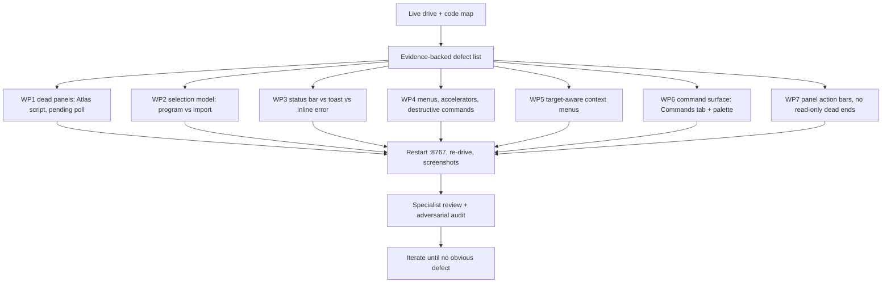

# Workbench UI/UX overhaul

Date: 2026-08-31
Surface: `/dashboard` workbench (`workbench-app.js`, `workbench.py`, `atlas_server.py`, dashboard panels + CSS)
Driving method: live Playwright drives against `http://127.0.0.1:8767` with work dir `/tmp/wb-dogfood-fixes`.

## Evidence

Captured by `/tmp/wb-ux/audit1.py` (inventory pass) and `/tmp/wb-ux/probe_panels.py` on the live
server. Screenshots and JSON under `/tmp/wb-ux/pass1/`.

| # | Severity | Defect | Evidence |
|---|----------|--------|----------|
| D1 | P0 | Atlas fragment's inline script is a JavaScript syntax error, so the whole Atlas panel is inert | `node --check` on the served fragment: `SyntaxError: Unexpected identifier 'wb'`; source is `atlas_server.py:259` where `\"` inside a non-raw Python string emits a bare `"` |
| D2 | P0 | Recovery / STABS / Knowledge / Corpus / Cross-match sit forever on `reading … 0s so far` | Legacy panels emit `[data-pending="1"]` and only the legacy page JS re-polls (`pages.py:2685`); the SPA's `HtmlIsland` (`workbench-app.js:530`) fetches once and never refreshes |
| D3 | P0 | Selecting a Ghidra program changes neither the status bar nor the editor meta, and the function list answers with a corpus-store message | pass1 `select-first-source`: `status_changed=false, meta_changed=false`, functions read `No functions in the corpus store for this slug.` |
| D4 | P1 | The status bar is reused as an error display and keeps a stale failure indefinitely | pass1 `chrome-final` still shows `path is not a readable file, Ghidra project, or URL` long after the dialog closed |
| D5 | P1 | Menus advertise accelerators the browser owns (`⌘N`, `⌘T`, `⌘W`, `⌘1`–`⌘5`) | `WORKBENCH_COMMANDS` (`workbench-app.js:872`) plus the keydown handler at `:2349`; Chrome/Firefox intercept Ctrl+N/T/W before the page sees them |
| D6 | P1 | `New Project…` is spelled as a dialog command but creates a project immediately with a generated name | `runCommand` `file.new-project` → `createProject()` (`:2277`), no dialog; store now holds `Untitled-2`, `repos-from-shared-2-2`, `repos__repos` |
| D7 | P1 | `Restart Server` / `Shutdown Server` live in the File menu directly under Save | pass1 File menu inventory |
| D8 | P2 | Every view command raises a toast, and every `More` tab command force-opens the overflow `
` | `runCommand` view branch (`:2311`–`:2331`) |
| D9 | P1 | Context menus are the same generic command list regardless of what was right-clicked; no per-row actions | pass1 `ctx-menu` rows for explorer background, session tab, editor tab |
| D10 | P1 | The Tools tab is a one-line footnote (`193 commands. Use ⌘K or Swagger.`) and the palette caps actions at 12 with no way to see the rest | pass1 `tab-body` Tools; `CommandPalette` slices at `:1022` |
| D11 | P2 | Graph, Report, Recovery, STABS, Knowledge, Review and Corpus render with zero actions or links | pass1 `tab-body` action counts |

## Work packages

Each package names its own files so packages can run in parallel without colliding.

### WP1 — Revive the dead panels (P0)

- `src/agentdecompile_recovery/atlas_server.py`: fix the escaping so the fragment script parses; keep the
  rendered JS byte-identical in intent (error list item still gets `class="wb-hint"`).
- `workbench-app.js` `HtmlIsland`: after injecting a fragment, if it still contains `[data-pending="1"]`,
  re-fetch on a backoff (1s → 2s → 4s, capped) until the pending marker is gone, the island unmounts, or a
  cap is reached; show a visible "still reading" affordance with a manual Refresh instead of a frozen line.
- Acceptance: Cross-match / Recovery / STABS / Knowledge / Corpus reach real content in the live browser;
  Atlas raises no page error and its buttons respond.

### WP2 — Honest selection model (P0)

- `workbench-app.js`: distinguish "corpus import" selection from "Ghidra program" selection in one place.
  Selecting a program updates the status bar, the editor meta, and the Functions header; when a program has
  no corpus inventory yet, the Functions panel states that and offers the action that fixes it (extract
  inventory) rather than a bare corpus-store sentence.
- Acceptance: in the live browser, clicking a program in Explorer changes the status bar and meta, and the
  Functions panel names the program plus a next step.

### WP3 — Separate status, notification, and validation (P1)

- `workbench-app.js`: the status bar carries durable state (source, kind, selection, job summary). Failures
  go to the toast, and dialog failures additionally render inline in the dialog next to the field. Any
  transient error shown in chrome clears when the operation that caused it is retried or the dialog closes.
- `workbench-dialogs.css`: style the inline dialog error.
- Acceptance: a failed open leaves no residue in the status bar; the dialog shows the reason in place.

### WP4 — Menu and keyboard honesty (P1)

- `workbench-app.js`: drop or rebind accelerators the browser reserves; keep only bindings the page actually
  receives. Move `Restart Server` / `Shutdown Server` out of File into their own guarded menu section with a
  confirm. `New Project…` either opens a real dialog (name + location) or loses the ellipsis; the plan
  chooses the dialog, because that also removes the `Untitled-N` garbage rows. Stop toasting pure view
  changes; stop force-opening the overflow menu — promote the chosen tab instead.
- Acceptance: every accelerator printed in a menu works in the live browser; File no longer contains server
  lifecycle commands.

### WP5 — Target-aware context menus (P1)

- `workbench-app.js`: right-click builds its item list from the target — program row, import row, function
  row, session tab, editor tab, jobs row, empty explorer — with the commands that apply to that target
  (open, reveal path, copy path/locator, remove, extract, run action, rename, close).
- Acceptance: right-click on each target type in the live browser yields a different, applicable menu.

### WP6 — A real command surface (P1)

- `workbench-app.js`: replace the Tools footnote with a Commands tab that lists every catalog action grouped
  by group, with a filter, a description, and inline run. Palette: group results, show counts, and offer
  "see all in Commands" when results are truncated.
- Acceptance: every catalog action is reachable without Swagger; palette truncation is disclosed.

### WP7 — No read-only dead ends (P2)

- `workbench-app.js`: give each panel a small action bar (Refresh, the run actions that belong to that panel,
  and drill links). Panels that legitimately have nothing to do say so in the empty state.
- Acceptance: no editor tab renders with zero actions.

## Non-goals and drift boundaries

- No product binary stems in recovery defaults.
- No "matched" or "verified" claims from dashboard pages.
- Do not add Restart/Shutdown *behavior*; only relocate and guard the existing commands. Do not click them.
- Keep the test-visible strings and ids listed in `docs/superpowers/specs/2026-08-31-workbench-control-system-design.md`.
- No build step: stay on React + htm from `static/`.

## Verification

1. Restart the `:8767` server against `/tmp/wb-dogfood-fixes` after each slice.
2. Re-run `/tmp/wb-ux/audit1.py` (inventory + defect assertions) and the workflow drive.
3. `uv run pytest tests/test_workbench_*.py tests/test_dashboard_*.py -q`.
4. Specialist review (code quality, then adversarial audit of the completion claim).

## Progress

- 2026-08-31: inspection complete, defect table above captured from the live server.
