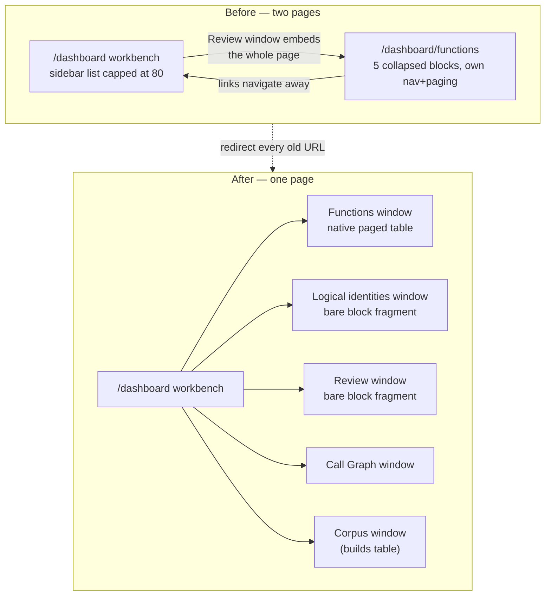

# Fold the browse page into the workbench (one page)

**Status:** implemented, browser-verified on `127.0.0.1:8767`
**Related:** [2026-08-31-2100-feat-workbench-ux-overhaul-plan.md](2026-08-31-2100-feat-workbench-ux-overhaul-plan.md)

## Objective

`/dashboard/functions` was a second, full page — five collapsed blocks (Functions,
Logical identities, Review, Relationships, Builds) with its own nav, its own search
boxes, and its own paging. The workbench at `/dashboard` embedded that entire page
inside its "Review" window, so the operator was reading a page inside a page and had
two unrelated ways to pick a function. Selecting a row on one had no effect on the
other.

There is now one page. `/dashboard` owns navigation, and each former block is either a
native workbench window or is gone because the workbench already did the job.

## What changed

### Navigation collapses onto one page

| Old URL | Now |
| --- | --- |
| `/dashboard/functions` | 302 → `/dashboard?window=wb-fnbrowse` |
| `/dashboard/logical`, `/logical` | 302 → `/dashboard?window=wb-logical` |
| `/dashboard/review`, `/review` | 302 → `/dashboard?window=wb-review` |
| `/dashboard/builds`, `/builds` | 302 → `/dashboard?window=wb-corpus` |
| `/functions` | 302 → `/dashboard?window=wb-fnbrowse` |
| `/dashboard/functions?…&partial=1` | unchanged fragment (programmatic consumers) |

Query keys survive the hop, so `?binary=`, `?addr=` and `?q=` still mean what they
meant. The workbench honors `?window=`, the old `#functions`/`#logical`/`#review`/
`#graph`/`#builds` anchors, and `?addr=` (which selects that row once the page loads).

### Functions is a native window, not an embedded page

`wb-fnbrowse` renders from the existing `/dashboard/api/workbench/functions` JSON with
real paging: Address, Name, Size, Logical, Decompiled C, Validated; first/prev/next,
`50/80/100/200` rows per page, an `N–M of TOTAL` counter, and an in-window filter.
The sidebar list and the window share one dataset and one selection, so clicking a row
in either drives Listing, Call Graph, Inspector and the status bar.

The sidebar previously fetched `offset=0&limit=80` and silently dropped everything past
row 80. It now carries a compact pager plus a "Browse all functions" link.

### Blocks that still need server HTML are served one at a time

New `GET /dashboard/browse-block?block=functions|logical|review|graph|builds` returns
one bare block — no page chrome, no `workspace-nav`, no `
` wrapper. The
Logical identities and Review windows mount that.

### Fixes found while driving it

- A deep link naming a build lost to the restored tab on boot, so
  `?binary=X` showed a different build. An explicit URL slug now wins.
- Logical identities printed `query failed: no such table: logical_name` on a store
  that never ran cross-build matching. It now says matching has not run and points at
  Cross-match.

## Verification

Live browser (`/tmp/wb-ux/onepage.py` against `127.0.0.1:8767`, 240 seeded functions):

- `/dashboard/functions?binary=uxdemo` lands on `/dashboard?window=wb-fnbrowse&binary=uxdemo`
  with the Functions pill active and the table populated.
- Paging: `1–80 of 240` → `81–160 of 240`, first-page returns.
- Rows per page 200 → `1–200 of 240`, 200 rows rendered.
- Filter `fn_0123` → `1–1 of 1`.
- Clicking row 4 sets the status bar to `fn fn_0003`, Listing shows `fn_0003 0x004010c0`,
  and the sidebar row is marked selected.
- Logical identities and Review render with no nested `workspace-nav`.
- `alt+F` and `alt+L` select the windows; View menu lists both.

Python: `tests/test_dashboard_runtime.py`, `tests/test_dashboard_actions.py`,
`tests/test_unified_pages.py`, `tests/test_dashboard_flow_ui.py`.
