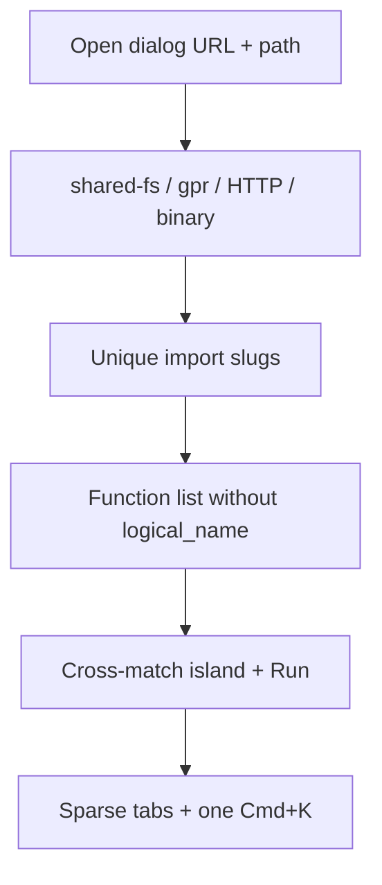

# Workbench dogfood fixes

Objective: make the four project kinds and NWN imports usable in the live `/dashboard` after the 2026-08-31 drive.

Tasks are one pass: same `workbench-app.js` / `workbench.py` / `workbench.css`. Confirm in the browser before adding tests.

## Progress

Browser-confirmed 2026-08-31 on `:8767` (`/tmp/wb-dogfood-fixes`): all four kinds, 8 unique NWN slugs, save+reload, Cross-match island + Run Cross-place, File → Open from URL stays remote. Tests follow that drive.
