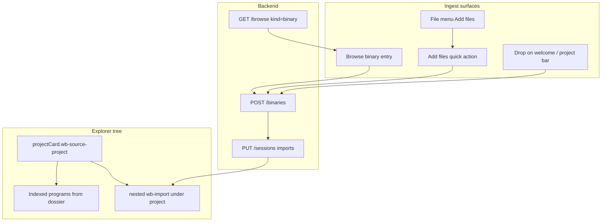
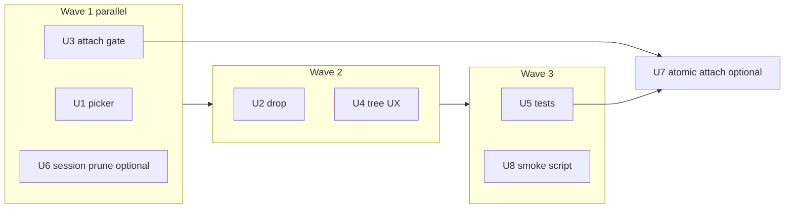

# Workbench Explorer Import Fix

Fix **Add files…** (silent no-op / no picker) and **orphan import UX** (PE binaries registered outside the open project tree). Extend regression coverage to ~40 operator paths before the next complaint wave.



## Goal Capsule

**Objective:** When a shared-fs or Ghidra project tab is open (e.g. `repos` with k2 programs), adding `witcher-6.exe` via **Add files…**, **browse**, or **drop** must (1) register the binary, (2) append its slug to `session.imports`, and (3) render it **nested under the project node** in Explorer—not as a top-level orphan sibling.

**Secondary:** **Add files…** must always open the file picker from Explorer without opening the Open Project modal first; failures must toast, never silent no-op.

**Authority:** Extends [2026-08-31-0041-feat-workbench-aio-plan.md](./2026-08-31-0041-feat-workbench-aio-plan.md) R7–R8 (ingest) and R3 (sources in document flow). Does not restyle 5173 or add byte-accuracy bars.

## Investigation Summary (subagent-driven)

Three parallel investigations (frontend, backend, tests) on 2026-08-31:

| Area | Status | Key finding |
|------|--------|-------------|
| **Add files wiring** | Partially fixed | `triggerFileUpload()` + `#wb-bin-file-global` exist; silent return if ref null; welcome bar says “Drop files” but has no handlers |
| **Nested imports** | Partially fixed | `projectCard.imports` renders nested list; orphan branch `!projectCard && importItems` still exists; attach gated on `tabHasRealProject()` not `dossier.ok` |
| **Browse PE** | Fixed | `_BROWSE_BINARY_SUFFIXES` + `openBinaryPath()` wired |
| **Session attach** | Client-only | No atomic register+attach API; failed PUT after POST → registered orphan |
| **Tests** | 72 pass / 4 fail | `test_workbench_workflows.py` matrix covers API layer; no DOM/browser tests for reported bugs |

**Current test baseline:** `pytest tests/test_workbench_*.py` → **72 passed, 4 failed** (`remove_import_keeps_project`, `remove_project_clears_tab`, `project_save_as_endpoint_exists`, `resolve_drop_missing_staging`).

## Requirements

### R-EX1 — Reliable file picker

Explorer **Add files…** and File → **Add files…** (new) must call the same `triggerFileUpload()` path bound to `#wb-bin-file-global`. If the input ref is unavailable, show an error toast.

### R-EX2 — Drop parity

Welcome bar and project bar accept the same drops as the Open modal (`uploadFiles` / stage-drop for GPR/rep/shared).

### R-EX3 — Import attach invariant

All add paths (`uploadFiles`, `openBinaryPath`, future drop) must call `importIntoTab(slug)` when the tab has `projectSlug` **or** `dossier.ok`, not only when `tabHasRealProject()` (kind + locator).

### R-EX4 — Explorer tree contract

When `projectCard` exists, **all** tab imports render under `.wb-source-project > .wb-programs > li.wb-import`. Root-level `.wb-source-import` only when no project context (draft-only imports).

### R-EX5 — Import normalization

Session `imports` normalized to slug strings on read/write; object-shaped imports from revision merge coerced via `_import_key` semantics.

### R-EX6 — Selection consistency

After add-on-open-tab: either always select the new import for function listing, or always keep project selected—pick one and document in UI (recommend: select import, highlight project row parent).

### R-EX7 — Regression matrix

40 API scenarios (existing `WORKFLOW_CASES` + shared-fs import chain) green; 4 failing cases fixed or expectations corrected.

## Verification Contract

| Gate | Command / check |
|------|-----------------|
| Unit/API | `.venv/bin/pytest tests/test_workbench_binaries.py tests/test_workbench_projects.py tests/test_workbench_tool_fields.py tests/test_workbench_workflows.py -q` — **0 failures** |
| Shared-fs + import | New `test_workbench_shared_fs_imports.py`: open repos → register witcher-6 → PUT imports → assert session + binaries |
| JS contract | Assert `Add files…` in `QUICK_ACTION_SETS`, `runQuickAction` upload branch, orphan branch guard |
| Dogfood smoke | Restart `:8080` server, hard refresh; Add files on open repos tab; browse PE; confirm nested DOM |
| Browser (optional CI) | Playwright: click Add files → set files on `#wb-bin-file-global` → assert `.wb-source-project .wb-import` |

## Definition of Done

- [ ] Both reported bugs pass acceptance criteria (picker opens; import nested under project)
- [ ] 4 failing workflow tests fixed or removed with documented behavior change
- [ ] File menu includes Add files…
- [ ] Welcome/project drop surfaces wired or copy corrected
- [ ] No silent `triggerFileUpload` failure
- [ ] Dogfood notes in `.mission/notes/` with curl/API evidence

## Implementation Units

Execute in dependency order via **subagent-driven development** (fresh implementer per U-ID, orchestrator integrates + runs pytest).

### U1 — File picker reliability (R-EX1)

**Goal:** Add files always opens picker; errors visible.

**Files:** `workbench-app.js`, `workbench.css`, `test_workbench_tool_fields.py`

**Approach:** Off-screen input instead of `hidden` if needed; toast on null ref; File menu entry.

**Verification:** JS asserts + manual dogfood click.

---

### U2 — Drop surfaces (R-EX2)

**Goal:** Drop on welcome/project bar calls `uploadFiles` / `onDrop`.

**Files:** `workbench-app.js`, `workbench.css`

**Dependencies:** U1

**Verification:** Drop PE on welcome with project open → nested import.

---

### U3 — Attach gate + normalization (R-EX3, R-EX5)

**Goal:** Unify attach condition; normalize imports to slugs in `importIntoTab`, session restore, tree build.

**Files:** `workbench-app.js`, optionally `ghidra_project.py` (`merge_session_records` slug coercion)

**Dependencies:** none

**Verification:** API test: object imports in PUT → GET returns string slugs; attach when `projectSlug` set without locator.

---

### U4 — Explorer tree contract (R-EX4, R-EX6)

**Goal:** Remove orphan branch when project context exists; Programs vs Imports visual grouping; consistent post-add selection.

**Files:** `workbench-app.js`, `workbench.css`

**Dependencies:** U3

**Verification:** JS asserts for `!projectCard` guard; static HTML fixture test or Playwright.

---

### U5 — Shared-fs import API tests (R-EX7)

**Goal:** Fix 4 failing workflow cases; add `test_workbench_shared_fs_imports.py` with repos + witcher-6 chain.

**Files:** `tests/test_workbench_workflows.py`, `tests/test_workbench_shared_fs_imports.py` (new)

**Dependencies:** U3

**Verification:** Full workbench pytest suite green.

---

### U6 — Backend session hygiene (optional, R-EX3)

**Goal:** On `DELETE /binaries/{slug}`, prune slug from all sessions in `workbench-sessions.json`.

**Files:** `workbench.py`, `ghidra_project.py`, tests

**Dependencies:** none (parallel with U1–U4)

**Verification:** Delete import → GET sessions has no stale slug.

---

### U7 — Atomic register+attach endpoint (optional stretch)

**Goal:** `POST /dashboard/api/workbench/binaries/attach` — register + session import in one transaction.

**Files:** `router.py`, `workbench.py`, `workbench-app.js`

**Dependencies:** U3, U5

**Verification:** POST attach → binary listed and import in session; no orphan on simulated PUT failure.

---

### U8 — Live smoke script

**Goal:** `scripts/workbench_smoke.sh` — curl matrix for E1–E5, shared-fs import on temp port.

**Files:** `scripts/workbench_smoke.sh`, `.mission/notes/`

**Dependencies:** U1–U5

**Verification:** Script exit 0 against fresh server.

## 40-Scenario Complaint Matrix (next wave)

Grouped for parametrized tests / smoke script. **Bold** = highest priority after the two reported bugs.

| # | Category | Scenario |
|---|----------|----------|
| 1 | Explorer | **Add files opens picker from sidebar** |
| 2 | Explorer | **Import nested under open project** |
| 3 | Explorer | Multi-file Add files on open tab |
| 4 | Explorer | Browse PE → nested import |
| 5 | Explorer | Draft tab first PE creates project + nest |
| 6 | Explorer | Orphan imports only on draft-only tab |
| 7 | Explorer | Import missing from store hidden + toast |
| 8 | Explorer | Programs vs Imports visual groups |
| 9 | Sessions | Tab switch preserves imports |
| 10 | Sessions | Revision merge unions imports |
| 11 | Sessions | Empty PUT → draft |
| 12 | Sessions | Remove import trims session only |
| 13 | Sessions | Delete project clears tab |
| 14 | Upload | Multipart label from session title |
| 15 | Upload | GPR upload rejected |
| 16 | Upload | Stage-drop folder with paths JSON |
| 17 | Upload | Mid-batch failure leaves prior registered |
| 18 | Browse | PE/DLL listed; txt/dotfiles skipped |
| 19 | Browse | Direct PE path kind=binary |
| 20 | Browse | Shared-fs folder kind |
| 21 | Shared-fs | Inspect programs from index.dat |
| 22 | Shared-fs | **Register repos + attach witcher-6** |
| 23 | Shared-fs | Select program vs import slug for functions |
| 24 | Drop | Welcome drop PE |
| 25 | Drop | Project bar drop PE |
| 26 | Drop | GPR → stage → resolve → open |
| 27 | Quick actions | Add vs Open tooltips |
| 28 | Quick actions | Init corpus disabled on draft |
| 29 | File menu | Add files parity |
| 30 | Remove | Confirm before delete |
| 31 | Remove | Nested Remove deletes global binary (document) |
| 32 | Save | Save empty locator creates project |
| 33 | Save-as | Local round trip |
| 34 | Save-as | HTTP shared-project checkout |
| 35 | Classify | PE, GPR, shared-fs |
| 36 | Deep link | ?slug= without import in session |
| 37 | Merge | Object imports → string slugs |
| 38 | Concurrent | Stale revision preserves both tabs |
| 39 | Edge | resolve-drop missing staging |
| 40 | Edge | users file alone → 400 |

## Subagent Execution Plan



**Orchestrator duties:** integrate diffs, run pytest after each U-ID, no subagent commits, dogfood on `:8080` after U4.

## Ultracode Execution Prompt

Paste to start a dynamic workflow session (substitute plan path only):

```text
ultracode: Execute docs/plans/2026-08-31-workbench-explorer-import-fix-plan.md as an end-to-end dynamic workflow.

Use the plan as authority. Build the workflow around Implementation Units U1–U8 and the Definition of Done. Parallelize only independent units with disjoint file ownership (U1+U3+U6 wave 1). Keep intermediate agent results inside the workflow. Run pytest tests/test_workbench_*.py after each unit. Run dogfood smoke on :8080 after U4. Return final summary with changed files, U-IDs completed, verification results, the 40-scenario matrix status, and blockers.
```

## Deferred / Out of Scope

- Full Qt dock/splitter shell redesign
- Playwright in CI (recommended but not blocking DoD)
- Per-program registration for shared-fs index entries (metadata-only today)
- Byte-accuracy / objdiff bars

## Residual Risks

1. **Browser file picker** cannot be fully tested in pytest—dogfood required.
2. **Functions panel** may stay empty for raw PE imports until analysis pipeline runs—separate from Explorer nesting.
3. **Remove** on nested import deletes global binary—UX may need “Detach from project” later (document, don’t fix in this slice).
4. **resolve-drop search pollution:** `drop-staging/` from prior stage-drop calls is searched even without `staging_id`; live test [37e4d9a2](37e4d9a2-973c-4a8b-b737-5341569b2d22) documented test-order false positive. Consider scoping unstaged resolve to explicit `staging_id` only (backend hardening).
5. **Session import prune on DELETE** not implemented—workflow test documents stale import slugs until U6.
