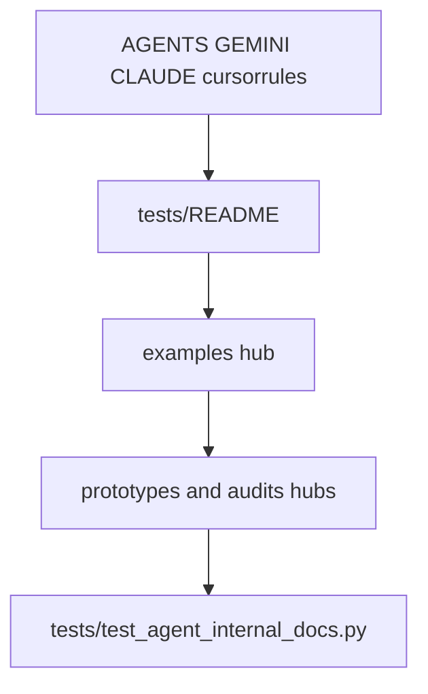

# Agent-internal and leftover docs

**Goal:** Agent-rule files, test/example entry points, and hubs for prototypes/audits agree with the public docs. Dated audit and prototype bodies stay frozen.

## Slices

| Slice | Address | Must not |
|---|---|---|
| Agent rules | Hops, 75/71/4, fix missing root `CLAUDE.md` and server-env stub | Delete learned preferences |
| Tests README | Contributor how-to; hop CONTRIBUTING | Duplicate README install |
| Examples | Hub + stub stale tools/list dump; notebook count/stems | Rewrite the whole notebook |
| Prototypes / audits | Hubs; freeze bodies | Rewrite feel.md or the May audit scores |

## Verification

`tests/test_agent_internal_docs.py` checks hops, registry triple in `.cursorrules`, missing-file ghosts named in this plan, and examples hub text.
