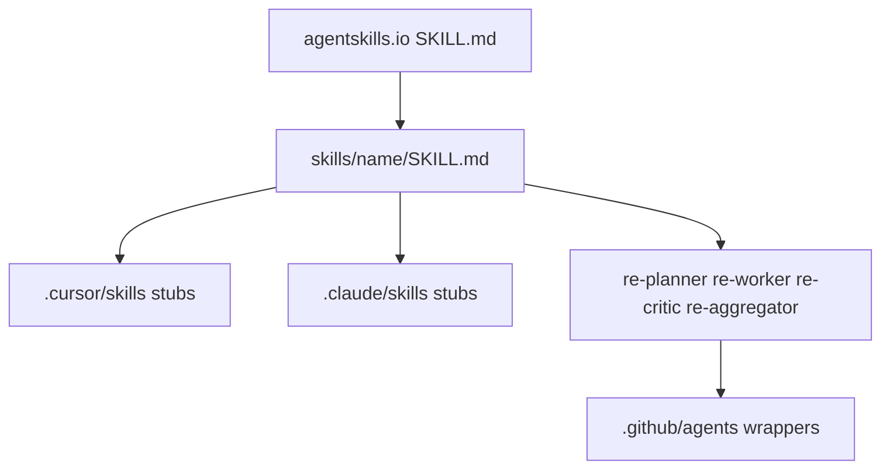

# Align AgentDecompile skills with agentskills.io

**Status:** implemented — spec + other agentskills.io pages (quickstart `.agents/skills/`, description evals, `evals/`)  
**Spec:** [Agent Skills Specification](https://agentskills.io/specification)

## Objective

One portable skill tree (`skills/`) that validates against the spec. Cursor and
Claude keep discovery stubs. GitHub Copilot RE agents become wrappers around
the same role skills so Planner/Worker/Critic/Aggregator do not drift.

