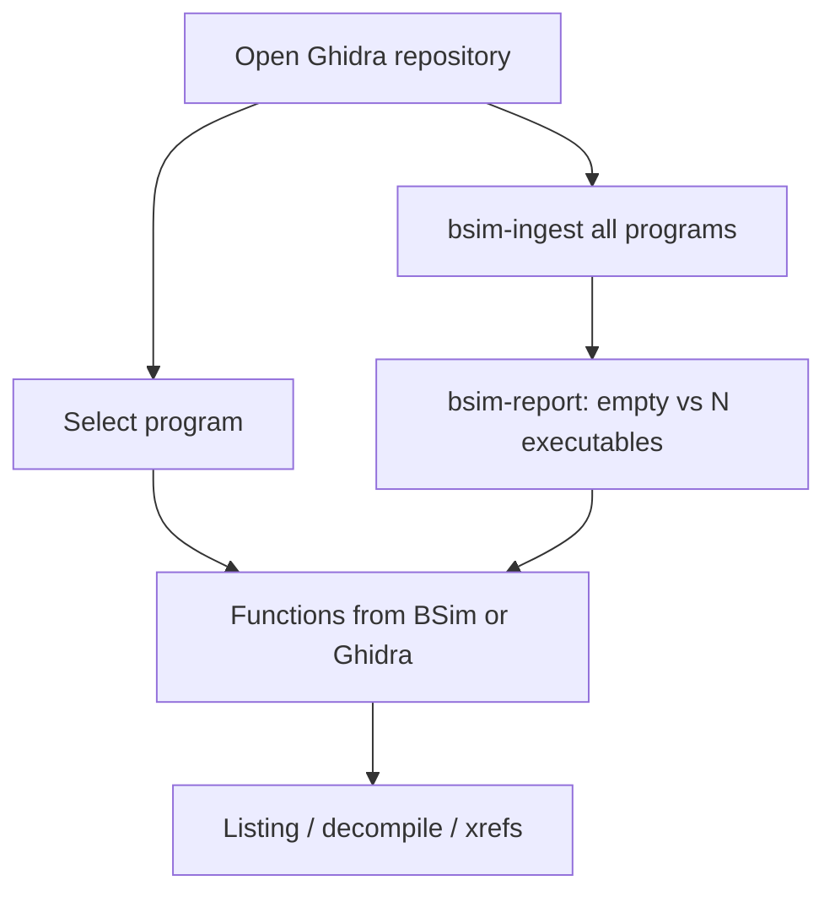

# BSim ingest + IDA-style workbench (issue 169)

**Status:** in progress  
**Issue:** [bodencrouch/AgentDecompile#169](https://github.com/bodencrouch/AgentDecompile/issues/169)

## Objective

The operator loop is a Ghidra repository (K1/K2/Jade/Aurora/Eclipse), not a
corpus-SQLite dashboard. The workbench must behave like IDA/Ghidra/x64dbg:
open a program, list its functions, run analysis. BSim is how names move
across the 24 builds — create the database, ingest every program, and report
whether the datadir is empty or loaded.

## Acceptance (issue 169)

- `createdatabase` wraps Ghidra `bsim createdatabase`
- `ingest` generates + commits signatures for every program; per-program
  progress; resumable via a receipt
- `report` distinguishes no database / empty database / N executables
- Commands in `TOOLS_LIST.md` and the MCP/catalog surface
- Workbench Analyze menu + Functions/Listing no longer dead-end on
  “add a corpus import”
