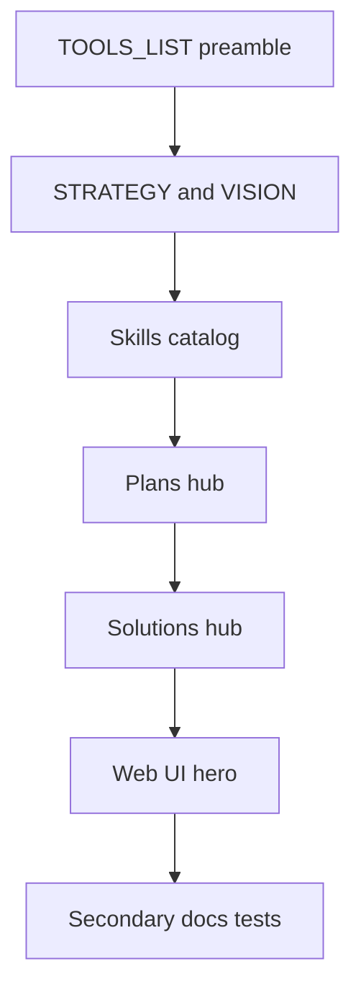

# Secondary documentation surfaces

**Goal:** The six surfaces left out of the landing rewrite get their own tidy pass, without rewriting historical plan bodies or generated tool entries.

This plan does **not** mutate the landing-page plan. Historical `docs/plans/**` bodies stay frozen except this file and a new hub.

## Slices

| Slice | Address | Must not |
|---|---|---|
| 1 TOOLS_LIST | Hand-edit preamble only: hops, 75/71/4, generator note | Rewrite Canonical Tool Docs |
| 2 STRATEGY / VISION | Hops, date, fix script-damaged words | Turn VISION into a README |
| 3 Skills | Catalog in `skills/README.md`; identical repo-root path text in both skill trees | Rewrite evals or stub loaders |
| 4 Plans | New `docs/plans/README.md` — living vs frozen | Rewrite dated execution plans |
| 5 Solutions | Hub + stale advertised-count note | Delete dated workflow-learnings |
| 6 Web UI hero | Headline and lede from `docs/HERO.md` | Redesign the tool runner |

## Verification

`tests/test_secondary_docs_surfaces.py` checks hubs, preamble counts, VISION corruption, and Web UI hero strings. Do not parse TOOLS_LIST tool bodies.
