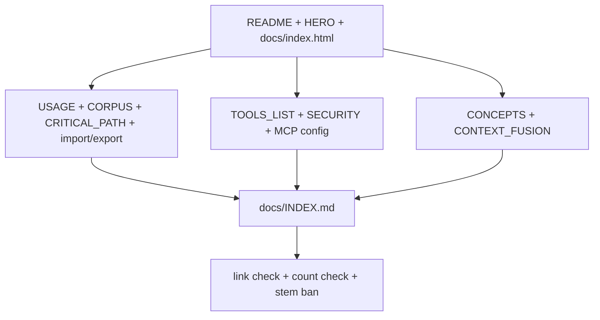
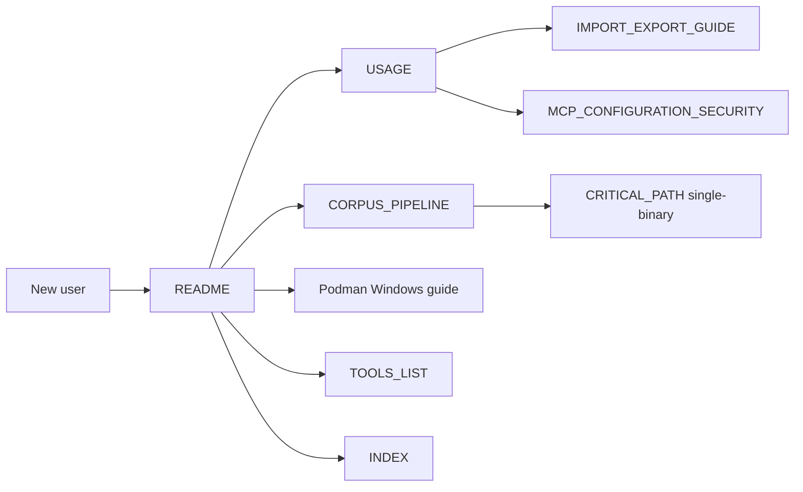

# Consolidate user-facing markdown

**Goal:** A stranger can start stdio or HTTP from README alone, with honest claims and one public install URL.

**Architecture:** Treat the public markdown tree as a Diataxis map (landing, how-to, reference, explanation). Rewrite in-scope markdown by hand. Limit `docs/index.html` to link and hero-copy sync only (no full page rewrite). Do not run a repository-wide substitution script. Leave agent rules, plans, solutions, and generated tool reference body alone.

## Problem

Public docs grew by accretion. A first-time reader hitting `README.md` (988 lines) meets session-validated PowerShell, a Windows checkout path, redacted passwords, a 200-line `agentdecompile_cli` mermaid, and marketing that promises CTF solvers. The same install, Web UI, and corpus commands appear again in `USAGE.md`, `docs/CORPUS_PIPELINE.md`, and `docs/index.html`.

Measured drift (2026-09-01, this checkout):

| Symptom | Where |
|---|---|
| Session diary headings | `README.md` § Session-Validated Commands; `USAGE.md` § Commands Exercised In This Session, Unique Patterns From Live Validation |
| Product-specific binary stems | `/K1/k1_win_gog_swkotor.exe` in `README.md` and `USAGE.md` |
| Broken relative links | `docs/MCP_AGENTDECOMPILE_USAGE.md` (missing; still linked from `docs/INDEX.md`, `docs/IMPORT_EXPORT_GUIDE.md`, `docs/MCP_CONFIGURATION_SECURITY.md`); `docs/SRC_ENTRYPOINTS_CALL_GRAPH.md` and `docs/generated/*.json` from `README.md` |
| Ghost historical list | `docs/INDEX.md` names `EXECUTE_SCRIPT_01_K1.md`, `KOTOR_SAVELOAD_TOOL_ANALYSIS.md`, `RELEASE_NOTES_1.0.0.md`, etc. — files are gone |
| Tool-count drift | README mermaid says "72 canonical tools"; `.cursorrules` says 75 / 71 advertised / 4 GUI-only |
| Duplicate corpus stage tables | `README.md`, `docs/CORPUS_PIPELINE.md`, `docs/corpus/README.md` |
| Duplicate import/export | `docs/QUICKSTART_IMPORT_EXPORT.md` vs `docs/IMPORT_EXPORT_GUIDE.md` |
| Clone / Pages owner mismatch | Pages and `docs/HERO.md` use `bodecloud/AgentDecompile`; README clone/uvx examples use `bolabaden/agentdecompile`; `origin` on this checkout is `bodencrouch/AgentDecompile` |
| Prior failed rewrite | `docs/plans/2026-07-24-feat-plain-language-docs-site.md` rejected `scripts/plain_language_docs.py` because it mutated valid commands such as `pip install -e .` |

## Scope

**In scope (public markdown — user and contributor entry surfaces):**

- `README.md`
- `USAGE.md`
- `CONTRIBUTING.md`
- `SECURITY.md`
- `CONCEPTS.md`
- `docs/INDEX.md`
- `docs/HERO.md`
- `docs/index.html` (link and hero-copy sync only; not a markdown rewrite)
- `docs/CORPUS_PIPELINE.md`
- `docs/corpus/README.md`
- `docs/CRITICAL_PATH.md`
- `docs/IMPORT_EXPORT_GUIDE.md`
- `docs/QUICKSTART_IMPORT_EXPORT.md`
- `docs/MCP_CONFIGURATION_SECURITY.md`
- `docs/session-handling.md`
- `docs/SharedProjectCLI.md`
- `docs/CONTEXT_FUSION.md`
- `docs/Podman-Windows-Complete-Setup-Guide.md`

**Out of scope (do not rewrite in this plan):**

- `TOOLS_LIST.md` body (generated from `registry.py`; U9 only updates counts/links that *other* files quote)
- `AGENTS.md`, `GEMINI.md`, `src/CLAUDE.md`, `src/agentdecompile_cli/CLAUDE.md`, `.cursorrules`
- `STRATEGY.md`, `VISION.md`
- `docs/plans/**`, `docs/solutions/**`, `docs/prototypes/**`, `docs/audits/**`, `docs/dogfood-reports/**`, `docs/residual-review-findings/**`, `docs/brainstorms/**`, `docs/superpowers/**`
- Skill trees under `skills/`, `.agents/skills/`, `.cursor/skills/`, `.claude/skills/`, `.github/agents/`
- `docs/UPSTREAM_DONOR_ARCHIVE.md`, `docs/PyGhidra_API_Reference*.md`, `docs/agent-native-*.md`, `docs/UNITY_RECONSTRUCTION.md`, `docs/e2e_shared_local_checkout_sync.md`
- `tests/README.md`, `examples/**`

Out-of-scope files may still be *listed* from `docs/INDEX.md` when they remain the right next hop for contributors or agents.

## Key Technical Decisions

1. **Diataxis roles, not a wiki dump.** Landing (`README` + `HERO` + Pages) explains what it is and how to start. How-to lives in `USAGE.md` and the recovery/import guides. Reference lives in `TOOLS_LIST.md` and security/config pages. Explanation lives in `CONCEPTS.md` and `CONTEXT_FUSION.md`.
2. **Hand edits only.** No repository-wide rewriter. A previous automated plain-language pass damaged live commands.
3. **Canonical facts come from code at write time.** Tool counts: import `Tool` and `DISABLED_GUI_ONLY_TOOLS` from `src/agentdecompile_cli/registry.py`, clear the same tool-surface / enable / disable / auto-checkin env vars as `tests/test_canonical_tool_parity.py`, and write the default-`full` triple (canonical = `len(Tool)`, GUI-only = `len(DISABLED_GUI_ONLY_TOOLS)`, advertised = canonical minus GUI-only). Do not copy `.cursorrules` or old README mermaid numbers. Refuse to write a count from a non-default process environment.
4. **Public GitHub URL is a lookup, not a guess.** Before rewriting clone/`uvx` URLs, check `gh repo view` on `bodecloud/AgentDecompile`, `bodencrouch/AgentDecompile`, and `bolabaden/agentdecompile`. Pages already point at `bodecloud`. Docker Hub image names stay whatever is actually published (`docker.io/bolabaden/agentdecompile-mcp` if that tag still exists). Document the split if owner and image publisher differ.
5. **Placeholders plus one public fixture.** Ban product stems (`/K1/`, `swkotor`, `k1_win_gog`) and session-machine paths (`C:/GitHub`, `.venv/Scripts`). Secondary examples use `/path/to/binary` and `http://127.0.0.1:8080/mcp`. The one public worked path is `tests/fixtures/test_x86_64` (or the current in-repo fixture if that name moves). Do not delete reconstruct how-to in order to satisfy the stem ban — rewrite the smoke block onto the fixture.
6. **Session diaries become generic how-to.** Useful patterns (default session, `tool-seq`, `/mcp` vs `/`, content-level errors) move into `USAGE.md` as timeless notes **before** the README sections that hold them are deleted. Headings like "Session-Validated Commands" and "Commands Exercised In This Session" are then deleted.
7. **`docs/QUICKSTART_IMPORT_EXPORT.md` becomes a stub.** Keep the path so inbound links work. First heading plus a pointer to the Quick start section of `IMPORT_EXPORT_GUIDE.md`. Do not keep two full copies.
8. **README target: under 350 lines.** Hero from `docs/HERO.md`, three **ordered closed** start paths (stdio → HTTP/`uvx` → Docker) a stranger can run without opening USAGE, plus one sentence that chooses among them. Short corpus pointer (default multi-binary hop). Link to `USAGE.md` / `TOOLS_LIST.md` / `docs/INDEX.md` / the Windows Podman guide. Exhaustive architecture mermaid moves out. New CLI command recipes land in `USAGE.md` first; README only changes when install or start-path text changes.
9. **Claim honesty stays.** "Finished job ≠ match." Dashboard green is not proof. Verified means compile + objdiff 0. Do not restore CTF-solver marketing.

## Information architecture

| Reader need | Canonical file | Must not also own |
|---|---|---|
| What is this / install / first 10 minutes | `README.md` | Full CLI catalog, recovery stage table, architecture mermaid |
| Shared landing sentence | `docs/HERO.md` | Commands |
| Pages landing | `docs/index.html` | Unique claims not in HERO/README |
| Day-to-day CLI / MCP / Web UI / failures / **complete env-var and HTTP-header catalog** | `USAGE.md` | Install options already in README; tool parameter encyclopedia; corpus stage table |
| Tool parameters and aliases | `TOOLS_LIST.md` | Tutorials |
| Multi-binary recovery contract | `docs/CORPUS_PIPELINE.md` | Single-binary reconstruct stages |
| Corpus folder map / stage table | `docs/corpus/README.md` | Duplicate command recipes from CORPUS_PIPELINE |
| Single-binary reconstruct | `docs/CRITICAL_PATH.md` | Corpus stage table |
| Import / export how-to | `docs/IMPORT_EXPORT_GUIDE.md` | A second quickstart file with the same examples |
| MCP bind / credential risk | `docs/MCP_CONFIGURATION_SECURITY.md` | Duplicate vuln-reporting process |
| Vuln reporting | `SECURITY.md` | Full MCP bind runbook |
| Session id persistence | `docs/session-handling.md` | Duplicate in README |
| Shared vs local Ghidra project CLI | `docs/SharedProjectCLI.md` | README install |
| Vocabulary | `CONCEPTS.md` | Pipeline recipes |
| Context fusion | `docs/CONTEXT_FUSION.md` | Recovery CLI |
| Windows / Podman setup | `docs/Podman-Windows-Complete-Setup-Guide.md` | Generic Linux install |
| Contributor setup / release | `CONTRIBUTING.md` | User install (link README) |
| Hub | `docs/INDEX.md` | Long excerpts |

## Implementation Units

**Priority (do not start at U1):**

| Tier | Units | Why |
|---|---|---|
| Must | Public URL decision (see Open Questions), U2, U3, U10 | Stranger can start |
| Should | U1, U9 | Hub ghosts and fact sweep |
| Later | U4, U5, U6, U7, U8 | Import stub, recovery trio, security sync, contributor guides, Pages copy-sync |

### U1 — Hub and role table

**Goal:** `docs/INDEX.md` describes files that exist and the role of each. Ghost paths and the missing MCP usage guide are gone.

**Files:**
- Modify: `docs/INDEX.md`

**Approach:**
- Replace the mermaid and lists so every link resolves on disk.
- Route MCP client setup to `USAGE.md` and `docs/MCP_CONFIGURATION_SECURITY.md` instead of `docs/MCP_AGENTDECOMPILE_USAGE.md`.
- Add short hops for `SECURITY.md`, `docs/MCP_CONFIGURATION_SECURITY.md`, and `docs/session-handling.md`.
- Drop the historical-file list of missing paths. If a file is gone, do not catalog it.
- Keep contributor hops (`CONTRIBUTING.md`, skills) as short links, not excerpts.

**Test scenarios:**
- Every relative link in `docs/INDEX.md` resolves.
- The string `MCP_AGENTDECOMPILE_USAGE` does not appear.

### U2 — README landing

**Goal:** A stranger can install and start without reading a session log or an internal architecture map.

**Files:**
- Modify: `README.md`
- Read (do not fork voice): `docs/HERO.md`

**Approach:**
- Open with HERO headline, subhead, and the three capabilities.
- Keep one mermaid: MCP client → server → Ghidra / corpus. Tool count in that diagram is the U9 registry triple.
- Install: three **ordered closed** recipes a stranger can run without opening USAGE — stdio, then HTTP/`uvx`, then Docker (published image name from KTD 4). One sentence chooses among them. Keep a heading that slugs to `#installation` (Pages Quick start). HTTP examples bind `127.0.0.1:8080/mcp`. If any remote-bind recipe is kept, it sits next to the `AGENT_DECOMPILE_AUTH_ENABLED` warning.
- Corpus: five-line pointer + link to `docs/CORPUS_PIPELINE.md` as the **default** recovery hop. Label `docs/CRITICAL_PATH.md` as single-binary only and list it after corpus.
- One hop: Windows / Podman → `docs/Podman-Windows-Complete-Setup-Guide.md`.
- One hop: Security → `SECURITY.md`.
- Link `CONCEPTS.md` only as vocabulary, not as a first-hour stop.
- First-run env trio only (`GHIDRA_INSTALL_DIR`, server URL, Ghidra Server auth). Move the complete env-var / HTTP-header table (including `AGENT_DECOMPILE_AUTH_ENABLED`, `AGENT_DECOMPILE_TLS_CERT`/`KEY`, `AGENT_DECOMPILE_HOST`) to USAGE — do not delete those rows.
- **Migrate then delete:** list durable patterns in Session-Validated Commands and Field-Proven Operational Patterns; confirm each already lives in USAGE (or add it in U3) before deleting those README sections. Also delete Recovery Recovery Pipelines, the CTF list, the exhaustive `src/agentdecompile_cli` mermaid, and broken `docs/SRC_ENTRYPOINTS_CALL_GRAPH.md` / `docs/generated/*` links.
- New CLI command recipes belong in USAGE first. README only gains a pointer when a start path changes.
- License + contributing links stay. Do not relocate the README architecture line that pairs session id with auth — delete that conflation.

**Test scenarios:**
- `README.md` is under 350 lines.
- README contains three closed start recipes (stdio, HTTP/`uvx`, Docker) plus a chooser sentence.
- README links `docs/CORPUS_PIPELINE.md` before `docs/CRITICAL_PATH.md` and labels the latter single-binary.
- README links `docs/Podman-Windows-Complete-Setup-Guide.md` and `SECURITY.md`.
- No `k1_win_gog`, `swkotor`, `C:/GitHub`, `.venv/Scripts`, or `Session-Validated` strings.
- Hero sentence matches `docs/HERO.md`.
- A heading slugs to `#installation`.

### U3 — USAGE how-to

**Goal:** One operator manual for CLI, HTTP MCP, Web UI, and failure states.

**Files:**
- Modify: `USAGE.md`

**Approach:**
- Drop "Shared constants" that hardcode a product program path. Use KTD 5 placeholders plus `tests/fixtures/test_x86_64` as the one public worked path.
- Keep: `/mcp` vs `/` vs `/api`, default session vs `tool-seq`, Web UI sidecar on `127.0.0.1:8002`, content-level `## Error` vs transport failure, shared-server auth flags.
- Default-session note must include: session IDs are not authentication; do not treat `mcp-session-id` or the default session as access control.
- Absorb README Field-Proven / session-validated patterns that are not already covered, then U2 may delete those README sections.
- Own the complete env-var + HTTP-header catalog moved from README, including `AGENT_DECOMPILE_AUTH_ENABLED`, `AGENT_DECOMPILE_TLS_CERT`/`KEY`, and `AGENT_DECOMPILE_HOST`.
- Rewrite "Commands Exercised In This Session" into numbered workflows. Secondary examples use `/path/to/binary`; at least one workflow uses the public fixture.
- Keep the failure-state catalog; make each row a symptom → check → next doc.
- Related docs footer points at INDEX, CORPUS_PIPELINE, IMPORT_EXPORT_GUIDE, MCP_CONFIGURATION_SECURITY, session-handling. State that new CLI recipes land here first. No missing files.
- Link `CONCEPTS.md` only when a term needs a definition. Link `docs/CONTEXT_FUSION.md` only from a named operator need (merge notes / address-keyed conflicts). Each of those pages must end with a return link to this how-to or to INDEX.
- Must not also own: install matrix, corpus stage table, tool-parameter encyclopedia (those stay README / CORPUS_PIPELINE / TOOLS_LIST).

**Test scenarios:**
- No `k1_win_gog`, `swkotor`, `C:/GitHub`, or `.venv/Scripts` strings.
- No heading containing `This Session` or `Live Validation`.
- Contains the session-id-is-not-auth sentence and the AUTH_ENABLED / TLS / HOST rows.
- Every relative link resolves.

### U4 — Import/export merge

**Goal:** One how-to, one stub.

**Files:**
- Modify: `docs/IMPORT_EXPORT_GUIDE.md`
- Modify: `docs/QUICKSTART_IMPORT_EXPORT.md`

**Approach:**
- Move the current quickstart examples to the top of the guide as `## Quick start`.
- Replace `QUICKSTART_IMPORT_EXPORT.md` with a 10-line stub that links to that section.
- Remove links to `MCP_AGENTDECOMPILE_USAGE.md`.
- Keep format table and troubleshooting.

**Test scenarios:**
- Opening the old quickstart path still explains where to go.
- Guide no longer references the missing MCP usage file.

### U5 — Recovery trio

**Goal:** Corpus contract, folder map, and single-binary reconstruct do not repeat each other's stage tables.

**Files:**
- Modify: `docs/CORPUS_PIPELINE.md`
- Modify: `docs/corpus/README.md`
- Modify: `docs/CRITICAL_PATH.md`

**Approach:**
- `CORPUS_PIPELINE.md` keeps operator commands, priorities, and rules. One mermaid.
- `docs/corpus/README.md` keeps the stage table only, plus a parent link. Delete the second copy of the run recipe if it is identical to the parent.
- `CRITICAL_PATH.md` states up front it is the single-binary reconstruct loop, not the corpus default. Keep checkpoint table. Link corpus for multi-binary.
- Rewrite any proof-scale smoke that names `swkotor` / `/K1/` onto `tests/fixtures/test_x86_64` and `target/agentdecompile-reconstruct/example`. Keep autonomous flags, receipts, and accept-vs-named-terminal criteria.

**Test scenarios:**
- A reader of CRITICAL_PATH is told corpus is the multi-binary default in the first screenful.
- Stage names in corpus/README match CORPUS_PIPELINE mermaid.
- CRITICAL_PATH has no `swkotor` or `/K1/` stems and still documents reconstruct smoke.

### U6 — Security and session pages

**Goal:** Vuln reporting, MCP bind risk, and session-id rules do not contradict each other.

**Files:**
- Modify: `SECURITY.md`
- Modify: `docs/MCP_CONFIGURATION_SECURITY.md`
- Modify: `docs/session-handling.md`

**Approach:**
- Relocate, do not delete. Write a Bind and MCP HTTP auth section in `MCP_CONFIGURATION_SECURITY.md` **before** slimming SECURITY or cutting the README env table: default bind `127.0.0.1`; never recommend `0.0.0.0` without `AGENT_DECOMPILE_AUTH_ENABLED` plus firewall/TLS; `GHIDRA_SERVER_*` / `X-Agent-Server-*` authenticate Ghidra Server only, not the MCP listener.
- `SECURITY.md` stays the reporting process. Keep the no-public-issue rule. Name GitHub private vulnerability reporting as the working channel (do not invent a mailbox the project does not monitor). Keep the `0.0.0.0` one-liner as a pointer to the bind section, plus malware-isolation and Ghidra-creds-as-secrets notes.
- `MCP_CONFIGURATION_SECURITY.md` drops the missing usage-guide link; point at `USAGE.md`.
- `session-handling.md` keeps protocol rules including "Session IDs must not be used for authentication." Point the user-facing summary at USAGE, not a missing AGENTS.md heading.

**Test scenarios:**
- No `MCP_AGENTDECOMPILE_USAGE` references.
- `session-handling.md` links resolve.
- `MCP_CONFIGURATION_SECURITY.md` contains the bind / AUTH_ENABLED / Ghidra-creds-are-not-MCP-auth text.
- `SECURITY.md` still forbids public GitHub issues and names private vulnerability reporting.

### U7 — CONTRIBUTING and remaining setup guides

**Goal:** Contributors get current clone, test, and release steps; Windows/Podman and SharedProject stay accurate and stop duplicating README install.

**Files:**
- Modify: `CONTRIBUTING.md`
- Modify: `docs/Podman-Windows-Complete-Setup-Guide.md`
- Modify: `docs/SharedProjectCLI.md`

**Approach:**
- CONTRIBUTING clone URL follows KTD 4.
- Release notes: stop requiring `RELEASE_NOTES_1.0.0.md` if that file is gone; say "notes file for this tag" or `gh release create` with `--generate-notes`.
- Change the "update all of" list: new CLI command recipes land in USAGE first; README only for install/start-path changes; tests still update with behavior.
- Delete the Project Layout `docs/generated/` bullet and the entire "Static call graph artifacts" section. Do not leave backtick paths to missing generated files.
- SharedProjectCLI and Podman guides: remove duplicate generic install; link README. Keep platform-specific steps. Generic placeholders.

**Test scenarios:**
- CONTRIBUTING does not link `RELEASE_NOTES_1.0.0.md` unless the file is recreated.
- CONTRIBUTING does not mention `docs/generated/` or `SRC_ENTRYPOINTS_CALL_GRAPH`.
- Both setup guides link README for generic install.

### U8 — HERO and Pages sync

**Goal:** README, `docs/HERO.md`, and `docs/index.html` say the same product in the same words.

**Files:**
- Modify: `docs/HERO.md` only if README landing forced a wording change
- Modify: `docs/index.html`

**Approach:**
- Copy headline, lede, and three capabilities from HERO. Pages must not keep a fourth capability card or unique claims.
- Delete Pages install code blocks, or make them match README's three start paths verbatim. Prefer delete-and-link: primary CTA = README `#installation`, secondary = USAGE then TOOLS_LIST.
- Start here list: README install, USAGE, CORPUS_PIPELINE (default recovery), CRITICAL_PATH labeled single-binary, INDEX, TOOLS_LIST. No missing files.
- Repository buttons keep the Pages-canonical owner from KTD 4.

**Test scenarios:**
- Headline, lede, and the three capability titles in `docs/index.html` equal HERO.
- Pages has no unique fourth capability and no install commands that differ from README.
- Primary CTA targets README `#installation`.
- No link to `MCP_AGENTDECOMPILE_USAGE.md`.

### U9 — Cross-doc fact sweep

**Goal:** In-scope files agree on tool counts, owners, and next hops. CONCEPTS stays a glossary.

**Files:**
- Modify: any in-scope file that still quotes a stale count or missing path
- Modify: `CONCEPTS.md` (wording only; no new recipe)

**Approach:**
- Compute the KTD 3 triple once under the env-cleared default-`full` recipe; write it wherever a count is claimed.
- Grep in-scope files for `MCP_AGENTDECOMPILE_USAGE`, `SRC_ENTRYPOINTS_CALL_GRAPH`, `k1_win_gog`, `swkotor`, `Session-Validated`, `72 canonical`, `C:/GitHub`, `.venv/Scripts`.
- CONCEPTS: keep terms; do not expand into a pipeline doc. End with a return link to USAGE or INDEX.
- If `docs/CONTEXT_FUSION.md` stays in scope (see Open Questions), confirm it has no recovery CLI recipes and ends with a return link to the named USAGE hop.

**Test scenarios:**
- Grep of in-scope files for the strings above is empty (except a historical note is not allowed — delete, do not annotate).
- CONCEPTS remains under 80 lines.

### U10 — Verification

**Goal:** Mechanical checks so the next edit cannot reintroduce ghost links.

**Files:**
- Create: `tests/test_user_facing_docs.py` (or extend an existing docs test if one appears during implementation)

**Approach:**
- Collect the in-scope markdown list from this plan.
- Path extractor includes markdown/HTML hrefs, mermaid node labels that look like repo paths, and backtick-wrapped `*.md` / `*.html` tokens.
- Assert every extracted relative path resolves.
- Parse `docs/index.html` hrefs: GitHub owner/branch match the KTD 4 lookup; the README `#installation` fragment exists.
- Assert forbidden tokens are absent: `k1_win_gog`, `swkotor`, `C:/GitHub`, `.venv/Scripts`, `Session-Validated`, `MCP_AGENTDECOMPILE_USAGE`, `SRC_ENTRYPOINTS_CALL_GRAPH`, `72 canonical`.
- Assert required substrings survive: `do not open a public GitHub issue` (SECURITY), `Session IDs must not be used for authentication` (USAGE or session-handling), and a bind/localhost or AUTH_ENABLED warning in `MCP_CONFIGURATION_SECURITY.md`.
- Import `Tool` and `DISABLED_GUI_ONLY_TOOLS`, clear the same env vars as `tests/test_canonical_tool_parity.py`, and assert README's written triple equals `len(Tool)`, `len(DISABLED_GUI_ONLY_TOOLS)`, and `len(Tool) - len(DISABLED_GUI_ONLY_TOOLS)`.
- Assert README line count `< 350` and that README contains three closed start recipes.
- Assert USAGE does not own an install matrix, a corpus stage table, or a tool-parameter encyclopedia.
- Assert `docs/QUICKSTART_IMPORT_EXPORT.md` is shorter than 30 lines and links to the guide.
- Assert `docs/index.html` headline, lede, and three capability titles match HERO.
- Do **not** parse TOOLS_LIST body.

**Test scenarios:**
- `uv run pytest tests/test_user_facing_docs.py -q` passes.
- A deliberately broken link in a scratch copy fails the test (run once while writing the test, then revert the scratch).
- A scratch mermaid node pointing at a missing `.md` fails the test, then revert.

## Verification Contract

1. Link check on every in-scope file, including mermaid and backtick paths (U10).
2. Registry triple written in README mermaid matches the test's env-cleared computed counts.
3. `docs/index.html` headline, lede, and three capability titles match `docs/HERO.md`.
4. No new dependency, no CLI behavior change, no skill-tree edit.
5. Written walkthrough: from README alone, run the stdio recipe and the HTTP recipe; record the command and the first success signal (process up, or `tools/list` / equivalent). Do not open a plan.

## Definition of Done

- In-scope files match the IA table (one owner per fact family).
- Ghost links and session diaries are gone.
- U10 test is in the tree and green.
- Verification Contract item 5 walkthrough is written (command + expected first success signal).
- Out-of-scope trees were not rewritten.

## Risks

- **Owner/URL fork.** Three GitHub owners appear in current docs. Wrong rewrite of clone URLs is worse than leaving a comment that Pages and `origin` differ. U2 waits on the `gh repo view` check.
- **TOOLS_LIST temptation.** Regenerating or hand-editing 2400 lines is out of scope. Count drift in TOOLS_LIST itself is a follow-up.
- **README re-growth.** U3 and U7 now write the USAGE-first recipe rule. Review still has to enforce it.
- **Worked examples vs honesty.** Session diaries are gone; the public fixture and `--help`-matching commands replace them.

## What this plan is not

Not a rewrite of agent skills, STRATEGY, VISION, or the living corpus plan. Not a new docs site generator. Not a claim that the Pages site is the product.

## Deferred / Open Questions

### From 2026-09-01 review

- **Settle one public GitHub owner before landing rewrite** — Key Technical Decisions — public GitHub URL (P0, product-lens, confidence 100)

  A stranger’s first copy-paste is the clone or uvx URL. Three owners already appear on public surfaces. A live lookup at implement time can ship three install addresses as the new canonical docs. Name one public owner (Pages may already be that owner) before U2/U7/U8 rewrite clone and uvx examples. Docker Hub may stay a different publisher if that tag is what is published.

- **Context-fusion is in scope with no owning unit** — Scope / Information architecture / Implementation Units (P2, coherence, scope-guardian, confidence 100)

  Listing the file under consolidation without assigned work leaves implementers to skip it or invent a rewrite. Either drop it from in-scope (keep as an index hop) or add one fact-sweep bullet that only checks ownership and ghost links.

- **Missing MCP usage guide becomes a silent 404** — Hub and role table / Import-export merge (P2, design-lens, confidence 75)

  The import quickstart keeps a stub so inbound links survive. The missing MCP usage guide is deleted with no successor page. Old bookmarks 404. Same stub pattern pointing at USAGE and the MCP security page, or accept the 404.
