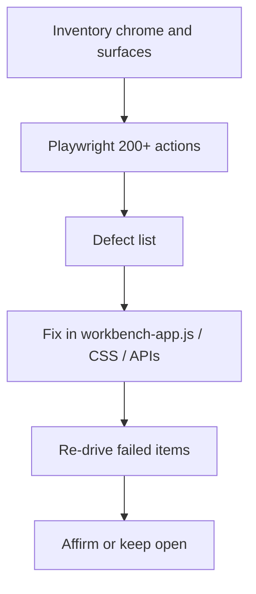

# Workbench UI thorough audit (200+ parts)

**Objective:** Drive every workbench chrome, window, dialog, and Explorer/Functions control on the live `:8768` dogfood server. Fix anything that is broken, hidden, or unprofessional. Affirm only from Playwright/API evidence.

## Scope

Live `/dashboard` on `http://127.0.0.1:8768` against the repos shared-fs project. Do **not** click Restart/Shutdown. Do **not** auto-analyze all 24 programs. Do **not** start `ghidraSvr`. Do **not** delete JadeEmpire.

## Task groups (~200 checks)

1. **Chrome** — brand, search, palette, File/Edit/View/Analyze/Help menus, shortcuts, session tabs, new tab, rename, close-cancel.
2. **Open/Save/Add** — Open path/URL, browse, Save, Save As fs/HTTP cancel+ok, Add-to-project dialog, Escape/backdrop.
3. **Explorer + Functions** — project tree, program select, visible Remove, function rows, pager, wrap/width, context menus.
4. **Editor windows** — Listing, Functions, Graph, every More surface, islands not stuck on “0s so far”.
5. **Listing tools** — Decompile/Comment/Label/Xrefs strips open and close; Jobs dock; density; jobs rail.
6. **Copy/empty/error** — no “Imports · corpus store”; empty states; dialog validation; dangerous confirms.

## Global constraints

- Authoritative UI: `src/agentdecompile_recovery/corpus/dashboard/static/workbench-app.js`.
- After UI edits: kill/restart `serve8768.py`; Playwright-verify. Do not click Restart in the page.
- No unit-test suite unless a change needs a single targeted test.
- No git commit unless the user asks.
- Playwright drivers stay throwaway (`/tmp`); do not land them in the repo.
