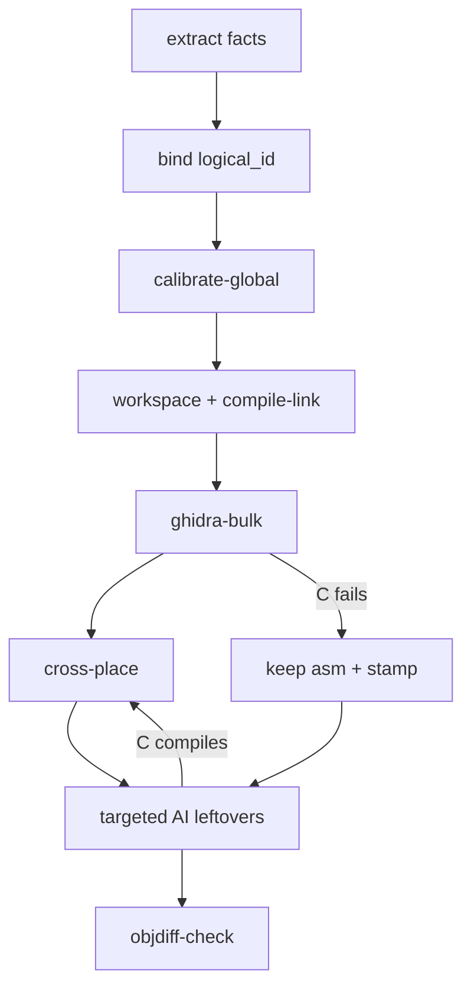
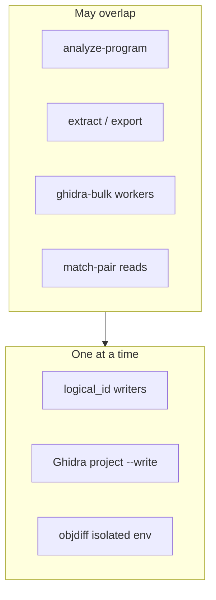

# Recovery Pipeline Ladder - Plan

**Target repo:** AgentDecompile

**Product Contract preservation:** authored in this plan (`ce-plan-bootstrap`). Strategy already updated in `STRATEGY.md` (2026-09-08). Living plan `docs/plans/2026-08-30-corpus-semantic-pipeline-living-plan.md` stays historical. Portable signatures / Phasor export: `docs/plans/2026-09-08-0225-feat-portable-signatures-phasor-export-plan.md`.

## Goal Capsule

- **Objective:** Make the corpus pipeline and React workbench run one 8-step ladder: extract → `logical_id` → global calibration → assembly floor → compiling Ghidra C → cross-place → targeted AI on leftovers → objdiff last. Never decompile the same logical function twice. Skip a step when its receipt or Ghidra analysis already exists.
- **Authority:** `STRATEGY.md` priority ladder, then this plan's Product Contract, then existing receipts on disk. Dashboard copy is not authority.
- **Stop when:** The catalog, `corpus.run`, the pipeline rail, and Recover/Match panes use the same step order and claim tiers. Auto-chain after analyze no longer fires `corpus.cross-place`. Opening an analyzed project does not start `analyze-program`. Identity-mutating jobs serialize. Byte-exact stays a separate last audit.
- **Do not:** Rewrite Ghidra Java, start a second Wine/Mizuchi job, treat compile as byte identity, add a second dashboard port, invent argv in the browser, or re-analyze a program that already has analysis unless the operator forces it.
- **Execution profile:** Code. Prefer smoke on `:8080` (curl + workbench) for rail and honesty. Named unit tests go with each feature-bearing unit.
- **Tail ownership:** Remove abandoned calibration or rail experiments from the diff before calling done.

---

## Product Contract

### Summary

Align the existing corpus CLI, job catalog, and React workbench to the recovery order already written in `STRATEGY.md`. Add global calibration as a real step with its own verb and receipt. Keep `corpus calibrate` as matcher score/margin sweep. Recover once per `logical_id` on the donor, then propagate. Do not redo Ghidra analysis or a stage receipt that already exists.

### Problem Frame

Three vocabularies describe eight steps and they disagree. `contract.PIPELINE_STAGES` still walks generate-projects before recover and compile before leftover AI. The workbench rail runs genproject before cross-place and compile-link. `chainAfterAnalyze` copies C after analyze with no compile gate. `corpus.calibrate` does not solve compiler, ABI, or layout. Operators and agents can spend compute on a sibling that already has compiling C, or treat a green job as a match.

### Requirements

**Identity and extract**

- R1. Every registered binary is inventoried (function bounds, calls, strings, symbols, types) before manual Ghidra edits on that program. Inventory may come from an already-analyzed Ghidra project. Do not re-run `analyze-program` to invent a second inventory.
- R2. Each inventoried function binds to one `logical_id` using debug info, symbols, and BSim as evidence.
- R3. Final `logical_id` assignment is a serialized write. Matching and evidence extract may run in parallel.

**Calibration**

- R4. Global calibration (compiler versions, flags, ABIs, global struct layouts) is a required step after identity and before per-function C recovery.
- R5. `corpus calibrate` remains matcher threshold sweep. The operator-visible calibration step must not reuse that verb.

**Scaffolding and readable C**

- R6. The donor workspace is one file per function. Missing C uses exact inline assembly. The tree must link.
- R7. Bulk Ghidra C replaces assembly only when that function compiles. Failure keeps assembly and stamps the attempt.
- R8. A `logical_id` that already has assembly-free compiling C (`real_c`) is not decompiled again on a sibling. A compiling asm wrapper does not count.

**Propagation and leftovers**

- R9. Cross-place copies only compiling C, keyed by `logical_id`, and only after a donor Ghidra-C compile receipt (`recover-source` / `ghidra-bulk`). The assembly-floor link receipt is not that gate.
- R10. Targeted AI / genproject / reconstruct one-shot run only on leftovers (bound `logical_id`, assembly still present, C-replace already tried or Ghidra C failed). Leaves before callers.

**Parity and honesty**

- R11. Byte-accuracy (objdiff) is a last, isolated audit. Compile and link never promote to `byte_exact`.
- R12. A finished catalog job is not a match. `real_c` and `byte_exact` stay separate headline fields.
- R13. `recovered_function` has no `byte_exact` column. Headlines must not treat a missing column as zero matches.

**Operator surface**

- R14. Humans and agents start ladder steps through the same catalog (`POST /api/v1/actions/{id}`) on port 8080. No browser-built argv.
- R15. The pipeline rail, steps panel, and `corpus.run` show the same 8-step order and the same default verbs.
- R16. Ghidra Server locators stay RMI over SSL. Check-in stays human-gated.

**Concurrency**

- R17. Parallelize Ghidra analysis, evidence extract, bulk C compile workers, and matching reads.
- R18. Serialize `logical_id` writers, mutations to one Ghidra project, and objdiff in isolated toolchain environments.
- R19. Skip `analyze-program` and any other expensive stage when Ghidra analysis or that stage's receipt already exists. Opening an analyzed project reuses it. `--force` is the only retry.

### Key Decisions

- Recover once per `logical_id`, never per build. (session-settled: user-directed — chosen over independent per-build decompile: same function, one recovery.) Governs R8, R9, R10.
- Global calibration is its own required step. (session-settled: user-directed — chosen over folding it into donor compile-link: global compiler/ABI/layout must be solved before per-function spend.) Governs R4, R5.
- Byte-exactness is a final separate audit. (session-settled: user-directed — chosen over treating compile as a match.) Governs R11, R12, R13.
- One React workbench on 8080 over JSON. (session-settled: user-directed — chosen over static HTML pages and a second port.) Governs R14, R15.
- Ghidra Server is RMI, not HTTP. (session-settled: user-directed — chosen over "Shared HTTP" copy.) Governs R16.
- New implementation plan, not an in-place rewrite of the living corpus plan. (session-settled: user-directed — chosen over updating `docs/plans/2026-08-30-corpus-semantic-pipeline-living-plan.md`.) Governs sequencing only.
- Skip work that is already done. (session-settled: user-directed — chosen over always re-analyzing on open: existing Ghidra analysis and receipts are the source of truth.) Governs R19, R1, R8.

### Actors

- A1. Operator at `/dashboard` on 8080.
- A2. Agent using the same catalog (HTTP actions or MCP tools that map to those actions).
- A3. In-process job runner (`dashboard/actions/jobs.py`).

### Key Flows

- F1. Full ladder from Overview pipeline rail
  - **Trigger:** A1 or A2 runs the numbered rail in order.
  - **Steps:** extract → identity → calibrate-global → workspace/link → ghidra-bulk → cross-place → leftovers → objdiff-check.
  - **Outcome:** Receipts on disk per step. No step claims the next step's tier.
  - **Covered by:** R1–R12, R15.
- F2. Open or import a program
  - **Trigger:** Operator opens a project or import pipeline starts.
  - **Steps:** If `analysisComplete` (or equivalent Ghidra analyzed flag) is already true, skip `analyze-program`. Open and list functions. If the program has no analysis yet, run `analyze-program` once. After a fresh analyze-ok: optional quiet extract-stabs / BSim ingest. Do not auto-run cross-place, genproject, or objdiff.
  - **Outcome:** Functions are available. An already-analyzed project starts no analyze job.
  - **Covered by:** R19, R1, KTD5, KTD9.
- F3. Leftover recovery
  - **Trigger:** Recover leftover control after ghidra-bulk and after cross-place of compiling C.
  - **Steps:** bottom-up AI/genproject only for leftover `logical_id`s. Then recompile. Then optional cross-place of new `real_c`. Objdiff last if claiming verified.
  - **Outcome:** Compiling leftovers may become `real_c`. Byte-exact only after isolated objdiff.
  - **Covered by:** R10, R11.

### Acceptance Examples

- AE1. Covers KTD5. Given analyze-program finished `ok`, when the workbench auto-chain runs, then `corpus.cross-place` is not started.
- AE2. Covers R8. Given donor function `logical_id=L` already has assembly-free compiling C (`real_c`), when ghidra-bulk or decompile runs on a sibling instance of L, then no second decompile write occurs.
- AE3. Covers R5, R4. Given the pipeline rail, when the operator opens the calibration step, then the action is the new global-calibration verb, not `corpus.calibrate`.
- AE4. Covers R11, R13. Given `recovered_function` has only `real_c`, when Overview loads headlines, then byte-exact comes from coverage/objdiff receipts or shows unmeasured, never a SQL error dressed as 0.
- AE5. Covers R10. Given Recover's primary button, when the operator has no leftover predicate, then the default is `corpus.ghidra-bulk`, not `reconstruct.one-shot`. Workspace stays Link floor only.
- AE6. Covers R19. Given an open program with analysis already complete, when the operator or import pipeline would start analyze, then `mcp.analyze-program` is not posted unless `force` is set.

### Success Criteria

- Pipeline rail, steps panel, and `PIPELINE_STAGES` agree on order and default verbs.
- `chainAfterAnalyze` never starts `corpus.cross-place`.
- Opening an already-analyzed program does not start `analyze-program`.
- Identity-mutating catalog jobs refuse a second concurrent writer on the same store.
- Headlines keep `real_c` and byte-exact apart; missing measurement renders `unmeasured`, not `0`.
- A1 can walk F1 on `:8080` without a leftover HTML page.

### Scope Boundaries

**In scope**

- Contract stages, catalog defaults, workbench rail, Recover/Match wiring, job serialization, calibration verb + receipt, claim-tier headlines, skip-if-already-analyzed.

**Deferred to Follow-Up Work**

- A single MCP wrapper that POSTs catalog actions from stdio (stdio vs HTTP parity).
- Distributed lock across multiple Ghidra Server users.
- Adding a `byte_exact` column to `recovered_function`.
- Authoring a new `docs/solutions/` learning after this lands.

**Outside this product's identity**

- Rewriting Ghidra's Java docking or listing.
- A live Python RMI Ghidra Server client.
- DRM circumvention.
- A second Wine/Mizuchi job.
- Whole-binary semantic parity marketing.

---

## Planning Contract

### Assumptions

- Old `corpus.run --stop-after` tokens (`compile`, `generate-projects`, `merge-knowledge`, `preparse`, `llm-cleanup`) remain accepted as aliases onto the new stage list for one release. `compile` maps to `recover-source` (Ghidra C compiled), not `assembly-floor`.
- Cross-place requires a donor Ghidra-C compile receipt and an `identity` row. Sibling `analyze-program` is skipped when that sibling already has analysis.
- Leftover means: bound `logical_id`, assembly still in the donor file, `c-replace-tried` or compile-failed stamp, and no `real_c` on that `logical_id`. U4 owns this predicate.
- `corpus.objdiff-check` is the pipeline verify verb. `corpus.verify-legacy-recovered` stays for old trees, not the numbered rail.
- This planning session does not write or run pytest. Implementers add the named tests when they execute the units.

### Key Technical Decisions

- KTD1. **New verb `corpus.calibrate-global`.** Compose existing fragments (`export-types`, `build-types-header`, `propagate` types, `recover.compiler-profile-corpus`) into one receipt. Leave `corpus.calibrate` as matcher sweep. (session-settled: user-approved — chosen over overloading `corpus.calibrate`: the existing help text is score/margin.)
- KTD2. **`PIPELINE_STAGES` becomes the 8-step ladder.** `corpus.run` walks that order. Alias table maps old `--stop-after` names. UI keys in `steps.py` match the new bases. (session-settled: user-directed — chosen over a second shadow vocabulary: full alignment.)

  | Stage token | Rail / catalog verb | Old `--stop-after` alias |
  |---|---|---|
  | extract | `corpus.extract-stabs` | extract |
  | identify | `corpus.match-pair` | identify, merge-knowledge |
  | calibrate-global | `corpus.calibrate-global` | (none) |
  | assembly-floor | `corpus.workspace` (Link floor; compile-link is the link receipt) | generate-projects |
  | recover-source | `corpus.ghidra-bulk` | compile, recover-source, preparse |
  | apply-cross-build | `corpus.cross-place` | apply-cross-build |
  | leftover-recover | `corpus.genproject` (leftover control only) | llm-cleanup |
  | verify-byte-accuracy | `corpus.objdiff-check` | verify-byte-accuracy |

- KTD3. **Staged catalog jobs are the agent path.** `corpus.run` stays an operator escape hatch, not the default rail walk.
- KTD4. **Pipeline step 8 is `corpus.objdiff-check`.** Compile-link is the assembly-floor link receipt only.
- KTD5. **`chainAfterAnalyze` stops at facts.** Extract-stabs and BSim ingest may stay quiet. Cross-place, genproject, and objdiff do not auto-start. (session-settled: user-directed — chosen over analyze-then-propagate: compile-before-copy.)
- KTD6. **Job runner gains writer classes.** One concurrent job per store for identity writers (`logical-build`, `bind-identities`, `merge-parts`, `apply-stabs`, `propagate-source`). One concurrent Ghidra `--write` / apply-annotations job per locator. Analyze, extract, ghidra-bulk compile workers, and matching reads stay parallel under `MAX_CONCURRENT`.
- KTD7. **Recover primary is `corpus.ghidra-bulk`.** Workspace is Link floor only. `reconstruct.one-shot` moves to an explicit leftover control. Governs R10, AE5.
- KTD8. **Do not add `byte_exact` to SQLite in this plan.** Fix the headline to use coverage/objdiff receipts when the column is absent. Render the word `unmeasured` when no receipt exists. Governs R13.
- KTD9. **Skip-if-done.** `analyze-program` and stage runners check existing Ghidra analysis or receipts before starting. (session-settled: user-directed — chosen over re-analyze on every open.) Governs R19, F2, AE6.

### High-Level Technical Design

Operator ladder and gates:

What may overlap vs what must wait:

### Implementation Constraints

- React 18 + htm in `src/agentdecompile_recovery/corpus/dashboard/static/workbench-app.js`. New UI stays there. `workbench.py` remains the boot shell.
- Catalog ids stay `{group}.{command}` from introspected parsers. New CLI subcommand is how a new action appears.
- Receipts on disk remain the done signal (`steps.py` already derives state from files).
- Ghidra Server copy stays RMI. Do not revive Shared HTTP.

### Sequencing

U1 (contract + aliases) before U2 (new verb lands in catalog). U3 (rail) depends on U1 and U2 so labels point at real ids. U4 follows U3. U5 has no dependency. U6 can land with U3 or after. Do not ship the rail pointing at `corpus.calibrate-global` before the verb exists.

---

## Implementation Units

### U1. Rewrite pipeline contract to the 8-step ladder

- **Goal:** `corpus.run`, `corpus.stages`, and tests walk extract → identify → calibrate-global → assembly-floor → recover-source → apply-cross-build → leftover-recover → verify-byte-accuracy.
- **Requirements:** R4, R9, R10, R11, R15. KTD2.
- **Dependencies:** none
- **Files:**
  - `src/agentdecompile_recovery/corpus/contract.py`
  - `src/agentdecompile_recovery/corpus/pipeline.py`
  - `src/agentdecompile_recovery/corpus/cli.py`
  - `CONCEPTS.md`
  - `tests/test_corpus_pipeline.py`
- **Approach:**
  1. Replace `PIPELINE_STAGES` with the eight names above.
  2. Add an alias map: `compile` / `preparse` → `recover-source`, `generate-projects` → `assembly-floor`, `merge-knowledge` → `identify`, `llm-cleanup` → `leftover-recover`. `cli.py` must accept live names plus those alias tokens. Do not bind `--stop-after` to `choices=PIPELINE_STAGES` alone. Default stays `compile` and resolves through the alias map before the `completeExecutable` exit-2 check.
  3. `run_corpus_pipeline` stays in-process: assembly-floor uses existing workspace/link helpers; recover-source writes a receipt over snapshot C. Do not subprocess `ghidra-bulk` from `corpus.run`. The rail owns `corpus.ghidra-bulk` (KTD3). Do not write a calibrate-global receipt in this unit.
  4. Update `test_source_cross_match_is_after_compile` to the new order (cross-place after recover-source; leftover AI after cross-place).
  5. `corpus.stages` prints live names and the alias table. `--stop-after recover-source` on the rail means ghidra-bulk after assembly-floor. On `corpus.run` it still means the in-process snapshot-C receipt until a later unit changes that.
- **Patterns to follow:** Existing receipt writes in `pipeline.py`. `CLAIM_BOUNDARY` text stays; add one sentence that compile ≠ byte-exact if missing.
- **Test scenarios:**
  - Happy path: `stages_through(None)` lists the eight new names in STRATEGY order.
  - Alias: `--stop-after compile` plans through `recover-source` and does not include leftover-recover or verify-byte-accuracy.
  - Gate: `apply-cross-build` index is after `recover-source` and before `leftover-recover`.
  - Error: unknown `--stop-after` still raises with the live names plus aliases.
- **Verification:** `corpus.stages` prints the new list. Old `compile` alias still accepted and stops after C compile.

### U2. Add `corpus.calibrate-global`

- **Goal:** One cataloged verb writes a calibration receipt before bulk C.
- **Requirements:** R4, R5. KTD1. AE3.
- **Dependencies:** U1
- **Files:**
  - `src/agentdecompile_recovery/corpus/cli.py`
  - `src/agentdecompile_recovery/corpus/pipeline.py`
  - `src/agentdecompile_recovery/corpus/dashboard/actions/introspect.py` (`_LONG_CORPUS`)
  - `tests/test_corpus_calibrate_global.py`
- **Approach:**
  1. New subcommand. Do not touch `calibrate.py` matcher sweep.
  2. Receipt writer lives in `pipeline.py` at `{work_dir}/calibrate-global.json` (same helper as other stage receipts). U3 probes that path. Missing fragment → `state=partial` with a named gap. Fragment exception or non-zero → `state=error` naming the fragment. Empty types header → `partial` with `types=missing`. Do not write a skip stub that looks complete. Do not start Wine if a compiler-profile file already exists.
  3. `corpus.run` calibrate-global stage calls that same writer.
  4. Mark the command long-running.
- **Execution note:** Receipt shape is the test. Do not invent a new toolchain detector if `recover.compiler-profile-corpus` and `export-types` already cover the bits.
- **Patterns to follow:** Other receipt JSON writers in `pipeline.py`. Catalog appearance is free once the argparse subcommand exists.
- **Test scenarios:**
  - Happy path: given a temp work dir and a stub profile, the command writes a JSON receipt with compiler and types fields.
  - Edge: no types export → receipt `state=partial`, exit 0 or documented non-zero; rail can show partial.
  - Error: missing `--db` / work dir fails the same way other corpus verbs fail.
  - Integration: `generate_actions()` includes `corpus.calibrate-global`.
- **Verification:** `GET /api/v1/actions` lists the new id after server reload.

### U3. Point the workbench rail and steps panel at the ladder

- **Goal:** Numbered pipeline, `STEP_ACTION_DEFAULTS`, and Recover/Match defaults match F1.
- **Requirements:** R14, R15, R16. KTD3, KTD4, KTD7. AE3, AE5.
- **Dependencies:** U1, U2
- **Files:**
  - `src/agentdecompile_recovery/corpus/dashboard/static/workbench-app.js`
  - `src/agentdecompile_recovery/corpus/dashboard/panels/steps.py`
  - `src/agentdecompile_recovery/corpus/dashboard/static/workbench-editor.css` (only if new step chips need a class)
  - `tests/test_dashboard_steps.py`
  - `tests/test_workbench_tool_fields.py`
- **Approach:**
  1. Replace `QUICK_ACTION_SETS.pipeline` numbered items with the KTD2 verbs: extract-stabs, `corpus.match-pair`, `calibrate-global`, `workspace`, `ghidra-bulk`, `cross-place`, leftover `genproject`, `objdiff-check`. Keep `corpus.run` as unnumbered escape hatch.
  2. Map `STEP_ACTION_DEFAULTS` bases to those verbs. Rename bases that still say `realc`/`apply`/`compile`/`verify` so payload keys match the contract.
  3. Recover primary is `corpus.ghidra-bulk`. Workspace is Link floor only. Move Dump source / one-shot under leftover.
  4. Overview StepLadder titles use the eight new names (not old knowledge / generate / verify copy). Labels: "Link floor" for workspace/compile-link, "Objdiff audit" for step 8.
- **Execution note:** Prove in the browser on `:8080` after cache-bumping `workbench-app.js`. CSS-only checks are not proof.
- **Patterns to follow:** Existing `executeAction` + catalog ids. No new HTML routes.
- **Test scenarios:**
  - Happy path: `STEP_ACTION_DEFAULTS` verify key is `corpus.objdiff-check`.
  - Happy path: pipeline quick-set includes `corpus.calibrate-global` and does not list `corpus.calibrate`.
  - Edge: steps payload still derives state from files, not stored claims.
  - Integration: Recover default action id is not `reconstruct.one-shot`.
  - Agent parity: `GET /dashboard/api/workbench/context` plus `GET /api/v1/actions` both expose `corpus.calibrate-global` with the same field defaults the rail sends.
- **Verification:** Overview pipeline strip shows eight numbered steps in STRATEGY order. Recover primary is not Dump source.

### U4. Stop recover-twice, re-analyze, and analyze-then-copy

- **Goal:** Auto-chain, skip-existing, leftover predicate, and skip-if-analyzed honor R8–R10 and R19.
- **Requirements:** R8, R9, R10, R12, R19. KTD5, KTD9. AE1, AE2, AE6.
- **Dependencies:** U3
- **Files:**
  - `src/agentdecompile_recovery/corpus/dashboard/static/workbench-app.js` (`chainAfterAnalyze`, `startImportPipeline`)
  - `src/agentdecompile_recovery/corpus/dashboard/workbench.py` (analyze `next` hints)
  - `src/agentdecompile_recovery/corpus/cross_place.py`
  - `src/agentdecompile_recovery/corpus/ghidra_bulk.py` (skip-existing / logical skip)
  - `tests/test_corpus_cross_place.py`
  - `tests/test_corpus_ghidra_bulk_layouts.py`
- **Approach:**
  1. Remove `corpus.cross-place` from `chainAfterAnalyze`. Leave optional extract-stabs / BSim ingest.
  2. Cross-place refuses bodies without `{out_dir}/compile-receipt.json` from `ghidra-bulk` (per-function `ok` ids). Missing, unreadable, or empty set → copy 0, exit 0. Same gate in `watch()`.
  3. Bulk / decompile skip when this `logical_id` already has `real_c` on the donor (not only per-address `c-replace-tried`, and not an asm wrapper).
  4. Leftover entrypoints use the leftover predicate (bound `logical_id`, assembly still present, `c-replace-tried` or compile-failed, no `real_c`) before starting reconstruct/genproject from Recover.
  5. `startImportPipeline` and Analyze do not post `mcp.analyze-program` when the open program already has analysis. `force` is the retry.
- **Patterns to follow:** `asm_seed` stamps. `cross_place.load_index` identity join. Existing `Already Analyzed` / `analysisComplete` checks.
- **Test scenarios:**
  - Happy path: analyze job `ok` does not enqueue `corpus.cross-place` (unit the chain helper or assert the function no longer lists that id).
  - Happy path: cross-place with no Ghidra-C compile receipt copies 0 files.
  - Happy path: open of an analyzed program does not enqueue `mcp.analyze-program`.
  - Edge: sibling address of a `real_c` `logical_id` is skipped by bulk.
  - Error: leftover action with empty leftover set no-ops or explains why.
- **Verification:** Open an already-analyzed project. Job dock stays quiet. Trigger analyze on a new program: extract/BSim at most. No cross-place job.

### U5. Serialize identity writers and Ghidra mutations

- **Goal:** Job runner enforces R17–R18 without shrinking analyze/bulk parallelism.
- **Requirements:** R3, R16, R17, R18. KTD6.
- **Dependencies:** none
- **Files:**
  - `src/agentdecompile_recovery/corpus/dashboard/actions/jobs.py`
  - `src/agentdecompile_recovery/corpus/dashboard/actions/catalog.py` (optional class metadata)
  - `tests/test_dashboard_actions.py`
- **Approach:**
  1. Tag identity-writer action ids and Ghidra-mutate ids (`corpus.apply-annotations` only). Do not put `corpus.ghidra-bulk` in the serial class.
  2. Key identity writers on `Path(params['db'] or live_db()).resolve()`. If both are empty, return 400 and do not start. Queue a second writer on the same store until the first finishes. Do not drop it. Release the lock on `ok`, `failed`, or `cancelled`.
  3. Keep `MAX_CONCURRENT = 4` for the parallel class.
  4. Objdiff jobs prefer isolated toolchain env already used by `verify_pool` / `scripts/recovery-toolchains/`.
- **Patterns to follow:** Existing job statuses `queued|running|ok|failed|cancelled`.
- **Test scenarios:**
  - Happy path: two `corpus.logical-build` posts → second stays queued until first completes.
  - Happy path: `mcp.analyze-program` and `corpus.extract-stabs` may run together.
  - Edge: writers against two different `--db` paths do not block each other.
  - Error: cancel of the running writer unblocks the queued one.
  - Agent parity: a second `POST /api/v1/actions/corpus/logical-build` returns a queued job id, not a silent drop, and the first job's receipt stays on disk.
- **Verification:** POST two identity jobs. Job list shows one running, one queued.

### U6. Keep claim tiers honest in headlines

- **Goal:** Overview numbers cannot lie about byte-exact or job-done.
- **Requirements:** R11, R12, R13. KTD8. AE4.
- **Dependencies:** U3
- **Files:**
  - `src/agentdecompile_recovery/corpus/dashboard/pages.py` (`_headline_byte_exact`)
  - `src/agentdecompile_recovery/corpus/dashboard/static/workbench-app.js` (hero copy if it still implies sum)
  - `tests/test_dashboard_steps.py`
  - `tests/test_dashboard_runtime.py`
- **Approach:**
  1. If `byte_exact` column is absent, skip that SQL and read coverage / objdiff receipts only.
  2. Keep `claimBoundary` on `corpus-status`.
  3. When no receipt exists, render the word `unmeasured`. Do not render `0` or `—`.
  4. Job dock / pipeline copy already says a finished job is not a match; keep that next to the new Objdiff audit label.
- **Patterns to follow:** `source_claims.is_real_c()`. Existing CLAIM strings in `pages.py` / `unified_pages.py`.
- **Test scenarios:**
  - Happy path: store without `byte_exact` column → headline `byte_exact` is `unmeasured` or receipt-backed, no query error in `errors`.
  - Happy path: `real_c` count does not include asm wrappers.
  - Edge: coverage JSON missing → the string `unmeasured`, not `0`.
  - Integration: `GET /dashboard/api/workbench/corpus-status` includes `claimBoundary` and separate headline fields.
- **Verification:** curl corpus-status. Browser Overview shows two distinct counts.

---

## System-Wide Impact

Agents and humans share one catalog on 8080. Changing rail order changes what a Cursor agent fires first from Overview. A stale MCP wheel without corpus env still 404s `/dashboard`; this plan does not add a second port to paper over that.

`corpus.run --stop-after compile` today means stop after the compile stage (after recover-source). After U1 that token aliases to `recover-source`. Scripts that already meant "C compiled" keep that stop. Do not alias `compile` to `assembly-floor`. `--stop-after recover-source` keeps a live name: on the rail it means ghidra-bulk after assembly-floor; on `corpus.run` it stays the in-process snapshot-C receipt. Print that split in `corpus.stages`. `corpus.run` does not subprocess ghidra-bulk.

stdio MCP still exposes 71 primitive tools. Agents that call `mcp.decompile-function` bypass skip-existing and leftover gates unless they go through catalog jobs (KTD3). Check-in stays on the File menu, not in autonomous playbooks (R16).

`logical-build` rebuilds `identity` / `logical_function`. A second writer without U5 can wipe in-flight matcher rows. Ghidra `--write` on one project stays one-at-a-time; analyze of a different program may still run.

Mizuchi leftover shards stay operator-owned. This plan must not start a second Wine job. Objdiff must not reuse the ghidra-bulk Wine/`cl.exe` pool.

---

## Risks & Dependencies

- **Alias miss:** a script uses `--stop-after compile` expecting C compile. Mitigation: alias `compile` → `recover-source`; document that in `corpus.stages` output. Do not map it to assembly-floor.
- **Name collision:** operators still click `corpus.calibrate`. Mitigation: AE3, rail label, help text on the old verb.
- **Skip-existing too wide:** skipping all siblings too early hides a real ABI split. Mitigation: skip only when donor compiling C exists for that `logical_id`; stamp remains per-address.
- **Job serialization deadlock:** a writer waits on a long bulk job if classes are tagged wrong. Mitigation: only the listed identity/Ghidra-mutate ids enter the serial class.

---

## Verification Contract

| Gate | When | Proof |
|---|---|---|
| Contract order | U1 | `tests/test_corpus_pipeline.py` stage order + alias |
| Calibration verb | U2 | `tests/test_corpus_calibrate_global.py`; `GET /api/v1/actions` lists `corpus.calibrate-global` |
| Rail / steps | U3 | `tests/test_dashboard_steps.py`; browser on `http://127.0.0.1:8080/dashboard` pipeline strip |
| Never-twice | U4 | cross-place + bulk tests; analyze job does not start cross-place; open analyzed program does not start analyze |
| Writer queue | U5 | `tests/test_dashboard_actions.py` |
| Headlines | U6 | corpus-status curl; Overview hero |
| Honesty smoke | after U3–U6 | Browser: no iframe dashboard, no Shared HTTP, job-done copy still visible |

Do not treat leftover HTML routes or CSS screenshots as proof. Reclaim port 8080. Do not start a second Wine job to verify.

---

## Definition of Done

- F1 verbs match STRATEGY order on rail, steps payload, and `PIPELINE_STAGES`.
- `corpus.calibrate-global` exists and is the calibration rail action.
- AE1–AE6 hold.
- Named unit tests for U1–U6 exist (written at implementation time).
- Abandoned rail or calibration experiments are not left in the tree.
- Living plan is not rewritten as if it were this artifact.

---

## Sources & Research

- `STRATEGY.md` (2026-09-08). `CONCEPTS.md` corpus pipeline + `logical_id` + Global calibration + Assembly floor + Skip-if-done.
- `src/agentdecompile_recovery/corpus/contract.py`, `pipeline.py`, `calibrate.py`, `cli.py`, `cross_place.py`, `ghidra_bulk.py`.
- `src/agentdecompile_recovery/corpus/dashboard/panels/steps.py` `STEP_ACTION_DEFAULTS`.
- `src/agentdecompile_recovery/corpus/dashboard/static/workbench-app.js` `QUICK_ACTION_SETS.pipeline`, `chainAfterAnalyze`, Recover Dump source → `reconstruct.one-shot`.
- `src/agentdecompile_recovery/corpus/dashboard/actions/jobs.py` `MAX_CONCURRENT = 4`.
- `src/agentdecompile_recovery/corpus/ingest_recovered.py` `recovered_function` schema (`real_c` only).
- `docs/solutions/architecture-patterns/decomp-matching-toolchain.md`, `tiered-re-analysis-knowledgebase.md`, `auditable-prompt-design.md`.
- Historical only: `docs/plans/2026-08-30-corpus-semantic-pipeline-living-plan.md`, `docs/solutions/workflow-learnings/2026-07-25-proof-scale-smoke-swkotor.md`.
