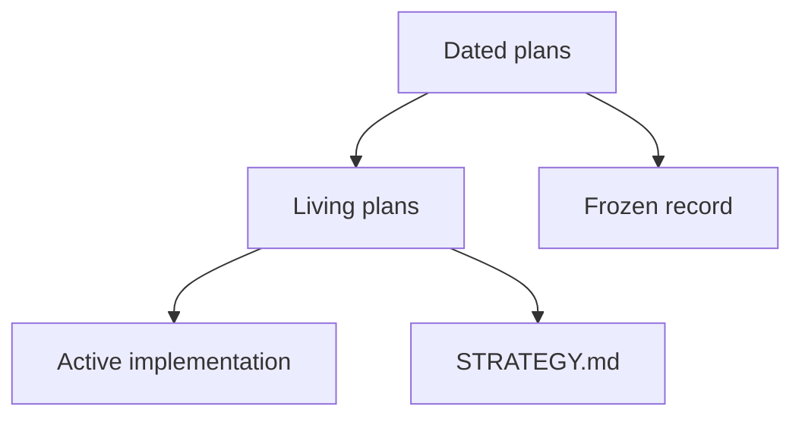

# Plans

Operator docs start at [README.md](../../README.md). Strategy: [STRATEGY.md](../../STRATEGY.md). This folder is implementer history, not a second user manual.

## Living

Update these when the work they name changes:

| Plan | Role |
|---|---|
| [2026-09-08-0156-feat-recovery-pipeline-ladder-plan.md](./2026-09-08-0156-feat-recovery-pipeline-ladder-plan.md) | Recovery ladder (STRATEGY `active_living_plan`) |
| [2026-09-08-0225-feat-portable-signatures-phasor-export-plan.md](./2026-09-08-0225-feat-portable-signatures-phasor-export-plan.md) | Portable signatures + Phasor hook-pack export |
| [2026-07-24-perf-recovery-one-shot-living-plan.md](./2026-07-24-perf-recovery-one-shot-living-plan.md) | One-shot perf backlog G14–G16 |

The 2026-08-30 corpus living plan is historical. Do not rewrite its deltas.

## Current docs work

| Plan | Role |
|---|---|
| [2026-09-01-feat-user-facing-docs-consolidation-plan.md](./2026-09-01-feat-user-facing-docs-consolidation-plan.md) | Landing / how-to / hub rewrite (done on disk) |
| [2026-09-01-feat-secondary-docs-surfaces-plan.md](./2026-09-01-feat-secondary-docs-surfaces-plan.md) | TOOLS_LIST preamble, STRATEGY/VISION, skills, hubs, Web UI hero |
| [2026-09-01-feat-agent-internal-docs-plan.md](./2026-09-01-feat-agent-internal-docs-plan.md) | AGENTS / GEMINI / CLAUDE / tests / examples / prototype and audit hubs |

## Frozen

Every other file in this tree is a **dated record**. Do not rewrite it to match today's clone URL, tool counts, or fixture names. Product stems and session paths in those files are historical evidence, not current how-to.

New work gets a new dated plan. Do not run a repository-wide substitution script over this folder.
