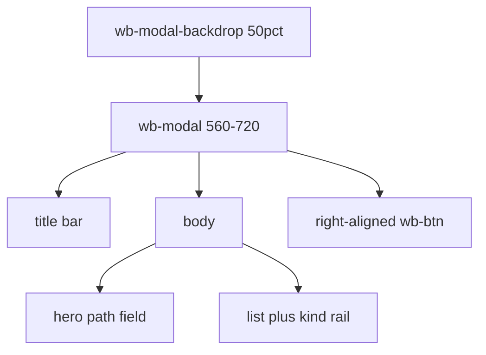

# Dialogs stylesheet report

**Status:** done  
**File written:** `src/agentdecompile_recovery/corpus/dashboard/static/workbench-dialogs.css`  
**Scope:** CSS only. JS and other CSS untouched. No commit.

## What changed

`workbench-dialogs.css` owns Open / Save As / Confirm chrome and overrides card-like rules in `workbench.css` (8px browse tiles, 12px drop banner, warm drop colors).

| Class / id | Treatment |
|---|---|
| `.wb-modal-backdrop`, `.wb-confirm-backdrop` | 50% dim, `--z-modal` |
| `.wb-modal` | 560–720px, radius 0, raised panel |
| `.wb-modal-head` / `.wb-modal-close` | 28px title bar, square close |
| `.wb-modal-foot`, `.wb-confirm` | right-aligned `.wb-btn` row |
| `.wb-open-paste`, `#wb-open-paste` | hero: 32px mono sunken field |
| `.wb-dialog-tabs` | underline tab strip, not pills |
| `.wb-drop` | dashed inset, ~36px, not a banner |
| `.wb-browse` / `.wb-browse-list` / `.wb-browse-item` | sunken list, radius 0, 3px kind rail |
| `#wb-save-as-form`, `#wb-shared-form`, `.wb-bin-form` | stacked fields in the modal |
| `.wb-confirm-dialog` | narrower alertdialog; danger keeps `.wb-btn.danger` |

Kind rails: `gpr` / `project-dir` → `--kind-gpr`; `shared-fs` → `--kind-shared-fs`; `binary` / `kind-bin` → `--kind-bin`. Tokens only (no new hex except the existing danger border already used by `.wb-btn.danger`).

## How verified

- Markup in `workbench-app.js` (`Modal`, `ConfirmDialog`, Open / Save As) matches selectors.
- Stylesheet is already linked after `workbench.css` in `workbench.py`.
- No automated visual test in this commission.

## Deviations

None. Confirm modal is narrower than 560px so an alertdialog does not look like a file chooser.

## Findings / risks

`workbench.css` still contains the old browse-card and drop-banner rules. This file must stay later in the cascade. `styleKind()` maps `project-dir` to `kind-bin`; rail also keys `data-kind` so project dirs stay blue.
