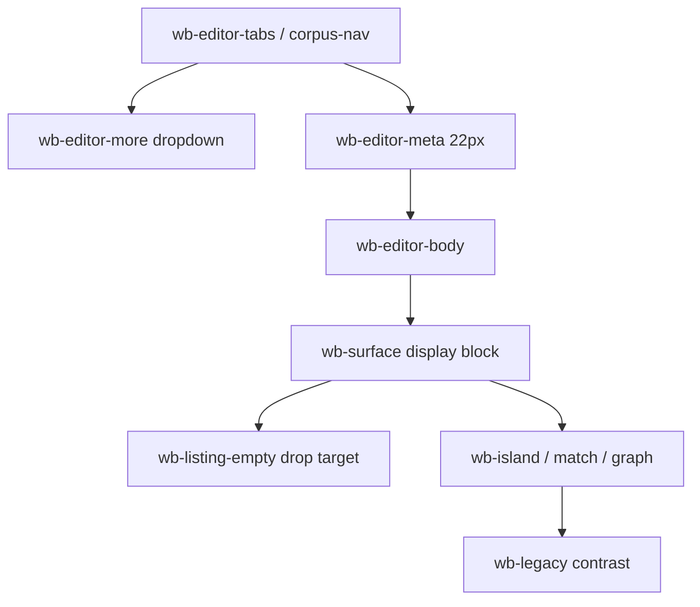

# Editor stylesheet report

**Status:** done  
**File written:** `src/agentdecompile_recovery/corpus/dashboard/static/workbench-editor.css`  
**Scope:** CSS only; JS and other widget files untouched; no commit.

## What changed

| File | Rationale |
|------|-----------|
| `workbench-editor.css` (new) | Token-based editor chrome: IDA-flush tabs (`--bg` + inset `--accent` bar), raised More menu (`--z-menu`, `--wb-raise`), 22px meta strip with wrapping `.wb-project-path`, drop-target empty listing (no card), listing/reaction `.wb-preview`, islands `min-height: 16rem` + `--fg-body`, `.wb-legacy` contrast so embed HTML is not white-on-white. |

## Critical constraint

`.workbench-page .wb-editor-body .wb-surface` is `display: block`. No `display: none` on `.wb-surface`. Surface heads stay hidden (tabs own the title). Legacy chrome chrome-hide is limited to known embed chrome selectors, not surfaces.

## How verified

- Read brief, design spec, tokens, controls, `CorpusNavBar` / `renderEditorBody` markup.
- Grep of written CSS: `display: none` only on tab marker, surface-head, and legacy chrome; not on `.wb-surface`.
- Broader pytest not run (stylesheet-only; `test_workbench_css_phase_c_batch` still reads `workbench.css`).

## Deviations

None. Layout remains in `workbench.css`; this file overrides visuals after it in the link order.

## Findings outside scope

- `workbench.css` still carries duplicate editor rules (hex tab bg, More z-index 30). Cascade is safe because `workbench-editor.css` loads later.
- Link tag already present in `workbench.py`; not edited.

## Risks / follow-ups

- Compact-density padding on `.wb-surface` still lives in `workbench.css`.
- Isolated `wb-graph-island` (no `wb-island` class) is styled via the shared island selector.
