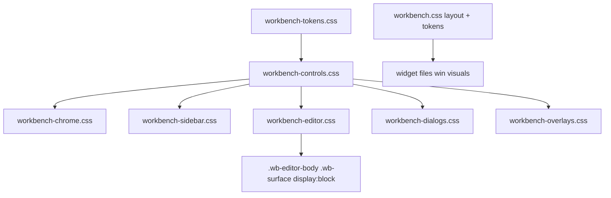

# Mediator report — workbench control system

Date: 2026-08-31  
Scope: `workbench.css` layout-only neutralization + hex→token drift in widget CSS. No JS. No commit.

## Status

DONE

## What changed

### `workbench.css` (kept; layout + page tokens)

Neutralized leftover SaaS/card rules that fought the widget files. Did not delete the file. Kept: `100vh` / flex shell, `#wb-root` overflow, app-shell / toolbar / workspace grid columns, body token block (including `--sel: #214283` for existing CSS tests).

| Leftover | Neutralization |
|---|---|
| Rounded browse cards (`border-radius: 8px`, wrap `auto-fill` grid, warm hex fill) | Column list, radius 0, transparent |
| Wrapping program / source grids (`minmax(14rem)` / `16rem` cards) | Column flex, no wrap; project children no card chrome |
| Pill buttons (`.wb-server-btn` / `.wb-probe` / `.wb-kind` / dual-bar `999px`) | Radius 0 |
| `@media 720px` `.wb-func-row { 1fr }` (collapsed address list) | Keep `1.35rem 7.5rem 1fr` |
| `@media 1100px` toolbar `1fr` (stacked chrome) | `auto 1fr auto` |
| `.wb-tab-chip { display: none }` | Removed (chrome owns chips) |
| Warm orange `#d07a3a` / `#1a1815` overlays | Tokens (`--accent`, `--sel`, `--bg-*`) |
| Palette / toast / action-strip / drop / ingest radii 8–12px | Radius 0 |

`.workbench-page .wb-editor-body .wb-surface { display: block }` remains (never `display: none`). Same rule is restated in `workbench-editor.css` (loads later).

### Widget hex drift

| File | Change |
|---|---|
| `workbench-controls.css` | `#fff` / `#3d66b0` / `#5a89d8` / `#b45348` → `--fg-max`, `--accent`, `color-mix` with `--danger` |
| `workbench-dialogs.css` | Confirm danger `#fff` / `#b45348` → same tokens |
| chrome / sidebar / editor / overlays | No invented hex (already token-only) |

`workbench-tokens.css` still defines `--wb-hover` / `--wb-press` as hex; that is the token owner.

## How verified

- Grep: no `8px`/`10px`/`12px`/`999px` radius and no `repeat(auto-fill` in `workbench.css`.
- Grep: no raw `#hex` in the five exclusive widget files + `workbench-controls.css`.
- `uv run pytest tests/test_dashboard_flow_ui.py::test_workbench_css_phase_c_batch -q` (must keep `1.35rem 7.5rem 1fr`, `#214283`, `wb-func-check`, `wb-sel-chip`, `wb-editor-tabs`).

## Deviations

None from the mediator brief. `workbench.css` still contains visual leftovers on unowned/legacy islands (ingest hex accents, tool-list hover, probe status colors). Those were not named as undo-ers of the new widget kit; only conflicting owned-widget rules were stripped.

## Findings outside scope

- `pages.py` / `atlas_server.py` / `unified_pages.py` still link **only** `workbench.css` (no widget cascade). Headless/unified pages will not get the new kit.
- `.wb-empty` / `.wb-chip` primitives in the spec are still thin in `workbench-controls.css`.

## Risks / follow-ups

- Cascade still depends on `workbench.py` order (layout → tokens → controls → widgets). Equal-specificity leftovers in `workbench.css` are now aligned, so order flips are less damaging.
- No browser render in this commission.

## Uncertainties

- Whether unified/atlas pages should adopt the widget links (out of scope).
