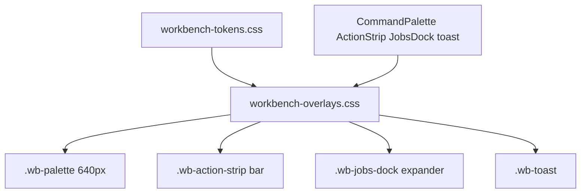

# Overlays stylesheet report

**Status:** done  
**File:** `src/agentdecompile_recovery/corpus/dashboard/static/workbench-overlays.css`  
**Scope:** overlays CSS only. No JS, no other CSS, no commit.

## What changed

Wrote the exclusive visual owner for palette, action strip, jobs dock, and toast. Rules consume `--wb-*` / surface tokens; no new hex. Same class names as `workbench-app.js`.

| Widget | Styled | Feel |
|---|---|---|
| Palette | `.wb-palette-backdrop`, `.wb-palette`, `.wb-palette-input`, `.wb-palette-section`, `.wb-palette-item`, `.active`, `.wb-palette-kbd` | Centered 640px, radius 0, kicker `h3`, `--sel` active row, `--z-palette` |
| Action strip | `.wb-action-strip`, `-head`, `-btns`, `.wb-tool-form`, `.wb-tool-field` | Flush context bar under chrome; danger = top rail, not a card |
| Jobs dock | `.wb-jobs-dock`, `-head`, `-body`, `.wb-job-row`, `.wb-job-log`, `.wb-job-cancel` | 22px idle expander; log pane when `.open`; rail layout unchanged |
| Toast | `.wb-toast` | Bottom-right, radius 0, `--z-toast`, sits above dock; pointer-events none |

## Honesty / no false match

- Dock header `.wb-hint` (“A finished job is not a match.”) uses `--fg-max`, not dim-on-dim.
- Finished job status (`.st-done`, `.st-finished`, `.st-complete`, `.st-ok`) is `--fg-head`, not `--success`.
- Toast uses `--bg-raised` / `--fg-max`, not success-green.

## How verified

- Markup walk of `CommandPalette`, `ActionStrip`, `JobsDock`, toast in `workbench-app.js`.
- Grep: every brief class is present in the new file.
- No pytest for CSS-only; `workbench.py` already links `workbench-overlays.css` last.

## Deviations

None vs brief. Also styled `.wb-jobs-dock-toggle` and `.wb-job-list` (present in markup, required for dock rows).

## Findings outside scope

- `workbench.css` still has older rounded/card overlay rules (560px palette, `#1a1815` dock, 8px toast). Overlays file loads after and should win; layout-only cleanup of those blocks is another owner.
- Jobs-rail position (`left/right/width`) remains in `workbench.css`.
