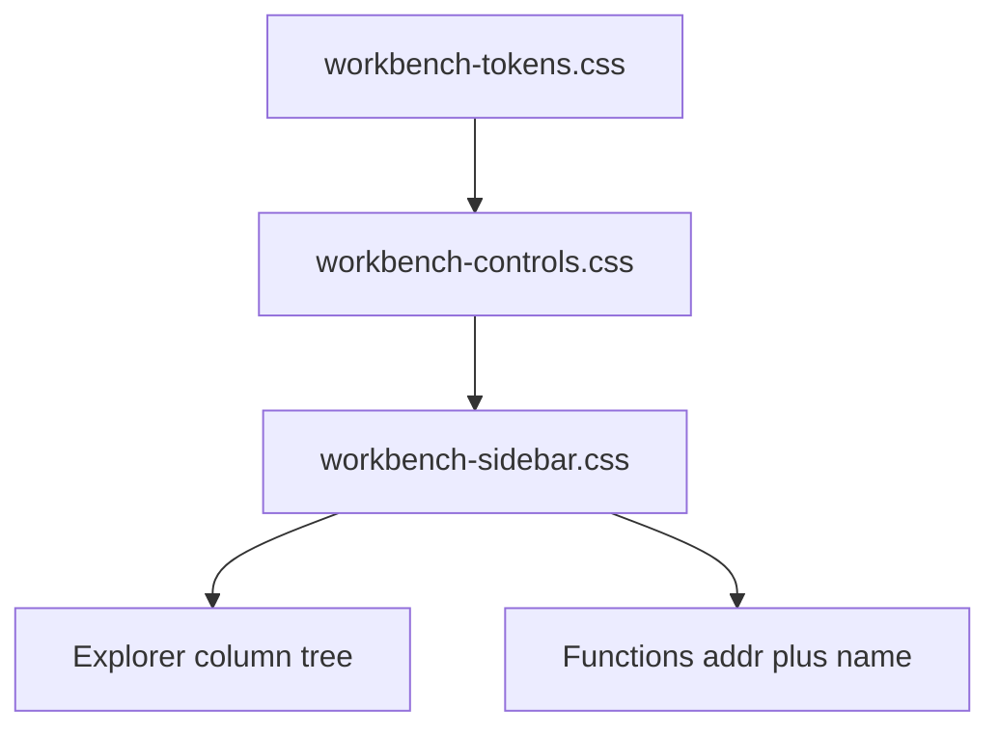

# Sidebar stylesheet report

**Status:** done  
**File written:** `src/agentdecompile_recovery/corpus/dashboard/static/workbench-sidebar.css`  
**Scope:** stylesheet + this report only. No JS, no other CSS, no commit.

## What changed

Overrides `workbench.css` leftovers that wrap explorer children as a card grid (`.wb-source-project .wb-programs` auto-fill columns, `.wb-source-grid` cards). Explorer is a single column: project root with kind-colored 3px rail, Imports kicker first, then import/program rows at 22px. Selected rows use `--sel`; hover `--wb-hover`; focus the shared 2px `--focus` ring.

Functions are IDA-like rows: checkbox, tabular mono `code` in `--addr`, name in `--fg-max`, height 22px. Hover / checked / selected (`on`) stay distinct. Empty explorer (`.wb-empty`) and function hint (`#wb-func-window .wb-hint`) are centered muted copy. Mobile override keeps addr+name columns instead of stacking.

## How verified

File written and class coverage checked against markup in `workbench-app.js` (`#wb-sidebar`, `#wb-binary-list.wb-source-tree`, `.wb-func-row` + `code`/`span`). CSS-only; no runtime suite for this slice.

## Deviations

None. Tokens only — no new hex except kind accents already defined.

## Findings outside scope

Widget CSS is already linked from `workbench.py`. Layout flex on `.wb-sidebar` remains in `workbench.css` (layout-only owner).
