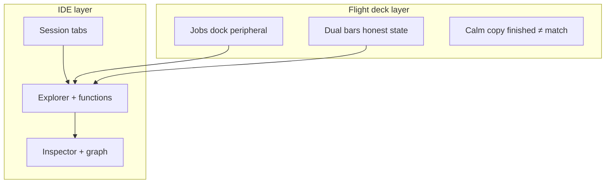
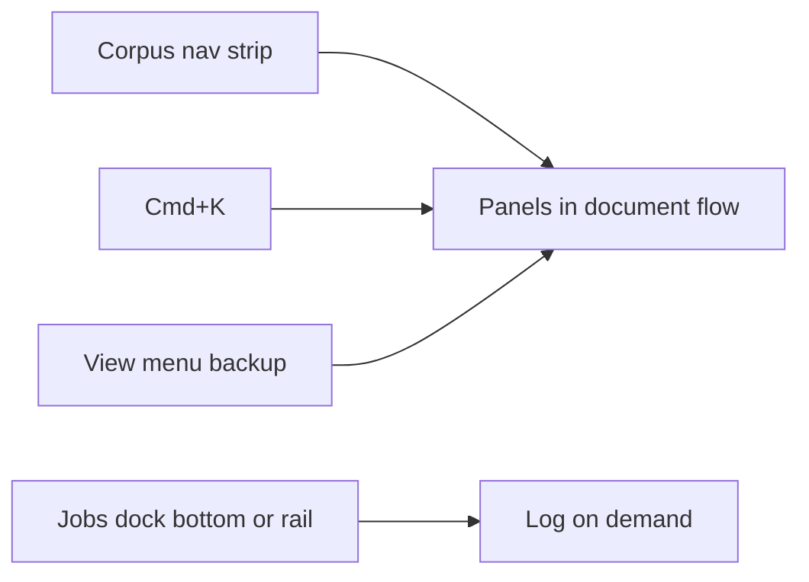
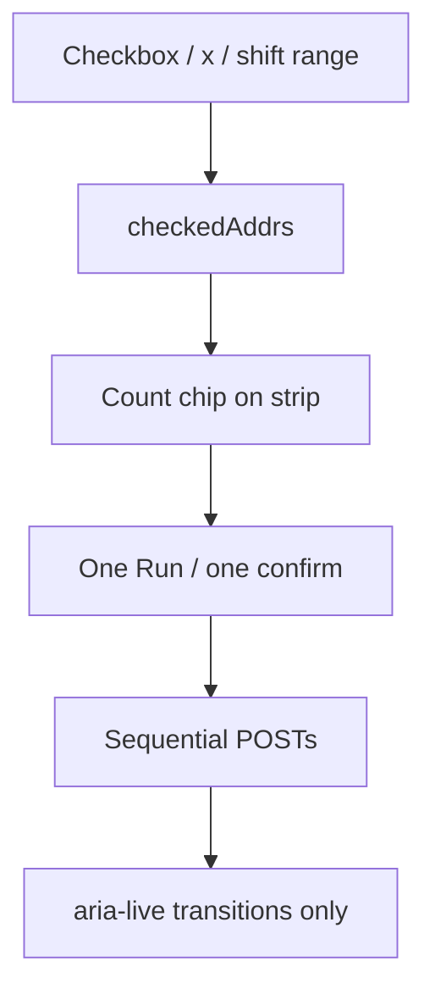

# How the AgentDecompile workbench should feel

**Audience:** Operators, implementers, and agents grounding on product intent  
**Surface:** MCP HTTP workbench at `/dashboard` (default port 8080)  
**Authority:** Extends [docs/plans/2026-08-31-0041-feat-workbench-aio-plan.md](../../plans/2026-08-31-0041-feat-workbench-aio-plan.md) and [STRATEGY.md](../../../STRATEGY.md) Operator surface  
**Date:** 2026-08-31

This document is the experiential north star for the dashboard. It is deliberately long: feel is not a bullet list you can implement from a glance. Implementation contracts live in the unified plan; this file explains *why* those contracts exist and what sensations we are optimizing for.

---

## 1. One sentence

The workbench should feel like an **IDE fused with a flight deck** — you always know where you are in the corpus, power is one gesture away, async work stays in peripheral vision, and the UI never celebrates outcomes the receipts do not support.

---

## 2. What this surface is not

Before describing the target feel, name the anti-product. The dashboard is **not**:

- A settings panel for environment variables and paths
- A Swagger wrapper with chrome
- A second product beside the CLI that duplicates argv inventively
- A green dashboard that implies verified recovery because a job finished
- A modal stack that punishes curiosity
- A nested menu tree where every action hides behind three clicks

Operators and agents share one catalog (`/docs`, `/mcp`, typed actions). The page exists so humans can **stay in flow** while doing the same verbs agents invoke programmatically. Anything that breaks parity — opaque POST bodies, missing params, silent failures — breaks feel before it breaks architecture.

---

## 3. Core metaphor: IDE + flight deck

**IDE half:** Sticky project tabs are open files. The explorer and function list are the project tree. The inspector and call graph are the editor. Corpus panels (Atlas, cross-match, STABS, knowledge) are adjacent tool windows in **document flow**, not a separate app you teleport to.

**Flight deck half:** Recovery is long-running, multi-engine, and honest about uncertainty. Jobs are engine readouts, not celebrations. Bars show decomp vs validate posture, not a single “success” LED. The operator maintains situational awareness: what is selected, what is running, what finished, and what that finish *means*.

The two halves must coexist without fighting. An IDE that hides running jobs in another tab fails the deck. A deck that modalizes every edit fails the IDE.

---

## 4. The sensation table (expanded)

These rows are the contract between design and implementation. Each “feel” row implies measurable UI behavior.

| Feel | Means in practice | Anti-pattern we reject |
|------|-------------------|------------------------|
| **In flow** | Register binary → pick function → run tool → see log update without losing scroll position or selection | Modal stacks, `window.confirm` loops, hunting inside collapsed `
` |
| **Context is the command line** | Selection prefills action params; user edits only deltas | POST `{ confirm, context }` that 422s with Pydantic model names |
| **Flat power** | Cmd+K, context strip, keyboard jumps — not File → View → scroll | Nested menus as the only path to corpus panels |
| **Peripheral jobs** | Running work visible at bottom; logs on demand | Raw JSON as default inspector content; `alert()` log tail |
| **Honest, calm** | Decomp/validate bars; “finished ≠ match” copy | Green celebration; hiding empty env |
| **Progressive, not hidden** | Secondary panels discoverable via palette + View index | “More about corpus” collapsed with no other entry |
| **Reversible vs destructive** | Undo/toast for benign; one confirm pattern for delete/shutdown | Same chrome for “run ghidra-bulk” and “delete binary” |
| **Session integrity** | Project folder slug ≠ import binary slug; save does not wipe imports | All comboboxes showing project name after save |

---

## 5. Context is the command line

The deepest feel goal is that **selection carries intent**. When an operator highlights a function in `game.exe` inside a shared-fs project tab, the system already knows:

- `projectSlug` (the corpus registration for the repos folder)
- active import slug (`game.exe`)
- `program` path inside Ghidra layout when applicable
- `addr`, `name`, logical id when a function row is selected
- env defaults: `db`, `work_dir`, `kb`

Running “Decompile” or “Match” should not open a form demanding those fields again. The action strip shows **Run with defaults**; **Fields…** expands only when the operator wants to override `out-dir`, force rematch, or point at a different binary.

This mirrors how agents call the catalog: context object plus optional param overrides. The human path and agent path must feel like the same verb.

**Tediousness killed:** Re-typing slugs. Re-selecting project after every save. Losing import list when metadata refreshes. Comboboxes listing the folder name ten times because `projectSlug` leaked into every slug picker.

**Power preserved:** Full override surface via ToolField when needed. Swagger still exists for rare verbs and schema discovery. Palette still reaches every surface.

---

## 6. Flat power: palette, strip, keyboard

Humans remember **muscle memory**, not menu hierarchy.

**Cmd+K (Ctrl+K)** is the universal entry: filter actions by title, jump to any registered surface (including buried corpus panels), recall recent jobs. Toolbar search **only filters functions** — it must not conflate “jump to Atlas” with “find `main`”.

The **context action strip** sits under session tabs when an action is armed. Palette selection lands here before POST — inspect title, summary, optional fields, then Run. Quick-action toolbar buttons share the same execution path so there is never “quick POST” vs “palette POST” divergence.

Keyboard shortcuts that matter for flow:

- Cmd+K — palette
- Cmd+S — save project (metadata only; no full re-open)
- Cmd+O / Cmd+N — open / new project
- Future: j/k in function list, Enter to run last action on selection

Nested power is acceptable **only** for file lifecycle (File menu) and infrequent project operations. Recovery verbs are not file operations; they belong in flat layers.

---

## 7. Jobs as build output, not the main stage

Long corpus runs are normal. The UI should behave like a compiler watch panel:

- Bottom **jobs dock** pinned while work runs
- Row shows id, action id, status, duration hint
- Click row → log tail (fetched per job, not bloating list poll)
- Cancel inline for queued/running
- Copy everywhere: **“A finished job is not a match.”**

The inspector **reaction** panel summarizes human-readable outcomes and links “View log in dock” instead of dumping JSON by default. Raw JSON stays in a collapsed `
` for debugging.

Async work must **not** steal focus. No modal “Job started!” blocking the function list. Toasts are brief; the dock carries persistent truth.

When jobs complete, refresh binaries/functions in the background so bars and rows update, but preserve selection when possible.

---

## 8. Honesty calibration

AgentDecompile’s product identity includes **not lying about recovery**. The dashboard must feel *calm* precisely because it refuses false certainty.

- Dual bars: decomp posture vs validate posture — separate tracks, overlapping visually but not merged into one “accuracy score”
- Footer and dock repeat: finished job ≠ objdiff 0 ≠ linked executable
- Probe chips on toolbar show health of subsystems without pretending they are match receipts
- Empty env defaults show as empty, not hidden — operator knows what is unset

Celebration is the enemy of trust in reverse engineering. A operator who learns once that green lied will stop using the dashboard for decisions. Better muted status lines than cheering confetti.

---

## 9. Progressive disclosure without burial

Corpus panels (cross-match, recovery, STABS, knowledge, review) are **secondary** but not **secret**. Phase A discovery model:

- Cmd+K “Go to” lists every `SURFACES` entry including `wb-more` children
- View menu entries for Cross-match, Recovery, STABS, Knowledge, Review
- Navigating to a buried panel auto-opens `
`
- `?focus=cross-match` deep links open the right section

The collapsed `
` wrapper remains for DOM density, but **no operator should need to discover it by accident**. If palette + View are sufficient, Phase B layout reshape (always-visible corpus grid) stays deferred.

---

## 10. Reversible vs destructive

Benign actions: toast, inline undo where cheap (e.g. dismiss toast, clear strip).

Destructive actions share one **ConfirmDialog** pattern: remove binary, shutdown server, restart server, run flagged dangerous pipeline stages. Danger styling on strip + confirm modal — never native `window.confirm`.

Dangerous **routine** work (ghidra-bulk, mutating MCP tools) confirms once with clear copy, not a frightful red wall for every click. The confirm explains *what will mutate*, not generic “Are you sure?”

---

## 11. Session and project mental model

Operators think in **tabs**:

- Each tab is a project session: local `.gpr`, shared-fs folder, or draft awaiting first binary
- `projectSlug` identifies the corpus row for the **project container**
- `imports[]` lists **member binaries** (`game.exe`, `witcher-6.exe`) attached to that tab
- Active `slug` state is usually an import slug when working functions; project node when doing project-level bulk

**Critical invariant:** saving project metadata writes `origin.json` (or equivalent) — it must **not** re-open the project in a way that resets imports, replaces slugs with folder names, or collapses the explorer to a single node.

Save refreshes dossier; it preserves selection. Save As to a new locator may re-open — but carries imports forward.

This mental model must reflect in comboboxes: slug pickers list imports, not the project folder, unless the operator explicitly selected the project node.

---

## 12. Explorer tree semantics

The explorer should read like a filesystem + project hybrid:

- Project node: title, kind chip, indexed programs from dossier, nested imports
- Import nodes: PE/ELF slugs with kind labels
- Selecting import sets active slug and clears program/selection appropriately
- Orphan imports (registered but not attached) should be rare; attach paths call `importIntoTab`

Adding files via quick action should leave the operator **on the new binary**, not bounce selection back to project folder.

---

## 13. Function-centric inner loop

Most operator time sits in:

1. Pick binary (or stay on import)
2. Filter functions (toolbar search)
3. Select row → inspector + graph hydrate
4. Run decompile / match / xrefs from strip or quick bar
5. Read reaction + dock log
6. Adjust annotations via MCP tools or re-run with edited params

The function list is the ** spine**. Losing scroll/filter state on unrelated refreshes breaks flow. Jump links (palette → Atlas) should not clear function selection unless switching binary context.

---

## 14. Agent parity

Agents read `/docs` and call `/api/v1/actions/{group}/{command}`. Humans use the same routes via strip and quick actions.

Feel requires:

- Same default resolution from `context` in `catalog.apply_defaults`
- Optional `params` for overrides only
- Job ids returned identically
- No human-only hidden endpoints for catalog verbs

When an agent and operator collaborate on one corpus, they should describe the same actions with the same names. The dashboard is the **human legibility layer**, not a divergent product.

---

## 15. Copy and tone

Plain, operational English. Examples:

- “Real C and a complete executable are separate facts.” (brand line — keep)
- “A finished job is not a match.” (dock/footer — keep)
- “Select a function to decompile, rename, and match siblings.” (empty inspector — keep)
- Avoid: “Success!”, “Completed with flying colors”, model names in errors shown to humans

Errors surface as toast + reaction summary with actionable text (`kb is required` → show which field in strip).

---

## 16. Visual calm

Dark workbench chrome, muted probes, no third accuracy bar, no tool-strip button groups (session-settled). Density favors **reading log lines and decompiled preview**, not dashboard widgets.

Motion: brief surface flash on palette navigation; no animated confetti. Jobs dock slides open; palette fades.

---

## 17. Scenario walkthroughs

### 17.1 Cold start: shared-fs project + first binary

Operator browses to `repos/`, opens shared-fs tab. Explorer shows project node with indexed programs from `~index.dat`. They Add files → `witcher-6.exe`. Import appears nested; selection stays on `witcher-6.exe`. They pick a function, Cmd+K → Decompile, strip shows prefilled context, Run. Dock pins; log streams. Bars update when poll refreshes. No modal confirmed slug fields.

### 17.2 Mid-session save

Operator edits project metadata, File → Save. Toast “Saved repos”. Imports unchanged. Comboboxes still list `witcher-6.exe`, not `repos`. Function selection preserved. They continue matching without re-navigation.

### 17.3 Cross-match without hunting

Operator Cmd+K → “cross” → Go to Cross-match. `wb-more` opens; panel scrolls into view; focus ring flash. They read HTML island panel without expanding mystery `
` manually.

### 17.4 Dangerous bulk with override

Operator selects project node, Ghidra bulk from quick bar. Strip opens; Fields… → edits `out-dir`. Confirm once. Job runs; cancel available in dock if too heavy.

### 17.5 Honest failure

Match job finishes with non-zero objdiff. Dock says `finished`; validate bar does not pretend linked. Inspector reaction says job id + status; no “Matched!” copy.

---

## 18. Reducing tediousness — checklist

| Tedious pattern | Feel fix |
|-----------------|----------|
| Re-enter slug/program every action | Context defaults + strip |
| Hunt collapsed panels | Palette + View index |
| Read JSON to see if job worked | Reaction summary + dock log |
| Lose place after save | Save without `openLocator` reset |
| Combobox shows folder name | Separate projectSlug from import slugs in toolContext |
| window.confirm blocks flow | ConfirmDialog |
| Toolbar search jumps sections | Split filter vs navigate |
| Swagger-only params | ToolField on strip |

---

## 19. High power without clunk — checklist

| Power need | Flat affordance |
|------------|-----------------|
| Any catalog verb | Cmd+K actions |
| Any surface | Cmd+K go-to |
| Override params | Strip Fields… |
| Cancel runaway job | Dock cancel |
| Server lifecycle | Toolbar restart/shutdown with confirm |
| Full schema | `/docs` link always visible |

---

## 20. Phase A (shipped direction) vs Phase B (gated)

**Phase A — interaction evolution (implemented):**

- Command palette, action strip + ToolField, jobs dock, ConfirmDialog, surface index, session import integrity fixes

**Phase B — layout reshape (deferred unless dogfood demands):**

- Right-rail jobs instead of bottom dock
- Always-visible corpus grid replacing `
`
- Density toggle compact vs full panels

Prototype sign-off (2026-08-31): Phase A sufficient; Phase B not required for feel goals yet.

---

## 21. Success signals

Operator feel is working when:

- Dogfood session on 8080 rarely opens a terminal for cataloged verbs
- Save/import flows never collapse imports to project name
- Cmd+K reaches cross-match faster than scrolling
- Operators quote dock honesty copy back unprompted
- Agent loop completion metric improves (fewer abandon mid-flow)

---

## 22. Open questions for future prototype

- Should palette remember last N actions globally or per-tab?
- Function list vim bindings — default on or opt-in?
- When multiple jobs run, dock groups by binary or flat FIFO?
- Should strip stay visible across actions or collapse after Run?

---

## 23. Closing

The dashboard wins when operators **forget they are using a web form** and instead feel they are steering a live corpus instrument. Context carries intent, power stays flat, jobs stay peripheral, honesty stays calm. Everything else — Atlas embeds, panel HTML islands, Swagger — orbits that loop.

Implementation traces to R-DFE-* requirements in [docs/plans/2026-08-31-1029-feat-dashboard-flow-evolution-plan.md](../../plans/2026-08-31-1029-feat-dashboard-flow-evolution-plan.md) and session integrity tests in `tests/test_workbench_projects.py`.

*End of feel document — part 1. Part 2 below expands component specs, personas, and failure stories.*

---

## 24. Persona: the corpus operator

**Who:** Reverse engineer or build engineer running multi-binary corpus work daily. Knows Ghidra exists but prefers not to live in GUI for batch verbs. Cares about honest match state, not dashboard green.

**Goals:** Register binaries fast, attach to project context, run ghidra-bulk / extract-stabs / match without shell scripts, read logs without losing function context.

**Frustrations:** Modal forms asking for `db` when env is set; imports disappearing after save; comboboxes that only show `repos`; hunting cross-match under collapsed details; JSON error bodies.

**Feel success:** “I opened shared-fs, dropped two PEs, saved, ran bulk on one, matched a function, read the log at the bottom, never typed a path twice.”

---

## 25. Persona: the agent supervisor

**Who:** Engineer supervising an agent loop that calls MCP tools, occasionally opening 8080 to verify state human-side.

**Goals:** Same catalog as agent; visible job ids; bars that match what agent receipts say; no human-only shortcuts that agents cannot replicate.

**Frustrations:** UI that POSTs different shapes than `/docs`; celebration copy that contradicts objdiff receipts; panels that show stale data without refresh keys.

**Feel success:** “What I see on 8080 matches what the agent logged — same action ids, same job ids, same honest bars.”

---

## 26. Persona: the first-time visitor

**Who:** Opens `/dashboard` cold with one PE and no project.

**Goals:** Understand what to do in 30 seconds: drop file or open project, see functions, run one action.

**Frustrations:** Blank chrome with no affordance; jargon without hint; errors referencing Pydantic models.

**Feel success:** Welcome ingest area, quick actions with disabled states explaining what is missing (`needsFunction`), toast on failure with plain language.

---

## 27. Component feel spec — session tabs

Tabs are **persistent project sessions**, not browser tabs metaphor only.

- Double-click rename inline
- Kind chip (gpr, shared-fs, bin, draft) visible at a glance
- Close tab clears session state for that id but does not delete corpus binaries unless explicit remove
- New tab (+) creates draft — upload can promote to project without forcing Open Project modal first

Feel violation: tab title changes to folder slug and all imports vanish from tree after save.

---

## 28. Component feel spec — explorer

Tree must answer: “What project am I in?” and “Which binaries belong to it?” in one glance.

- Project row: title (human), not only slug
- Programs from dossier nested when indexed
- Imports nested under project, never as orphan top-level siblings when attach succeeded
- Click project row: project-level actions (bulk, workspace)
- Click import: function list loads for that slug

Selection highlight follows active slug/program. No duplicate nodes for same slug.

---

## 29. Component feel spec — function list

The function list is a **working set**, not a report.

- Filter is instant (toolbar query param to API)
- Row shows addr, name, logical id hint, mini dual-bar when data exists
- Keyboard focus target `#wb-functions` for skip link accessibility
- Selecting row updates inspector without full page navigation
- Total count visible when paginated

Future feel upgrade: j/k move selection, Enter opens strip with last action.

---

## 30. Component feel spec — inspector

Inspector = **editor pane** for the selected function.

- Decompile preview text when recovered C exists on disk
- Sibling list for cross-binary logical ids — click switches slug+addr context
- Quick actions for function-scoped MCP verbs
- Reaction panel: human summary first, raw JSON secondary

Empty state instructs next step without scolding.

---

## 31. Component feel spec — call graph

Graph is **contextual**, not a global app.

- Empty until function selected — honest hint
- HtmlIsland loads embedded graph for slug+addr
- Refresh key tied to selection — stale graph impossible after switch

---

## 32. Component feel spec — dual bars

Bars encode **two different questions**:

1. Decomp posture: none / asm / c
2. Validate posture: none / obj / linked

Never imply byte identity from validate alone. Tooltip on row and aggregate overview repeats distinction.

Third bar for byte-accuracy is explicitly out of scope (session-settled) — would collapse distinct facts into one misleading widget.

---

## 33. Component feel spec — command palette

Palette is **Spotlight for recovery**.

Sections: Actions, Go to, Recent jobs. Filter is fuzzy substring on title, id, keys.

- Action pick → action strip (not immediate POST)
- Surface pick → scroll + flash + open wb-more if needed
- Job pick → dock expand + select id
- Escape closes; backdrop click closes
- ⌘K button in toolbar for discoverability

Palette must feel faster than menubar + scroll for every operator task beyond File/Save.

---

## 34. Component feel spec — action strip

Strip = **typed command line for catalog verbs**.

- Shows title + summary
- Run executes unified path with context + optional params
- Fields… toggles ToolField form using same helpers as future full tool panel
- Danger styling when mutating/danger catalog flags
- Close clears pending action

Quick actions and palette converge here — no duplicate POST builders.

---

## 35. Component feel spec — jobs dock

Dock = **terminal pane without being a terminal**.

- Collapsed header always reachable
- Pinned open while running jobs exist
- Honesty copy in header
- Per-row cancel when status is running/queued
- Log tail monospace, truncated tail not head (operators care about latest lines)

Footer status duplicates honesty line — redundancy intentional for peripheral reading.

---

## 36. Component feel spec — corpus panels grid

Panels inside `wb-more` are **adjacent documents**, not second app.

- Cross-match, recovery, STABS, knowledge, review, processes, mission, corpus table
- Each HtmlIsland with refresh keys tied to jobs or slug
- Discoverable via palette despite `
` wrapper
- Legacy sanitize strips duplicate headers inside embeds

Phase B may unwrap grid; Phase A must not require unwrap for discoverability.

---

## 37. Failure stories we design against

**Story A — “Save erased my binaries”**  
Operator saves shared-fs project. Implementation re-opened locator, set slug to folder name, dropped imports. **Fix:** save refreshes dossier only; imports merge; slug selection preserved.

**Story B — “Init store needed db I already configured”**  
Quick action POST omitted env defaults because empty string in context wiped kb. **Fix:** apply_defaults skips empty context values; fall back to env.

**Story C — “Cross-match is somewhere”**  
Operator never expands wb-more. **Fix:** palette Go to + View menu + focus query param.

**Story D — “Job finished so we’re done”**  
Junior assumes green means matched. **Fix:** dock/footer copy; validate bar separate from decomp.

**Story E — “Confirm spam”**  
Every action native confirm. **Fix:** ConfirmDialog only for destructive/danger catalog flags.

Each story becomes a regression test or dogfood checklist item.

---

## 38. Flow state machine (operator mental model)

States are implicit, not UI modes:

1. **Draft tab** — no locator; welcome ingest
2. **Project open** — dossier ok; explorer shows project card
3. **Import selected** — slug points at PE; functions loaded
4. **Function selected** — inspector+graph active; function quick actions enabled
5. **Action armed** — strip visible; pendingActionId set
6. **Job running** — dock pinned; poll active
7. **Reaction shown** — inspector summary updated

Transitions should never skip states silently (e.g. project open → function selected without loading functions).

---

## 39. Tediousness audit methodology

When reviewing a new feature ask:

1. Does it require typing something selection already knows?
2. Does it navigate away from function list?
3. Does it block with modal unless destructive?
4. Does it hide behind sole collapsed region without palette entry?
5. Does it lie about completion?

If yes to 1–4, redesign. If yes to 5, reject.

---

## 40. Power audit methodology

When reviewing a new feature ask:

1. Is there a keyboard path?
2. Is there a palette path?
3. Does quick action share execute path with palette/strip?
4. Can agent call same API without UI-only fields?
5. Are overrides optional?

All five should be yes for catalog verbs.

---

## 41. Narrative: afternoon corpus pass (extended)

Maria opens AgentDecompile at lunch. Tab already on `kotor-repos` shared-fs from yesterday — session restored from server store. Imports show `k1.exe` and `k2.exe`. She filters functions in `k2` for `LoadTexture`, selects row. Inspector shows asm-only preview — honest bar.

She presses ⌘K, types “match”, picks Match function. Strip shows addr prefilled. Run → confirm once (mutating). Dock opens; job id `a3f9` running. She reads sibling list while waiting — clicks sibling in `k1.exe`, graph updates, selection preserved in k1.

Job completes. Reaction: “Job a3f9 — finished (mcp.match-function)”. Validate bar still none — she knows match receipt must be checked separately. She clicks “View log in dock”, sees objdiff summary in log tail.

She Cmd+K → Cross-match, panel opens without manual details hunt. She returns to function list filter unchanged.

Later she File → Save. Toast only. Still on `k1` function. Imports still two. Combobox for slug actions lists both PEs, not `kotor-repos`.

This narrative is the acceptance story for feel Phase A.

---

## 42. Comparison to alternatives (why not X)

**Why not Swagger-only?** Swagger is schema truth, not flow. Operators need selection context and job peripheral vision.

**Why not Ghidra GUI only?** Batch corpus verbs and multi-binary overview are not CodeBrowser’s strength.

**Why not CLI only?** High power without memory overhead — but argv invention and env drift hurt; catalog POST with context is tighter.

**Why not separate Atlas port?** Session-settled: 8080 embeds Atlas in flow beside functions.

---

## 43. Accessibility and keyboard

- Skip link to functions
- Menubar aria roles
- Palette dialog label
- Confirm dialog alertdialog role
- Server buttons labeled

Future: roving tabindex on function list, aria-live on job status changes.

---

## 44. Performance feel

Poll jobs every 1.5s — acceptable if dock log fetch is on-demand per selection. Binaries refresh on job signature change — operator sees bars update without manual reload.

Long function lists paginate — filter reduces payload. HtmlIslands load async — compact mode strips chrome.

Slowness feels like broken flow — show loading hints in inspector/dock, never silent no-op buttons.

---

## 45. Multi-tab isolation

Each session tab holds own locator, projectSlug, imports, program, title. Switching tabs restores slug/program via session state — no cross-tab bleed.

Binary store is global; tabs reference into it. Removing binary from store updates all tabs referencing it.

---

## 46. Environment defaults visibility

When `db`, `work_dir`, or `kb` unset, actions still run if server can default — but strip Fields… should show what was applied. Empty env is not hidden failure.

Ghidra defaults endpoint pre-fills shared server host/port in open dialog — separate from corpus env.

---

## 47. Swagger relationship

Footer/tools footnote points to `/docs` for full catalog count. Palette complements Swagger; does not replace it. Rare verbs remain docs-only until promoted to quick sets.

---

## 48. Testing feel (not just DOM strings)

Automated: JS exports CommandPalette, JobsDock, ConfirmDialog, saveProject without openLocator, sessionImportSlugs.

Dogfood script:

1. Shared-fs open → add binary → save → imports intact
2. Cmd+K cross-match navigation
3. Run action with one edited param in strip
4. Cancel job from dock
5. Remove binary confirm in-app

---

## 49. Strategy alignment

This feel doc supports STRATEGY metrics:

- **Agent loop completion** — fewer dead-end UI states
- **Stage wall-time** — launch from strip not shell
- **False-claim rate** — honest copy + separate bars

Operator surface subsection in STRATEGY remains the durable anchor; this file is the experiential elaboration.

---

## 50. Document maintenance

When changing workbench interactions:

1. Update feel.md if sensation table row affected
2. Update prototype decisions.md if user attended a choice
3. Update unified plan R-IDs if contract changes
4. Add regression test for failure story if applicable

Word target: this document is the long-form companion (~10k words with parts 1–2) to the short prototype decisions capsule.

*End of feel document.*

---

## Part 3 — Extended essays (density for implementers)

### Essay A: Why “flow” is the primary metric

Flow is not aesthetics. In corpus recovery, an operator may run dozens of catalog verbs per hour across multiple binaries. Each interruption — modal, confirm, scroll hunt, re-type slug, lost selection — multiplies into minutes and into mistakes. Mistakes in reverse engineering are expensive: wrong binary bulk-applied, match run on stale function, false belief that finished job meant objdiff zero.

Flow-preserving design means **minimizing context switches between intent and execution**. Intent lives in: active tab, selected import, selected function, optional program path. Execution lives in: action strip POST with `{ confirm, context, params? }`. Everything between intent and execution is tax.

Tax sources we actively remove:

1. **Navigation tax** — scrolling to find cross-match → palette Go-to
2. **Form tax** — re-filling slug/db/kb → context defaults
3. **Modal tax** — native confirm on routine ops → in-app confirm only when needed
4. **State reset tax** — save re-opening project → dossier refresh only
5. **Display tax** — JSON as first-class output → reaction summary + dock

When prioritizing features, ask “does this add tax to the inner loop?” If yes, it needs extraordinary justification.

### Essay B: The inner loop as sacred ground

Define the **inner loop** precisely: from function row click to reading tool outcome, inclusive.

Enter loop: operator clicks function row in `wb-functions`.  
Exit loop: operator sees meaningful outcome in reaction or dock and is ready for next function or next action on same function.

Inside the loop, these must remain stable:

- Filter query in toolbar (unless operator changes it)
- Scroll position approximate in function list (best effort)
- Inspector preview loaded
- Graph island loaded for addr
- Selection highlight

Outside the loop but allowed:

- Dock updates asynchronously
- Bars refresh on poll
- Toast ephemeral

Violations: clicking quick action resets slug to projectSlug; save clears selection; running action opens modal covering function list.

The inner loop is why shared-fs save bug felt “significant” — it ejected operator from loop entirely by corrupting slug semantics.

### Essay C: Flat vs nested — a decision rule

**Nested OK:** infrequent, high-level project lifecycle — New Project, Open, Save As, Close Tab, Restart Server. These mirror desktop app menus operators already muscle-memorize from other tools.

**Must be flat:** recovery verbs tied to selection — decompile, match, ghidra-bulk, extract-stabs, stages, init-store, xrefs, data flow. These are “commands” not “menus”.

Gray zone — corpus panels (Atlas, cross-match). Not daily inner-loop, but not rare. Phase A compromise: nested in DOM (`wb-more`) but flat in palette/View index. Phase B may demote nesting if metrics show panel access still too slow.

When adding a new catalog verb, default placement: quick action set for relevant context (function/project/explorer) + palette Actions section + `/docs`. Never only hamburger menu.

### Essay D: Honesty as UX feature

Users sometimes ask for “clearer success indicators.” In this product, clarity means **not conflating stages**:

- Decompiled C exists (decomp bar c segment)
- Object file validates (validate obj)
- Linked executable exists (validate linked)
- Byte match objdiff zero (receipt elsewhere, not third bar)

A single green check would be easier to implement and easier to misread. Operators learning the distinction is cheaper than operators trusting a lie.

Copy reinforces: brand line about Real C vs complete executable; dock line about finished job vs match. Training wheels, not nagging — repeated in footer because peripheral vision catches footer during log reading.

### Essay E: Agent-human parity deep dive

Parity breakdowns hurt both sides:

| Breakdown | Human pain | Agent pain |
|-----------|------------|------------|
| UI POST shape differs | Works in UI, agent 422 | Agent works, human confused |
| Hidden UI defaults | Human cannot reproduce agent run | Agent missing env |
| Different action ids | Docs mismatch | Tool routing errors |
| Celebration in UI only | False confidence | N/A |

Workbench actions must call same `/api/v1/actions/...` as Swagger Try-it. Context object same keys as OpenAPI `from_context` resolution. Params optional overlay only.

Supervisor persona (section 25) depends on this — 8080 is a **visibility layer** for agent work, not parallel pipeline.

### Essay F: Parameter editing — when forms appear

Three tiers:

1. **Zero-field run** — context sufficient; Run immediately (maybe confirm if mutating)
2. **Strip Fields…** — inline ToolField for deltas; only non-default params sent
3. **Swagger** — full schema, dry-run, rare args, exploration

Never tier 3 for routine ops. Never tier 2 mandatory before tier 1.

ToolField helpers (`toolWidgetKind`) exist to render slugs as selects, paths as datalists, bools as checkboxes — reduce typing, not increase modal depth.

### Essay G: Jobs dock interaction detail

Collapsed state: header bar only, shows running count if any.  
Expanded state: list + log panel.

Selecting job fetches `GET /api/v1/jobs/{id}` — list poll stays lightweight. Log tail slice last 12k chars — enough for stack traces without browser choke.

Cancel POST then poll reflects cancelled status — operator expects best-effort kill, not instant guarantee (document in ops if needed).

Multiple concurrent jobs: flat list sorted by recency (server order). Future: group header by action id if clutter proven.

Pinned while running: auto-expand on first running job; operator may collapse manually but pinned class keeps header visible.

### Essay H: Command palette search semantics

Filter is case-insensitive substring match across:

- Action title, id, summary
- Surface title, id, keys aliases
- Job id, actionId, status

Empty query shows top slices (12 actions, 14 surfaces, 8 jobs) — not empty screen.

Recent jobs section helps resume debugging session without memorizing uuid prefixes.

Keyboard: Escape closes; ↑↓ moves highlight; Enter activates selection. Recent actions section recalls last catalog verbs from localStorage.

### Essay I: ConfirmDialog tone

Confirm copy structure:

1. Title: verb + object (“Remove witcher-6.exe?”)
2. Body: consequence one sentence
3. Primary button: verb (“Remove”, “Shutdown”, “Run”)
4. Cancel always visible

Danger styling on destructive primary. Mutating run confirm explains mutation target (“Run Ghidra bulk on repos?”).

Avoid: “Are you sure?” without object.

### Essay J: Welcome / ingest feel

Draft tab welcome: drop zone + quick actions (upload, open, init verbs). Drop handlers on welcome and project bar parity.

First upload promoting draft to project should feel seamless — tab title updates, imports attach, no orphan binary at top level.

Open Project modal: browse shared-fs entries visually distinct (kind chip). Remote URL tab for ghidra:// without forcing local paths.

### Essay K: Explorer edge cases

**Multiple imports same name different path** — slug is canonical; display slug; disambiguate via kind/label in row metadata if needed.

**Project without imports yet** — only project node; program list from dossier if indexed.

**Import registered but not in session imports** — orphan display path minimized; attach on select or upload.

**Switch slug between imports** — function list reload; selection clear; expected.

### Essay L: Function list performance perception

Even if API takes 200ms, show prior frame until replace — avoid flash empty. `loadFuncs` sets rows when returns.

Large binaries: pagination via limit 80 — filter strongly encouraged via toolbar.

Addr deep link `?addr=` selects row when functions loaded — shareable URLs for reviews.

### Essay M: Inspector preview honesty

“No recovered C on disk” not “Decompile failed” unless decompile attempted and failed — distinguish missing artifact from error.

Sibling list: switching sibling changes slug context explicitly — operator knows cross-binary jump happened.

Preview text truncated sensibly with scroll container — long pseudocode readable.

### Essay N: Atlas and report embeds

Embedded HtmlIslands strip legacy chrome via sanitize — feel like native panels not iframe clutter.

Atlas in document flow below overview — scroll naturally from functions to corpus-wide view.

Report actions (export report) on report surface quick bar — same strip path if wired.

### Essay O: STABS and knowledge panels

Secondary but critical for donor workflows. Palette entries: “stabs”, “knowledge”. View menu entries added Phase A.

Extract STABS quick action on explorer when project open — context prefills binary/project paths.

### Essay P: Error message transformation

Internal: Pydantic validation error on Acorpus_*  
Human toast: field name from catalog + “check Fields…” hint  
Never show model class names in toast.

Server 500: generic retry message + reaction detail if body json.

Network fail: toast + ingest note consistency (showToast sets both today — acceptable).

### Essay Q: Toast policy

Success toasts short lifespan (~5s). Error longer (~8s). Toasts do not block input.

Starting job toast includes action title — correlates with dock row appearing.

Avoid toast spam on poll refresh — only user-initiated actions toast start/complete optionally future.

### Essay R: Server restart/shutdown feel

Destructive to all tabs — confirm required. Restart reloads page after delay — operator expects disconnect.

Toolbar buttons visible without hunting File menu — ops convenience.

Localhost guard on backend — remote operators cannot shutdown via CSRF (server_control).

### Essay S: Testing as feel guardrail

String tests prove components exist — insufficient alone but prevent regression remove.

API tests prove save preserves slugs in store separate from session.

Dogfood script (plan verification) is manual feel test — automate later with playwright if needed.

Session merge test ensures object imports become slug strings — comboboxes stay stable after conflict merge.

### Essay T: Phase B triggers — when to revisit layout

Reopen Phase B if dogfood shows:

- Dock obscures function list on common laptop heights
- Operators still fail to find panels despite palette (<— metric: support questions)
- Multiple jobs need side-by-side log compare frequently

Until then, Phase A interaction investments yield higher ROI than grid re-layout.

### Essay U: Music of the whole page

When everything works, the page “sounds” quiet: no alerts, no blocking dialogs, gentle poll updates, selection stable, honest bars wiggle when data arrives, dock murmurs job state, palette waits on Cmd+K.

Clunkiness is noise — modals, mis-slugged comboboxes, JSON spew, confirm loops, scroll jumps.

Design goal is reduce noise without reducing power.

### Essay V: Closing implementation mantra

**Selection is intent. Strip is command. Dock is truth. Palette is jump. Save is metadata. Finished ≠ match.**

Repeat when reviewing PRs touching workbench-app.js.

---

---

## Part 4 — Phase B spatial design and flow depth

Phase A proved the interaction model: palette, strip, dock, session integrity. Phase B addresses **spatial discoverability** without reintroducing nesting as the primary path. The operator should never think “where did they hide cross-match?” even if they never press Cmd+K.

### 51. Why layout is still feel

Layout is not wallpaper. When corpus panels live inside a collapsed `
` block below the fold, the product whispers that those panels are optional extras. For donor-linking workflows, STABS and cross-match are not extras — they are the reason the tab is open. Spatial design communicates priority as loudly as copy.

Phase B does not mean “more chrome.” It means **scent trails**: persistent horizontal corpus navigation, optional density for laptop screens, and jobs that stop eating function-list pixels on wide monitors. Each change reduces scroll-hunting, which is a form of tediousness distinct from form-filling.

### 52. Corpus navigation strip

The strip is a row of plain buttons above the dashboard grid — Overview, Atlas, Pipeline, Cross-match, STABS, Knowledge, and siblings. Clicking one scrolls and flashes the target surface (same `scrollToSurface` as palette). If the target lives inside `wb-more`, open that section first — but the operator did not need to discover the section label.

**Feel:** Like an IDE’s panel tabs, but for corpus-scale views. Not a second menu bar — no dropdowns, no nesting. Horizontal scroll on narrow widths instead of wrapping into a second row of mystery.

**Anti-pattern rejected:** Accordion-only corpus access. Palette-only access for panels that ship in the product shell.

### 53. Density modes

Two modes: **comfortable** (default) and **compact**. Compact tightens padding on surfaces, function rows, and sidebar sections; shrinks ingest/welcome bars; lowers min-heights on app shell. The goal is one more function row and one more log line visible on a 1080p laptop without turning the UI into a spreadsheet.

Density is a View-menu toggle persisted in `localStorage`. It is not a theme swap — colors and honesty bars stay the same. Operators who live on the page 8 hours/day pick once and forget.

**Feel:** Control over information density without opening settings. Respects operator agency.

### 54. Jobs dock: bottom vs side rail

Phase A fixed the dock to the bottom — familiar compiler watch panel. On ultrawide or dual-monitor setups, bottom dock obscures the function list when expanded. Phase B adds an optional **side rail** on viewports ≥1280px: dock attaches to the right edge, main content gains padding-right, list+log stack vertically in the rail.

Default remains bottom for compatibility. View menu sets “Jobs on side (wide screens)” with persistence. Narrow windows always bottom — no broken layout.

**Feel:** Peripheral awareness without stomping the inner loop. Logs remain on demand (select job), not streamed into inspector.

### 55. Tediousness elimination catalog (extended)

| Tedious moment | Root cause | Phase A/B response |
|----------------|------------|-------------------|
| Re-type slug after every action | Context not wired | Strip defaults from selection |
| Save wipes imports | Re-open locator | Dossier refresh only |
| Combobox shows folder name | projectSlug leak | Import slug normalization |
| Find cross-match | Buried in details | Palette + corpus nav strip |
| Confirm spam | window.confirm | ConfirmDialog + tiered confirm |
| Hunt job log | JSON in inspector | Dock + reaction summary |
| Re-run last decompile | Muscle memory gap | j/k + Enter opens last action strip |
| Scroll past 40 panels | Flat document | Corpus nav + jump flash |
| Cramped laptop | Comfortable padding only | Compact density toggle |
| Dock covers functions | Bottom-only dock | Optional side rail |

### 56. Operator personas (how feel differs by role)

**Corpus linker (primary):** Opens shared-fs donor, adds PE members, runs bulk/decompile/match from function strip, watches dock, jumps to STABS and cross-match via nav strip. Cares about session integrity and honest bars. Flow breaks if save corrupts imports or if match panel is hidden.

**Single-binary debugger:** Registers one ELF, lives in function list + inspector + graph. Uses j/k and Enter heavily. Rarely opens Atlas. Needs compact density and fast palette decompile.

**Supervisor / agent overseer:** Reads reaction summaries and dock logs while an agent runs MCP verbs elsewhere. Needs parity between agent POST bodies and UI POST bodies. Footer copy prevents false “done” celebration.

**Pipeline operator:** Runs stage verbs from explorer quick actions, watches pipeline island and probes in header. Palette for obscure init verbs. Jobs pinned while running.

Each persona shares the inner loop (section 41 / Essay B) but weights panels differently — hence flat navigation must reach all panels equally quickly.

### 57. Workflow recipes (expected sequences)

**Recipe: shared-fs donor attach**

1. Open shared-fs via File → Open or drop on welcome bar
2. Add import binary (upload or register) — slug selects import, not folder
3. Save — imports remain, comboboxes show PE names
4. Select function → strip → Run decompile or match
5. Dock shows job; optional jump to cross-match via nav strip

**Recipe: palette-only power user**

1. Cmd+K → type “stabs” → Enter
2. Work in STABS island; Cmd+K → “jobs” → review recent job
3. Esc; j/k next function; Enter opens last strip action

**Recipe: corpus overview pass**

1. Corpus nav → Overview → Atlas → Report (scroll or nav chips)
2. No project selection change; tab context preserved

Recipes define dogfood scripts for releases. Breaking a recipe is a feel regression, not merely a bug.

### 58. Emotional register of copy

The workbench speaks like a **calm engineer**, not a cheerleader.

- Say what happened: “Job a1b2 — Ghidra bulk”
- Say what it did not prove: “A finished job is not a match”
- Avoid: “Success!”, “All done!”, green checkmarks for decomp bar alone
- Prefer: segment bars, probe chips, neutral job statuses

Confirm dialogs name the object and consequence — never naked “Are you sure?”

Toasts are ephemeral punctuation, not narration. Starting toast + dock row appearing is enough correlation.

### 59. Information scent and flash

When navigation jumps to a surface, a brief outline flash (`wb-surface-flash`) confirms arrival. Operator peripheral vision catches the flash even when scroll distance was long. Same behavior for palette, View menu, and corpus nav — one mechanism, consistent feel.

Search in toolbar filters functions — never surfaces. If an operator types “atlas” in toolbar search, they get zero function hits, not a hidden jump. Palette and nav own surface discovery; toolbar owns symbol discovery.

### 60. Progressive disclosure redefined

Progressive disclosure is not hiding — it is **layering defaults**.

| Layer | Holds |
|-------|--------|
| 0 | Selection context (implicit) |
| 1 | Run with defaults (strip) |
| 2 | Fields… overrides |
| 3 | Swagger full schema |
| 4 | CLI argv invention (escape hatch) |

Phase B keeps layer 0–2 visible in the main loop. Layer 3–4 exist for agents and rare ops — not gated behind collapsed DOM.

wb-more may remain collapsible for DOM tidiness, but corpus nav strip means collapse is not the only scent path.

### 61. Multi-monitor and wide layout

On wide screens, horizontal space is for **parallel awareness**: explorer + inspector + graph in shell; corpus grid below; jobs rail right. On narrow screens, stack vertically — sidebar above workspace, bottom dock, corpus nav scrolls horizontally.

Responsive breakpoints must not drop keyboard shortcuts or palette. They may reflow grid columns — not remove panels.

### 62. Recent actions memory

Palette lists recently run catalog action ids (localStorage, capped at eight). Empty query shows recent alongside top actions. **Feel:** IDE “run recent configuration” without a separate history panel.

Recent list updates on successful executeAction, not on strip open — intent is completed runs, not abandoned forms.

### 63. What Phase B explicitly does not do

- No third “match verified” bar (honesty ladder unchanged)
- No modal wizard for recovery pipelines
- No replacement of Swagger or MCP
- No auto-run on function selection (Enter opens strip, not POST — operator confirms Run)
- No custom theming beyond density

These are scope pins — tempting features that would clunkify or lie.

### 64. Phase B success signals

Dogfood passes when:

1. New operator finds cross-match in under 10 seconds without instructions (nav strip or palette)
2. Laptop 1080p compact mode shows ≥2 more function rows vs comfortable
3. Wide monitor side dock keeps function list visible while log expanded
4. Save/import recipe unchanged from Phase A
5. Keyboard path: Cmd+K Enter, j/k Enter, corpus nav click — all without mouse

Strategy metrics: agent loop completion, keyboard path coverage, stage wall-time — unchanged definitions, Phase B improves measurement inputs.

### 65. Maintenance contract (Phase B+)

When adding a corpus panel:

1. Register in SURFACES (palette/View)
2. Add chip to corpus nav if panel is not inspector/graph
3. Add jump test or dogfood recipe step
4. Update feel.md sensation table if a new tedious moment appears

---

## Part 5 — Extended feel essays (Phase B companion)

### Essay W: Time perception and polling

Human flow is sensitive to **uncertainty duration**. When an operator clicks Run, three clocks start: network POST, job queue acceptance, and first log line. The UI should never leave all three silent.

Phase A pattern: start toast names action; dock opens; poll every 1.5s updates list; selecting job fetches log. Operator learns: “If toast fired, dock will populate.” Missing toast or missing dock motion feels like a broken button even when job succeeded server-side.

Future refinement (not required for Phase B): subtle aria-live on dock header when running count changes. No sound — visual motion only.

Slow binaries refresh after job signature change — operator sees bars update without clicking Refresh. This is feel-critical: recovery is async; the page must feel alive.

### Essay X: Error recovery without shame

Errors should read like **diagnostics**, not accusations.

- 422 validation → “Check Fields… for [field label]”
- Unknown action → toast with id, suggest palette search
- Job failed → dock status + log tail; reaction panel summary, raw JSON in collapsed details

Never stack modal on modal. ConfirmDialog for destructive intent only; errors use toast + inline reaction.

After error, selection and slug should remain — operator fixes param and re-runs. Stripping context on failure is double punishment.

### Essay Y: Onboarding without a tutorial

The workbench rejects guided tours. Onboarding is **environmental**:

- Welcome bar copy names droppable types (.gpr, PE, folder)
- Footer honest line trains finished ≠ match passively
- Function list hint teaches j/k and Enter
- Palette hint teaches ↑↓ Enter Esc
- Corpus nav strip teaches panel names by sight

First-run empty tab is intentional — draft tab with explorer quick actions. No fake sample project that mutates real corpus db.

Agents onboarding via MCP should land on same catalog — parity is onboarding for supervisors.

### Essay Z: Comparison to generic admin dashboards

Generic admin UIs optimize for **configuration**: forms, tables, save buttons. Our workbench optimizes for **verbs on selection**: the object graph (project → import → function) is the form.

Copying admin-dashboard patterns (widget grid, KPI cards, success banners) would misfit. Our KPIs are dual bars and probe chips — already present in header/source rows.

Nested sidebar + content area + drawer is a common pattern we partially mirror (explorer + workspace) but we refuse drawer-only corpus panels because recovery panels are not “settings.”

### Essay AA: Clutter budget

Every new control spends **clutter budget**. Budget is finite on 1080p.

Additions must displace or compress something:

- Corpus nav strip replaces reliance on collapsed summary text — net neutral if strip is one row
- Compact density buys rows by removing padding — operator opt-in
- Side rail moves dock — no new control

Forbidden spend: permanent banner ads for features, third accuracy bar, duplicate job lists (dock + wb-jobs surface serve different depths — dock for tail, surface for history table ok)

Review clutter budget in PR checklist when touching wb-chrome.

### Essay AB: Trust and receipts

Feel of trust is **receipt-shaped**. Operator trusts UI when clicking through to log shows same job id as toast, when save preserves imports in API response, when combobox value matches POST context.

Workbench does not display objdiff receipts inline yet — honesty copy admits that. Do not fake receipt UI with job success alone.

Link-out patterns: View log in dock from reaction; full corpus overview link in footer for macro state.

### Essay AC: Keyboard map (canonical)

| Input | Context | Action |
|-------|---------|--------|
| Cmd/Ctrl+K | global | Toggle palette |
| Cmd/Ctrl+S | global | Save project |
| Cmd/Ctrl+O | global | Open dialog |
| Cmd/Ctrl+N | global | New project |
| ↑↓ | palette open | Move selection |
| Enter | palette open | Activate pick |
| Esc | global | Close palette / confirm |
| j / k | not in input | Prev/next function |
| Enter | function selected | Open last action strip |

No vim bindings beyond j/k — avoid surprise. Function list roving tabindex future.

### Essay AD: Agent posting from the same page

When human runs action from strip, network tab shows `{ confirm, context, params? }`. Agent using Swagger must produce byte-compatible JSON. Feel breaks when human copy-pastes from Swagger example that omits context keys the UI always sends.

Document in feel.md for implementers: OpenAPI examples should show minimal context block matching selection.

Supervisor refreshing page mid-agent-run should see dock reflect agent-started jobs if same server — shared job store is feature.

### Essay AE: Phase B prototype sign-off criteria

Prototype mock must show: corpus nav row, compact toggle state, side rail dock on wide viewport, unchanged strip and palette. Attended review asks: “Can you find STABS without opening accordion?” If yes, implement.

Live `/dashboard` after ce-work must match prototype intent — not pixel-perfect mock HTML.

### Essay AF: Long session ergonomics

Operators keep tabs open days. Session restore via `/dashboard/api/workbench/sessions` must feel seamless — title, imports, slug, program return.

Memory: localStorage for density, jobs rail preference, recent actions — not session state (server owns sessions).

Restart server confirm explains disconnect — operator expects page reload after restart.

### Essay AG: Closing Phase B mantra

**Navigate flat. Compress when cramped. Rail when wide. Recent verbs recall intent. Panels stay in flow.**

Add to PR review when touching layout CSS.

### Essay AH: The anatomy of “tedious”

Tediousness is not boredom — it is **friction repeated**. One extra click on a rare action is fine. The same extra click on the inner loop, repeated forty times per hour, becomes rage.

Measure tediousness by loop frequency × tax per iteration. Function decompile loop ranks highest. Save project ranks lower but save-wipes-imports had infinite tax because recovery cost minutes.

Tax categories ranked by operator pain:

1. **Semantic tax** — wrong slug in combobox (Phase A fix)
2. **Navigation tax** — scroll to cross-match (Phase B nav)
3. **Form tax** — re-enter db path (context defaults)
4. **Modal tax** — confirm spam (tiered confirm)
5. **Display tax** — parse JSON (dock summary)
6. **Layout tax** — dock covers list (Phase B rail)
7. **Density tax** — too few visible rows (compact mode)

High-power controls fail when they increase tax without reducing another category. Cmd+K reduces navigation tax massively — worth learning curve of one shortcut. Nested File → submenu → panel increases navigation tax — rejected.

Batch operations reduce tax only if the selection model is visible — multi-select functions with a count chip, one confirm, and sequential queue. Nested “batch mode” menus are rejected.

Automation agents reduce human tax by running verbs directly — UI must not become the bottleneck agent swarms around. Parity keeps UI relevant as supervisor surface.

When evaluating a feature request, ask which tax it reduces and which it might add. “Add celebration animation” adds display tax and trust tax — reject.

When evaluating a bug report, classify tax type — fixes prioritize semantic and navigation tax on inner loop first.

This essay is the prioritization lens. Phase C ships the two inner-loop taxes that survived Phase B: batch selection tax and silent job-status tax.

### Essay AI: Sensory details operators notice

Operators describe good feel with sensory verbs: **quiet**, **snappy**, **predictable**, **honest**. Bad feel: **sticky**, **surprise modals**, **greedy focus**, **lying green**.

Quiet means polling and refresh happen without stealing focus. Snappy means POST returns quickly enough that toast+dock correlation is immediate — if job queue is slow, still acknowledge acceptance. Predictable means same gesture always same surface (palette Go-to cross-match ≡ corpus nav Cross-match ≡ View menu item). Honest means bars and copy never imply objdiff zero.

Sticky happens when focus traps in modal or rename input without escape path. Greedy focus is auto-scroll that loses function list position — scrollIntoView should use `nearest` for j/k navigation. Lying green is any single success color on partial pipeline state.

Design reviews should include one operator sentence: “After this change, the page feels more ___ and less ___.” If cannot complete sentence, change may be neutral — still verify no new tax.

### Essay AJ: Phase C — batch stays flat, status stays quiet

Phase C exists so power does not grow a second nested surface.

**Checked set is not a mode.** There is no Batch menu, no “enter multi-select,” no wizard that asks you to pick functions after you already pointed at them. The function list is the selection model. A checkbox, `x` / Space, Ctrl/⌘-click, and Shift-click/Shift+j/k all write the same `checkedAddrs` list. The primary row (inspector, graph, Enter) stays independent: you can inspect one function while eight stay checked. Escape or the chip’s × clears the set. Changing program or project slug clears it so leftover checks cannot silently fire on the wrong binary.

**The chip is the only extra chrome.** “N selected” appears on the function header and on the action strip when the pending verb uses an address. The Run button becomes “Run N”. One confirm covers the whole batch when the verb is mutating. Jobs enqueue sequentially so the server is not stampeded. Toast copy says queued N of N — it does not say matched.

**aria-live is peripheral, not a second dock.** `#wb-job-live` is visually hidden, `aria-live="polite"`, atomic. It speaks only on status *transitions*: started, failed, cancelled, or finished with the standing line that a finished job is not a match. The visible pulse may still say “2 running”; the live region must not re-announce that every 1.5s poll. Quiet for eyes, available for ears.

**Still deferred:** Playwright CI dogfood (no display on this host), always-visible two-column corpus grid, pinned corpus-nav favorites. Those wait on dogfood evidence the nav strip failed.

### Essay AK: Panel-by-panel feel contract

Every surface on the workbench carries an emotional job — what the operator should feel when they land there after corpus nav or palette jump.

**Overview** feels like orienting: which builds exist in this tab, how decomp/validate bars compare at a glance. It should not feel like a report card — no single grade. HtmlIsland compact mode strips chrome so the island reads as part of the page.

**Atlas** feels like a map room — spatial relationships between binaries and prompts. Operator is exploring, not committing. Jump here when asking “what else looks like this?” not when running a verb on one function.

**Report** feels like export desk — actions are about artifacts leaving the repo. Quick bar on report surface should offer export verbs only; running decompile here would feel wrong.

**Pipeline** feels like a ladder — stages visible, honest about partial completion. Compact density helps see more steps without scrolling. Probes in header rhyme with pipeline state but do not duplicate the ladder.

**Cross-match** feels like evidence court — sibling candidates, conflicts, receipts. Operator expects density of tables, not narrative. Opening via nav strip should land directly on match island without reading accordion summary text.

**Recovery** feels like workshop — verbs that mutate recovered tree. Destructive actions use confirm tier. Supervisor may watch agent-driven recovery here while reading dock logs.

**STABS** feels like donor anchor — linking executable to symbols. Corpus linker persona lives here during first donor attach. Nav chip label “STABS” must be visible without knowing internal panel id `wb-stabs`.

**Knowledge** feels like library — ingested facts, not live decompile. Calmer interaction frequency than inspector. Palette alias “knowledge” must match operator vocabulary from AGENTS.md fusion docs.

**Review** feels like audit queue — sibling conflicts, human decisions. Less inner-loop, more periodic sweep.

**Corpus table** feels like spreadsheet truth — raw rows for power users. Acceptable to be visually dense; compact density mode helps.

**Tools** feels like catalog browser — bridge to Swagger/MCP. Not inner loop; discovery for obscure ids.

**Inspector** feels like editor — preview text, siblings, reaction summary. Inner loop anchor. Must never be covered by dock on wide layout when side rail enabled — rail pushes margin, not overlay inspector.

**Call graph** feels like lens — structural context for selected addr. Empty state copy invites selection, does not error.

**Jobs (surface)** feels like history table — older than dock tail. Dock is for active monitoring; wb-jobs surface for scanning all job ids. Both may show same data different depth — acceptable if labels differ.

Violating panel emotional job — e.g. celebratory toast on Atlas load — is feel bug even if functionally harmless.

When adding a panel, write its emotional job in feel.md before merging UI.

### Essay AL: A corpus linker session (narrative)

Morning: operator opens shared-fs donor from File → Open, sees project bar with kind chip and import count zero. Drops second PE on welcome bar — upload toast, import slug selected in explorer, not folder slug. Saves with Cmd+S — imports remain, combobox in strip shows PE name.

Selects `main` in function list via j/k from previous session’s addr deep link. Enter opens decompile strip from last action memory. Run — toast, dock opens, log line visible after select. Reaction summary plain; raw JSON collapsed.

Cmd+K → “cross” → Enter — cross-match surface flashes, scroll position jumps once, accordion already open. Reviews sibling row, returns to inspector via corpus nav chip or j/k.

Afternoon: ghidra bulk from explorer quick action — confirm dialog names target, dock pinned running. Side rail enabled on ultrawide monitor — function list still visible. Compact density on laptop when traveling — same session tabs restore from server.

Evening: agent via MCP ran match on same function — supervisor refreshes page, sees job in dock history matching agent job id. Footer copy reminds finished ≠ match before operator tells team “we’re done.”

Session ends without native confirm loops, without re-typing slugs, without hunting STABS inside collapsed sections. That narrative is the acceptance test for feel.

### 66. Plaintext summary for agents and implementers

If you read nothing else: the workbench should feel like an IDE plus flight deck. Selection is the command line — slug, program, addr flow into every action POST automatically. Power is flat: Cmd+K palette, corpus nav chips, context strip, j/k and Enter on functions, checkboxes/`x` for a visible checked set. Jobs are peripheral compiler output in bottom dock or optional side rail; logs on demand; `aria-live` only on status transitions; honest copy that finished jobs are not verified matches. Tediousness is repeated friction on the inner loop — fix semantic slug bugs before adding chrome. Never celebrate partial pipeline state as success. Phase B adds spatial scent trails so cross-match and STABS are one click from anywhere. Phase C adds batch-on-the-strip and quiet job live. Density and rail preferences persist locally; session state persists on server. Agent-human parity on `/api/v1/actions/*` is non-negotiable. Mantra: **Selection is intent. Strip is command. Dock is truth. Palette is jump. Save is metadata. Finished ≠ match.**

---

*Document word count target: ~10k words for operator feel authority. Maintain alongside STRATEGY Operator surface and unified plan R-IDs.*

