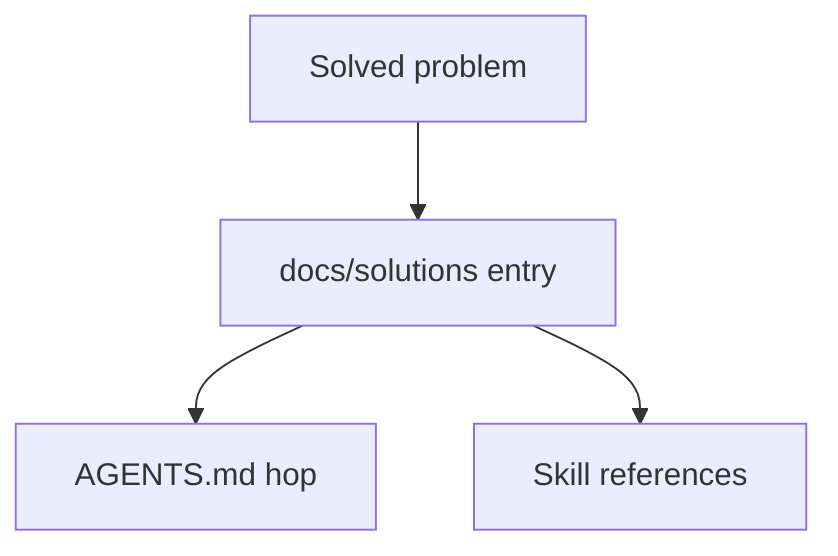

# Documented solutions

Searchable institutional learnings from solved problems. Each file uses YAML frontmatter (`module`, `problem_type`, `component`, `tags`). Search by module or tag before changing `src/agentdecompile_cli/`.

User how-to lives in [USAGE.md](../../USAGE.md). Vocabulary: [CONCEPTS.md](../../CONCEPTS.md). Plans hub: [../plans/README.md](../plans/README.md).



## Categories

| Directory | What is here |
|-----------|----------------|
| `architecture-patterns/` | Coordinators, claim tiers, MCP surface, tiered RE, decomp matching |
| `integration-issues/` | MCP session, Ghidra import, analysis gate |
| `developer-experience/` | CLI ergonomics for agents |
| `mcp-ghidra-integration/` | Shared check-in / local VC mirror |
| `tooling-decisions/` | Plugin packaging and similar |
| `workflow-learnings/` | Dated run receipts — historical, not current smoke how-to |

Dated `workflow-learnings/` files may name old binaries or work dirs. Leave them. Current reconstruct smoke is `docs/CRITICAL_PATH.md`.

Current advertised tool counts are computed from `src/agentdecompile_cli/registry.py` (see README / TOOLS_LIST preamble). Do not copy a number out of an old learning.

Run `ce-compound` after solving a non-trivial problem. Run `ce-compound-refresh` periodically.

Validate new frontmatter:

```bash
python3 scripts/validate-frontmatter.py docs/solutions/<category>/<file>.md
```
