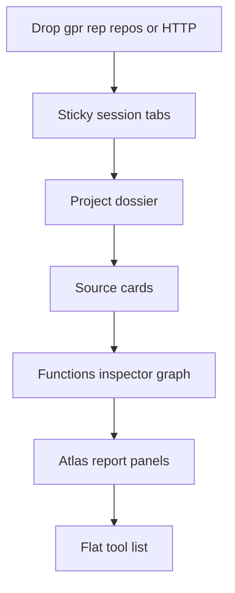

# Workbench AIO design

Canonical requirements live in [docs/plans/2026-08-31-0041-feat-workbench-aio-plan.md](../../plans/2026-08-31-0041-feat-workbench-aio-plan.md).

This file is the Superpowers spec pointer for the same Product Contract: one 8080 AgentDecompile React workbench, all current UI capabilities on screen, public CLI/MCP in Docs and on the page, drag/drop plus path-register plus confirm-remove, live jobs, Ghidra `.gpr` / `.rep` / filesystem shared-server `repos/` / `ghidra://` / `http(s)` ingest, sticky project session tabs, no 5173 restyle, no byte-accuracy bar.

