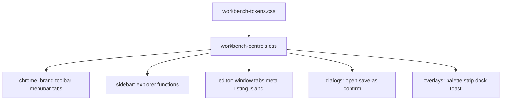

# Workbench control system

Date: 2026-08-31  
Surface: `/dashboard` workbench (`workbench-app.js` + static CSS)  
Feel: [dashboard-operator-feel](../../prototypes/dashboard-operator-feel/feel.md) — Ghidra CodeBrowser + IDA + Cheat Engine, cool gray, honest copy.

## Intent

The page already has the right *architecture* (one editor, explorer + functions, jobs peripheral). Individual controls still look like unstyled form chrome. This spec upgrades **every control** to a shared professional kit without inventing a second product.

## Approaches

| Approach | Trade-off |
|----------|-----------|
| **A. Token + primitive CSS files, widgets consume them** (chosen) | Parallel-safe. One look. Existing class names stay so tests keep passing. |
| B. Rewrite to a component library (Radix/etc.) | Heavy, breaks the no-build React+htm bundle. |
| C. Per-widget one-off restyles | Fast locally, visual drift in a week. |

## Tokens (mediator)

Owned by `workbench-tokens.css`. Widgets may **use** variables; they must not invent new hex colors except kind accents already defined.

- Surfaces: `--bg`, `--bg-panel`, `--bg-raised`, `--bg-sunken`
- Type: 11 / 12 / 13 / 15 px; `--font-ui` / `--font-mono`
- Focus: 2px `--focus` ring, offset 0 inside chrome
- Radius 0 (tool, not SaaS card)
- Space: 4 / 6 / 8 / 12 / 16 px

## Primitives (`workbench-controls.css`)

Reusable classes (no new JS required):

| Class | Role |
|-------|------|
| `.wb-btn` / `.wb-btn-primary` / `.wb-btn.danger` | 24px min height, hover, focus, disabled |
| `.wb-field` | stacked label + control |
| `input, select, textarea` | inset sunken field, 1px border, focus ring |
| `.wb-tree` / `.wb-tree-row` | indent, selection `--sel`, kind rail |
| `.wb-chip` | tiny count, not a slogan pill |
| `.wb-kicker` | 11px uppercase section label |
| `.wb-empty` | centered muted empty copy |

## Widget files (exclusive owners)

| File | Widgets |
|------|---------|
| `workbench-chrome.css` | brand, toolbar search, menubar, session tabs, status bar |
| `workbench-sidebar.css` | explorer tree, imports, function list + checkboxes |
| `workbench-editor.css` | editor tabs, More menu, meta bar, listing, islands |
| `workbench-dialogs.css` | modal, browse grid, path field, save-as, confirm |
| `workbench-overlays.css` | palette, action strip, jobs dock, toast |

`workbench.css` keeps **layout only** (grid, 100vh, flex). Visual chrome moves to the files above when they override.

## JS constraints

- Keep IDs and test strings: `function CorpusNavBar`, `wb-corpus-nav`, `⌘K`, `wb-func-check`, `Filter functions…`, `wb-open-paste`, `Run Cross-place`, `A finished job is not a match`
- Do not commit
- Do not add Restart/Shutdown behavior
- Honest empty states; never green “matched”

## Success

A human operator can distinguish hover / select / focus / disabled on every control. Explorer reads as a program tree. Functions read as an address list. Dialogs look like Ghidra file dialogs, not Bootstrap cards.
