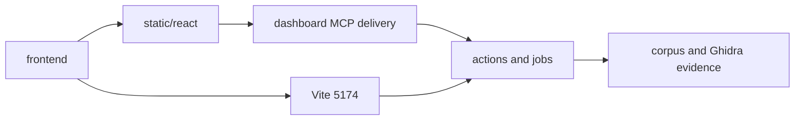

# React workbench and Atlas verification

This frontend work supports the KotOR recovery workflow. It does not establish complete source recovery or byte parity for the corpus.

## Delivery

The MCP server serves the built React workbench at `/dashboard` without Node. Vite binds strictly to port 5174 and defaults to the separate Atlas project-manager presentation. Both use the same Python APIs, action catalog, jobs, project state, evidence, Code Browser, and guide workflows. `?mode=workbench` and `?mode=atlas` explicitly select either presentation.

The [interface guide](../../src/agentdecompile_recovery/corpus/dashboard/frontend/README.md) maps the PyKotor Ghidra walkthrough to its controls. Advanced operations remain available through contextual forms and the complete catalog.

## Verification method

After the user's testing restriction, verification used inline terminal commands and inline Playwright against the real dashboard handlers. No saved test suites were run and no test files were created or modified. TypeScript production builds checked the compiled application. Browser receipts and screenshots are under `/tmp/wb-dogfood-fixes/`.

The runtime used a separate corpus snapshot and a copied analyzed Ghidra project, `KotorBrowserCopy.gpr`. The donor checkout was read-only. Its external dashboard and Atlas services remained available on ports 8791 and 5173.

## Observed workflows

- The copied K2 program exposed 22,502 stored functions without another analysis run.
- Both presentations rendered actual Ghidra source and instruction bytes. Source remained labeled advisory.
- Native provider checks exercised instruction navigation, function filters, type-use references, unreachable-code decompilation, and function properties. Explicit EAX return and stack parameter storage were applied to the copied project, read back, and restored to automatic storage.
- Browser checks exercised function selection, incoming/outgoing references, memory sections, signature/storage forms, guide chapters, contextual scripts, persistent Activity tabs, resizing, project/session restoration, batches, and recovery/export actions. Receipts retain failed checks and their subsequent observations.
- Atlas preserves an unsaved function/storage draft during background refresh. Loading changed recorded values requires an explicit discard; changing the target clears the previous target's draft.
- Native BSim generation produced 22,778 similarity signatures and committed them to the shared database. Signature count is separate from the function inventory count.
- An actual preparation retry reused five completed cross-build comparison receipts. These are matching evidence, not byte-verification receipts. Cancellation stopped only the validation coordinator and its active unfinished child.
- Installed-wheel checks rendered both presentations with Node absent from the server environment and imports resolved to the installed package. Actual corpus/function reads returned the copied K2 evidence. Assets had the expected MIME types and `nosniff`; missing assets and traversal attempts returned 404.

## Defects found and corrected

Live verification found script-result serialization and Ghidra project-URL errors in automatic preparation. The corrected path reused analyzed inventory and completed native BSim indexing.

A second server sharing a workspace exposed incorrect preparation ownership and duplicate admission. Preparation now holds an OS file lock for the coordinator lifetime and records its owner. Interrupted-state inspection does not overwrite another process's receipt. Installed-wheel verification was moved to its own runtime state.

Native script execution blocked the HTTP event loop during BSim work. Execution now runs on a worker thread with output routed to that script's capture. Cancellation waits for native execution to finish before releasing its invocation context. Review exercised repeated cancellation and independent output capture.

Contextual editing controls now expose their relevant name, prototype, type, or comment fields. Source navigation resolves an exact symbol before changing addresses; ambiguous names and local variables cannot silently become numeric addresses. Vtable browsing discovers candidates before reading slots and uses the active program's pointer byte order.

## Claim boundaries

Compilation and byte comparison were not established by opening a project, completing preparation, ingesting BSim signatures, or exporting a report. Missing toolchains and proof receipts remain explicit. The report export preserves recorded real-C classifications without promoting them to byte accuracy.

The installed-wheel build used an exact staged package snapshot because repository-wide setuptools discovery traversed the large vendor trees. Runtime dependencies came from the existing environment; this was not a fresh dependency-install audit.

Cross-build comparison completion receipts bind binary fingerprints and inventory counts. Same-count feature or label edits still require an explicit comparison action. Native Ghidra analysis can retain its own uncertainty about stack-slot reuse, inherited vtables, and unusual register preservation.

## NWN and additional KotOR inputs

The September 8 import batch registered 25 original files and imported 29 architecture-specific programs into `target/projects/NWN-KotOR-Corpus.gpr`. Four universal Mach-O files contributed eight slices. `target/imports/2026-09-08-nwn-kotor/analysis-inputs.json` records each original path, SHA-256, slice offset, size, and architecture. All 29 import jobs and the subsequent 29 local save jobs succeeded. These receipts establish import and persistence, not completed analysis or matching.

Inline Chromium checks found the NWN and additional KotOR entries in both the MCP-served workbench and Vite project manager without JavaScript page errors. The check exposed missing project bindings when navigating from the binary library; successful imports now retain their project and program locations independently of their original file paths.

A real Ghidra census contradicted the old analysis-complete status: the programs' persisted analyzed flags were false. The analysis gate had required `getAnalysisState`, which these ProgramDB objects do not expose, and treated unsupported observation as completed analysis. The gate now recognizes the actual Program API and reads `GhidraProgramUtilities`; idle detection uses `AutoAnalysisManager.isAnalyzing`. Import and analysis native work runs outside the HTTP event loop while retaining invocation locks through cancellation. Missing analysis must complete before feature inventories or BSim results are accepted.

No filesystem test suite was run or changed for this work. Validation uses inline commands, actual shared jobs, and Chromium interactions. Cross-build matches and source parity remain unproven for these new inputs until their corresponding stages produce evidence.

The first post-fix project preparation was correctly admitted as the same durable run by both UIs (HTTP 202), but stopped with partial results because the filesystem reader exposed Ghidra's mangled storage names instead of actual program names. Matching `NamingUtilities.demangle` fixed all 29 names against their live import receipts. This failure is preserved; it is not a successful analysis receipt. Project opening now also honors `openAllPrograms` and `analyzeAfterImport`, preventing an implicit full-project analysis from blocking HTTP while preparation is trying to inspect the project.

The corrected gate ran unforced analysis for both `KOTOR2` architectures. Ghidra then spent 641 seconds analyzing `KOTOR2sub` i386, exceeding the old 600-second RPC timeout. The native operation completed and its local save succeeded on retry. Import/analysis RPCs now allow 1800 seconds, and successful analysis saves through the owning `GhidraProject`. Twenty live health/jobs probes succeeded while a real analysis job ran (maximum combined request time 1.197 seconds). The larger corpus preparation and cross-matching are still pending; these observations are not a completion claim.

After restarting with the final fixes, a Vite retry admitted the same preparation ID. The backend reported reuse of completed analysis for `KOTOR2` i386, `KOTOR2` x86_64, and `KOTOR2sub` i386, then began `KOTOR2sub` x86_64. This verifies that three completed analyses survived reopening and were not repeated. The live run still has 29 total programs and pending feature, BSim, and comparison stages.

## Library identity and consolidated workspace follow-up

The binary library now supports row-click selection, keyboard selection, ranges in displayed order, filtered Select all, and project drop targets. Search and checked identities survive leaving the library. Per-row Explore buttons were removed. Import batches use the shared action catalog and retain fixed targets. A backend continuation waits for an existing preparation pass before admitting a pass for newly imported binaries.

SHA-256 canonicalization preserves original records, aliases, and project bindings. Identical bytes collapse in the library. Changed or unavailable source identity appears separately for resolution, rather than inheriting old analysis. A real FastAPI preview using the workspace database returned 33 binary rows with 33 distinct nonempty SHA-256 values and 23 unresolved records. Receipt: `/tmp/wb-dogfood-fixes/library-unique-hash-receipt.json`. This is library identity evidence, not recovery proof.

Variant groups use completed comparison receipts with matching fingerprints/inventory counts. Every pair in a suggested group must have at least 20 accepted matches and 20% accepted coverage on each build. This conservative display policy is advisory; missing comparison evidence is not evidence of unrelatedness. Existing sparse accepted matches do not establish the requested variant relationship yet.

Protection metadata separates detected, not detected, and unknown. Supported Steamless/UPX handling writes a derived copy and receipt. Mach-O encryption commands and existing PE detector evidence are inspected. Actual protected-image unpacking and shared-server import deduplication have not been verified live. Originals are retained.

The workbench now keeps Compare builds, Inspect, and Recover & verify in a single mounted document. View owns layout controls; old section IDs remain navigable through command search. Secondary commands remain in contextual Actions disclosures. Types, knowledge, and context are adjacent, and source/compilation/byte-proof claims remain separate. New layout defaults close the inspector, while saved operator preferences are retained.

Inline Chromium checks exercised both frontend modes: row/range selection, filtered selection, keyboard Space, persistence, drag confirmation, three document anchors, menu contents, command disclosure navigation, and action-dialog focus restoration. TypeScript/Vite build passed. No existing filesystem tests were run or test files changed. New native import behavior still requires live Ghidra validation after a safe server reload; the active analysis server was not interrupted for these checks.

## Import dialog and live progress review

The large-selection failure had two causes: the selected-file list was not a scrollable flex child, and a global footer height constrained the dialog controls. Add and Cancel now remain outside the scrolling body. Existing dialogs without the new footer property retain container scrolling.

Browser passes used the actual 81-entry library in Vite and MCP-served production assets. The Add control remained entirely inside the viewport at 1044×768, 320×568, and 522×384. The latter checks the CSS space corresponding to 200% zoom from 1044×768; actual browser zoom was not asserted. Tools and Create Project were separately checked at 320×568 so the fix did not merely move clipping to other dialogs.

Active import batches now show measured imported/total counts, queued/running/stopped counts, destination and current binary before opening per-item details. Recorded parameters/results and frozen-target retry remain available. Existing live batches (including 0/80 and 3/81 snapshots) survived page refresh. Adding an already-bound NWN2 launcher through the UI returned the existing-binding result without submitting another import.

Preparation appears before secondary overview metrics. It retains the applicable project-wide run while inspecting functions, distinguishes worker queues from execution, shows current operation/target and elapsed time, and uses indeterminate progress where no measured denominator exists. Current operations use readable labels such as Check existing analysis and Index functions and relationships. Import, analysis, similarity indexing, matching and byte proof remain distinct.

Independent polling was exercised with real preparation responses while the jobs feed was aborted, then restored. Preparation remained visible and the unavailable feed was labeled. A separate held-response pass rendered preparation in 2931 ms while jobs remained pending; the eight-second job timeout was reported without hiding preparation. Both passes had no page errors. A first navigation check used an overly strict button-name selector and timed out; the corrected accessible-name check passed.

Representative screenshots: `/tmp/wb-dogfood-fixes/progress-first-overview.png`, `progress-inspection-restored.png`, `import-existing-binding-reused.png`, and `import-progress-real-batches.png`. Final TypeScript/Vite build passed. No existing filesystem tests were executed or test files created/modified. Native protection and import changes still require a safe backend reload; active imports/analysis were not interrupted during these browser checks.

## Persistent explorer and entity activity

The persistent project/binary and function trees were exercised against the actual validation workspace in Vite 5174 and MCP production delivery 8767. An analyzed KOTOR2sub i386 selection exposed 15,639 functions. Search found the selected function, refresh restored its address, and both trees stayed mounted. Receipts include `/tmp/wb-dogfood-fixes/explorer-both-live-receipt.json` and `/tmp/explorer-browser-receipt.json`.

The minimum-width pass held an actual library response while activity updates continued. Add binaries remained inside the tree header in both presentations, and its dialog opened without page errors. Receipt: `/tmp/wb-dogfood-fixes/explorer-minwidth-heldread.json`. The first version of this browser harness failed during teardown because a held route still used a disposed context; waiting or removing pending routes corrected the harness.

A separate Chromium persistent context changed the actual browser zoom through `chrome://settings/appearance` to 200%. The target page measured devicePixelRatio 2, innerWidth 390 and outerWidth 780. Add binaries and its dialog remained visible. This supersedes the earlier equivalent-CSS-width-only observation. Receipt: `/tmp/wb-dogfood-fixes/explorer-zoom-receipt.json`.

Entity activity uses durable revisions and resumable events with a bounded polling fallback. Controlled transport-fault checks verified held snapshots, reconnect cursors, stale streams, and resnapshot after history reset. These are transport checks, not fabricated recovery measurements. Real project rows reported stage counts; unknown ETAs remained unknown.

Inline checks exercised cross-process batch admission, cancellation while a native child drains, project locator canonicalization, and shared MCP policy enforcement. Read-workspace-activity remains read-only; mutation admission through manage-workflow requires the configured mutation tier. Checks used actual ToolProviderManager call paths. No filesystem tests were executed or test files created or changed.

### Native project ownership findings

Opening a project repeatedly could lose track of the process's existing Ghidra handle and attempt to lock it again. Project handles now reuse canonical paths and reject closed handles. Actual native opens, switching, symlink aliases, and closed-handle reacquisition were checked in `/tmp/ghidra-owned-project-inline-ke51kol7`.

During an earlier maintenance drain, a JVM thread-print diagnostic crashed the JVM in its VM_PrintThreads operation. The process was allowed to exit fully; diagnostic and workflow receipts were preserved under `/tmp/wb-dogfood-fixes/maintenance-drain-20260908-113806`. Only maintenance-cancelled admissions were restored. Unsaved analysis was not claimed durable. Further JVM thread-print diagnostics were avoided.

A later live inspection found that session program aliases could still reference a program in the previously selected project. Explicitly requesting an NWN project returned a ProgramDB owned by the copied project. Automatic preparations were paused and native work drained before correction. Save failures and actual DomainFile locations are preserved under `/tmp/wb-dogfood-fixes/maintenance-pause-20260908-120243`. The isolation fix must be verified against actual DomainFile project locations before automatic mutations resume.

### Distribution boundary

An installed wheel was imported from `/tmp/wb-dogfood-fixes/wheel-installed` and its actual ASGI paths served bundled JavaScript, activity records, and safe asset errors without a Node server. The packaged protection normalizer was resolved from the installed package and inspected the supplied PE binary. These checks establish asset delivery and that packaged helper path; they do not establish a successful protected-image transformation or an entire installed recovery campaign. The final asset revision is recorded separately after rebuilding.

## Function map, scoring, and prompt workspace

Both presentations now include a native canvas projection, paged function scoring, and a prompt builder. The live KOTOR2sub i386 map rendered 12,000 sampled points from 15,639 recorded functions. It uses labeled PCA of measured structural features, not inferred semantic embeddings. The scoring thresholds came from those recorded metrics; missing or constant measurements do not receive invented ranks.

The coordinating browser pass recorded 33 purposeful checks without page errors: point selection, zoom and keyboard pan/reset, full-binary address search, empty search, score sorting and pagination, shared selection, prompt categories, operator notes, exact clipboard text, and exact downloaded text. Receipt: `/tmp/wb-dogfood-fixes/analysis-interactions-vite.json`. Static browser passes exercised the corresponding map, scoring, prompt download, and narrow-layout controls. Vite Back/Forward restored selected functions without another preparation request.

Review corrected stale response data during function switches, projection refetches on every point selection, invented ranks for missing scores, concatenated metric labels, and Ghidra listing metadata incorrectly treated as C. Prompt excerpts now carry truncation metadata. The prompt keeps artifact instructions inside an explicit untrusted-evidence boundary. Automatic workflow knowledge caches are accepted only through their recorded project, binary, program, and current fingerprint. Source cache WAL changes invalidate cached source-state displays.

## Monaco source and assembly editor

Both UIs use a lazy-loaded local Monaco editor. Browser passes typed and downloaded a draft, exercised Find and Wrap, switched between evidence and draft, navigated away and back, and restored a draft after refresh. Static worker and font requests returned HTTP 200, with no page errors. Screenshot: `/tmp/monaco-static-draft.png`.

A controlled response-update pass delivered four selected-function responses, changing evidence from one revision to the next while a local draft remained unchanged. This verifies editor update isolation; it is not a claim that those controlled source strings came from a new Ghidra decompilation. Actual selected functions without stored C or assembly remained explicitly empty.

The installed-package check loaded Monaco JavaScript, its worker, and the font from the wheel-installed package, with expected MIME types and nosniff headers. It also exercised the actual installed analysis handler against 15,639 recorded functions and rejected invalid asset/archive paths. Receipt: `/tmp/wb-dogfood-fixes/wheel-monaco-receipt.json`. The final rebuilt asset revision is checked separately after the export control's durable-admission update.

## Source archive contract

The source ZIP action generates whole-program C through the shared native exporter when analysis and the executable fingerprint match. It packages full source witnesses rather than editor previews, separates assembly substrate/listings, and records every saved function inventory entry with explicit missing-source reasons. A whole-program file, address-bound C coverage, compilation, and byte verification are separate fields.

Inline archive checks exercised source longer than 16K, fresh whole-program C/header callback output longer than 20K, full inventory/missing manifests, scoped headers, cancellation, changed-target rejection, partial fallback, actual ASGI ZIP delivery, and invalid-ID/symlink rejection. Fixture evidence: `/tmp/analysis-source-contract-82an80yv`. Those callback checks do not establish native Ghidra export; the native browser result is recorded below once observed.

Export admission uses the existing durable one-target batch surface. A controlled held-acknowledgement browser check refreshed after submission, replayed the same persisted key and frozen target, and observed no duplicate download after restoration or later refresh. An interrupted-target check displayed the owning-process failure and stopped polling after one terminal status read. These are transport/state checks, not native export receipts.

The archive describes captured files and their hashes. Existing project files are read individually; the archive is not an atomic snapshot across concurrent project writers. No existing filesystem tests were run or test files created or changed.

### Native export and resumed bioware workflow

The first real browser export exposed an obsolete `CppExporter` constructor in the native provider. The resulting archive correctly remained partial and displayed the generation failure. The provider now uses Ghidra's current constructor and runs the read-only exporter off the HTTP event loop. Export preflight bypasses the implicit analysis gate so it can check analysis state before deciding whether export is available.

A second Vite submission completed native export in about 53 seconds: job `a258ce02019c`, archive `2f96307feed44d9bbacabe6549885437`. Its freshly generated C file is 4,053,269 bytes and its header is 138,450 bytes. Every captured file hash matched its manifest. Receipt: `/tmp/wb-dogfood-fixes/native-zip-success-receipt.json`. Native Ghidra observed 2,572 functions while the older corpus inventory contained 2,251; archive coverage now explicitly reports this difference. This is generated source, not compilation or byte-parity proof. The initial automatic-download wait overlapped frontend edits and did not complete; explicit delivery and restoration are checked separately after the frontend freezes.

The requested `bioware.gpr` contains one native program, `nwloader.exe`. Its old deadline had expired. A user-authorized new 24-hour allowance preserved the prior deadline and attempt history. Native analysis job `86e37770732b` completed in approximately 59 seconds without forced reanalysis. Fact extraction stored 2,554 functions and BSim signature generation and commit completed. Later stages reported specific missing prerequisites rather than claiming recovery. The matching pass exposed a project-only candidate restriction despite other workspace inventories. Candidate discovery now includes existing workspace feature inventories without changing project memberships.

### Live matching, editor delivery, and project controls

The resumed bioware workflow reused valid analysis, facts, and BSim receipts. It read 29 feature inventories once and completed 28 directed peer comparisons. Input content hashes include function fields, call edges, binary metadata, and successful decompilation summaries, so same-count enrichment invalidates old comparison receipts. The match run recorded 223 automatic matches, 30,536 review candidates, 132 verification-queue candidates, and 12,860 unresolved observations. These are directed pair observations, not unique recovered functions or byte proof. Knowledge merging created 193 logical identities, bound 523 concrete functions across builds, and retained 10 conflicts and 1,041 source attributions. The remaining blocker is a missing target compiler profile.

Two successful comparison jobs initially lost their stdout due to treating process exit as pipe EOF. The executor now drains through the reader's EOF signal. Inline checks covered fast subprocesses, delayed output delivery, buffered output, and cancellation after the direct child exited while a descendant retained stdout. The two result summaries were recovered from their exact persisted match run/pairs, preserving the original empty logs and recovery provenance. Comparisons were not rerun to manufacture receipts.

Browser controls changed bioware priority from 50 to 75 and back to 50 through the shared backend action while matching continued. Right-click, Shift+F10, and visible menu buttons worked in both UIs. A temporary workspace session was removed and restored; no bioware files or membership were removed. Receipts and screenshots include `/tmp/wb-dogfood-fixes/bioware-priority-browser.json`, `/tmp/bioware-vite-workflow-menu.png`, and `/tmp/bioware-static-workflow-menu.png`.

Static UI decompile action `443da7746d4e` produced a fresh native witness for bioware `entry` at `0x00401000`. Both Monaco presentations displayed that same recorded C, including its actual `GetModuleHandleA` calls. Receipt: `/tmp/wb-dogfood-fixes/bioware-native-monaco-receipt.json`. An earlier harness expected a stale graph callee in the source; that assertion was corrected against the actual native result. No product success was inferred from the stale expectation.

Both UIs restored and downloaded the completed native archive, with no duplicate export admission or automatic download after refresh. Receipt: `/tmp/wb-dogfood-fixes/native-zip-both-modes.json`.

### Recovery view uses current project evidence

The former Recovery view mounted the entire workbench and loaded an unscoped historical corpus report. Missing `output/work_queue/logical_queue_summary.json` and `output/exact_universal/_coverage.json` therefore appeared as errors for an otherwise valid new project. Recovery now uses one shared project/binary-scoped status service and a dedicated workspace in both presentations. Historical report availability remains inspectable as optional evidence. Independent tools and exports remain accessible.

The live bioware selection returned exactly binary 49, 2,554 functions, 336 recorded names, and 235 bindings in that binary. Match counts are labeled recorded directed pair observations. Compilation and byte-proof aggregates remain unmeasured. Switching explicitly to all corpora and back restored the selected project scope; selecting its binary preserved native program `nwloader.exe` and the exact bioware project locator. Both browser passes reported no page errors or primary missing-report alerts. Receipt: `/tmp/wb-dogfood-fixes/recovery-scope-browser.json`. Independent receipts: `/tmp/bioware-scoped-recovery-vite.json` and `/tmp/bioware-scoped-recovery-static.json`.

The preparation view and activity contract now consume measured `workProgress` as well as stage counts. A replay of the observed inventory-read shape rendered 20/29 binary inventories. The actual workflow subsequently displayed 28/28 completed comparisons. Activity never treats a finished child job as completion of its still-running coordinator. ETA labels distinguish waiting for a worker, a prerequisite, a paused workflow, and exhausted budget; running estimates still require comparable timing evidence.

Final validation used Vite on 5174 and MCP-served static assets on 8767. The separate existing 8080 server and external Atlas service were not interrupted. Maintenance restoration preserved prior successes/failures and restored exactly 135 held import targets; expired workflow deadlines remained budget stops. Other accepted background work continued after the final reload while bioware retained its completed comparisons and named compiler-profile blocker.

### Final installed-wheel check

The final wheel's SHA-256 is `a85aa05a3d075a5405341716454da9eb3e3d1aa8d96a235203fc5d98dec90b92`. All 388 packaged Python files and all eight current React files matched source after the check; stale generated asset copies were excluded. Installed `index.html` references `index-BdSPPvHZ.js`.

With PATH empty, actual installed ASGI routes served the app, all seven JavaScript/CSS/worker/font assets with matching hashes, the selected bioware status with 2,554 functions and exact `nwloader.exe` binding, and the 518,467-byte native source archive. Four invalid paths returned 404. All 196 loaded project modules resolved from the fresh extracted wheel. No Node server or native operation was used by this distribution check. Receipt: `/tmp/agentdecompile-final-wheel-95g7qmae/installed-asgi-receipt.json`.

## Shared repository import and local project export

Opened `/home/brunner56/biodecompwarehouse/repos` through the real Open project dialogs on static port 8080 and Vite port 5174. Both classify it as `shared-fs`, with 32 program databases and original paths under `/JE`, `/K1`, `/TSL`, and `/Other BioWare Engines`. This filesystem connection does not imply an RMI server connection or shared-server check-in.

The static Copy project dialog produced `/home/brunner56/biodecompwarehouse/kotorxid/ghidra-projects/SharedRepos-8080.gpr`; the Vite Copy project dialog produced `/tmp/wb-dogfood-fixes/kotor-workspace/ghidra-projects/SharedRepos-Vite.gpr`. Native MCP `open` reopened both with 32 actual Ghidra DomainFiles. JadeEmpire retained 16,186 functions, 843,687 instructions, and `analysisComplete: true`; analysis was not requested.

Inline committed-GBF SHA-256 comparisons cover the stored database versions, rather than just the marker files or inventory JSON. Both exports matched all 32 programs: 180 committed GBF files and 3,385,081,856 bytes per export. Receipts: `/tmp/shared-repos-8080-database-receipt.json` and `/tmp/shared-repos-vite-database-receipt.json`. Scratch `.ps` files are excluded: Ghidra removes those on native open and can regenerate `history.dat`. Browser screenshots: `/tmp/shared-repos-8080-copy.png`, `/tmp/shared-repos-vite-copy.png`; Vite native receipt: `/tmp/shared-repos-vite-native-open.json`.

Defects identified and fixed during this pass: Vite Tools omitted Copy project; project opening discarded qualified program paths; the async export handler performed blocking filesystem copies; native directory opening selected empty shadow `.gpr` files beside server stores. Native shared-folder opening now uses an owned source-bound checkout, preserving the original repository and reusing its existing analysis. Export publication stages copies, detects source changes, preserves item metadata, and rejects existing destinations. Live verification of these final fixes is recorded below after the coordinated reload.

## Reload and delivery verification

After the coordinated backend reload, ports 8080 and 8767 both reported healthy status and served the rebuilt React assets. Shared-folder inspection still returned `shared-fs`, 32 programs, and `/home/brunner56/biodecompwarehouse/repos/_odyssey`. The durable job endpoint returned 169 records on 8080 and 363 on 8767, including historical records with `historySource`, `logState`, `logReason`, and `ownerUnavailable` metadata.

The default budget constant is now `None`; workflow-control requests with `seconds: null` completed for the shared repository and copied-project runs, and their preparation records report `budgetSeconds: null` and `deadline: null`. Existing finite runs remain finite until explicitly changed.

Inline Playwright at 885x912 loaded both the static workbench and Vite pages without page errors. Both showed Projects, Add binaries, and Activity. Opening File/Tools exposed Copy project in each interface. The production build completed with TypeScript checking and Vite asset generation.
