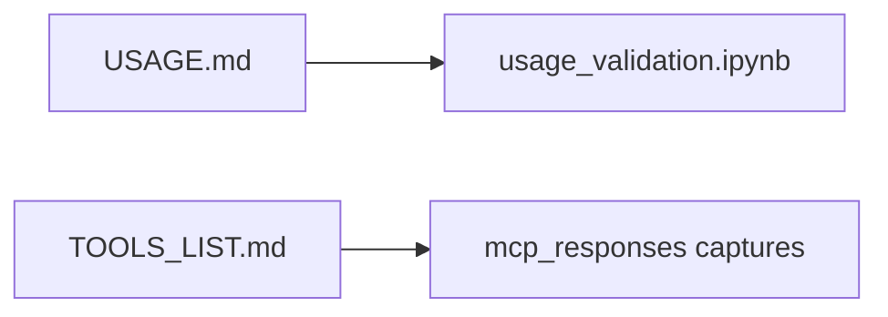

# Examples

Operator how-to is [USAGE.md](../USAGE.md). Tool parameters are [TOOLS_LIST.md](../TOOLS_LIST.md). These files are **captured snapshots**, not the live surface.

| Path | Role |
|------|------|
| `usage_validation.ipynb` | Local-first notebook that follows USAGE |
| `mcp_responses/` | Historical `tools/list` and init dumps |

Default advertised count is computed from `registry.py` (see README / TOOLS_LIST preamble). Do not treat a captured JSON as current. Public fixture: `tests/fixtures/test_x86_64`.
