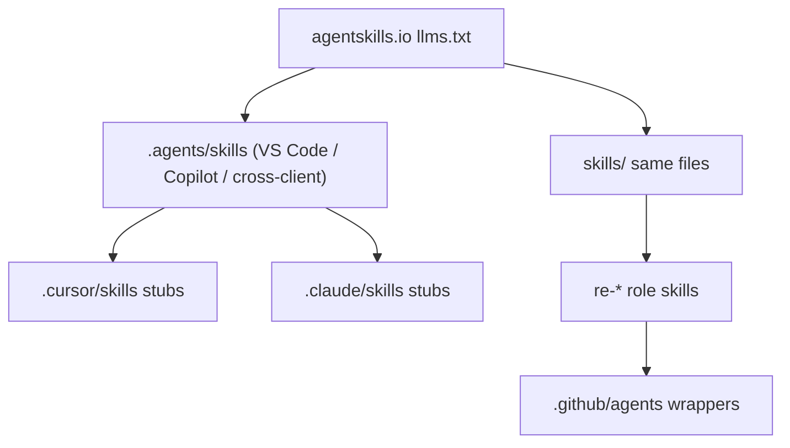

# AgentDecompile skills

Follow the **whole** [agentskills.io](https://agentskills.io/llms.txt) site, not only the spec.

User docs start at [README.md](../README.md), [USAGE.md](../USAGE.md), and [docs/INDEX.md](../docs/INDEX.md). Authoring: `skills/skill-authoring` (same files under `.agents/skills/skill-authoring`).



| Page | Rule we apply |
|---|---|
| [Specification](https://agentskills.io/specification.md) | `name` = folder; `description` ≤ 1024; optional license/compatibility/metadata |
| [Quickstart](https://agentskills.io/skill-creation/quickstart.md) | VS Code lists `/skills` from `.agents/skills/<name>/SKILL.md` |
| [Client implementation](https://agentskills.io/client-implementation/adding-skills-support.md) | Scan `.agents/skills/` plus client dirs; catalog is name+description only |
| [Optimizing descriptions](https://agentskills.io/skill-creation/optimizing-descriptions.md) | `Use this skill when…`; `evals/triggers.json` train/validation |
| [Evaluating skills](https://agentskills.io/skill-creation/evaluating-skills.md) | `evals/evals.json` prompts + assertions |
| [Using scripts](https://agentskills.io/skill-creation/using-scripts.md) | Bundled `scripts/` with `--help`, no TTY |
| [Best practices](https://agentskills.io/skill-creation/best-practices.md) | Project gotchas; lean bodies; progressive disclosure |
| [Clients](https://agentskills.io/clients.md) | Cursor, Copilot, Claude Code, Gemini CLI, OpenCode, … |

## Catalog

Bodies live in `skills/<name>/` and `.agents/skills/<name>/` (same text). `.cursor/skills/` and `.claude/skills/` are stubs that read the canonical file. Point at repo-root paths (`docs/…`, `.github/…`) so both trees stay identical.

| Skill | Use when |
|---|---|
| `skill-authoring` | Adding or reviewing skills / Copilot agent wrappers |
| `source-recovery` | Recovered C, objdiff, `--dump-source`, rematch, reconstruct |
| `workbench-operator` | `/dashboard` dogfood or workbench UX |
| `bsim-corpus` | BSim database / ingest / report |
| `tiered-re-analysis` | Picking Tier 0–3 tools before Ghidra MCP |
| `mcp-debugging` | MCP session, transport, or tool-routing failures |
| `lfg` | Continue / merge / next slice from STRATEGY and open plans |
| `re-planner` / `re-worker` / `re-critic` / `re-aggregator` | Multi-agent RE roles |
| `agentdecompile-server-env` | Start server, `GHIDRA_INSTALL_DIR`, bind, sessions |

Client-only stub (not duplicated under `skills/`): `agentdecompile-rewrite-worker`.

Validate:

```bash
python3 scripts/validate-agent-skills.py
python3 skills/skill-authoring/scripts/check-evals.py
```
