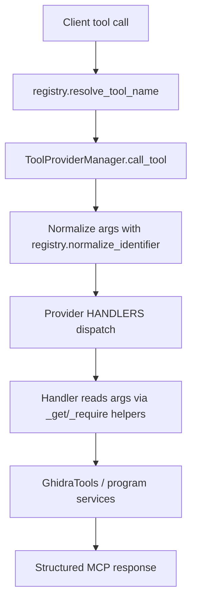

# CLAUDE.md - `agentdecompile_cli` Working Guide

This guide is for contributors/agents working specifically in `src/agentdecompile_cli`.

## 1) Package Purpose

`agentdecompile_cli` is the authoritative Python implementation of AgentDecompile CLI + MCP server behavior, including registry-based normalization, provider dispatch, and bridge/session support.

## 2) Critical Entry Points

- CLI entry: `agentdecompile_cli.__main__`
- Registry and name resolution: `agentdecompile_cli.registry`
- MCP server wiring: `agentdecompile_cli.mcp_server.server`
- Central dispatch: `agentdecompile_cli.mcp_server.tool_providers.ToolProviderManager`
- Provider implementations: `agentdecompile_cli.mcp_server.providers.*`

## 3) Normalization Contract (Must Not Be Broken)

Use one canonical normalizer everywhere:
- `normalize_identifier(s) = re.sub(r"[^a-z]", "", s.lower().strip())`

Meaning:
- Ignore punctuation/separators/casing.
- Match by alphabetic core only.

Examples that must resolve identically:
- `manage-symbols`, `Manage_Symbols`, `MANAGESYMBOLS`
- `programPath`, `program_path`, `PROGRAM PATH`

## 4) Required Tool Routing Pipeline

Every call should follow this pipeline:
1. `registry.resolve_tool_name()` for tool intent.
2. Normalize keys via `tool_providers.n` (`registry.normalize_identifier`).
3. Apply `TOOL_PARAM_ALIASES` on normalized keys.
4. Dispatch via `ToolProviderManager.call_tool()`.
5. Provider handler consumes args with `_get*` / `_require*` helpers.

No ad-hoc bypasses.

## 5) Provider Authoring Standard

When editing/adding providers:
- `HANDLERS` keys use normalized canonical identifiers.
- Do not implement custom dispatch logic in providers.
- Do not compare raw arg names.
- Use helper accessors: `_get`, `_get_str`, `_get_int`, `_get_bool`, `_require*`.
- Keep behavior aligned with `TOOLS_LIST.md` canonical specs.

## 6) Forbidden Patterns

Avoid these anti-patterns:
- Local alias maps for tool-routing inside provider methods.
- Direct ad-hoc rewrites like `replace("-", "_")` for matching.
- Provider-level custom `call_tool` re-implementations.
- Raw-case / raw-punctuation string comparisons.

## 7) Tool Documentation Source of Truth

Before changing any tool behavior:
- Check `TOOLS_LIST.md` first.
- Keep canonical naming and semantics aligned.
- Ensure aliases still route through the same canonical implementation path.

## 8) MCP Tool Advertisement Guidance

For advertised schemas and docs:
- Prefer canonical snake_case for displayed names/params.
- Keep execution compatibility broad through normalization.
- Ensure schema reflects what handlers actually accept/require.

## 9) Error Handling and Responses

Prefer consistent structured responses:
- Include `success` status.
- Return actionable error payloads.
- Preserve useful context for callers (missing program, invalid mode, etc.).

## 10) Program Context Rules

Many tools are program-scoped:
- GUI mode can use active program context.
- Headless mode typically requires explicit `programPath`.
- Handlers should provide clear error when no program is resolvable.

## 11) Bridge/Transport Expectations

When touching bridge/server forwarding paths:
- Forward tool names through registry resolver.
- Do not implement transport-specific normalization forks.
- Keep one behavior path from CLI/MCP to provider handlers.

## 12) Testing Priorities in This Package

Primary confidence tests after behavior changes:
- `tests/test_normalization_combinatorial.py`
- Provider-specific tests for modified domain
- Parity/advertisement tests (schema/canonical alignment)

## 13) Safe Change Strategy

For modifications in `agentdecompile_cli`:
- Keep changes narrow and root-cause focused.
- Avoid unrelated refactors.
- Preserve public behavior unless intentionally changed.
- Update docs when tool behavior or naming semantics change.

## 14) Reverse Engineering Workflow Fit

This package must support both:
- Human-driven CLI usage with varied naming styles.
- Agent-driven MCP usage with robust intent recovery.

Normalization and canonical routing are the compatibility backbone for both.

## 15) Contributor Checklist (Before Merge)

- No custom dispatch normalization added in providers.
- No normalization bypass path introduced.
- Tool and param matching still alphabetic-core based.
- Canonical tool behavior documented and tested.
- Relevant unit/integration tests pass.

## 16) Quick Reality Check Commands

Typical local checks:

- `python -m pytest tests/test_normalization_combinatorial.py -v`
- `python -m pytest tests/test_provider_symbols.py -v`
- `python -m pytest tests/test_provider_functions.py -v`

Use narrower test scopes first, then broader suites.

## 17) Notes for Skill/Workflow Docs

If adding skill/workflow docs in the repo:
- Keep canonical tool names visible.
- Optionally include legacy aliases for compatibility.
- Prefer evidence-first workflows and explicit confidence gates.
