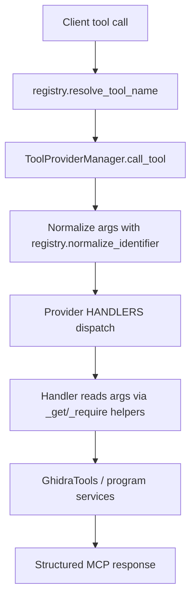

# CLAUDE.md - `agentdecompile_cli` Working Guide

This guide is for contributors/agents working specifically in `src/agentdecompile_cli`.

```mermaid
flowchart TD
    A[Client tool call] --> B[registry.resolve_tool_name]
    B --> C[ToolProviderManager.call_tool]
    C --> D[Normalize args with registry.normalize_identifier]
    D --> E[Provider HANDLERS dispatch]
    E --> F[Handler reads args via _get/_require helpers]
    F --> G[GhidraTools / program services]
    G --> H[Structured MCP response]
```

## 1) Package Purpose

`agentdecompile_cli` is the authoritative Python implementation of AgentDecompile CLI + MCP server behavior, including registry-based normalization, provider dispatch, and bridge/session support.

## 2) Critical Entry Points

- CLI entry: `agentdecompile_cli.__main__`
- Registry and name resolution: `agentdecompile_cli.registry`
- MCP server wiring: `agentdecompile_cli.mcp_server.server`
- Central dispatch: `agentdecompile_cli.mcp_server.tool_providers.ToolProviderManager`
- Provider implementations: `agentdecompile_cli.mcp_server.providers.*`

## 3) Normalization Contract (Must Not Be Broken)

Use one canonical normalizer everywhere:
- `normalize_identifier(s) = re.sub(r"[^a-z]", "", s.lower().strip())`

Meaning:
- Ignore punctuation/separators/casing.
- Match by alphabetic core only.

Examples that must resolve identically:
- `manage-symbols`, `Manage_Symbols`, `MANAGESYMBOLS`
- `programPath`, `program_path`, `PROGRAM PATH`

## 4) Required Tool Routing Pipeline

Every call should follow this pipeline:
1. `registry.resolve_tool_name()` for tool intent.
2. Normalize keys via `tool_providers.n` (`registry.normalize_identifier`).
3. Apply `TOOL_PARAM_ALIASES` on normalized keys.
4. Dispatch via `ToolProviderManager.call_tool()`.
5. Provider handler consumes args with `_get*` / `_require*` helpers.

No ad-hoc bypasses.

## 5) Provider Authoring Standard

When editing/adding providers:
- `HANDLERS` keys use normalized canonical identifiers.
- Do not implement custom dispatch logic in providers.
- Do not compare raw arg names.
- Use helper accessors: `_get`, `_get_str`, `_get_int`, `_get_bool`, `_require*`.
- Keep behavior aligned with `TOOLS_LIST.md` canonical specs.

## 6) Forbidden Patterns

Avoid these anti-patterns:
- Local alias maps for tool-routing inside provider methods.
- Direct ad-hoc rewrites like `replace("-", "_")` for matching.
- Provider-level custom `call_tool` re-implementations.
- Raw-case / raw-punctuation string comparisons.

## 7) Tool Documentation Source of Truth

Before changing any tool behavior:
- Check `TOOLS_LIST.md` first.
- Keep canonical naming and semantics aligned.
- Ensure aliases still route through the same canonical implementation path.

## 8) MCP Tool Advertisement Guidance

For advertised schemas and docs:
- Prefer canonical snake_case for displayed names/params.
- Keep execution compatibility broad through normalization.
- Ensure schema reflects what handlers actually accept/require.

## 9) Error Handling and Responses

Prefer consistent structured responses:
- Include `success` status.
- Return actionable error payloads.
- Preserve useful context for callers (missing program, invalid mode, etc.).

## 10) Program Context Rules

Many tools are program-scoped:
- GUI mode can use active program context.
- Headless mode typically requires explicit `programPath`.
- Handlers should provide clear error when no program is resolvable.

## 11) Bridge/Transport Expectations

When touching bridge/server forwarding paths:
- Forward tool names through registry resolver.
- Do not implement transport-specific normalization forks.
- Keep one behavior path from CLI/MCP to provider handlers.

## 12) Testing Priorities in This Package

Primary confidence tests after behavior changes:
- Provider-specific tests under `tests/test_provider_*.py` for the area you touched
- Broader MCP smoke: `tests/test_e2e_standalone_proxy_cli.py`, `tests/test_e2e_tool_sweep.py`
- Full tool contracts against a fixture binary: `tests/test_e2e_exhaustive_tool_contracts.py` (when available in your environment)

## 13) Safe Change Strategy

For modifications in `agentdecompile_cli`:
- Keep changes narrow and root-cause focused.
- Avoid unrelated refactors.
- Preserve public behavior unless intentionally changed.
- Update docs when tool behavior or naming semantics change.

## 14) Reverse Engineering Workflow Fit

This package must support both:
- Human-driven CLI usage with varied naming styles.
- Agent-driven MCP usage with robust intent recovery.

Normalization and canonical routing are the compatibility backbone for both.

## 15) Contributor Checklist (Before Merge)

- No custom dispatch normalization added in providers.
- No normalization bypass path introduced.
- Tool and param matching still alphabetic-core based.
- Canonical tool behavior documented and tested.
- Relevant unit/integration tests pass.

## 16) Quick Reality Check Commands

Typical local checks:

- `uv run pytest tests/test_provider_symbols.py -v`
- `uv run pytest tests/test_provider_functions.py -v`
- `uv run pytest tests/test_e2e_standalone_proxy_cli.py -v`

Use narrower test scopes first, then broader suites.

## 17) Notes for Skill/Workflow Docs

If adding skill/workflow docs in the repo:
- Keep canonical tool names visible.
- Optionally include legacy aliases for compatibility.
- Prefer evidence-first workflows and explicit confidence gates.

## 18) Learned Workspace Facts

- open-project: `analyzeAfterImport` is optional and defaults to true. `open` and `import-binary` always run incremental Ghidra auto-analysis when needed (blocking); other program-scoped tools wait until analysis completes for that program.
- Load Ghidra from `GHIDRA_INSTALL_DIR` via a top-level repo `.env`; the path must match the real install folder name (for example `ghidra_12.0.4_PUBLIC`—a wrong or stale basename breaks LFG/driver).
- Project-level Cursor skills live under .cursor/skills/ (SKILL.md + references/), not under docs/.
- In prompts and docs use semantic tool names (rename-function, set-function-prototype) not the legacy manage-function name.
- For proxy mode set AGENTDECOMPILE_PROJECT_PATH (and AGENTDECOMPILE_PROJECT_NAME) so the proxy sends X-AgentDecompile-Project-Path; use separate backends and proxy URLs when multiple projects run at once. The CLI persists mcp-session-id per normalized --server-url; without a session header the server may use one default session—send distinct session ids for multi-user or multi-client use. Keep server-side session state on the same logical key as the client-persisted id so it does not split across `default` and `sdk-session:…` buckets.
- For tools that accept an optional program_path (e.g. checkout-status), resolve the domain file by that path (session + project_data) and use it for the operation; do not default to the active program only, so shared-only paths report versioned status correctly.
- Before domain_file.save() or shared versioned checkin-program while a program is open (e.g. sync-project push, check-in all), end the program's active transaction to avoid "Unable to lock due to active transaction". For shared check-in, the DomainFile used must match the open program being edited—repo-style programPath strings and Program.getDomainFile() pathnames may differ only by basename on Windows; mismatched resolution yields "File has not been modified since checkout" despite successful mutations.
- get-function with an address returns the containing function (not the callee); get-references and list-cross-references accept addressOrSymbol or importName (thunk and IAT supported; .rsrc targets include LoadStringA/LoadStringW as indirect refs).
- When Ghidra exposes multiple overloads for the same operation (e.g. `Listing.getComment` variants), support both with try/fallback for compatibility across backends.
- Comments, bookmarks, function rename/prototype, function-tags, create-label, and manage-symbols are advertised by default (not in registry _DEFAULT_HIDDEN_TOOLS or CLI curated-only list).
- Cross-binary match-function uses signature (param count, return type), name, and call graph (caller/callee names) to find the same function in another binary; it does not use byte or instruction-level comparison, so it works when addresses, registers, and stack layout differ across builds.
- Strict proof sequence `/lfg` is defined in `.cursor/commands/lfg.md` (shared Ghidra Server, MCP restarts, `tool-seq`). For automation, avoid unmodified stock `ghidraSvr.bat console` (separate JVM window and poor terminal logging); use the driver's patched background start or a dedicated Ghidra window per that doc.
- Setting `AGENT_DECOMPILE_GHIDRA_SERVER_REPOSITORY` (or the legacy alias) on the MCP server process can make shared-session bootstrap treat the repository name as a program key; LFG scripting avoids exporting repository into MCP env, and program activation skips treating the repo name as a program when it matches the open shared handle's repository.
- ContextStream Claude Code hooks should be launched via `scripts/contextstream_claude_hook.ps1` (or a stable copy under `~/.claude/scripts`), resolving the global `@contextstream/mcp-server` install instead of stale `npx` cache paths to `index.js`.
- For JPype buffers passed to Ghidra `Memory.getBytes`, allocate with `jpype.JArray(jpype.JByte)(length)`; Pyright may need `cast(Any, ...)` around the constructor when stubs disagree.
- `ProgramInfo` (`context.py`) declares optional `domain_object_consumer` and `domain_file` for shared/versioned program lifecycle; use those typed fields instead of `setattr`.

## 19) Modification Conflicts (Two-Step Flow)

Tools that modify project data (e.g. `manage-symbols` rename, `manage-function` rename/set_prototype, `manage-comments` set, `manage-structures` create/apply, `apply-data-type`, `manage-bookmarks` set) may return a **conflict** when the change would overwrite existing custom data. In that case, the response includes a `conflictId` and a udiff-style summary. Use **`resolve-modification-conflict`** with that `conflictId` and `resolution=overwrite` to apply the change or `resolution=skip` to discard. Do not retry the modifying tool with the same args to force overwrite—only `resolve-modification-conflict` completes the flow.

## 20) Tiered Reverse-Engineering Analysis

Agents should **not default to Ghidra** for every task. Use the **tiered-re-analysis** skill ([.cursor/skills/tiered-re-analysis/SKILL.md](../../.cursor/skills/tiered-re-analysis/SKILL.md)) and knowledge base ([docs/solutions/architecture-patterns/tiered-re-analysis-knowledgebase.md](../../docs/solutions/architecture-patterns/tiered-re-analysis-knowledgebase.md)): Tier 0 shell/static tools → Tier 1 batch `ghidrecomp` → Tier 2 MCP read-only → Tier 3 decompile/mutations. Multi-agent RE agents (`.github/agents/re-*.agent.md`) follow this routing in Planner triage and Worker/Critic verification.

## 21) MCP Server Debugging and Self-Healing

When investigating or fixing MCP server issues (timeouts, schema, GUI/coords, sandbox), use the **mcp-debugging** skill: open [.cursor/skills/mcp-debugging/SKILL.md](../../.cursor/skills/mcp-debugging/SKILL.md) or invoke `/mcp-debugging` in Agent chat. The skill references the meta-debug loop and the five CLIs (MCP Inspector, mcptools, mcp-debug, mcp-trace, FastMCP CLI). Detailed docs: [references/CLIS_AND_META_DEBUG.md](../../.cursor/skills/mcp-debugging/references/CLIS_AND_META_DEBUG.md), [references/WORKFLOWS.md](../../.cursor/skills/mcp-debugging/references/WORKFLOWS.md), [references/CLAUDE_MCP_DEBUG.md](../../.cursor/skills/mcp-debugging/references/CLAUDE_MCP_DEBUG.md).
