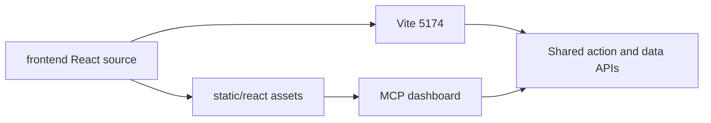

# Use the AgentDecompile interfaces

AgentDecompile serves the built workbench at `/dashboard` on its MCP HTTP server. The installed Python package includes the assets; serving them does not require Node.

The MCP-served interface defaults to the dense workbench. Vite defaults to the Atlas project manager, with project preparation, build comparisons, and focused function exploration. Both include the same Code Browser, recovery surfaces, guide workflows, action catalog, and persistent jobs. `?mode=workbench` and `?mode=atlas` select either presentation explicitly.

For frontend development, run these commands from this directory:

```bash
npm ci
npm run build
AGENTDECOMPILE_BACKEND=http://127.0.0.1:8080 npm run dev
```

Vite runs on `http://127.0.0.1:5174/`. It fails if 5174 is occupied. It proxies API requests to AgentDecompile; credentials stay on the backend. The production build writes to `../static/react` and is served by both full and proxy MCP servers.



The workspace keeps one selection across the explorer, functions, source, graph, evidence, and commands. Project tabs represent sessions. Section navigation moves through the document. Drag the separators to resize panes; View provides density, visibility, and layout reset controls.

Logs and Jobs share the bottom Activity dock. Logs remain inspectable. Job completion is distinct from compilation and byte verification. Unknown progress is indeterminate; object-file presence does not establish function proof.

Use the command palette or Commands section to select a catalog action. Fields receive the current target and server defaults. Batch selections survive paging and filtering, clear on program changes, and are frozen on submission. Batch receipts live in `workbench-batches` under the configured corpus workspace. Reloading the browser does not restart a batch. A server restart reconciles durable workflow checkpoints and process ownership. Completed work is retained; ambiguous non-import mutations remain blocked for reconciliation.

Save workspace writes metadata. Copy project reports whether program databases were copied. Save connection creates a reopenable reference; it does not upload a Ghidra repository.

## Follow the Ghidra guide

The Code Browser supports the [PyKotor Ghidra Reversing Guide](https://github.com/OpenKotOR/PyKotor/wiki/Ghidra-Reversing-Guide) through shared Python operations. Browse symbols, types, memory sections, bookmarks, references, instructions, source witnesses, and function properties. Select an instruction to inspect its address; double-click for instruction details. Function editing reads the active language's registers and calling conventions. Explicit storage supports register pieces, stack pieces, and composite returns without assuming an x86 layout.

Tools includes ordered guide workflows alongside the full action catalog. Detailed operations stay available without filling the landing view with every tool. Open Activity to inspect a command's target, parameters, output, and failure reason. A job completing does not prove recovered source.

| Guide topic | Where to work in either interface |
| --- | --- |
| Projects and programs | Project manager or project sessions; open a project or import a binary. |
| Symbols, classes, namespaces, imports, exports | Code Browser → symbols; choose a kind and search. |
| Types, archives, enums, unions, template instances | Code Browser → types; Tools → Find symbols and types or structure workflows. |
| Assembly, addresses, operands, references | Code Browser listing, address field, previous/next controls, instruction operands, references. |
| Source, unreachable code, decompiler issues | Advisory source beside the listing; Tools → Read bytes and reconstructed code and repair workflows. |
| Call trees, memory, bookmarks, scripts | Relationship views, Code Browser memory/bookmarks, and Script console. |
| Function filters and signatures | Code Browser → functions and Edit signature. |
| Namespace, inline, varargs, call fixups, thunks | Edit function signature and storage → property controls. |
| Calling conventions and custom return/parameter storage | Edit function signature and storage; register choices come from the active language. |
| Structures and vtables | Type inspection/field editing, Find uses of type, Code Browser → vtables. |

The guide's x86 examples are not universal ABI rules. Register sizes, layouts, and conventions come from the active program. Correcting a decompiler type or storage hypothesis does not establish byte accuracy. Unsupported or ambiguous evidence remains visible rather than being replaced with an inferred success.

Project preparation checks existing analysis, extracts missing function features and call edges, indexes BSim signatures, and compares registered related builds. Receipts record completed stages; retries reuse successful work. Missing toolchains, connections, or comparison evidence remain named blockers.

## Verify the running interfaces

Build with `npm run build`. Browser acceptance must exercise both MCP production delivery and Vite against actual handler paths. Use inline Playwright or browser tools to open/import projects, inspect functions, follow references, edit justified analysis, save state, resize panes, run recovery/export operations, and inspect their evidence. Verify installed-wheel serving with Node absent from the server's environment.

For this implementation session, do not run saved test files or create or modify tests. Browser screenshots and JSON interaction receipts are evidence of the observed workflows, not corpus-recovery proof.

See the [verification record](../../../../../docs/verification/2026-09-08-react-workbench.md) for observed workflows, defects found during live use, and remaining claim boundaries.

## Follow work in the explorer

The left column contains projects and binaries above a function tree. Resize its width or the divider between the trees; both dimensions persist. Projects contain evidence-backed variant groups, binaries, and architecture slices. A library asset is identified by SHA-256, while membership also includes the project. Dragging binaries onto a project adds membership without removing their original membership or moving files.

Click an item to inspect it. Checkboxes keep the batch selection independent. Dragging a checked item uses the fixed checked set; dragging an unchecked item uses that item. Function groups prefer recorded human organization, debug source units, and namespaces before Unassigned. Search covers the selected binary, with bounded rows rendered at once.

Activity, evidence, and proof have separate labels. A measured completed/total pair supplies the progress bar; unknown running work is indeterminate. An ETA requires at least five comparable completed operations. Remaining budget is an allowance, not an estimate. Expand activity details for targets, attempts, dependencies, and recorded receipts. A recorded receipt is not a fresh verification run.

New project workflows receive a 24-hour allowance. The backend advances supported stages and preserves completed checkpoints. Missing compilers, unsupported protection paths, and deterministic failures remain named blockers. Pause, stop, and budget controls remain available through the shared action surface.

## Explore function evidence

Both presentations include Embeddings map, Function scoring, and Prompt builder in the main workspace. The map currently projects recorded structural metrics with PCA; it does not claim semantic embedding similarity. Pan, zoom, or reset the map, then select a point to update the shared function context. The function tree and scoring table provide keyboard alternatives.

Function scoring ranks measured structural complexity. Missing values remain unknown. The method, thresholds, sampling limits, and evidence basis are inspectable. Neither proximity nor a score establishes identity, source correctness, compilation, or byte parity.

Prompt builder combines the selected function's available witnesses and operator notes. Review the generated text, choose evidence categories, then copy or download it. Artifact text remains explicitly untrusted and model proposals still require the ordinary compiler and objdiff acceptance gate.

## Edit and download source

Source and assembly use a bundled Monaco editor, including its local worker and font. Find, folding, line numbers, wrapping, and syntax highlighting are available in both interfaces. Selected-function evidence refreshes while the page is visible. The editor retains its view position; incoming evidence does not overwrite a local draft.

Recorded evidence is read-only. Edit local draft creates a browser-local candidate for the selected project, binary, and function. Drafts retain edits across navigation and refresh, and can be downloaded. They are not submitted to Ghidra or counted as recovery proof. Source excerpts show their truncation boundary when the backend supplies it.

Download source ZIP starts a shared backend job. For an analyzed, fingerprint-matched Ghidra program, it generates whole-program C and a header in a new export directory, then packages all available function witnesses and bound project files. The archive includes its complete recorded inventory, per-function source coverage, missing-source entries, and provenance. Assembly evidence is separate. Exporter completion, compilation, and byte verification are separate facts.

The browser downloads the finished archive if the export view remains open. Otherwise its download link is available when returning to that binary. Closing the page does not cancel the accepted export. Agents use the same catalog action, or `manage-workflow` with `operation=export-source` and `operation=export-status`.

## Manage projects and queue order

Right-click a project or binary, press Shift+F10 on its tree row, or open its visible actions menu. Remove project from workspace hides its session without deleting files, unlinking other memberships, or stopping accepted work. Removed projects can be restored from the explorer.

Workflow and queue priority shows the canonical project run, current operation, blocker, and actual waiting position. Move earlier or later changes the backend priority; equal priorities retain admission order. Running native operations are not interrupted by a priority change. Expired budgets have an explicit new allowance control. Execution allowance and ETA have separate meanings.

The explorer displays initial activity loading, current operations, and elapsed time. ETA ranges require enough comparable recorded operations. Idle, blocked, and unknown activity remain distinct. Project search keeps a matching project's binaries visible.
