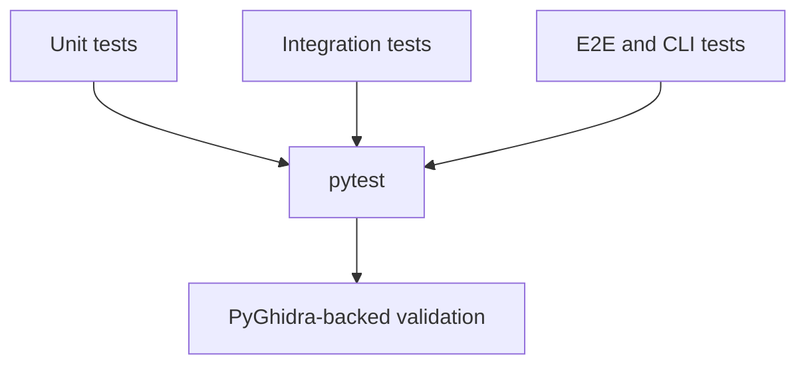

# AgentDecompile Tests



Professional pytest suite for testing AgentDecompile with PyGhidra.

## Overview

These tests verify that AgentDecompile components work together correctly:

- **Integration tests**: PyGhidra initialization, launcher lifecycle, real program workflows (`@pytest.mark.integration`)
- **Unit tests**: Fast checks with mocked or minimal dependencies (`@pytest.mark.unit`)
- **E2E tests**: HTTP MCP server (`TestClient`), CLI subprocesses, tool sweeps, Docker-backed shared-project flows
- **Provider tests**: Individual `tests/test_provider_*.py` modules calling real provider handlers where practical

List modules with:

```bash
dir tests\test_*.py   # Windows
ls tests/test_*.py    # Unix
```

## Running Tests

### Prerequisites

```bash
# Install dependencies with uv
uv sync

# Ensure GHIDRA_INSTALL_DIR is set
export GHIDRA_INSTALL_DIR=/path/to/ghidra  # or set via Windows environment
```

### Run All Tests

```bash
uv run pytest tests/ -v --timeout=120
```

### Run Tests by Category

```bash
uv run pytest -m unit -v
uv run pytest tests/test_provider_*.py -v
uv run pytest tests/test_cli_*.py -v
uv run pytest tests/test_e2e_*.py -v
uv run pytest tests/test_e2e_cancelled_profile.py -v --timeout=300 -s
```

### Run Tests Matching Pattern

```bash
uv run pytest tests/ -k "symbols" -v
uv run pytest tests/ -k "provider" -v
```

### Run with Timeout

```bash
uv run pytest tests/ -v --timeout=120
```

### Run with Different Output

```bash
uv run pytest tests/ -v --tb=short
uv run pytest tests/ -v --tb=line
uv run pytest tests/ -v -s
```

## Test Markers

```bash
@pytest.mark.unit        # Unit tests (mocked / no full Ghidra)
@pytest.mark.integration # Integration tests (PyGhidra)
@pytest.mark.e2e         # End-to-end tests
@pytest.mark.slow        # Slow tests
```

```bash
uv run pytest tests/ -m integration -v
uv run pytest tests/ -m "not slow" -v
```

## CI Integration

GitHub Actions workflows under `.github/workflows/` run pytest and packaging checks (see workflow YAML for matrix and timeouts).

## Writing New Tests

Prefer tests that invoke **`tools/call`** (or provider `call_tool`) and assert on structured **results**, not only on `tools/list` or schema shape.

```python
# tests/test_provider_mytool.py
import pytest

class TestMyToolProvider:
    def test_tool_returns_expected_shape(self):
        from agentdecompile_cli.mcp_server.providers.mytool import MyToolProvider
        # call_tool(...) and assert on JSON payload keys / success / errors
```

## Troubleshooting

### PyGhidra Initialization Fails

```
Error: GHIDRA_INSTALL_DIR not set
```

Set `GHIDRA_INSTALL_DIR` to your Ghidra install root.

### Tests Timeout

Increase `--timeout` or mark very slow tests and skip with `-m "not slow"`.

### Profiling E2E Suite

The cancelled-timeout reproduction suite starts a local subprocess server with
Python cProfile output and JVM JFR recording enabled.

```bash
uv run pytest tests/test_e2e_cancelled_profile.py -v --timeout=300 -s
```

Artifacts are written under the pytest temp directory for the module and include:

- `server.log`
- `profiles/*.prof`
- `profiles/*.analysis.txt`
- `profiles/*.analysis.json`
- a JFR recording dump when `jcmd` is available

## Related Docs

- [../CONTRIBUTING.md](../CONTRIBUTING.md) — development setup and test commands
- [../AGENTS.md](../AGENTS.md) — agent environment notes
