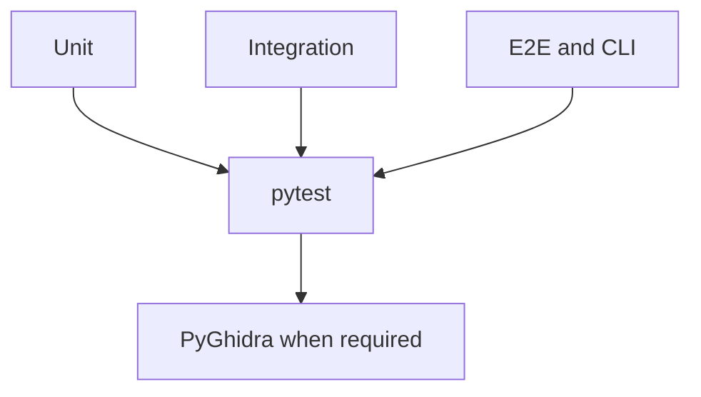

# AgentDecompile tests

Install and first start: [README.md](../README.md). Contributor commands: [CONTRIBUTING.md](../CONTRIBUTING.md). This page is markers, suites, and troubleshooting only.


```mermaid
flowchart TD
    A[Unit] --> D[pytest]
    B[Integration] --> D
    C[E2E and CLI] --> D
    D --> E[PyGhidra when required]
```

Prefer tests that call `tools/call` (or provider `call_tool`) and assert on structured results, not only `tools/list` shape.

## Markers

| Marker | Meaning |
|--------|---------|
| `unit` | Fast; mocked or no full Ghidra |
| `integration` | PyGhidra |
| `e2e` | HTTP MCP, CLI subprocess, Docker shared-project |
| `lfg` | Full Ghidra Server + MCP stack; very slow |
| `slow` | Skip with `-m "not slow"` |

```bash
export GHIDRA_INSTALL_DIR=/path/to/ghidra
uv run pytest -m unit -v
uv run pytest tests/ -v --timeout=120
uv run pytest tests/test_e2e_cancelled_profile.py -v --timeout=300 -s
```

CI unit job (no Ghidra): `.github/workflows/test-unit.yml` → `uv run pytest -m unit -q --timeout=120`.

Program analysis gate (mocked, run before pushing gate changes):

```bash
uv run pytest tests/test_program_analysis_gate.py tests/test_tool_providers_analysis_gate.py -m unit -q
```

## Strict `/lfg` (optional)

Fast smoke is `unit`. Full stack is opt-in:

```bash
uv run pytest tests/test_lfg_e2e.py -m "not lfg" -q --timeout=60
LFG_RUN=1 uv run pytest tests/test_lfg_e2e.py -m lfg -v --timeout=900
```

Canonical live sequence: `.cursor/commands/lfg.md`. Nightly: `.github/workflows/lfg-nightly.yml`.

## Troubleshooting

- `GHIDRA_INSTALL_DIR not set` — point at the real Ghidra install folder name.
- Timeouts — raise `--timeout` or skip with `-m "not slow"`.
- Profiling E2E writes `server.log`, `profiles/*.prof`, and a JFR dump when `jcmd` is available.

Related: [AGENTS.md](../AGENTS.md), [USAGE.md](../USAGE.md).

### React workbench

`test_react_workbench_api.py` exercises production asset serving, traversal rejection, honest progress, frozen/idempotent batch admission, and streaming/cancellation. Build the frontend before running the asset checks. Frontend tests live alongside the React source. Legacy HTML-string checks describe the retained fallback; browser acceptance for the React build must drive actual interactions in both serving modes.
