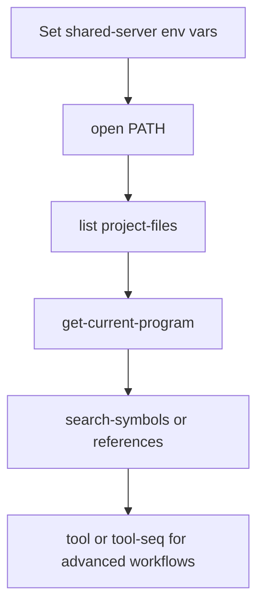

# AgentDecompile Shared Repository CLI Sequence



This file is the compact counterpart to `USAGE.md`. It keeps a single current shared-server workflow without historical output dumps.

## 1. Set shared-server defaults

```powershell
$Env:AGENT_DECOMPILE_GHIDRA_SERVER_HOST = "<set-in-user-env>"
$Env:AGENT_DECOMPILE_GHIDRA_SERVER_PORT = "13100"
$Env:AGENT_DECOMPILE_GHIDRA_SERVER_USERNAME = "<set-in-user-env>"
$Env:AGENT_DECOMPILE_GHIDRA_SERVER_PASSWORD = "<set-in-user-env>"
$Env:AGENT_DECOMPILE_GHIDRA_SERVER_REPOSITORY = "<set-in-user-env>"
```

## 2. Open a program from the shared repository

```powershell
uvx --from git+https://github.com/bolabaden/agentdecompile agentdecompile-cli --server-url http://***:8080/ open /K1/k1_win_gog_swkotor.exe
```

## 3. List available project files

```powershell
uvx --from git+https://github.com/bolabaden/agentdecompile agentdecompile-cli --server-url http://***:8080/ list project-files
```

## 4. Verify the active program

```powershell
uvx --from git+https://github.com/bolabaden/agentdecompile agentdecompile-cli --server-url http://***:8080/ get-current-program --program_path /K1/k1_win_gog_swkotor.exe
```

## 5. Search symbols

```powershell
uvx --from git+https://github.com/bolabaden/agentdecompile agentdecompile-cli --server-url http://***:8080/ search-symbols --program_path /K1/k1_win_gog_swkotor.exe --query main --limit 5
```

## 6. Trace references

```powershell
uvx --from git+https://github.com/bolabaden/agentdecompile agentdecompile-cli --server-url http://***:8080/ references to --binary /K1/k1_win_gog_swkotor.exe --target WinMain --limit 5
uvx --from git+https://github.com/bolabaden/agentdecompile agentdecompile-cli --server-url http://***:8080/ references from --binary /K1/k1_win_gog_swkotor.exe --target 0x004b58a0 --limit 25
```

## 7. Use raw tool mode when you need exact MCP payload control

```powershell
uvx --from git+https://github.com/bolabaden/agentdecompile agentdecompile-cli --server-url http://***:8080/ tool list-imports '{"programPath":"/K1/k1_win_gog_swkotor.exe","limit":5}'
uvx --from git+https://github.com/bolabaden/agentdecompile agentdecompile-cli --server-url http://***:8080/ tool-seq '[{"name":"open-project","arguments":{"path":"/K1/k1_win_gog_swkotor.exe"}},{"name":"get-current-program","arguments":{"programPath":"/K1/k1_win_gog_swkotor.exe"}}]'
```